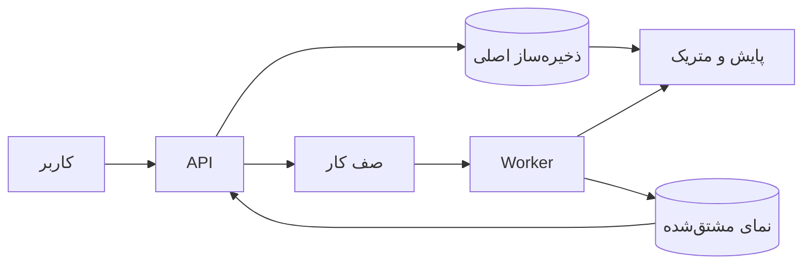

# فصل ۱: `Reliability`, `Scalability`, `Maintainability`

## Reliable, Scalable, and Maintainable Applications

این فصل سه معیار اصلی برای ارزیابی یک data-intensive system را از هم جدا می‌کند: `Reliability`، `Scalability` و `Maintainability`. توضیح فارسی آن‌ها یعنی درست‌کارکردن در برابر fault، پاسخ‌گویی به رشد load و امکان تغییر و بهره‌برداری بلندمدت.

## هدف فصل

پیش از انتخاب پایگاه داده یا الگوی معماری باید بدانیم مسئلهٔ واقعی چیست. یک سامانه ممکن است امروز سریع باشد اما در برابر خرابی شکننده باشد، یا در مقیاس کوچک ساده به نظر برسد اما با رشد تیم و داده نگهداشت آن دشوار شود. فصل چارچوبی برای صحبت دقیق دربارهٔ این تفاوت‌ها می‌دهد.

## نقشهٔ مطالب

- نگاه‌کردن به سامانهٔ داده به‌عنوان مجموعه‌ای از مؤلفه‌ها و قراردادها
- `Reliability`: نقص سخت‌افزار، خطای نرم‌افزار و خطای انسانی
- `Scalability`: تعریف load، سنجش performance و انتخاب روش رشد
- `Maintainability`: بهره‌برداری، سادگی و تکامل

## خلاصهٔ زمینه‌محور

### فکرکردن به سامانه‌های داده

یک برنامهٔ واقعی معمولاً فقط یک database نیست. ممکن است cache، نمایهٔ جست‌وجو، صف پیام، سرویس HTTP، پردازشگر دسته‌ای و ابزار پایش در کنار هم کار کنند. هر کدام قرارداد، ظرفیت و شیوهٔ خرابی خودش را دارد. طراحی خوب، تعامل این بخش‌ها و مسیر رفت‌وبرگشت داده را هم می‌بیند، نه فقط انتخاب یک محصول.

### `Reliability`

`Reliability` یعنی سامانه در شرایط نامطلوب نیز کار درست را با سطح عملکرد قابل‌قبول انجام دهد. **`fault`** انحراف یک component از قراردادش است؛ **`failure`** زمانی است که کاربر سرویس مورد انتظار را دریافت نمی‌کند. هدف عملی این نیست که همهٔ faultها حذف شوند، بلکه باید faultهای محتمل را از تبدیل‌شدن به failure بازداشت.

سه منبع اصلی مشکل چنین‌اند:

1. در سخت‌افزار، دیسک، برق، شبکه یا یک ماشین ممکن است از دسترس خارج شود. افزونگی سخت‌افزاری مفید است، اما سامانه‌های بزرگ معمولاً باید از دست‌دادن کامل یک ماشین را هم تحمل کنند.
2. خطای نرم‌افزاری اغلب سیستماتیک است: ورودی خاص، مصرف بی‌نهایت یک منبع، پاسخ خراب یک سرویس وابسته یا cascade failure می‌تواند چند گره را هم‌زمان درگیر کند.
3. انسان‌ها می‌توانند configuration را اشتباه تغییر دهند، دادهٔ بد وارد کنند یا عملیات خطرناکی انجام دهند. sandbox، تست، انتشار تدریجی، rollback، پایش و امکان بازسازی داده اثر این خطاها را کم می‌کنند.

پایش فقط برای پیدا کردن مشکل پس از وقوع نیست. متریک‌های latency، نرخ خطا و ظرفیت می‌توانند نقض یک فرض پنهان را زودتر آشکار کنند. با این حال، `Reliability` مطلق وجود ندارد و باید برای هر سامانه مشخص کرد کدام نوع خرابی و چه سطحی از سرویس در محدودهٔ هدف است.

### `Scalability`

`Scalability` صفتی مطلق مانند «این سیستم scalable است» نیست. باید بپرسیم اگر load در یک جهت مشخص رشد کند، چه تغییری در منابع یا معماری لازم است. پارامتر load می‌تواند تعداد درخواست در ثانیه، نسبت خواندن به نوشتن، تعداد کاربران فعال، اندازهٔ dataset یا توزیع اندازهٔ رکوردها باشد.

برای batch معمولاً throughput یا زمان کل job اهمیت دارد؛ برای سرویس online، latency و به‌ویژه توزیع latency مهم‌تر است. میانگین می‌تواند کندی درصد کوچکی از درخواست‌ها را پنهان کند، بنابراین percentileهای بالا برای تجربهٔ کاربر و زنجیرهٔ سرویس‌ها ارزش بیشتری دارند.

برای فهم trade-off، سامانهٔ feed را در نظر بگیرید. یک راه هنگام خواندن، دادهٔ همهٔ دنبال‌شده‌ها را join و مرتب می‌کند. راه دیگر هنگام انتشار پیام، نتیجه را در feed دنبال‌کنندگان می‌نویسد. اولی هزینهٔ read را بالا می‌برد؛ دومی در برابر کاربری با دنبال‌کنندگان بسیار زیاد، fan-out سنگینی دارد. یک طراحی عملی ممکن است برای کاربران عادی پیش‌محاسبه و برای حساب‌های بسیار بزرگ ترکیبی از دو روش را به کار ببرد.

روش‌های رشد شامل افزایش منابع یک ماشین، افزودن ماشین‌ها، تقسیم داده، cacheکردن، پردازش ناهمگام و تغییر محل انجام محاسبه است. هیچ‌کدام به‌تنهایی راه‌حل عمومی نیستند؛ پارامتر بار و الگوی دسترسی تعیین می‌کنند کدام گزینه مناسب است.

### `Maintainability`

`Maintainability` سه بُعد دارد:

- **`Operability`:** عملیات روزمره مانند استقرار، پایش، backup، تعمیر و عیب‌یابی باید تا حد امکان قابل‌فهم و خودکار باشد.
- **`Simplicity`:** پیچیدگی تصادفی ناشی از abstractionهای مبهم، حالت‌های پنهان و وابستگی‌های زیاد باید کم شود. ساده‌بودن به معنی کم‌قابلیت‌بودن نیست؛ یعنی رفتار سامانه از روی اجزایش قابل‌فهم باشد.
- **`Evolvability`:** نیاز کسب‌وکار، تیم، حجم داده و فناوری تغییر می‌کند. معماری باید اجازه دهد schema، API و اجزا بدون مهاجرت یک‌باره و پرریسک تغییر کنند.

### مثال مستقل: ثبت سفارش

فرض کنید سرویس ثبت سفارش پس از دریافت درخواست، سفارش را ذخیره می‌کند، موجودی را بررسی می‌کند و پیام ارسال را به سامانهٔ انبار می‌فرستد. برای `Reliability` باید retryها idempotent باشند و اگر انبار موقتاً در دسترس نیست، سفارش از بین نرود. برای `Scalability` باید مسیر دریافت سفارش از پردازش کند ارسال جدا شود. برای `Maintainability` نیز باید وضعیت سفارش، متریک‌ها و روش replayکردن پیام‌ها روشن باشد. این سه تصمیم از یک مشکل مشترک می‌آیند اما هدف‌های یکسانی ندارند.

## نکته‌های کلیدی

1. اول بار، قرارداد و نوع خرابی را تعریف کنید؛ بعد دربارهٔ محصول صحبت کنید.
2. افزونگی فقط خرابی را پنهان نمی‌کند؛ باید recovery و پایش هم طراحی شود.
3. latency را با توزیع آن بسنجید، نه فقط میانگین.
4. پیچیدگی پنهان، هزینهٔ آیندهٔ تغییر و عیب‌یابی است.

## ارتباط با فصل‌های دیگر

- [فصل ۲: `Data Models` و `Query Languages`](../02-data-models-query-languages/README.md)
- [فصل ۳: `Storage` و `Retrieval`](../03-storage-retrieval/README.md)
- [فصل ۴: `Encoding` و `Evolution`](../04-encoding-evolution/README.md)

## مدل تصمیم برای سه هدف اصلی

| پرسش طراحی | نشانهٔ مشکل | ابزار یا تصمیم مناسب |
| --- | --- | --- |
| اگر یک مؤلفه از دسترس خارج شود چه رخ می‌دهد؟ | خطای زنجیره‌ای، از دست‌رفتن داده یا recovery نامعلوم | افزونگی، timeout، retry محدود، backup و runbook |
| بار در کدام بُعد رشد می‌کند؟ | افزایش latency یا اشباع یک resource | اندازه‌گیری load parameter، cache، queue، partition یا scale-out |
| تغییر بعدی با چه چیزی برخورد می‌کند؟ | deploy هم‌زمان، coupling یا مهاجرت پرریسک | قرارداد versioned، migration تدریجی و interface کوچک |

## نمودار مفهومی یک سامانهٔ داده

این نمودار یک معماری عمومی و مستقل است. هر پیکان باید قرارداد، timeout، retry و مالکیت خطا داشته باشد. مثلاً اگر `Worker` چند بار اجرا شود، عملیات آن باید idempotent باشد؛ اگر نمای مشتق‌شده عقب بماند، API باید freshness آن را بداند.

## سناریوی طراحی: اعلان تغییر قیمت

برای سامانه‌ای که تغییر قیمت را به میلیون‌ها کاربر اعلام می‌کند، ابتدا سه مسیر را جدا کنید: ثبت معتبر قیمت، انتشار رویداد و تحویل اعلان. ثبت قیمت باید invariant مربوط به ارز و بازهٔ اعتبار را رعایت کند. رویداد باید شناسهٔ یکتا داشته باشد تا retry، اعلان تکراری نسازد. تحویل اعلان می‌تواند eventual باشد، اما صفحهٔ مدیریت باید lag و تعداد پیام‌های ناموفق را نمایش دهد.

## چک‌لیست بررسی

- [ ] بار با پارامترهای قابل‌اندازه‌گیری تعریف شده است.
- [ ] رفتار در برابر timeout، duplicate و از دست‌رفتن node مشخص است.
- [ ] p50، p95 و نرخ خطا جداگانه پایش می‌شوند.
- [ ] عملیات restore و rollback مستند و تمرین شده‌اند.
- [ ] یک فرد تازه‌وارد می‌تواند مسیر اصلی داده را از روی دیاگرام بفهمد.

## تمرین‌های مرور

1. برای یک سامانهٔ رزرو، سه load parameter و دو failure mode بنویسید.
2. مشخص کنید کدام بخش باید synchronous باشد و کدام بخش می‌تواند با queue انجام شود.
3. یک تغییر schema پیشنهاد دهید که بدون deploy هم‌زمان دو سرویس قابل انتشار باشد.

## تعریف مستقل اصطلاحات

### `reliability`

**چیست؟** توان سامانه برای انجام کار درست، حتی وقتی بخشی از آن خراب می‌شود.

**مثال:** اگر یک replica از database از دسترس خارج شود، سفارش‌ها همچنان ثبت شوند.

**اشتباه رایج:** سرعت زیاد به‌تنهایی reliability نیست؛ سامانهٔ سریع اما نادرست قابل‌اعتماد نیست.

### `SLI`, `SLO` و `SLA`

- `SLI` اندازه‌ای است که واقعاً ثبت می‌کنیم؛ مثلاً درصد درخواست‌های موفق.
- `SLO` هدف داخلی است؛ مثلاً ۹۹.۹٪ درخواست‌ها در محدودهٔ مشخص موفق باشند.
- `SLA` تعهد قراردادی به مشتری است و ممکن است جریمه یا اعتبار بازگشت داشته باشد.

**اشتباه رایج:** گفتن «سیستم همیشه بالا است» قابل‌اندازه‌گیری نیست؛ باید metric و بازهٔ زمانی داشته باشیم.

### `idempotency`

**چیست؟** اجرای دوبارهٔ یک درخواست، اثر نهایی را چندبرابر نمی‌کند.

**مثال:** ثبت سفارش با `order_id` یکتا انجام می‌شود. اگر client به‌خاطر timeout دوباره همان درخواست را بفرستد، سرویس همان سفارش را برمی‌گرداند.

### `retry`

**چیست؟** تلاش دوباره برای خطایی که احتمال می‌دهیم موقت است.

**قانون ساده:** retry باید سقف، `backoff`، `jitter` و گاهی `retry budget` داشته باشد. برای خطای اعتبارسنجی یا پرداخت ردشده، retry بی‌فایده است.

### `p95` و `p99`

`p95` یعنی ۹۵٪ درخواست‌ها سریع‌تر از آستانهٔ گزارش‌شده پاسخ گرفته‌اند. `p99` وضعیت ۱٪ کندترین درخواست‌ها را بهتر نشان می‌دهد. این عددها برای دیدن تجربهٔ واقعی کاربر از میانگین مفیدترند.
