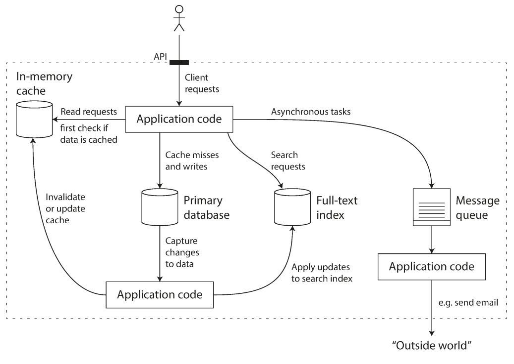
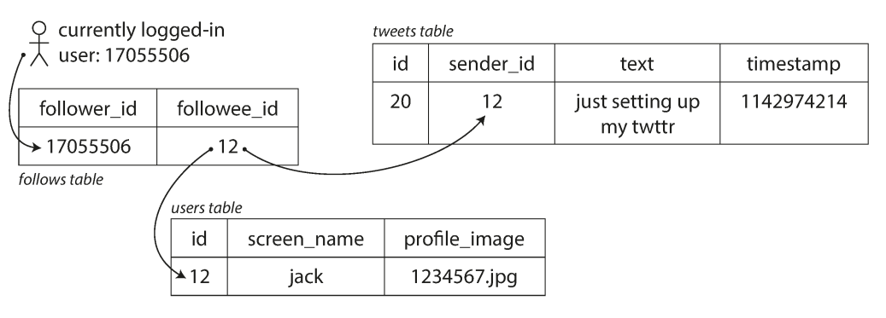
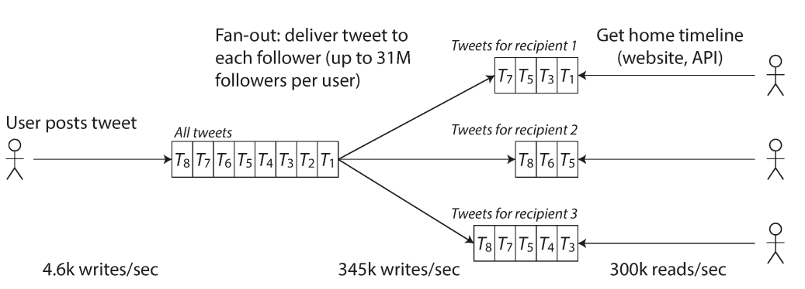
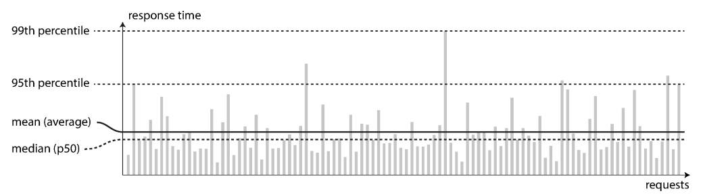
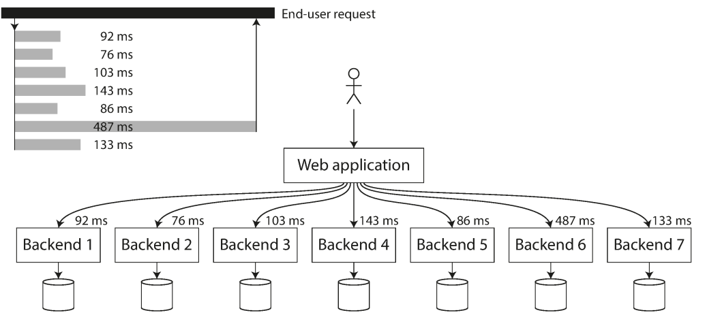

# فصل ۱: `Reliability`، `Scalability` و `Maintainability`

## &rlm;`Reliable`, `Scalable` و `Maintainable` applications

<blockquote dir="rtl" align="right">
  <p dir="rtl" align="right">اینترنت آن‌قدر خوب ساخته شده است که بیشتر مردم آن را مثل یک منبع طبیعی، شبیه اقیانوس آرام، می‌بینند؛ نه چیزی که انسان‌ها ساخته باشند. آخرین بار چه زمانی فناوری‌ای با چنین <span dir="ltr">scale</span>ای این‌قدر کم‌خطا بوده است؟</p>
  <p dir="rtl" align="right">— <span dir="ltr">Alan Kay</span>، گفت‌وگو با <em dir="ltr">Dr Dobb’s Journal</em>، ۲۰۱۲</p>
</blockquote>

امروزه بسیاری از applicationها `data-intensive` هستند، نه `compute-intensive`. قدرت خام CPU به‌ندرت محدودیت اصلی این applicationهاست. مسئله‌های بزرگ‌تر معمولاً مقدار data، پیچیدگی data و سرعت تغییر آن هستند.

یک `data-intensive application` معمولاً از building blockهای استانداردی ساخته می‌شود که قابلیت‌های پرکاربرد را فراهم می‌کنند. برای نمونه، بسیاری از applicationها لازم دارند:

<ul dir="rtl" align="right">
  <li><span dir="ltr">data</span> را ذخیره کنند تا خودشان یا <span dir="ltr">application</span> دیگری بتواند بعداً آن را پیدا کند؛ این کار را <span dir="ltr">database</span> انجام می‌دهد.</li>
  <li>نتیجهٔ یک <span dir="ltr">operation</span> پرهزینه را به خاطر بسپارند تا <span dir="ltr">read</span>ها سریع‌تر شوند؛ این کار را <span dir="ltr">cache</span> انجام می‌دهد.</li>
  <li>به <span dir="ltr">user</span> اجازه دهند با <span dir="ltr">keyword</span> یا <span dir="ltr">filter</span>های مختلف در <span dir="ltr">data</span> جست‌وجو کند؛ این کار را <span dir="ltr">search index</span> انجام می‌دهد.</li>
  <li><span dir="ltr">message</span>ای را به <span dir="ltr">process</span> دیگری بفرستند تا آن <span dir="ltr">process</span> آن را به‌صورت <span dir="ltr">asynchronous</span> پردازش کند؛ این کار به <span dir="ltr">message system</span> یا <span dir="ltr">stream processing</span> مربوط می‌شود.</li>
  <li>مقدار زیادی <span dir="ltr">data</span> جمع‌شده را هر چند وقت یک‌بار پردازش کنند؛ این کار را <code dir="ltr">batch processing</code> انجام می‌دهد.</li>
</ul>

اگر این نکته‌ها خیلی بدیهی به نظر می‌رسند، دلیلش موفقیت همین abstractionهاست: ما همیشه از data systemها استفاده می‌کنیم، بدون اینکه زیاد به آن‌ها فکر کنیم. هنگام ساخت application، بیشتر engineerها به فکر نوشتن storage engine جدید از صفر نمی‌افتند؛ چون database برای این کار ابزار خوبی است.

اما واقعیت به این سادگی نیست. databaseهای زیادی با ویژگی‌های متفاوت وجود دارند، چون applicationهای مختلف requirementهای مختلفی دارند. برای cacheکردن چند روش وجود دارد، search indexها را می‌توان به شکل‌های مختلف ساخت و همین تفاوت برای بقیهٔ componentها هم وجود دارد. هنگام ساخت application هنوز باید بفهمیم کدام ابزار و کدام روش برای مسئلهٔ فعلی مناسب‌تر است. وقتی یک ابزار به‌تنهایی از عهدهٔ کار برنمی‌آید، ترکیب چند ابزار نیز می‌تواند دشوار باشد.

این کتاب سفری است در اصول و واقعیت‌های عملی data systemها و در روش استفاده از آن‌ها برای ساخت `data-intensive application`. بررسی می‌کنیم ابزارهای مختلف چه چیزهایی را مشترک دارند، چه تفاوت‌هایی میان آن‌ها هست و ویژگی‌هایشان چگونه به دست می‌آید.

در این فصل از هدف‌های بنیادی شروع می‌کنیم: ساخت data systemهایی که `reliable`، `scalable` و `maintainable` باشند. معنی هر کدام را روشن می‌کنیم، روش فکرکردن دربارهٔ آن‌ها را توضیح می‌دهیم و پایه‌هایی را می‌سازیم که در فصل‌های بعد به آن‌ها نیاز داریم.

## فکرکردن به data systemها

معمولاً database، queue، cache و ابزارهای مشابه را دسته‌های کاملاً جدا می‌دانیم. database و message queue شباهت سطحی دارند: هر دو مدتی data را نگه می‌دارند. اما access pattern آن‌ها متفاوت است، در نتیجه performance characteristic و implementation آن‌ها نیز تفاوت زیادی دارد.

پس چرا همهٔ آن‌ها را زیر عنوان کلی `data system` قرار دهیم؟ در سال‌های اخیر ابزارهای زیادی برای storage و processing data به وجود آمده‌اند. این ابزارها برای use caseهای گوناگون optimize شده‌اند و دیگر همیشه در دسته‌بندی‌های سنتی جا نمی‌گیرند [۱]. برای نمونه، datastoreهایی مانند Redis گاهی به‌عنوان message queue استفاده می‌شوند و message queueهایی مانند Apache Kafka ضمانت‌های durability شبیه database ارائه می‌کنند. مرز میان این دسته‌ها کم‌کم محو شده است.

از طرف دیگر، applicationهای بیشتری requirementهای سخت و گسترده‌ای دارند که یک ابزار واحد نمی‌تواند همهٔ نیازهای storage و processing آن‌ها را برآورده کند. در این حالت کار به taskهایی شکسته می‌شود که هر کدام روی یک ابزار مشخص به‌خوبی اجرا می‌شوند و application code این ابزارها را به هم وصل می‌کند.

برای مثال، ممکن است application یک caching layer با Memcached یا ابزار مشابه داشته باشد یا یک full-text search server مانند Elasticsearch یا Solr را جدا از database اصلی استفاده کند. در این حالت معمولاً application code مسئول sync نگه‌داشتن cache و index با database اصلی است.



وقتی چند ابزار را برای ارائهٔ یک service با هم ترکیب می‌کنید، interface یا `API` سرویس معمولاً جزئیات implementation را از client پنهان می‌کند. در این لحظه، عملاً یک data system ویژه را از چند component عمومی ساخته‌اید. این data system ترکیبی ممکن است guaranteeهایی بدهد؛ مثلاً هنگام write، cache را درست invalidate یا update کند تا clientهای بیرونی نتیجهٔ consistent ببینند. بنابراین شما دیگر فقط application developer نیستید؛ data system designer هم هستید.

در طراحی data system یا service سؤال‌های سخت زیادی پیش می‌آید:

- چطور مطمئن شویم data حتی هنگام خراب‌شدن بخش‌های داخلی درست و کامل می‌ماند؟
- چطور performance خوب و یکنواختی به client بدهیم، حتی وقتی بخشی از system degraded شده است؟
- چطور system را scale کنیم تا افزایش load را تحمل کند؟
- یک API خوب برای این service چه شکلی دارد؟

عوامل زیادی روی طراحی data system اثر می‌گذارند: مهارت و تجربهٔ افراد، وابستگی به legacy system، زمان تحویل، میزان ریسکی که سازمان می‌پذیرد و محدودیت‌های قانونی یا regulatory. این عوامل به شرایط هر پروژه وابسته‌اند.

در این کتاب روی سه دغدغه تمرکز می‌کنیم که در بیشتر software systemها مهم‌اند:

### &rlm;<span dir="ltr">`Reliability`</span>

&rlm;system باید حتی هنگام adversity، مانند fault سخت‌افزاری، fault نرم‌افزاری یا خطای انسانی، درست کار کند؛ یعنی function درست را با level مورد انتظار از performance انجام دهد.

### &rlm;<span dir="ltr">`Scalability`</span>

با رشد system از نظر حجم data، حجم traffic یا complexity، باید روش‌های معقولی برای کنارآمدن با این رشد وجود داشته باشد.

### &rlm;<span dir="ltr">`Maintainability`</span>

در طول زمان افراد زیادی در engineering و operations روی system کار می‌کنند. آن‌ها باید بتوانند رفتار فعلی system را نگه دارند و آن را برای use caseهای جدید با productivity مناسب تغییر دهند.

این واژه‌ها زیاد استفاده می‌شوند، بدون اینکه معنی‌شان دقیق روشن باشد. در ادامهٔ فصل، روش‌های فکرکردن دربارهٔ `reliability`، `scalability` و `maintainability` را بررسی می‌کنیم و در فصل‌های بعد سراغ techniqueها، architectureها و algorithmهایی می‌رویم که به رسیدن به این هدف‌ها کمک می‌کنند.

## &rlm;<span dir="ltr">`Reliability`</span>

همهٔ ما به‌صورت شهودی می‌دانیم چیزی reliable یا unreliable یعنی چه. انتظارهای معمول از software چنین‌اند:

- &rlm;application همان functionی را انجام دهد که user انتظار دارد.
- بتواند اشتباه user یا استفادهٔ غیرمنتظره از software را تحمل کند.
- &rlm;performance آن، با توجه به use case، load و حجم data مورد انتظار، کافی باشد.
- جلوی دسترسی غیرمجاز و سوءاستفاده را بگیرد.

اگر مجموع این موارد را «درست کارکردن» بدانیم، `reliability` یعنی system حتی وقتی مشکلی پیش می‌آید، همچنان درست کار کند.

چیزهایی که ممکن است خراب شوند `fault` نام دارند و systemهایی که از قبل برای fault آماده‌اند و می‌توانند با آن کنار بیایند، `fault-tolerant` یا `resilient` نامیده می‌شوند. عبارت fault-tolerant کمی گمراه‌کننده است، چون انگار می‌توان systemی ساخت که هر نوع fault ممکن را تحمل کند؛ در واقع چنین چیزی شدنی نیست. اگر کل سیارهٔ زمین و همهٔ serverهای روی آن درون یک black hole بلعیده شوند، برای تحمل این fault باید web hosting را در فضا قرار دهیم؛ گرفتن بودجهٔ چنین کاری احتمالاً آسان نیست! بنابراین بهتر است دربارهٔ تحمل نوع‌های مشخصی از fault صحبت کنیم.

باید توجه کرد که `fault` با `failure` یکی نیست [۲]. `fault` معمولاً یعنی یک component از spec خودش منحرف شده است؛ `failure` زمانی رخ می‌دهد که کل system دیگر service موردنیاز user را ارائه نکند. احتمال fault را نمی‌توان به صفر رساند. بنابراین معمولاً بهتر است mechanismهای fault tolerance را طوری بسازیم که نگذارند fault به failure تبدیل شود. این کتاب چند technique برای ساختن systemهای reliable از componentهای unreliable بررسی می‌کند.

در systemهای fault-tolerant، برخلاف انتظار، گاهی عمداً نرخ fault را زیاد می‌کنیم؛ مثلاً processهای مشخصی را تصادفی و بدون هشدار می‌کشیم. بسیاری از bugهای مهم از error handling ضعیف ناشی می‌شوند [۳]. با ایجاد عمدی fault، mechanismهای fault tolerance دائماً exercise و test می‌شوند و اعتماد ما به واکنش درست system بیشتر می‌شود. Netflix Chaos Monkey نمونه‌ای از این روش است [۴].

با اینکه معمولاً تحمل fault را به پیشگیری از آن ترجیح می‌دهیم، گاهی prevention بهتر از cure است؛ مخصوصاً وقتی cure وجود ندارد. موضوع‌های security چنین‌اند: اگر attacker وارد system شده و به data حساس دسترسی پیدا کرده باشد، آن اتفاق را نمی‌توان برگرداند. این کتاب بیشتر دربارهٔ faultهایی است که می‌توان آن‌ها را کنترل یا جبران کرد.

## &rlm;<span dir="ltr">`Hardware Faults`</span>

وقتی به علت‌های failure فکر می‌کنیم، fault سخت‌افزار سریع به ذهن می‌آید: hard disk خراب می‌شود، RAM از کار می‌افتد، شبکهٔ برق قطع می‌شود یا کسی کابل network اشتباه را می‌کشد. هرکس در data center بزرگ کار کرده باشد می‌داند وقتی تعداد machineها زیاد باشد، این اتفاق‌ها مرتب رخ می‌دهند.

گفته می‌شود `MTTF` یا Mean Time To Failure دیسک‌ها حدود ۱۰ تا ۵۰ سال است [۵، ۶]. بنابراین در یک storage cluster با ۱۰٬۰۰۰ disk، به‌طور میانگین باید انتظار داشته باشیم هر روز یک disk از کار بیفتد.

واکنش اول ما معمولاً افزودن redundancy به componentهای سخت‌افزاری است تا failure rate کل system کم شود. diskها را می‌توان در configurationی مانند RAID قرار داد، serverها را به dual power supply و CPUهای hot-swappable مجهز کرد و data center را به battery و diesel generator برای backup power مجهز کرد. وقتی یک component می‌میرد، component اضافی جای آن را می‌گیرد تا component خراب تعویض شود. این روش نمی‌تواند hardware problem را کاملاً حذف کند، اما شناخته‌شده است و اغلب می‌تواند machine را سال‌ها بدون interruption روشن نگه دارد.

تا همین اواخر، redundancy سخت‌افزار برای بیشتر applicationها کافی بود، چون failure کامل یک machine را نادر می‌کرد. اگر backup را بتوانیم سریع روی machine جدید restore کنیم، downtime ناشی از یک failure در بسیاری از applicationها فاجعه‌بار نیست. به همین دلیل multi-machine redundancy فقط برای تعداد کمی از applicationهایی لازم بود که high availability برایشان حیاتی بود.

اما با زیادشدن حجم data و نیاز محاسباتی applicationها، تعداد machineهای استفاده‌شده نیز زیاد شده و در نتیجه نرخ hardware fault بالا رفته است. در cloud platformهایی مانند Amazon Web Services یا `AWS` نیز ممکن است virtual machine instance بدون هشدار unavailable شود [۷]؛ چون این platformها flexibility و elasticity را بر reliability یک machine واحد ترجیح می‌دهند.

به همین دلیل systemها به سمت تحمل ازدست‌رفتن کل machine رفته‌اند؛ با استفاده از software fault tolerance در کنار یا به‌جای hardware redundancy. این systemها از نظر operations هم مزیت دارند. یک single-server system برای reboot، مثلاً جهت نصب security patch سیستم‌عامل، به planned downtime نیاز دارد؛ اما systemی که failure یک machine را تحمل می‌کند می‌تواند nodeها را یکی‌یکی patch کند، بدون آنکه کل service متوقف شود. به این کار rolling upgrade می‌گویند.

## &rlm;<span dir="ltr">`Software Errors`</span>

معمولاً hardware faultها را تصادفی و مستقل از یکدیگر می‌دانیم: خراب‌شدن disk یک machine الزاماً به معنی خراب‌شدن disk machine دیگر نیست. ممکن است correlation ضعیفی به‌علت یک علت مشترک، مانند دمای rack، وجود داشته باشد؛ اما معمولاً بعید است تعداد زیادی component سخت‌افزاری هم‌زمان از کار بیفتند.

دستهٔ دیگری از fault، error سیستماتیک داخل software است [۸]. پیش‌بینی این faultها سخت‌تر است و چون میان nodeها correlated هستند، معمولاً failureهای بیشتری از hardware faultهای مستقل ایجاد می‌کنند [۵]. نمونه‌ها:

- یک software bug باعث شود همهٔ instanceهای application server با دریافت یک input بد مشخص crash کنند. برای نمونه، leap second در ۳۰ ژوئن ۲۰۱۲ به‌دلیل bug در Linux kernel باعث شد applicationهای زیادی هم‌زمان hang شوند [۹].
- یک runaway process یک resource مشترک مانند CPU time، memory، disk space یا network bandwidth را تمام کند.
- &rlm;serviceای که system به آن وابسته است کند شود، پاسخ ندهد یا responseهای خراب برگرداند.
- یک fault کوچک در یک component، fault دیگری ایجاد کند و آن fault نیز faultهای بعدی را فعال کند؛ این وضعیت `cascading failure` نام دارد [۱۰].

&rlm;bugهایی که این نوع software fault را ایجاد می‌کنند ممکن است مدت‌ها پنهان بمانند و فقط در مجموعه‌ای غیرعادی از شرایط فعال شوند. در آن لحظه معلوم می‌شود software دربارهٔ محیطش یک assumption داشته است؛ assumptionی که معمولاً درست بوده، اما به دلیلی دیگر درست نیست [۱۱].

برای systematic faultهای software راه‌حل سریع و واحدی وجود ندارد. چند کار کوچک کمک می‌کند: assumptionها و interactionهای system را با دقت بررسی کنیم؛ test کامل بنویسیم؛ processها را isolate کنیم؛ اجازه دهیم processها crash و restart شوند؛ و behavior system را در production اندازه‌گیری، monitor و تحلیل کنیم. اگر system باید guarantee مشخصی بدهد، مثلاً در یک message queue تعداد messageهای ورودی با خروجی برابر باشد، می‌تواند هنگام اجرا خودش را دائماً check کند و در صورت پیدا کردن اختلاف alert بدهد [۱۲].

## &rlm;<span dir="ltr">`Human Errors`</span>

انسان‌ها software systemها را design و build می‌کنند و operatorهایی که system را روشن نگه می‌دارند نیز انسان‌اند. حتی با بهترین نیت، انسان‌ها خطا می‌کنند. یک مطالعه روی internet serviceهای بزرگ نشان داده است که configuration error توسط operatorها علت اصلی outage بوده، درحالی‌که hardware fault، یعنی مشکل server یا network، فقط در ۱۰ تا ۲۵ درصد outageها نقش داشته است [۱۳].

چطور با وجود انسان‌های خطاپذیر، system reliable بسازیم؟ systemهای خوب چند روش را با هم ترکیب می‌کنند:

- &rlm;system را طوری design کنیم که فرصت خطا کم شود. abstraction، API و admin interface خوب باید انجام‌دادن کار درست را آسان و انجام‌دادن کار اشتباه را سخت کنند. البته اگر interface بیش‌ازحد restrictive باشد، افراد راهی دور آن پیدا می‌کنند؛ بنابراین باید تعادل مناسبی ساخت.
- محل‌هایی را که انسان‌ها بیشتر اشتباه می‌کنند از محل‌هایی که می‌توانند failure ایجاد کنند جدا کنیم. به‌ویژه باید sandboxهای کامل و غیرproduction داشته باشیم تا افراد بتوانند با data واقعی امن آزمایش کنند، بدون اینکه user واقعی آسیب ببیند.
- در همهٔ levelها test کامل انجام دهیم: از unit test تا integration test کل system و test دستی [۳]. automated test برای پوشش corner caseهایی که در operation عادی به‌ندرت رخ می‌دهند ارزش زیادی دارد.
- &rlm;recovery از human error را سریع و ساده کنیم تا اثر failure کم شود. rollback کردن configuration را آسان کنیم، code جدید را تدریجی rollout کنیم تا bug احتمالی فقط به بخش کوچکی از userها برسد و toolهایی برای recompute data داشته باشیم؛ چون ممکن است بعداً معلوم شود محاسبهٔ قبلی غلط بوده است.
- &rlm;monitoring روشن و جزئی راه‌اندازی کنیم؛ مانند performance metric و error rate. در مهندسی به این کار telemetry نیز می‌گویند. monitoring می‌تواند early warning بدهد و نشان دهد assumption یا constraintای نقض شده است. هنگام بروز مشکل، metricها برای diagnosis بسیار باارزش‌اند.
- &rlm;management practice و training مناسب داشته باشیم. این موضوع مهم و پیچیده است، اما خارج از دامنهٔ این کتاب است.

## &rlm;`Reliability` چقدر مهم است؟

&rlm;reliability فقط برای نیروگاه هسته‌ای و software کنترل ترافیک هوایی نیست. applicationهای عادی نیز باید reliable باشند. bug در business application باعث کاهش productivity و حتی risk حقوقی می‌شود؛ مثلاً وقتی عددی اشتباه گزارش شود. outage در ecommerce نیز می‌تواند از نظر درآمد ازدست‌رفته و آسیب به reputation هزینهٔ بزرگی داشته باشد.

حتی در applicationهای «غیرحیاتی» مسئول user خود هستیم. پدر یا مادری را تصور کنید که همهٔ عکس‌ها و videoهای فرزندانش را در photo application شما نگه داشته است. اگر database ناگهان خراب شود چه احساسی خواهد داشت؟ آیا می‌داند چطور آن را از backup restore کند؟

گاهی ممکن است برای کم‌کردن development cost، مثلاً هنگام ساخت prototype محصولی که بازارش ثابت نشده، یا برای کم‌کردن operational cost، مثلاً در serviceای با profit margin بسیار کم، بخشی از reliability را قربانی کنیم. اما باید کاملاً آگاه باشیم که کجا و چرا shortcut می‌زنیم.

## &rlm;<span dir="ltr">`Scalability`</span>

حتی اگر system امروز reliable کار کند، لزوماً در آینده نیز همین‌طور نخواهد بود. یکی از علت‌های رایج degradation، زیادشدن load است: شاید system از ۱۰٬۰۰۰ user هم‌زمان به ۱۰۰٬۰۰۰ user رسیده باشد یا از یک میلیون به ده میلیون record پردازش کند. شاید حجم data بسیار بزرگ‌تر شده باشد.

&rlm;`Scalability` اصطلاحی برای توان system در کنارآمدن با load بیشتر است. اما scalability یک برچسب تک‌بعدی نیست که بتوان روی system چسباند. گفتن «X scalable است» یا «Y scale نمی‌شود» به‌تنهایی بی‌معناست. باید بپرسیم اگر system از یک جهت مشخص رشد کند، چه گزینه‌هایی برای کنارآمدن با growth داریم و چطور resource محاسباتی اضافه کنیم.

### توصیف `Load`

ابتدا باید load فعلی system را با چند عدد کوتاه توصیف کنیم؛ فقط بعد از آن می‌توانیم دربارهٔ رشد، مثلاً دو برابرشدن load، حرف بزنیم. این عددها `load parameter` هستند. انتخاب آن‌ها به architecture system بستگی دارد: request در ثانیه برای web server، نسبت read به write در database، تعداد user فعال هم‌زمان در chat room، hit rate یک cache یا چیزهای دیگر. شاید average case مهم باشد یا bottleneck به تعداد کمی از caseهای extreme وابسته باشد.

برای روشن‌شدن موضوع، Twitter را در نظر بگیرید. دو operation اصلی آن در نوامبر ۲۰۱۲ چنین بودند [۱۶]:

&rlm;**Post tweet**: یک user message جدیدی برای followerهایش منتشر می‌کند؛ به‌طور میانگین ۴٫۶ هزار request در ثانیه و در peak بیش از ۱۲ هزار request در ثانیه.

&rlm;**Home timeline**: یک user tweetهای افرادی را که follow می‌کند می‌بیند؛ حدود ۳۰۰ هزار request در ثانیه.

رسیدگی به ۱۲٬۰۰۰ write در ثانیه به‌تنهایی چندان دشوار نیست. چالش اصلی scale در Twitter حجم tweet نیست؛ `fan-out` است. هر user افراد زیادی را follow می‌کند و هر user نیز followerهای زیادی دارد. دو روش کلی برای پیاده‌سازی این operationها وجود دارد.

**روش ۱: محاسبه هنگام read**

هنگام post، tweet جدید را فقط در یک collection سراسری ذخیره می‌کنیم. وقتی user home timeline خود را می‌خواهد، افراد follow‌شده را پیدا می‌کنیم، tweetهای هرکدام را می‌خوانیم و بر اساس زمان merge می‌کنیم. در یک relational database، query می‌تواند چنین باشد:

```sql
SELECT tweets.*, users.* FROM tweets
JOIN users ON tweets.sender_id = users.id
JOIN follows ON follows.followee_id = users.id
WHERE follows.follower_id = current_user
```



**روش ۲: محاسبه هنگام write**

برای هر user یک cache از home timeline نگه می‌داریم؛ شبیه mailboxای از tweetها برای هر recipient. هنگام post، افراد follow‌کنندهٔ آن user را پیدا می‌کنیم و tweet جدید را در cache home timeline هرکدام قرار می‌دهیم. در نتیجه readکردن home timeline ارزان است، چون نتیجه از قبل محاسبه شده است.

نسخهٔ اول Twitter از روش ۱ استفاده می‌کرد، اما system نمی‌توانست با load queryهای home timeline همراه شود؛ بنابراین Twitter به روش ۲ رفت. این روش بهتر بود، چون نرخ متوسط post tweet تقریباً دو مرتبهٔ بزرگی کمتر از نرخ read home timeline بود. در چنین شرایطی بهتر است کار بیشتری هنگام write انجام شود و read سبک بماند.

ضعف روش ۲ این است که postکردن tweet کار بیشتری می‌خواهد. هر tweet به‌طور میانگین به حدود ۷۵ follower می‌رسد؛ بنابراین ۴٫۶ هزار tweet در ثانیه به ۳۴۵ هزار write در ثانیه در cacheهای home timeline تبدیل می‌شود. این average پنهان می‌کند که تعداد followerهای userها بسیار متفاوت است. بعضی userها بیش از ۳۰ میلیون follower دارند؛ یک tweet آن‌ها می‌تواند بیش از ۳۰ میلیون write ایجاد کند. Twitter تلاش می‌کند tweetها را ظرف پنج ثانیه به followerها برساند و این کار چالش بزرگی است.

در این مثال، توزیع تعداد followerهای هر user، که شاید با تعداد tweetهای او وزن‌دهی شود، یک load parameter مهم است؛ چون fan-out load را تعیین می‌کند. application شما ممکن است ویژگی‌های دیگری داشته باشد، اما می‌توانید از همین روش برای فکرکردن دربارهٔ load استفاده کنید.

پیچ آخر داستان Twitter این است که پس از مقاوم‌شدن روش ۲، Twitter به ترکیبی از هر دو روش حرکت کرد. tweet بیشتر userها هنگام post به home timelineها fan-out می‌شود، اما تعداد کمی user با followerهای بسیار زیاد، یعنی celebrityها، از این کار مستثنا هستند. tweetهای celebrityهایی که یک user دنبال می‌کند هنگام read جداگانه fetch و با timeline او merge می‌شوند. این hybrid approach performance یکنواخت‌تری می‌دهد.



### توصیف `Performance`

وقتی load system را توصیف کردیم، باید ببینیم با زیادشدن load چه اتفاقی برای performance می‌افتد. دو سؤال مهم داریم:

- اگر یک load parameter را زیاد کنیم و resourceهای system، مانند CPU، memory و network bandwidth، ثابت بمانند، performance چطور تغییر می‌کند؟
- اگر load parameter زیاد شود، برای ثابت‌ماندن performance چقدر باید resource اضافه کنیم؟

برای پاسخ به این سؤال‌ها به performance number نیاز داریم. در `batch processing`، معمولاً `throughput` مهم است: چند record در ثانیه پردازش می‌شود یا اجرای job روی datasetی با اندازهٔ مشخص چقدر طول می‌کشد. در online systemها، معمولاً `response time` مهم‌تر است؛ یعنی فاصلهٔ زمانی میان فرستادن request توسط client و دریافت response.

### &rlm;`Latency` و `Response time`

&rlm;latency و response time گاهی مترادف به کار می‌روند، اما یکی نیستند. response time چیزی است که client می‌بیند: علاوه بر زمان واقعی پردازش request یا service time، network delay و queueing delay را هم شامل می‌شود. latency مدت زمانی است که request منتظر رسیدگی می‌ماند.

حتی اگر یک request یکسان را بارها بفرستید، response time در هر بار کمی فرق می‌کند. در systemی که requestهای مختلف را پردازش می‌کند، این تفاوت زیاد است. بنابراین response time را نباید یک عدد واحد دانست؛ باید آن را به شکل distribution اندازه گرفت.

میانگین response time معمولاً گزارش می‌شود، اما برای فهمیدن response time «معمول» metric خوبی نیست؛ چون نمی‌گوید چند user واقعاً آن delay را تجربه کرده‌اند. بهتر است از `percentile` استفاده کنیم. اگر response timeها را از سریع‌ترین تا کندترین مرتب کنیم، median نقطهٔ وسط است. مثلاً median برابر ۲۰۰ میلی‌ثانیه یعنی نصف requestها کمتر از ۲۰۰ میلی‌ثانیه و نصف دیگر بیشتر از آن طول کشیده‌اند. median همان `p50` است.

برای فهمیدن وضعیت outlierها به percentileهای بالاتر نگاه می‌کنیم: p95، p99 و p999. p95 یعنی ۹۵ درصد requestها سریع‌تر از آن threshold هستند و ۵ درصد کندتر یا برابرند. `Tail latency` همان latency در percentileهای بالاست و مستقیماً تجربهٔ user را تحت تأثیر می‌گذارد.

&rlm;Amazon requirementهای response time سرویس‌های داخلی را با p99 توصیف می‌کند، حتی اگر فقط یک request از هر هزار request را تحت تأثیر قرار دهد؛ چون requestهای کند معمولاً به accountهایی مربوط‌اند که data بیشتری دارند و مشتریان ارزشمندتری هستند [۱۹]. Amazon گزارش کرده است که ۱۰۰ میلی‌ثانیه افزایش response time می‌تواند فروش را یک درصد کم کند [۲۰]. در عین حال، optimizeکردن p99.99 ممکن است آن‌قدر پرهزینه باشد که منفعت کافی نداشته باشد.

&rlm;percentileها در `SLO` و `SLA` نیز استفاده می‌شوند. این contractها performance و availability مورد انتظار service را تعریف می‌کنند. برای نمونه، SLA می‌تواند بگوید service زمانی up است که median response time کمتر از ۲۰۰ میلی‌ثانیه و p99 کمتر از یک ثانیه باشد و service حداقل ۹۹٫۹ درصد زمان در دسترس بماند. اگر این شرط‌ها رعایت نشوند، customer ممکن است refund بخواهد.



در percentileهای بالا، queueing delay بخش بزرگی از response time است. server فقط می‌تواند تعداد محدودی کار را با parallelism انجام دهد؛ مثلاً به تعداد CPU coreها. چند request کند می‌توانند requestهای بعدی را پشت خود نگه دارند. به این اثر `head-of-line blocking` می‌گویند. به همین دلیل response time باید از سمت client اندازه‌گیری شود.

هنگام load test، client تولیدکنندهٔ load باید مستقل از response time به فرستادن request ادامه دهد. اگر client تا پایان request قبلی صبر کند، queueها در test کوتاه‌تر از واقعیت می‌شوند و measurement به‌طور مصنوعی بهتر دیده می‌شود.

### &rlm;`Percentiles` در عمل

&rlm;percentileهای بالا در backend serviceهایی مهم‌ترند که برای پاسخ یک end-user چند بار فراخوانی می‌شوند. حتی اگر callها parallel باشند، end-user باید تا کندترین call صبر کند. یک call کند می‌تواند کل request را کند کند؛ این اثر `tail latency amplification` نام دارد.

برای افزودن percentile به monitoring dashboard باید آن‌ها را به‌طور مداوم حساب کنیم. مثلاً یک rolling window از response timeهای ۱۰ دقیقهٔ اخیر نگه می‌داریم و هر دقیقه median و percentileهای مختلف را از آن حساب می‌کنیم.

روش ساده این است که همهٔ response timeهای window را نگه داریم و هر دقیقه مرتب کنیم. اگر این کار پرهزینه باشد، algorithmهایی مانند forward decay، t-digest و HdrHistogram می‌توانند percentile را با هزینهٔ کم به‌صورت تقریبی حساب کنند. نباید percentileهای چند machine را average کنیم؛ از نظر ریاضی این کار معنی ندارد. روش درست، جمع‌کردن histogramهاست.



## روش‌های کنارآمدن با `Load`

اکنون که load parameter و performance metric را شناختیم، می‌توانیم دربارهٔ حفظ performance خوب هنگام افزایش load حرف بزنیم. architectureای که برای یک level از load مناسب است، احتمالاً load ده برابر را تحمل نمی‌کند. در service رو‌به‌رشد، شاید لازم باشد architecture را با هر order of magnitude رشد دوباره بررسی کنیم.

معمولاً میان `scale up` یا vertical scaling و `scale out` یا horizontal scaling تفاوت می‌گذاریم. scale up یعنی انتقال به machine قدرتمندتر؛ scale out یعنی توزیع load میان machineهای کوچک‌تر. توزیع load روی چند machine را `shared-nothing architecture` نیز می‌نامند. system تک‌machine ساده‌تر است، اما machineهای بسیار قدرتمند گران می‌شوند. در عمل، architecture خوب اغلب ترکیبی عملی از هر دو روش است.

بعضی systemها `elastic` هستند؛ یعنی با تشخیص افزایش load به‌صورت خودکار resource محاسباتی اضافه می‌کنند. بعضی systemها دستی scale می‌شوند و انسان پس از تحلیل capacity تصمیم می‌گیرد machine اضافه کند. elastic system برای load پیش‌بینی‌ناپذیر مفید است، اما manual scaling ساده‌تر است و surpriseهای عملیاتی کمتری دارد.

توزیع stateless service میان چند machine نسبتاً ساده است، اما بردن data system stateful از یک node به محیط distributed complexity زیادی ایجاد می‌کند. به همین دلیل تا همین اواخر توصیهٔ رایج این بود که database را تا زمانی که هزینهٔ scale یا requirement مربوط به high availability مجبورمان نکرده است روی یک node نگه داریم.

در آینده شاید distributed data system برای بعضی use caseها به default تبدیل شود، حتی اگر حجم data یا traffic خیلی بزرگ نباشد. architecture systemهای large-scale به application وابسته است و architecture عمومی و یکسانی برای همه وجود ندارد. مسئله ممکن است read زیاد، write زیاد، حجم data، پیچیدگی data، response time، access pattern یا ترکیبی از همهٔ این‌ها باشد.

برای نمونه، systemی که ۱۰۰٬۰۰۰ request در ثانیه با اندازهٔ ۱ کیلوبایت می‌گیرد، با systemی که در هر دقیقه ۳ request دو گیگابایتی می‌گیرد کاملاً متفاوت است؛ حتی اگر throughput data هر دو یکی باشد. architecture scalable بر اساس assumptionهایی دربارهٔ operationهای رایج و نادر ساخته می‌شود. اگر assumptionها غلط باشند، تلاش برای scaleکردن یا هدر می‌رود یا حتی نتیجهٔ معکوس می‌دهد. در startup اولیه، توانایی iterateکردن سریع روی featureها اغلب از scaleکردن برای load فرضی آینده مهم‌تر است.

با وجود application-specific بودن، architectureهای scalable معمولاً از building blockهای عمومی در patternهای آشنا ساخته می‌شوند. در فصل‌های این کتاب همین building blockها و patternها را بررسی می‌کنیم.

## &rlm;<span dir="ltr">`Maintainability`</span>

بخش بزرگی از هزینهٔ software در development اولیه نیست؛ در maintenance مداوم است: fixکردن bug، operational نگه‌داشتن system، بررسی failure، سازگارکردن با platform جدید، تغییر برای use caseهای جدید، پرداخت technical debt و افزودن feature.

بااین‌حال بسیاری از افراد از maintenance legacy system خوششان نمی‌آید؛ شاید چون باید اشتباه افراد دیگر را اصلاح کنند، با platformهای قدیمی کار کنند یا systemی را مجبور کنند کاری را انجام دهد که برای آن طراحی نشده است. هر legacy system به شکل خاص خودش ناخوشایند است و به همین دلیل توصیهٔ عمومی ساده‌ای برای برخورد با همهٔ آن‌ها وجود ندارد.

بااین‌حال می‌توان software را طوری طراحی کرد که درد maintenance کمتر شود و خودمان legacy software تازه‌ای نسازیم. برای این هدف روی سه اصل تمرکز می‌کنیم:

### &rlm;<span dir="ltr">`Operability`</span>

کار تیم operations را برای روشن و سالم نگه‌داشتن system آسان کنیم.

### &rlm;<span dir="ltr">`Simplicity`</span>

&rlm;complexity غیرضروری را از system کم کنیم تا engineer جدید بتواند آن را بفهمد. این با ساده‌بودن user interface یکی نیست.

### &rlm;<span dir="ltr">`Evolvability`</span>

تغییر system در آینده را آسان کنیم تا با requirementها و use caseهای پیش‌بینی‌نشده سازگار شود. به این ویژگی extensibility، modifiability یا plasticity هم گفته می‌شود.

برای این هدف‌ها نیز راه‌حل آسانی وجود ندارد؛ باید هنگام فکرکردن دربارهٔ system، operability، simplicity و evolvability را از ابتدا در نظر بگیریم.

### &rlm;`Operability`: آسان‌کردن زندگی operations

گفته شده است: «operations خوب اغلب می‌تواند محدودیت‌های software بد یا ناقص را دور بزند، اما software خوب با operations بد نمی‌تواند reliable اجرا شود» [۱۲]. بعضی کارهای operations را می‌توان automate کرد، اما انسان‌ها باید آن automation را بسازند و درست‌بودنش را بررسی کنند.

تیم operations برای سالم نگه‌داشتن software system حیاتی است. معمولاً کارهای زیر را انجام می‌دهد:

- سلامت system را monitor می‌کند و اگر system وارد وضعیت بد شد، service را سریع restore می‌کند.
- علت مشکل‌هایی مانند system failure یا performance degradation را پیدا می‌کند.
- &rlm;software و platform، از جمله security patchها، را به‌روز نگه می‌دارد.
- اثر systemها بر یکدیگر را دنبال می‌کند تا change مشکل‌ساز پیش از ایجاد آسیب متوقف شود.
- مشکل‌های آینده را پیش‌بینی می‌کند و پیش از وقوع برایشان راه‌حل می‌سازد؛ مثلاً capacity planning انجام می‌دهد.
- &rlm;practice و tool خوب برای deployment و configuration management می‌سازد.
- &rlm;maintenance پیچیده، مانند انتقال application از یک platform به platform دیگر، را انجام می‌دهد.
- هنگام تغییر configuration، security system را حفظ می‌کند.
- &rlm;processهایی تعریف می‌کند که operations را قابل‌پیش‌بینی و production environment را stable نگه دارند.
- دانش سازمان دربارهٔ system را حفظ می‌کند، حتی وقتی افراد تیم عوض می‌شوند.

&rlm;operability خوب یعنی کارهای روزمره ساده باشند تا تیم operations وقت خود را روی فعالیت‌های باارزش‌تر بگذارد. data system می‌تواند با monitoring خوب، visibility مناسب از runtime behavior و internals، پشتیبانی از automation و integration با toolهای استاندارد، پرهیز از وابستگی به یک machine، documentation روشن و defaultهای مناسب این کار را آسان کند. system باید در صورت لزوم self-healing داشته باشد، اما administrator را از کنترل دستی محروم نکند؛ behavior آن قابل‌پیش‌بینی باشد و surprise کم ایجاد کند.

### &rlm;`Simplicity`: مدیریت complexity

پروژه‌های کوچک ممکن است code ساده و بیانگر داشته باشند، اما با بزرگ‌شدن پروژه، فهمیدن آن سخت و پیچیده می‌شود. این complexity کار همهٔ افرادی را که روی system کار می‌کنند کند می‌کند و هزینهٔ maintenance را بالا می‌برد. پروژه‌ای که در complexity گیر کرده باشد گاهی `big ball of mud` نامیده می‌شود [۳۰].

نشانه‌های complexity می‌توانند explosion در state space، coupling شدید moduleها، dependencyهای درهم‌تنیده، naming و terminology ناسازگار، hackهای مخصوص performance و special caseهایی برای دورزدن مشکل جای دیگر باشند. complexity خطر bug را هنگام change زیاد می‌کند، چون assumption پنهان، consequence ناخواسته و interaction غیرمنتظره راحت‌تر دیده نمی‌شود. کم‌کردن complexity، maintainability را بهتر می‌کند و باید یکی از هدف‌های اصلی design باشد.

ساده‌کردن system الزاماً به معنی کم‌کردن feature نیست؛ گاهی باید `accidental complexity` را حذف کرد. complexity زمانی accidental است که از خود مسئله نمی‌آید و فقط نتیجهٔ implementation است.

یکی از بهترین ابزارها برای حذف accidental complexity، `abstraction` است. abstraction خوب جزئیات implementation را پشت یک façade تمیز پنهان می‌کند و می‌تواند برای applicationهای مختلف استفاده شود. این reuse از بازنویسی جلوگیری می‌کند و quality component مشترک را برای همهٔ applicationهای استفاده‌کننده بالا می‌برد.

زبان programming سطح بالا نمونه‌ای از abstraction است که machine code، CPU register و syscall را پنهان می‌کند. `SQL` نیز abstractionی است که data structureهای پیچیده روی disk و memory، requestهای هم‌زمان clientهای دیگر و ناسازگاری پس از crash را پنهان می‌کند. البته هنگام کار با زبان سطح بالا همچنان machine code اجرا می‌شود؛ فقط مستقیم با آن کار نمی‌کنیم.

پیداکردن abstraction خوب دشوار است. در distributed systems algorithmهای خوبی وجود دارند، اما بسته‌بندی آن‌ها در abstractionهایی که complexity را در سطح قابل‌مدیریت نگه دارند، مسئلهٔ ساده‌ای نیست. در سراسر کتاب دنبال abstractionهای خوبی می‌گردیم که بتوانند بخش‌های بزرگ system را به componentهای reusable و well-defined تبدیل کنند.

### &rlm;`Evolvability`: آسان‌کردن تغییر

بسیار بعید است requirementهای system برای همیشه ثابت بمانند. معمولاً data و واقعیت‌های جدید یاد می‌گیریم، use caseهای پیش‌بینی‌نشده ظاهر می‌شوند، اولویت کسب‌وکار تغییر می‌کند، userها feature جدید می‌خواهند، platformهای جدید جای قدیمی را می‌گیرند و قانون یا regulation عوض می‌شود.

در processهای سازمانی، روش‌های Agile چارچوبی برای سازگارشدن با change می‌دهند. جامعهٔ Agile tool و patternهای فنی مانند test-driven development یا `TDD` و refactoring را نیز توسعه داده است.

بیشتر بحث‌های Agile روی مقیاس محلی، مثلاً چند فایل code در یک application، تمرکز می‌کنند. در این کتاب دنبال راه‌هایی برای افزایش agility در سطح یک data system بزرگ هستیم؛ systemی که شاید چند application یا service با ویژگی‌های متفاوت داشته باشد. برای مثال، چطور می‌توان architecture Twitter برای ساخت home timeline را از روش ۱ به روش ۲ refactor کرد؟

سهولت تغییر data system و سازگارشدن آن با requirement جدید به simplicity و abstractionهای آن وابسته است. system ساده و قابل‌فهم معمولاً راحت‌تر تغییر می‌کند. برای اشاره به agility در سطح data system از واژهٔ `evolvability` استفاده می‌کنیم [۳۴].

## جمع‌بندی فصل

در این فصل راه‌های بنیادی فکرکردن دربارهٔ `data-intensive application` را بررسی کردیم. این اصول در فصل‌های بعدی راهنمای ما هستند.

یک application برای مفیدبودن باید requirementهای مختلفی را برآورده کند. بعضی requirementها functional هستند؛ یعنی application باید چه کاری انجام دهد، مانند storage، retrieval، search و processing data. بعضی requirementها nonfunctional هستند؛ مانند security، reliability، compliance، scalability، compatibility و maintainability. در این فصل reliability، scalability و maintainability را با جزئیات بیشتری بررسی کردیم.

&rlm;reliability یعنی system حتی هنگام وقوع fault درست کار کند. fault می‌تواند در hardware، software یا انسان باشد. fault سخت‌افزاری معمولاً random و uncorrelated است؛ bug نرم‌افزاری بیشتر systematic و دشوار است؛ و انسان‌ها نیز گاهی ناگزیر اشتباه می‌کنند. fault-tolerance می‌تواند بعضی نوع‌های fault را از user نهایی پنهان کند.

&rlm;scalability یعنی strategyهایی برای خوب نگه‌داشتن performance هنگام افزایش load داشته باشیم. برای بحث دربارهٔ scalability، ابتدا باید load و performance را کمی‌سازی کنیم. Twitter نمونه‌ای برای توصیف load و response-time percentile نمونه‌ای برای سنجش performance بود. در system scalable می‌توان capacity پردازش را زیاد کرد تا reliability زیر load بالا حفظ شود.

&rlm;maintainability جنبه‌های زیادی دارد، اما در اصل یعنی زندگی تیم‌های engineering و operations با system بهتر شود. abstraction خوب complexity را کم می‌کند و تغییر و سازگاری با use case جدید را آسان‌تر می‌سازد. operability خوب یعنی visibility مناسب از سلامت system و روش مؤثر برای مدیریت آن داشته باشیم.

برای reliable، scalable یا maintainableکردن application راه‌حل آسانی وجود ندارد. بااین‌حال، patternها و techniqueهای مشخصی در applicationهای مختلف تکرار می‌شوند. در فصل‌های بعد نمونه‌هایی از data systemها را بررسی می‌کنیم و می‌بینیم چطور به این هدف‌ها نزدیک می‌شوند.

در بخش سوم کتاب، patternهای systemهایی را بررسی می‌کنیم که از چند component تشکیل شده‌اند و با هم کار می‌کنند؛ مانند معماری ترکیبی معرفی‌شده در شکل ۱-۱.

## منابع فصل

منابع عددگذاری‌شدهٔ این فصل شامل مقاله‌ها و نوشته‌هایی دربارهٔ one-size-fits-all architecture، fault tolerance، production failure، Chaos Monkey، hardware reliability، AWS outage، Twitter timelines، tail latency، SLO و SLA، operations، complexity و evolvability هستند. برای حفظ تمرکز آموزشی، جزئیات کتاب‌شناختی و صفحه‌های ناشر در این branch وارد متن ترجمه نشده‌اند.
