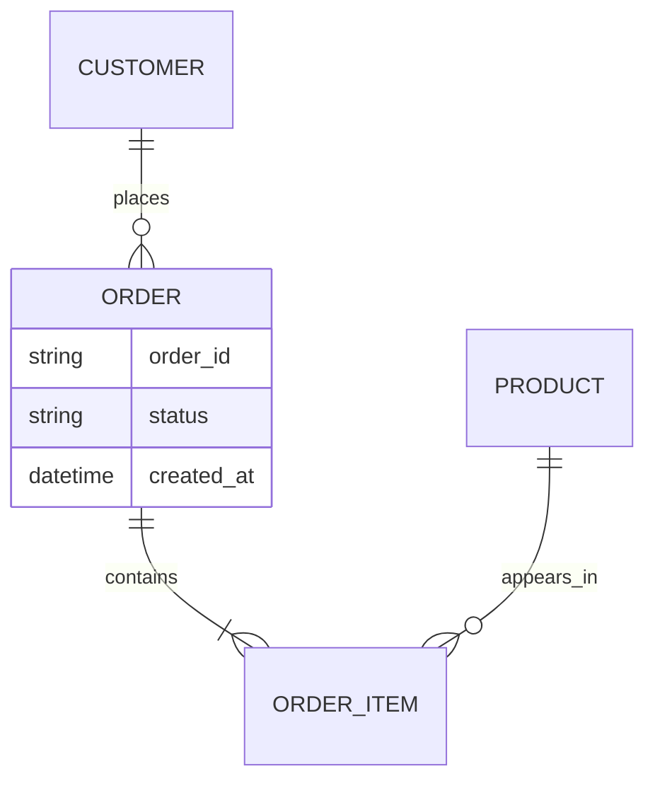

# فصل ۲: `Data Models` و `Query Languages`

## Data Models and Query Languages

این فصل نشان می‌دهد انتخاب `relational`، `document` یا `graph` فقط انتخاب syntax نیست؛ این انتخاب مشخص می‌کند رابطه‌ها کجا نگه‌داری شوند، چه چیزی در یک record کنار هم باشد و کدام `query`ها ساده یا پرهزینه شوند.

## هدف فصل

data model باید بین نیازهای دامنه، access pattern، استقلال از فناوری و هزینهٔ تغییر تعادل ایجاد کند. فصل از مدل `relational` و `document` شروع می‌کند و سپس `graph model`ها و زبان‌های declarative را بررسی می‌کند.

## نقشهٔ مطالب

- مدل `relational` در برابر مدل `document` و مسئلهٔ `object-relational mismatch`
- رابطه‌های یک‌به‌چند و چندبه‌چند و تکرار تاریخچهٔ data modelها
- وضعیت امروز databaseهای `relational` و `document`
- زبان‌های `declarative`، `MapReduce` و `graph model`ها
- property graph، Cypher، SPARQL و Datalog

## خلاصهٔ زمینه‌محور

### `relational` و `document`

مدل `relational` داده را در tableهای مستقل نگه می‌دارد و رابطه‌ها را با key و join بیان می‌کند. این جداسازی از تکرار بی‌دلیل جلوگیری می‌کند و برای queryهای ترکیبی قدرتمند است. در مدل `document`، داده‌ای که معمولاً با هم خوانده می‌شود می‌تواند در یک document تو‌در‌تو قرار بگیرد. این کار locality خواندن و شکل نزدیک به object برنامه را بهتر می‌کند، اما update دادهٔ تکراری و رابطه‌های پیچیده را دشوارتر می‌کند.

مرز «schema ثابت» و «schema آزاد» نیز ساده نیست. database `document` می‌تواند محدودیت و schema داشته باشد و database `relational` هم می‌تواند ستون‌های انعطاف‌پذیر یا JSON را ذخیره کند. پرسش مهم این است که چه قراردادی برای data وجود دارد و کجا enforce می‌شود.

### `NoSQL` و `object-relational mismatch`

رشد حجم داده، نیاز به توزیع روی ماشین‌های متعدد، preference برای نرم‌افزار آزاد و الگوهای دسترسی خاص، انگیزهٔ بخشی از جنبش NoSQL بود. «NoSQL» یک مدل واحد نیست؛ key-value، document، wide-column و graph هر کدام trade-off خود را دارند.

در برنامهٔ شیءگرا، ساختار nested و reference طبیعی است؛ در مدل `relational`، `normalization` و join طبیعی است. ORM می‌تواند تبدیل syntax را آسان کند، اما تفاوت مفهومی را حذف نمی‌کند. تصمیم طراحی باید از queryهای واقعی و invariantهای دامنه شروع شود، نه از شبیه‌سازی کامل objectها در database.

رابطهٔ چندبه‌چند معمولاً به junction table در مدل `relational` و آرایه یا reference در مدل `document` نیاز دارد. اگر data مرتبط کوچک و تقریباً ثابت است، embedding مناسب است؛ اگر مستقل، بزرگ یا زیاد update می‌شود، نگه‌داری reference و query جدا می‌تواند بهتر باشد.

### آیا `document` model تاریخ را تکرار می‌کند؟

مدل‌های سلسله‌مراتبی قدیمی در نمایش ساختار درختی خوب بودند اما رابطهٔ چندطرفه را سخت می‌کردند. مدل `relational` برای حل همین مشکل عمومی‌تر شد. مدل `document` دوباره locality و سلسله‌مراتب را پررنگ می‌کند، اما معمولاً وقتی انتخاب خوبی است که روابط واقعاً درختی یا bounded باشند. نتیجهٔ اصلی این است که هیچ model واحدی همهٔ شکل‌های data را به‌خوبی نمایش نمی‌دهد.

### `Query Languages`

زبان declarative مانند SQL هدف را بیان می‌کند و تصمیم اجرای آن را به optimizer می‌سپارد. این جداسازی باعث می‌شود query بدون تغییر منطق، با index یا plan دیگری اجرا شود. زبان imperative گام‌های اجرا را کنترل می‌کند و برای الگوریتم‌های خاص انعطاف بیشتری دارد، اما مسئولیت کارایی و هم‌زمانی را بیشتر به برنامه منتقل می‌کند.

MapReduce نیز یک زبان کامل پرس‌وجو نیست؛ الگویی برای پخش‌کردن محاسبهٔ map، shuffle و reduce روی دادهٔ بزرگ است. خوانایی و کنترل مرحله‌ای آن مفید است، اما برای queryهای تعاملی یا joinهای پیچیده، زبان declarative سطح بالاتر معمولاً مناسب‌تر است.

### `Graph models`

در دادهٔ گرافی، vertexها موجودیت و edgeها رابطهٔ دارای جهت و ویژگی‌اند. وقتی پرسش‌ها بیشتر دربارهٔ مسیرها، همسایگی چندمرحله‌ای یا شبکهٔ ارتباطی باشند، graph model طبیعی‌تر از جدول‌های متعدد است.

در property graph، هر node و edge ویژگی دارد و زبان‌هایی مانند Cypher مسیر و الگوی اتصال را بیان می‌کنند. در مدل RDF، data به tripleهای subject-predicate-object تقسیم می‌شود و SPARQL برای یافتن الگوها به کار می‌رود. Datalog لایه‌ای منطقی‌تر برای تعریف رابطه‌ها و قواعد است. این مدل‌ها به معنی حذف همهٔ queryهای `relational` نیستند؛ انتخاب باید بر اساس شکل سؤال و نیاز به transaction، index و scale انجام شود.

### مثال مستقل: شبکهٔ سازمانی

در یک سامانهٔ منابع انسانی، اطلاعات پایهٔ کارمند و تیم ممکن است در tableهای `relational` قرار گیرد، چون گزارش‌های مالی به join و constraintهای دقیق نیاز دارند. برای پرسش «چه کسانی از طریق چند مدیر به یک پروژه متصل‌اند؟» graph model طبیعی‌تر است. اگر این دو نیاز هم‌زمان مهم باشند، معماری polyglot می‌تواند data اصلی را در یک store نگه دارد و graph یا index را به‌صورت derived data بسازد؛ در این صورت باید جریان sync و source of truth روشن باشد.

## نکته‌های کلیدی

1. مدل داده را از روی access pattern و رابطه‌های دامنه انتخاب کنید.
2. embedding locality می‌دهد اما می‌تواند تکرار و ناسازگاری ایجاد کند.
3. declarative query به optimizer اجازهٔ تغییر plan می‌دهد.
4. گراف زمانی ارزشمند است که خود رابطه‌ها و مسیرها موضوع اصلی پرسش باشند.

## ارتباط با فصل‌های دیگر

- [فصل ۳: `Storage` و `Retrieval`](../03-storage-retrieval/README.md)
- [فصل ۴: `Encoding` و `Evolution`](../04-encoding-evolution/README.md)
- [فصل ۱۰: `Batch Processing`](../10-batch-processing/README.md)

## ماتریس انتخاب مدل داده

| نیاز اصلی | انتخاب اولیه | ریسک اصلی | پرسش کنترل‌کننده |
| --- | --- | --- | --- |
| transaction و constraint بین چند entity | مدل `relational` | join یا scale-out پرهزینه | کدام invariant باید اتمیک enforce شود؟ |
| خواندن یک aggregate کامل | مدل `document` با embedding | تکرار و update چند نسخه | اندازه و چرخهٔ عمر aggregate چقدر است؟ |
| جست‌وجوی مسیر و ارتباط چندمرحله‌ای | graph model | دشواری توزیع و query گسترده | آیا خود رابطه موضوع اصلی محصول است؟ |
| lookup بسیار ساده با کلید | key-value | query ثانویهٔ محدود | آیا همهٔ دسترسی‌ها از قبل معلوم‌اند؟ |

## نمودار مدل‌سازی یک سفارش

این نمودار فقط یک مدل مستقل برای فکرکردن است. اگر صفحهٔ سفارش همیشه اقلام را همراه خود می‌خواند، embedding می‌تواند مناسب باشد. اگر قیمت و مشخصات محصول مرتب تغییر می‌کند یا از چند سفارش مستقل خوانده می‌شود، reference و snapshot قیمت در زمان سفارش تصمیم دقیق‌تری است.

## روش طراحی query قبل از schema

1. پنج query پرتکرار و دو query نادر اما حیاتی را فهرست کنید.
2. برای هر query، مقدار داده، freshness، latency و نیاز به transaction را ثبت کنید.
3. entityهایی را که با هم تغییر می‌کنند از entityهایی که فقط با هم نمایش داده می‌شوند جدا کنید.
4. query آزمایشی را روی دادهٔ کج‌شده هم اجرا کنید؛ average معمولاً hotspot را پنهان می‌کند.
5. تصمیم را در کنار دلیل و query نمونه ثبت کنید تا schema به‌صورت تصادفی تکامل نیابد.

## سناریوی طراحی: سامانهٔ پشتیبانی

تیکت، پیام، کاربر و برچسب‌ها رابطه‌های متفاوتی دارند. صفحهٔ تیکت به پیام‌های مرتب نیاز دارد، جست‌وجوی agent به index متن نیاز دارد و گزارش SLA به factهای زمانی. یک سند بزرگ برای همهٔ این نیازها هم update را سخت می‌کند و هم queryهای تحلیلی را بدتر؛ بهتر است مدل عملیاتی و viewهای جست‌وجو/تحلیل با dataflow روشن از هم جدا شوند.

## تمرین‌های مرور

1. برای «مقالات و نویسندگان»، دو مدل `document` و `relational` طراحی و هزینهٔ update هر کدام را توضیح دهید.
2. سه query برای یک شبکهٔ دوستی بنویسید که graph model را توجیه یا رد کند.
3. یک field را انتخاب کنید که نباید به‌خاطر راحتی ORM در چند محل تکرار شود.

## تعریف مستقل اصطلاحات

### `relational`

**چیست؟** مدلی که داده را در tableها نگه می‌دارد و رابطه‌ها را با keyها مشخص می‌کند.

**مثال:** `orders.customer_id` می‌گوید هر سفارش متعلق به کدام مشتری است.

**اشتباه رایج:** `relational` یعنی «فقط SQL» نیست؛ نکتهٔ اصلی وجود رابطه و constraint میان داده‌هاست.

### `document`

**چیست؟** یک بستهٔ مستقل از داده که می‌تواند fieldهای تو‌در‌تو داشته باشد.

**مثال:** یک document سفارش می‌تواند آدرس ارسال و فهرست کالاها را کنار وضعیت سفارش نگه دارد.

**خطر:** اگر یک اطلاعات مشترک در چند document کپی شود، update باید همهٔ نسخه‌ها را هماهنگ کند.

### `schema`

**چیست؟** قراردادی دربارهٔ fieldها، نوع آن‌ها، اجباری‌بودن و معنی مقدارها.

**مثال:** schema پیام پرداخت می‌گوید `amount` عدد مثبت و `currency` یکی از کدهای معتبر است.

### `access pattern`

**چیست؟** شکل واقعی دسترسی برنامه به داده؛ مثل «آخرین ۲۰ پیام یک گفتگو» یا «همهٔ سفارش‌های باز یک مشتری».

**چرا مهم است؟** database را باید برای queryهای واقعی طراحی کرد، نه فقط برای شکل قشنگ entityها.

### `normalization` و `denormalization`

`normalization` یعنی حقیقت هر داده را تا جای ممکن یک‌جا نگه داریم. `denormalization` یعنی بخشی از داده را برای سریع‌ترشدن read دوباره ذخیره کنیم. دومی فقط وقتی منطقی است که منبع اصلی، روش sync و راه rebuild روشن باشد.

### `SQL` و `NoSQL`

`SQL` معمولاً به زبان و خانوادهٔ databaseهای `relational` اشاره دارد. `NoSQL` نام یک model واحد نیست؛ ممکن است document، key-value، wide-column یا graph باشد. انتخاب میان آن‌ها باید از query، consistency و scale شروع شود، نه از مد روز.
