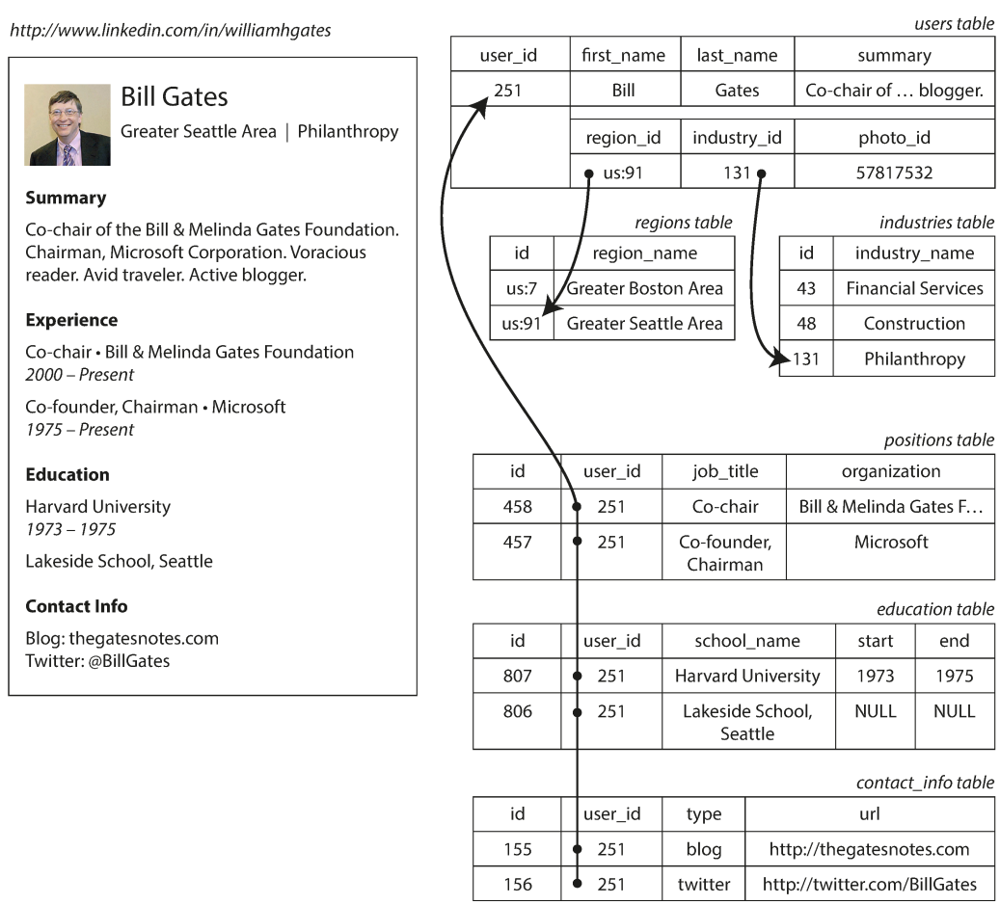
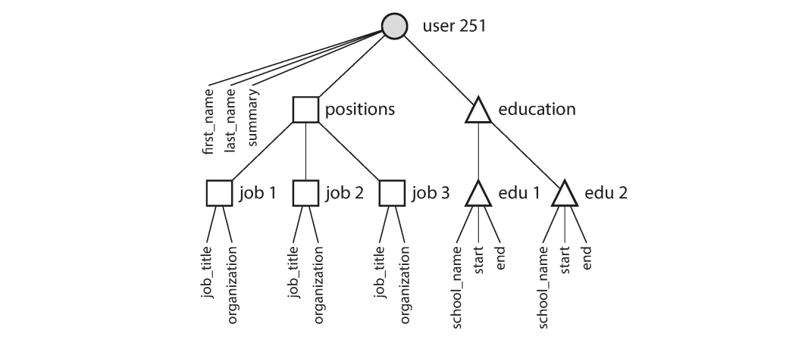
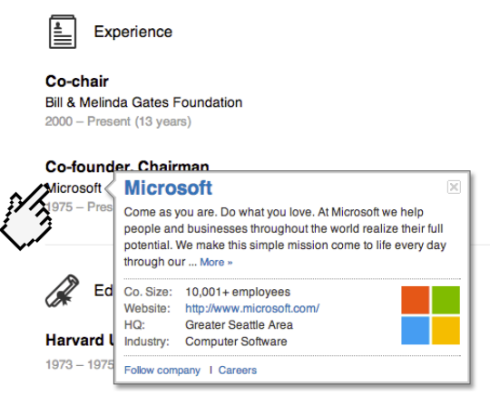
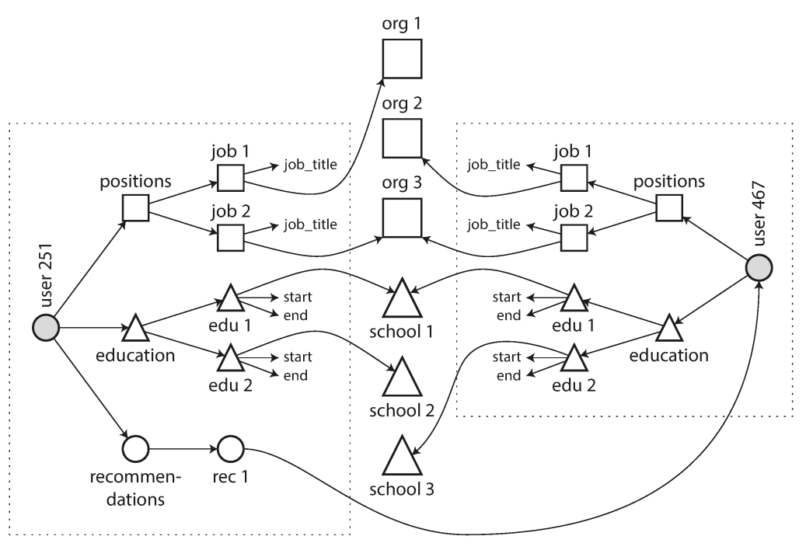
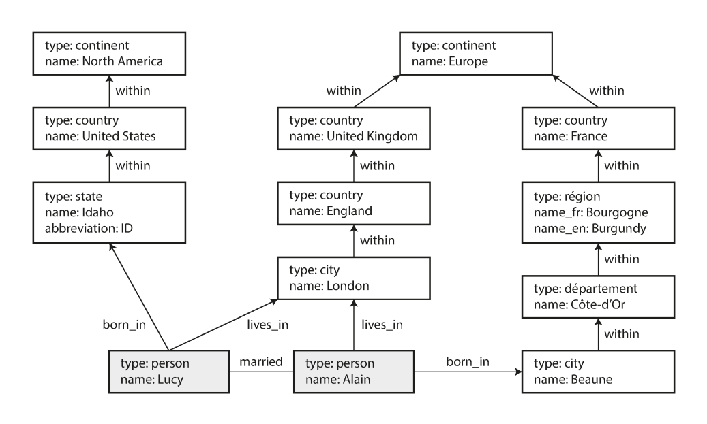

# فصل ۲: `Data Models` و `Query Languages`

## مدل‌های data و زبان‌های query

<blockquote dir="rtl" align="right">
  <p dir="rtl" align="right">محدودیت زبان من، محدودیت دنیای من است.</p>
  <p dir="rtl" align="right">— <span dir="ltr">Ludwig Wittgenstein</span>، <em dir="ltr">Tractatus Logico-Philosophicus</em>، ۱۹۲۲</p>
</blockquote>

&rlm;`Data model`ها شاید مهم‌ترین بخش توسعهٔ software باشند، چون اثر عمیقی بر software دارند: نه فقط روی روش نوشتن code، بلکه روی روشی که با آن مسئلهٔ خود را تصور می‌کنیم.

بیشتر applicationها با قرارگرفتن چند data model روی هم ساخته می‌شوند. سؤال اصلی در هر layer این است: این layer با استفاده از layer پایین‌تر چگونه نمایش داده می‌شود؟

1. &rlm;application developer به دنیای واقعی نگاه می‌کند؛ به آدم‌ها، سازمان‌ها، کالاها، actionها، جریان پول، sensorها و چیزهای دیگر. سپس آن‌ها را با object یا data structure و APIهایی که آن data structure را تغییر می‌دهند مدل می‌کند. این structureها معمولاً مخصوص همان application هستند.
2. وقتی می‌خواهید این structureها را ذخیره کنید، آن‌ها را با یک general-purpose data model بیان می‌کنید؛ مثلاً documentهای JSON یا XML، tableهای یک `relational database` یا یک `graph model`.
3. &rlm;engineerهایی که database را ساخته‌اند، راهی برای نمایش JSON، XML، relational یا graph data به شکل byte در memory، disk یا network انتخاب کرده‌اند. این representation باید امکان query، search، manipulation و processing data را فراهم کند.
4. در layerهای پایین‌تر، hardware engineerها روش نمایش byteها را با جریان الکتریکی، پالس نور، میدان مغناطیسی و چیزهای دیگر پیدا کرده‌اند.

در application پیچیده ممکن است layerهای میانی بیشتری وجود داشته باشد؛ مثلاً APIهایی که روی APIهای دیگر ساخته شده‌اند. ایدهٔ اصلی همان است: هر layer با ارائهٔ یک data model تمیز، complexity layerهای پایین‌تر را پنهان می‌کند. این abstractionها به گروه‌های مختلف، مانند engineerهای vendor database و application developerهای استفاده‌کننده، اجازه می‌دهند با هم کار کنند.

&rlm;data modelهای زیادی وجود دارند و هرکدام assumptionهایی دربارهٔ روش استفاده از خود دارند. بعضی usageها آسان‌اند و بعضی پشتیبانی نمی‌شوند؛ بعضی operationها سریع‌اند و بعضی بد اجرا می‌شوند؛ بعضی transformationها طبیعی‌اند و بعضی awkward.

مسلط‌شدن بر حتی یک data model تلاش زیادی می‌خواهد. چون data model اثر عمیقی بر کارهایی دارد که layer بالاتر می‌تواند یا نمی‌تواند انجام دهد، باید مدلی را انتخاب کنیم که با application مناسب باشد. در این فصل `relational model`، `document model` و چند data model مبتنی بر graph را مقایسه می‌کنیم و به query languageهای گوناگون و use caseهای آن‌ها می‌پردازیم. فصل ۳ توضیح می‌دهد storage engineها این modelها را واقعاً چگونه پیاده می‌کنند.

## &rlm;`Relational Model` در برابر `Document Model`

شناخته‌شده‌ترین data model امروز احتمالاً model مربوط به `SQL` است که بر `relational model` پیشنهادی Edgar Codd در سال ۱۹۷۰ بنا شده است [۱]. data در `relation`ها سازمان‌دهی می‌شود که در SQL آن‌ها را table می‌نامیم. هر relation مجموعه‌ای بدون ترتیب از tupleهاست که در SQL همان rowها هستند.

&rlm;relational model ابتدا یک پیشنهاد نظری بود و بسیاری شک داشتند که بتوان آن را با performance مناسب پیاده کرد. اما تا میانهٔ دههٔ ۱۹۸۰، `RDBMS` یا Relational Database Management System و SQL به ابزار اصلی ذخیره و queryکردن data با structure منظم تبدیل شدند. برتری relational databaseها حدود ۲۵ تا ۳۰ سال ادامه داشت؛ در تاریخ محاسبات، این مدت بسیار طولانی است.

ریشهٔ relational databaseها به business data processing روی mainframeها در دهه‌های ۱۹۶۰ و ۱۹۷۰ برمی‌گردد. use caseها از دید امروز عادی به نظر می‌رسند: `transaction processing` مانند ثبت فروش، عملیات بانکی، رزرو هواپیما و مدیریت موجودی warehouse؛ و `batch processing` مانند صدور invoice، payroll و reporting.

&rlm;databaseهای آن زمان application developer را مجبور می‌کردند دربارهٔ representation داخلی data زیاد فکر کند. هدف relational model این بود که این جزئیات implementation را پشت یک interface تمیز پنهان کند.

در دههٔ ۱۹۷۰ و ابتدای دههٔ ۱۹۸۰، network model و hierarchical model رقیب‌های اصلی بودند. object databaseها در اواخر دههٔ ۱۹۸۰ و اوایل دههٔ ۱۹۹۰ آمدند و دوباره کنار رفتند. XML databaseها در اوایل دههٔ ۲۰۰۰ ظاهر شدند، اما adoption محدودی داشتند. هر رقیب relational model در زمان خودش hype زیادی ایجاد کرد، اما ماندگار نشد [۲].

با قدرتمندتر و networkedشدن computerها، آن‌ها برای هدف‌های متنوع‌تری استفاده شدند. نکتهٔ جالب این است که relational databaseها بسیار خوب generalize شدند و از business data processing به use caseهای گسترده‌ای رسیدند: online publishing، discussion، social networking، ecommerce، game و software-as-a-service هنوز در بسیاری موارد روی relational database کار می‌کنند.

### تولد `NoSQL`

در دههٔ ۲۰۱۰، `NoSQL` تازه‌ترین تلاش برای کنارزدن برتری relational model بود. نام NoSQL کمی بد انتخاب شده است، چون به technology مشخصی اشاره نمی‌کند. این نام ابتدا فقط یک hashtag جذاب Twitter برای meetup مربوط به open source، distributed و non-relational databaseها در سال ۲۰۰۹ بود [۳]. بعداً این واژه با تفسیر `Not Only SQL` دوباره معنا شد [۴].

چند نیرو باعث استقبال از NoSQL شدند:

- نیاز به scalability بیشتر از چیزی که relational database به‌سادگی فراهم می‌کند؛ از جمله dataset بسیار بزرگ یا write throughput بسیار زیاد.
- ترجیح گستردهٔ free و open source software بر productهای تجاری database.
- &rlm;query operationهای تخصصی که relational model به‌خوبی پشتیبانی نمی‌کند.
- نارضایتی از محدودیت relational schema و علاقه به data model پویاتر و بیانگرتر [۵].

&rlm;applicationهای مختلف requirementهای متفاوت دارند؛ بنابراین بهترین technology برای یک use case ممکن است برای use case دیگر بهترین نباشد. احتمالاً در آیندهٔ قابل‌پیش‌بینی relational databaseها در کنار datastoreهای non-relational متنوع استفاده خواهند شد. این ایده را گاهی `polyglot persistence` می‌نامند [۳].

### &rlm;<span dir="ltr">`Object-Relational Mismatch`</span>

امروزه بیشتر applicationها با زبان‌های object-oriented نوشته می‌شوند. به همین دلیل از SQL انتقاد می‌شود که اگر data در tableهای relational ذخیره شود، بین objectهای application code و model table، row و column یک layer ترجمهٔ awkward لازم است. این فاصله را `impedance mismatch` می‌نامند.

&rlm;frameworkهای `ORM` یا Object-Relational Mapping، مانند ActiveRecord و Hibernate، مقدار boilerplate code لازم برای این ترجمه را کم می‌کنند؛ اما تفاوت دو model را کاملاً پنهان نمی‌کنند.

برای نمونه، یک résumé یا LinkedIn profile را در نظر بگیرید. profile با identifier یکتای `user_id` شناخته می‌شود. fieldهایی مانند `first_name` و `last_name` برای هر user فقط یک‌بار وجود دارند و می‌توانند columnهای table `users` باشند. اما بیشتر افراد در طول career چند position داشته‌اند، دوره‌های education و contact information آن‌ها نیز تعداد متغیری دارد. رابطهٔ user با این itemها one-to-many است و چند راه برای نمایش آن وجود دارد:

- در SQL سنتی، representation معمول و `normalized` این است که positions، education و contact information در tableهای جدا باشند و با foreign key به table `users` اشاره کنند.
- نسخه‌های جدید SQL از structured datatype و XML data پشتیبانی می‌کنند. در این روش data چندمقداری می‌تواند در یک row قرار گیرد و داخل آن query و index شود. چند database مانند Oracle، IBM DB2، MS SQL Server و PostgreSQL چنین قابلیت‌هایی دارند. JSON datatype نیز در databaseهایی مانند IBM DB2، MySQL و PostgreSQL پشتیبانی می‌شود.
- راه سوم این است که job، education و contact info را به شکل JSON یا XML encode کنیم، در یک text column ذخیره کنیم و بگذاریم application structure و content آن را تفسیر کند. در این حالت database معمولاً نمی‌تواند valueهای داخل آن column را query کند.



برای data structureای مانند résumé که بیشتر شبیه یک document مستقل است، JSON می‌تواند مناسب باشد. databaseهای document-oriented مانند MongoDB، RethinkDB، CouchDB و Espresso از این model پشتیبانی می‌کنند.

```json
{
  "user_id": 251,
  "first_name": "Bill",
  "last_name": "Gates",
  "summary": "Co-chair of the Bill & Melinda Gates... Active blogger.",
  "region_id": "us:91",
  "industry_id": 131,
  "photo_url": "/p/7/000/253/05b/308dd6e.jpg",
  "positions": [
    {"job_title": "Co-chair", "organization": "Bill & Melinda Gates Foundation"},
    {"job_title": "Co-founder, Chairman", "organization": "Microsoft"}
  ],
  "education": [
    {"school_name": "Harvard University", "start": 1973, "end": 1975},
    {"school_name": "Lakeside School, Seattle", "start": null, "end": null}
  ],
  "contact_info": {
    "blog": "http://thegatesnotes.com",
    "twitter": "http://twitter.com/BillGates"
  }
}
```

بعضی developerها احساس می‌کنند JSON `impedance mismatch` میان application code و storage layer را کم می‌کند. JSON به‌دلیل locality بهتر از schema چند tableای عمل می‌کند. در relational representation برای fetchکردن profile باید چند query بزنید یا join چندطرفه‌ای میان users و tableهای زیرمجموعه انجام دهید. در JSON همهٔ اطلاعات مرتبط در یک محل است و یک query کافی است.

رابطهٔ one-to-many میان profile و position، سابقهٔ education و contact information یک ساختار tree در data ایجاد می‌کند و JSON این tree را صریح نشان می‌دهد.



### رابطه‌های `Many-to-One` و `Many-to-Many`

در JSON بالا `region_id` و `industry_id` به شکل ID ذخیره شده‌اند، نه به شکل text ساده‌ای مانند `Greater Seattle Area` و `Philanthropy`. اگر user interface برای region و industry field آزاد داشته باشد، text ساده قابل‌قبول است. اما فهرست استاندارد regionها و industryها مزیت‌هایی دارد:

- &rlm;style و spelling در همهٔ profileها یکسان می‌شود.
- &rlm;ambiguity کم می‌شود؛ مثلاً چند شهر ممکن است نام یکسان داشته باشند.
- &rlm;update آسان می‌شود، چون نام فقط در یک محل ذخیره شده است.
- &rlm;localization ممکن می‌شود؛ فهرست استاندارد می‌تواند به زبان user نمایش داده شود.
- &rlm;search بهتر می‌شود؛ مثلاً می‌توان فهمید Seattle در Washington است، چیزی که از text خام معلوم نیست.

انتخاب میان ID و text در اصل سؤال دربارهٔ duplication است. وقتی از ID استفاده می‌کنید، اطلاعات معنی‌دار برای انسان فقط یک‌بار ذخیره می‌شود و recordهای دیگر به ID اشاره می‌کنند. وقتی text را در هر record ذخیره می‌کنید، همان اطلاعات را تکرار می‌کنید.

مزیت ID این است که برای انسان معنی ندارد و بنابراین لازم نیست تغییر کند. اما هر اطلاعاتی که برای انسان معنی‌دار است ممکن است در آینده تغییر کند. اگر آن اطلاعات duplicate شده باشد، همهٔ copyها باید update شوند؛ این کار write overhead ایجاد می‌کند و ممکن است بعضی copyها update شوند و بعضی نشوند. حذف این duplication ایدهٔ اصلی `normalization` در database است.

&rlm;database administratorها و developerها دربارهٔ normalization و `denormalization` زیاد بحث می‌کنند. در ادامه فعلاً قضاوت را کنار می‌گذاریم و در بخش سوم به caching، denormalization و derived data برمی‌گردیم.

&rlm;normalization معمولاً به رابطه‌های many-to-one نیاز دارد؛ مثلاً افراد زیادی در یک region زندگی می‌کنند یا در یک industry کار می‌کنند. این رابطه‌ها در document model همیشه طبیعی نیستند. در relational database ارجاع‌دادن به rowهای table دیگر با ID عادی است، چون join آسان است. در document database برای treeهای one-to-many معمولاً join لازم نیست و پشتیبانی از join ممکن است ضعیف باشد. اگر database join را پشتیبانی نکند، باید join را با چند query در application code تقلید کرد؛ در این حالت complexity از database به application منتقل می‌شود.

حتی اگر نسخهٔ اول application با document model بدون join خوب کار کند، data با اضافه‌شدن feature معمولاً interconnectedتر می‌شود:

- &rlm;organization و school ممکن است از string ساده به entity مستقل تبدیل شوند تا هرکدام page، logo و news feed داشته باشند.
- ممکن است user بتواند برای user دیگری recommendation بنویسد. recommendation باید به profile نویسنده reference داشته باشد تا اگر عکس نویسنده تغییر کرد، recommendation نیز عکس جدید را نشان دهد.



این featureها رابطه‌های many-to-many ایجاد می‌کنند. data داخل هر rectangle نقطه‌چین را می‌توان در یک document نگه داشت، اما reference به organization، school و userهای دیگر باید جدا بماند و هنگام query به join نیاز دارد.



### آیا `Document Database`ها تاریخ را تکرار می‌کنند؟

رابطه‌های many-to-many و join در relational databaseها عادی‌اند، اما document database و NoSQL دوباره بحث قدیمیِ بهترین روش نمایش relationship را زنده کردند. این بحث از NoSQL قدیمی‌تر است و به اولین databaseهای computer برمی‌گردد.

&rlm;database محبوب business processing در دههٔ ۱۹۷۰، IBM Information Management System یا `IMS` بود که ابتدا برای stock-keeping برنامهٔ فضایی Apollo ساخته شد و در سال ۱۹۶۸ تجاری شد [۱۳]. IMS هنوز روی mainframeهای IBM استفاده و نگه‌داری می‌شود [۱۴].

&rlm;IMS از `hierarchical model` استفاده می‌کرد؛ data به شکل treeای از recordهای nested در recordهای دیگر بود، شبیه JSON. این model برای one-to-many خوب بود، اما many-to-many و join را سخت می‌کرد. developer باید انتخاب می‌کرد data را duplicate یا `denormalize` کند یا reference میان recordها را دستی دنبال کند. مسئلهٔ دههٔ ۱۹۶۰ و ۱۹۷۰ بسیار شبیه مسئله‌ای است که امروز در document database دیده می‌شود [۱۵].

دو راه‌حل اصلی برای محدودیت hierarchical model پیشنهاد شد: relational model که به SQL تبدیل شد و برتری پیدا کرد، و network model که ابتدا طرفداران زیادی داشت اما بعد کنار رفت. برای فهم اختلاف این دو، نگاه کوتاهی به آن‌ها مفید است.

#### &rlm;<span dir="ltr">`Network Model`</span>

&rlm;CODASYL یا Conference on Data Systems Languages، network model را استاندارد کرد. این model تعمیم hierarchical model بود: در tree hierarchical هر record دقیقاً یک parent دارد، اما در network model یک record می‌تواند چند parent داشته باشد. بنابراین many-to-one و many-to-many ممکن می‌شد.

&rlm;link میان recordها foreign key نبود؛ بیشتر شبیه pointer در programming language بود، با این تفاوت که روی disk ذخیره می‌شد. تنها راه دسترسی به record، دنبال‌کردن یک path از root در زنجیرهٔ linkها بود. به این path، `access path` می‌گفتند.

در ساده‌ترین حالت، access path شبیه traversal یک linked list بود: از head شروع می‌کردید و recordها را یکی‌یکی می‌دیدید تا record موردنظر پیدا شود. در data با many-to-many pathهای مختلفی می‌توانستند به یک record برسند و programmer مجبور بود همهٔ این pathها را در ذهن نگه دارد.

&rlm;query در CODASYL با حرکت‌دادن cursor در database و دنبال‌کردن listها و access pathها انجام می‌شد. اگر record چند parent داشت، application code باید همهٔ relationshipها را مدیریت می‌کرد. این روش از سخت‌افزار محدود دههٔ ۱۹۷۰ استفادهٔ خوبی می‌کرد، اما code مربوط به query و update را پیچیده و inflexible می‌کرد. اگر path مناسب به data وجود نداشت، وضعیت دشوار بود؛ تغییر access path نیز به بازنویسی مقدار زیادی code نیاز داشت.

#### &rlm;<span dir="ltr">`Relational Model`</span>

&rlm;relational model data را ساده و آشکار روی table می‌چیند: relation یا table مجموعه‌ای از tuple یا row است. structureهای nested تو‌در‌تو و access pathهای پیچیده وجود ندارند. می‌توان هر row یا همهٔ rowهای table را با شرط دلخواه خواند و می‌توان با مشخص‌کردن key یک row خاص را پیدا کرد.

در relational database، `query optimizer` به‌طور خودکار تصمیم می‌گیرد کدام بخش query با چه ترتیبی اجرا شود و کدام index به کار رود. این انتخاب‌ها در واقع access path هستند، اما application developer لازم نیست آن‌ها را دستی مشخص کند.

اگر بخواهید data را به روش جدیدی query کنید، معمولاً فقط یک index جدید تعریف می‌کنید و query optimizer مناسب‌ترین index را انتخاب می‌کند. لازم نیست queryها را برای استفاده از index جدید تغییر دهید. همین ویژگی اضافه‌کردن feature جدید به application را آسان‌تر کرد.

ساخت query optimizer عمومی دشوار و حاصل سال‌ها research و development است [۱۸]؛ اما insight مهم relational model این است که optimizer را یک‌بار می‌سازید و همهٔ applicationهای استفاده‌کننده از database از آن سود می‌برند.

#### مقایسه با `Document Database`

&rlm;document database از یک جهت به hierarchical model برگشته است: recordهای nested مربوط به رابطهٔ one-to-many، مانند position و education، داخل parent record ذخیره می‌شوند، نه در table جدا.

اما برای many-to-one و many-to-many، relational و document database از نظر بنیادی متفاوت نیستند. در هر دو، item مرتبط با یک identifier یکتا reference می‌شود؛ در relational model به آن foreign key و در document model به آن document reference می‌گوییم. این identifier هنگام read با join یا queryهای بعدی resolve می‌شود. document database مسیر CODASYL را دنبال نکرده و به pointerهای قدیمی برنگشته است.

## &rlm;`Relational` و `Document Database` امروز

در مقایسهٔ relational و document database تفاوت‌های زیادی وجود دارد، مانند fault tolerance و concurrency؛ اما در این فصل روی تفاوت data model تمرکز می‌کنیم.

استدلال‌های اصلی به نفع document model عبارت‌اند از schema flexibility، performance بهتر به‌دلیل locality و نزدیک‌بودن به data structureهای application در بعضی use caseها. relational model در مقابل، پشتیبانی بهتری از join و رابطه‌های many-to-one و many-to-many دارد.

### کدام model code ساده‌تری می‌سازد؟

اگر data application ساختاری document-like داشته باشد، یعنی treeای از رابطه‌های one-to-many که معمولاً یک‌جا load می‌شود، document model احتمالاً انتخاب خوبی است. `shredding` یا شکستن یک document به tableهای متعدد می‌تواند schema دشوار و application code غیرضروری پیچیده‌ای بسازد.

&rlm;document model محدودیت‌هایی نیز دارد. مثلاً نمی‌توانید مستقیماً به item nested داخل document اشاره کنید و باید چیزی مانند «item دوم از list positionهای user 251» را بگویید. تا وقتی document بیش‌ازحد عمیق nested نشده باشد، این مشکل معمولاً جدی نیست.

پشتیبانی ضعیف از join بسته به application ممکن است مشکل باشد یا نباشد. در analytics applicationای که فقط eventهای رخ‌داده در زمان‌های مختلف را ثبت می‌کند، شاید many-to-many لازم نباشد [۱۹]. اما اگر application رابطه‌های many-to-many داشته باشد، document model جذابیت کمتری دارد. می‌توان با denormalization نیاز به join را کم کرد، ولی application code باید consistency copyهای denormalized را حفظ کند. تقلید join با چند request به database هم complexity را به application منتقل می‌کند و معمولاً از join تخصصی database کندتر است [۱۵].

پس نمی‌توان به‌طور عمومی گفت کدام model code ساده‌تری می‌سازد؛ پاسخ به نوع relationshipهای data بستگی دارد. برای data بسیار interconnected، document model awkward است، relational model قابل‌قبول است و graph model طبیعی‌تر است.

### &rlm;`Schema Flexibility` در document model

بیشتر document databaseها و JSON support در relational databaseها schema را روی data داخل document enforce نمی‌کنند. یعنی می‌توان key و value دلخواه به document اضافه کرد و client هنگام read guarantee ندارد که همهٔ documentها چه fieldهایی دارند.

به document database گاهی schemaless می‌گویند، اما این عبارت گمراه‌کننده است. codeی که data را می‌خواند معمولاً structure خاصی را فرض می‌کند؛ پس schema وجود دارد، ولی database آن را enforce نمی‌کند. عبارت دقیق‌تر `schema-on-read` است؛ structure هنگام read تفسیر می‌شود. در مقابل، در `schema-on-write` schema صریح است و database تضمین می‌کند data نوشته‌شده با آن سازگار باشد.

&rlm;schema-on-read شبیه dynamic type checking در runtime است و schema-on-write شبیه static type checking در compile time. دربارهٔ مزیت این دو روش پاسخ مطلقی وجود ندارد.

تفاوت در زمان تغییر format data واضح‌تر می‌شود. فرض کنید نام کامل user را ابتدا در یک field ذخیره کرده‌اید و اکنون می‌خواهید first name و last name جدا باشند. در document database می‌توانید از این پس documentهای جدید را با fieldهای جدید بنویسید و در application code برای documentهای قدیمی راه سازگارکننده داشته باشید:

```javascript
if (user && user.name && !user.first_name) {
  // Documents written before Dec 8, 2013 don't have first_name
  user.first_name = user.name.split(" ")[0];
}
```

در database با schema استاتیک، معمولاً migration انجام می‌دهید:

```sql
ALTER TABLE users ADD COLUMN first_name text;
UPDATE users SET first_name = split_part(name, ' ', 1); -- PostgreSQL
UPDATE users SET first_name = substring_index(name, ' ', 1); -- MySQL
```

&rlm;schema change به کندی و downtime معروف است، اما این reputation همیشه منصفانه نیست. بیشتر relational databaseها `ALTER TABLE` را در چند millisecond اجرا می‌کنند. MySQL استثنایی مهم است؛ چون هنگام ALTER TABLE کل table را copy می‌کند و برای table بزرگ ممکن است دقیقه‌ها یا ساعت‌ها downtime ایجاد شود، هرچند toolهایی برای دورزدن این محدودیت وجود دارد [۲۴، ۲۵، ۲۶].

اجرای UPDATE روی table بزرگ در هر database احتمالاً کند است، چون هر row باید دوباره نوشته شود. اگر این کار قابل‌قبول نباشد، application می‌تواند first_name را فعلاً NULL بگذارد و هنگام read آن را از name پر کند؛ مانند document database.

&rlm;schema-on-read وقتی مفید است که itemهای collection structure یکسانی نداشته باشند؛ مثلاً object typeهای زیادی وجود داشته باشد یا structure data را systemهای بیرونی تعیین کنند و هر زمان تغییر دهند. در چنین موقعیتی schema ممکن است بیشتر از آنکه کمک کند مانع باشد و document بدون schema model طبیعی‌تری باشد. اما وقتی همهٔ recordها باید structure یکسانی داشته باشند، schema برای documentکردن و enforceکردن آن structure مفید است. فصل ۴ به schema و schema evolution برمی‌گردد.

### &rlm;`Data Locality` برای query

&rlm;document معمولاً به شکل یک string پیوسته و با JSON، XML یا variant باینری مانند BSON encode می‌شود. اگر application اغلب به کل document نیاز داشته باشد، این locality مزیت performance دارد. اگر data میان چند table تقسیم شده باشد، برای retrieveکردن آن به چند index lookup و احتمالاً چند disk seek نیاز است.

&rlm;locality فقط زمانی مزیت است که هم‌زمان بخش بزرگی از document را بخواهید. database معمولاً کل document را load می‌کند، حتی اگر فقط بخش کوچکی از آن را بخوانید؛ در document بزرگ این کار waste است. هنگام update نیز اغلب کل document دوباره نوشته می‌شود. به همین دلیل documentها را بهتر است کوچک نگه داشت و از writeهایی که اندازهٔ document را زیاد می‌کنند دوری کرد [۹].

ایدهٔ جمع‌کردن data مرتبط برای locality فقط مخصوص document model نیست. Google Spanner در relational model اجازه می‌دهد schema اعلام کند rowهای یک table داخل parent table interleave یا nested شوند. Oracle نیز با multi-table index cluster tableها قابلیت مشابهی دارد. مفهوم column-family در Bigtable، که Cassandra و HBase استفاده می‌کنند، هدف مشابهی برای مدیریت locality دارد.

### نزدیک‌شدن document و relational databaseها

بیشتر relational databaseها از میانهٔ دههٔ ۲۰۰۰ از XML پشتیبانی می‌کنند و امکان update محلی، index و query داخل XML document را می‌دهند. PostgreSQL، MySQL و IBM DB2 نیز JSON را پشتیبانی می‌کنند. با توجه به محبوبیت JSON در web API، احتمالاً relational databaseهای بیشتری این قابلیت را اضافه می‌کنند.

در سمت document database، RethinkDB از joinهای شبیه relational در query language خود پشتیبانی می‌کند و بعضی MongoDB driverها referenceهای database را خودکار resolve می‌کنند؛ این کار عملاً join سمت client است و به‌دلیل network round-trip اضافه ممکن است کندتر از join داخل database باشد.

&rlm;relational و document databaseها در طول زمان شبیه‌تر می‌شوند و این خوب است. data modelهای آن‌ها مکمل یکدیگرند. databaseای که بتواند data شبیه document را نگه دارد و روی آن relational query اجرا کند، اجازه می‌دهد application ترکیبی را انتخاب کند که با نیازش بهتر است. hybridی از دو model مسیر خوبی برای آینده است.

## &rlm;`Query Languages` برای data

&rlm;relational model روش تازه‌ای برای query معرفی کرد. SQL یک `declarative query language` است، درحالی‌که IMS و CODASYL با imperative code database را query می‌کردند.

در زبان imperative به computer می‌گویید چه operationهایی را با چه ترتیبی انجام دهد. مثلاً برای برگرداندن sharkها از list حیوانات:

```javascript
function getSharks() {
  var sharks = [];
  for (var i = 0; i < animals.length; i++) {
    if (animals[i].family === "Sharks") {
      sharks.push(animals[i]);
    }
  }
  return sharks;
}
```

در relational algebra به‌جای آن pattern نتیجه را می‌نویسید:

```text
sharks = σfamily = “Sharks” (animals)
```

و در SQL:

```sql
SELECT * FROM animals WHERE family = 'Sharks';
```

در `declarative query language` فقط pattern data موردنظر را مشخص می‌کنید: result چه conditionهایی داشته باشد و data چطور transform شود، مثلاً sort، group یا aggregate. اینکه به این هدف چگونه برسیم بر عهدهٔ query optimizer database است؛ optimizer index، join method و ترتیب اجرای query را انتخاب می‌کند.

&rlm;declarative language معمولاً کوتاه‌تر و آسان‌تر از imperative API است. مهم‌تر اینکه جزئیات implementation engine را پنهان می‌کند و database می‌تواند performance را بهتر کند، بدون اینکه queryها تغییر کنند. declarative language معمولاً برای parallel execution نیز مناسب‌تر است، چون فقط pattern نتیجه را توصیف می‌کند، نه algorithm دقیق رسیدن به نتیجه را.

## &rlm;`Declarative Query` در web

مزیت declarative query فقط مخصوص database نیست. در web browser نیز CSS و XSL declarative هستند. فرض کنید صفحه‌ای دربارهٔ حیوانات اقیانوس دارید و navigation item مربوط به Sharks با class `selected` مشخص شده است:

```html
<ul>
  <li class="selected">
    <p>Sharks</p>
    <ul>
      <li>Great White Shark</li>
      <li>Tiger Shark</li>
      <li>Hammerhead Shark</li>
    </ul>
  </li>
  <li>
    <p>Whales</p>
    <ul>
      <li>Blue Whale</li>
      <li>Humpback Whale</li>
      <li>Fin Whale</li>
    </ul>
  </li>
</ul>
```

برای آبی‌کردن background عنوان انتخاب‌شده، CSS کافی است:

```css
li.selected > p {
  background-color: blue;
}
```

این selector pattern elementهایی را مشخص می‌کند که باید style آبی بگیرند: هر `p`ای که parent مستقیم آن `li`ای با class selected باشد. اگر همین کار را با DOM API و JavaScript imperative انجام دهید، code بسیار طولانی‌تر و شکننده‌تر می‌شود. وقتی class selected حذف شود، CSS خودکار style را برمی‌دارد؛ اما code imperative ممکن است رنگ قدیمی را باقی بگذارد. همچنین browser vendor می‌تواند implementation داخلی CSS و XPath را بهتر کند، بدون آنکه application code تغییر کند.

بنابراین در browser، CSS declarative از دستکاری imperative style در JavaScript بهتر است؛ در database نیز SQL declarative معمولاً از imperative query API بهتر عمل می‌کند.

## &rlm;`MapReduce` برای query

&rlm;`MapReduce` یک programming model برای پردازش bulk مقدار زیادی data روی چند machine است که Google آن را popular کرد [۳۳]. بعضی NoSQL datastoreها مانند MongoDB و CouchDB شکل محدودی از MapReduce را برای read-only query روی documentهای بسیار پشتیبانی می‌کنند.

&rlm;MapReduce نه declarative query language است و نه کاملاً imperative API؛ جایی میان این دو قرار دارد. logic query با snippetهای code نوشته می‌شود و processing framework آن‌ها را بارها صدا می‌زند. این model بر functionهای map یا collect و reduce یا fold تکیه دارد.

فرض کنید marine biologist هستید و هر بار حیوانی در اقیانوس می‌بینید، یک observation record در database ثبت می‌کنید. اکنون می‌خواهید گزارشی بسازید که تعداد sharkهای دیده‌شده در هر ماه را نشان دهد. در PostgreSQL:

```sql
SELECT date_trunc('month', observation_timestamp) AS observation_month,
       sum(num_animals) AS total_animals
FROM observations
WHERE family = 'Sharks'
GROUP BY observation_month;
```

در این query ابتدا observationهای خانوادهٔ Sharks filter می‌شوند، سپس بر اساس ماه group می‌شوند و در پایان تعداد حیوانات هر ماه sum می‌شود. همان کار با MongoDB MapReduce:

```javascript
db.observations.mapReduce(
  function map() {
    var year = this.observationTimestamp.getFullYear();
    var month = this.observationTimestamp.getMonth() + 1;
    emit(year + "-" + month, this.numAnimals);
  },
  function reduce(key, values) {
    return Array.sum(values);
  },
  {
    query: { family: "Sharks" },
    out: "monthlySharkReport"
  }
);
```

&rlm;map برای هر document مطابق query یک‌بار اجرا می‌شود و keyای مانند `1995-12` و value تعداد حیوانات را emit می‌کند. pairهای هم‌key کنار هم group می‌شوند و reduce برای هر group یک‌بار اجرا می‌شود. اگر دو observation در دسامبر ۱۹۹۵ به‌ترتیب ۳ و ۴ حیوان داشته باشند، reduce مقدار ۷ برمی‌گرداند و خروجی در collection `monthlySharkReport` ذخیره می‌شود.

&rlm;map و reduce باید pure function باشند: فقط از input خود استفاده کنند، query اضافی نزنند و side effect نداشته باشند. این محدودیت اجازه می‌دهد database آن‌ها را هرجا و با هر ترتیبی اجرا کند و در صورت failure دوباره اجرا کند.

&rlm;MapReduce modelی نسبتاً low-level برای اجرای distributed روی cluster است. query languageهای سطح بالاتر مانند SQL می‌توانند با pipelineای از operationهای MapReduce پیاده شوند، اما distributed SQL implementationهایی نیز وجود دارند که از MapReduce استفاده نمی‌کنند. SQL الزام نمی‌کند روی یک machine اجرا شود و MapReduce نیز تنها راه distributed query execution نیست.

مشکل usability در MapReduce این است که باید دو function هماهنگ بنویسید و این کار اغلب از نوشتن یک query سخت‌تر است. به همین دلیل MongoDB 2.2 `aggregation pipeline` را اضافه کرد:

```javascript
db.observations.aggregate([
  { $match: { family: "Sharks" } },
  { $group: {
      _id: {
        year: { $year: "$observationTimestamp" },
        month: { $month: "$observationTimestamp" }
      },
      totalAnimals: { $sum: "$numAnimals" }
  } }
]);
```

&rlm;aggregation pipeline از نظر expressiveness شبیه subsetای از SQL است، اما syntax آن JSON-based است. نکتهٔ جالب این است که NoSQL system ممکن است در ظاهر، SQL را دوباره با لباسی دیگر اختراع کند.

## &rlm;<span dir="ltr">`Graph-Like Data Models`</span>

اگر data بیشتر رابطه‌های one-to-many یا هیچ رابطه‌ای نداشته باشد، document model مناسب است. اما وقتی many-to-many زیاد باشد و connectionهای data پیچیده شوند، مدل‌کردن data به شکل graph طبیعی‌تر می‌شود.

&rlm;graph از دو نوع object ساخته می‌شود: `vertex` یا node یا entity، و `edge` یا relationship یا arc. نمونه‌ها:

- در social graph، vertexها آدم‌ها و edgeها رابطهٔ آشنایی‌اند.
- در web graph، vertexها web pageها و edgeها HTML linkها هستند.
- در road یا rail network، vertexها junctionها و edgeها road یا railway بین آن‌ها هستند.

الگوریتم‌هایی مانند shortest path برای navigation و PageRank برای تعیین محبوبیت page روی graph کار می‌کنند. graph الزاماً data هم‌نوع ندارد. Facebook graph واحدی با vertexهای person، location، event، check-in و comment و edgeهایی مانند friendship، محل check-in و حضور در event دارد [۳۵].

در این بخش graphی را در نظر می‌گیریم که دو نفر به نام Lucy از Idaho و Alain از Beaune فرانسه را نشان می‌دهد. آن‌ها ازدواج کرده‌اند و در London زندگی می‌کنند.



سه زبان declarative برای graph را بررسی می‌کنیم: `Cypher`، `SPARQL` و `Datalog`. زبان imperative مانند Gremlin و framework پردازش graph مانند Pregel نیز وجود دارد.

### &rlm;<span dir="ltr">`Property Graph`</span>

در property graph هر vertex شامل identifier یکتا، مجموعهٔ outgoing edge، مجموعهٔ incoming edge و collectionای از propertyهای key-value است. هر edge نیز identifier یکتا، vertex شروع یا tail، vertex پایان یا head، label رابطه و propertyهای key-value دارد.

می‌توان graph store را مانند دو relational table دید: یکی برای vertex و دیگری برای edge:

```sql
CREATE TABLE vertices (
  vertex_id integer PRIMARY KEY,
  properties json
);

CREATE TABLE edges (
  edge_id integer PRIMARY KEY,
  tail_vertex integer REFERENCES vertices (vertex_id),
  head_vertex integer REFERENCES vertices (vertex_id),
  label text,
  properties json
);

CREATE INDEX edges_tails ON edges (tail_vertex);
CREATE INDEX edges_heads ON edges (head_vertex);
```

سه ویژگی مهم این model:

1. هر vertex می‌تواند با هر vertex دیگری edge داشته باشد؛ schema محدود نمی‌کند چه چیزهایی به هم وصل شوند.
2. از هر vertex می‌توان outgoing و incoming edge را سریع پیدا کرد و graph را هم forward و هم backward traverse کرد.
3. با labelهای مختلف می‌توان چند نوع relationship را در یک graph نگه داشت و data model تمیزی داشت.

این انعطاف برای data model ارزشمند است. اگر بعداً بخواهیم allergyهای Lucy و Alain را ثبت کنیم، vertexای برای هر allergen و edgeای میان person و allergen می‌سازیم و می‌توانیم query کنیم هر شخص چه foodهایی را می‌تواند بخورد. graph با اضافه‌شدن featureهای application به‌سادگی evolve می‌شود.

### زبان query `Cypher`

&rlm;Cypher یک declarative query language برای property graph و ساختهٔ Neo4j است. برای واردکردن بخش‌هایی از graph:

```cypher
CREATE
  (NAmerica:Location {name:'North America', type:'continent'}),
  (USA:Location {name:'United States', type:'country' }),
  (Idaho:Location {name:'Idaho', type:'state' }),
  (Lucy:Person {name:'Lucy' }),
  (Idaho) -[:WITHIN]-> (USA) -[:WITHIN]-> (NAmerica),
  (Lucy) -[:BORN_IN]-> (Idaho)
```

برای پیدا‌کردن personهایی که از US به Europe مهاجرت کرده‌اند:

```cypher
MATCH
  (person) -[:BORN_IN]-> () -[:WITHIN*0..]-> (us:Location {name:'United States'}),
  (person) -[:LIVES_IN]-> () -[:WITHIN*0..]-> (eu:Location {name:'Europe'})
RETURN person.name
```

این query می‌گوید person باید هم مسیر BORN_IN به locationای در US داشته باشد و هم مسیر LIVES_IN به locationای در Europe. `WITHIN*0..` یعنی edge WITHIN را صفر بار یا بیشتر دنبال کن. query optimizer می‌تواند به‌جای scanکردن همهٔ personها از locationهای US و Europe شروع کند و با index و incoming edgeها به person برسد. چون query declarative است، application لازم نیست این execution detailها را مشخص کند.

### &rlm;queryهای graph در `SQL`

&rlm;graph data را می‌توان در relational table قرار داد، اما queryکردن graph با SQL دشوارتر است، چون تعداد joinها از قبل مشخص نیست. برای همان مسئله می‌توان از recursive common table expression استفاده کرد:

```sql
WITH RECURSIVE
in_usa(vertex_id) AS (
  SELECT vertex_id FROM vertices
  WHERE properties->>'name' = 'United States'
  UNION
  SELECT edges.tail_vertex FROM edges
  JOIN in_usa ON edges.head_vertex = in_usa.vertex_id
  WHERE edges.label = 'within'
),
in_europe(vertex_id) AS (
  SELECT vertex_id FROM vertices
  WHERE properties->>'name' = 'Europe'
  UNION
  SELECT edges.tail_vertex FROM edges
  JOIN in_europe ON edges.head_vertex = in_europe.vertex_id
  WHERE edges.label = 'within'
),
born_in_usa(vertex_id) AS (
  SELECT edges.tail_vertex FROM edges
  JOIN in_usa ON edges.head_vertex = in_usa.vertex_id
  WHERE edges.label = 'born_in'
),
lives_in_europe(vertex_id) AS (
  SELECT edges.tail_vertex FROM edges
  JOIN in_europe ON edges.head_vertex = in_europe.vertex_id
  WHERE edges.label = 'lives_in'
)
SELECT vertices.properties->>'name'
FROM vertices
JOIN born_in_usa ON vertices.vertex_id = born_in_usa.vertex_id
JOIN lives_in_europe ON vertices.vertex_id = lives_in_europe.vertex_id;
```

این query ابتدا locationهای داخل US و Europe را به‌صورت recursive پیدا می‌کند، سپس personهایی را که در US متولد شده‌اند و در Europe زندگی می‌کنند پیدا می‌کند و در نهایت دو set را intersect می‌کند. اگر یک query در Cypher چهار خط باشد و در SQL بیست‌ونه خط، نشان می‌دهد data modelها برای use caseهای متفاوت طراحی شده‌اند.

### &rlm;`Triple-Store` و `SPARQL`

&rlm;triple-store تقریباً همان ایدهٔ property graph را با واژه‌های دیگر بیان می‌کند. همهٔ data به statementهای سه‌قسمتی `(subject, predicate, object)` تبدیل می‌شود. در triple `(Jim, likes, bananas)`، Jim subject، likes predicate و bananas object است.

&rlm;object یا یک primitive value مانند string و number است، یا vertex دیگری در graph. در حالت اول predicate و object مثل key و value یک property هستند. در حالت دوم predicate همان edge، subject tail vertex و object head vertex است.

یک نمونه از Turtle:

```turtle
@prefix : <urn:example:>.
_:lucy a :Person.
_:lucy :name "Lucy".
_:lucy :bornIn _:idaho.
_:idaho a :Location.
_:idaho :name "Idaho".
_:idaho :type "state".
_:idaho :within _:usa.
_:usa a :Location.
_:usa :name "United States".
_:usa :type "country".
_:usa :within _:namerica.
_:namerica a :Location.
_:namerica :name "North America".
_:namerica :type "continent".
```

&rlm;Semantic web ایده‌ای ساده دارد: web siteها علاوه بر text و picture برای انسان، dataی machine-readable نیز منتشر کنند تا dataهای سایت‌های مختلف خودکار ترکیب شود. RDF برای چنین data exchangeای ساخته شد. این ایده در اوایل دههٔ ۲۰۰۰ بیش از حد hype شد، اما tripleها حتی بدون علاقه به انتشار RDF در semantic web، data model داخلی خوبی برای application هستند.

&rlm;`SPARQL` query language برای triple-storeهای مبتنی بر RDF است و مخفف SPARQL Protocol and RDF Query Language است. query مهاجرت از US به Europe:

```sparql
PREFIX : <urn:example:>
SELECT ?personName WHERE {
  ?person :name ?personName.
  ?person :bornIn / :within* / :name "United States".
  ?person :livesIn / :within* / :name "Europe".
}
```

&rlm;SPARQL از Cypher کوتاه‌تر است و حتی اگر semantic web عملی نشود، می‌تواند ابزار قدرتمندی برای استفادهٔ داخلی application باشد.

### &rlm;database graph در برابر `Network Model`

&rlm;graph database شبیه network model به نظر می‌رسد، اما تفاوت‌های مهمی دارد:

- در CODASYL schema مشخص می‌کرد کدام record type داخل کدام type nested شود؛ در graph هر vertex می‌تواند به هر vertex دیگری edge داشته باشد.
- در CODASYL تنها راه رسیدن به record، دنبال‌کردن access path بود؛ در graph می‌توان به هر vertex با ID مستقیم اشاره کرد یا با index آن را پیدا کرد.
- در CODASYL childهای record مرتب بودند و database باید ordering را نگه می‌داشت؛ در graph vertex و edge مرتب نیستند و فقط هنگام query result را sort می‌کنیم.
- &rlm;queryهای CODASYL imperative و شکننده بودند؛ graph databaseها علاوه بر imperative traversal معمولاً زبان declarative مانند Cypher و SPARQL دارند.

### پایهٔ `Datalog`

&rlm;Datalog از SPARQL و Cypher قدیمی‌تر است و در دههٔ ۱۹۸۰ توسط academicها زیاد بررسی شده است [۴۴، ۴۵، ۴۶]. Datalog در Datomic query language است و Cascalog implementationای برای queryکردن datasetهای بزرگ در Hadoop دارد.

&rlm;data model Datalog شبیه triple-store است، اما کمی generalize شده: به‌جای `(subject, predicate, object)` می‌نویسیم `predicate(subject, object)`.

```prolog
name(namerica, 'North America').
type(namerica, continent).
name(usa, 'United States').
type(usa, country).
within(usa, namerica).
name(idaho, 'Idaho').
type(idaho, state).
within(idaho, usa).
name(lucy, 'Lucy').
born_in(lucy, idaho).
```

سپس rule تعریف می‌کنیم:

```prolog
within_recursive(Location, Name) :- name(Location, Name). /* Rule 1 */
within_recursive(Location, Name) :- within(Location, Via), /* Rule 2 */
  within_recursive(Via, Name).
migrated(Name, BornIn, LivingIn) :- name(Person, Name), /* Rule 3 */
  born_in(Person, BornLoc),
  within_recursive(BornLoc, BornIn),
  lives_in(Person, LivingLoc),
  within_recursive(LivingLoc, LivingIn).
?- migrated(Who, 'United States', 'Europe').
/* Who = 'Lucy'. */
```

&rlm;Cypher و SPARQL مستقیماً با SELECT شروع می‌کنند، اما Datalog قدم‌به‌قدم جلو می‌رود. ruleها predicateهای جدیدی مانند within_recursive و migrated می‌سازند. این predicateها الزاماً در database ذخیره نیستند؛ از data یا ruleهای دیگر derived می‌شوند. ruleها می‌توانند به ruleهای دیگر reference دهند و query پیچیده را قطعه‌قطعه بسازند.

## جمع‌بندی فصل

&rlm;data model موضوع بزرگی است و در این فصل فقط نگاه سریعی به modelهای مختلف داشتیم. historically data ابتدا یک tree بزرگ بود؛ hierarchical model برای many-to-many مناسب نبود و relational model برای حل همین مسئله ساخته شد. بعداً روشن شد بعضی applicationها با relational model هم خوب fit نمی‌شوند و datastoreهای non-relational یا NoSQL در دو جهت اصلی شکل گرفتند:

1. &rlm;document database برای dataای مناسب است که در documentهای مستقل می‌آید و رابطه میان documentها کم است.
2. &rlm;graph database برای use caseهایی مناسب است که هر چیز بالقوه با هر چیز دیگری رابطه دارد.

&rlm;document، relational و graph هر سه امروز پرکاربردند و هرکدام در domain خود مناسب‌اند. می‌توان یک model را با model دیگر شبیه‌سازی کرد، مثلاً graph data را در relational database نگه داشت؛ اما نتیجه اغلب awkward است. به همین دلیل systemهای مختلف برای هدف‌های مختلف وجود دارند و یک one-size-fits-all solution نداریم.

&rlm;document و graph database معمولاً schema را enforce نمی‌کنند و این adaptation به requirementهای متغیر را آسان می‌کند. بااین‌حال application معمولاً هنوز structure خاصی را فرض می‌کند؛ تفاوت فقط این است که schema explicit و در write enforce شود یا implicit و هنگام read مدیریت شود.

برای هر data model query language یا frameworkی وجود دارد. در این فصل SQL، MapReduce، MongoDB aggregation pipeline، Cypher، SPARQL و Datalog را دیدیم و به CSS و XSL/XPath نیز اشاره کردیم که query language database نیستند، اما parallel جالبی با آن‌ها دارند.

&rlm;modelهای دیگری نیز وجود دارند: researcherهای genome به sequence-similarity search نیاز دارند و از databaseهایی مانند GenBank استفاده می‌کنند؛ particle physicistها datasetهای بسیار بزرگ دارند و پروژه‌هایی مانند Large Hadron Collider به custom solution نیاز دارند؛ و full-text search خود حوزهٔ بزرگی است که کنار databaseها استفاده می‌شود و در فصل ۳ و بخش سوم دوباره به آن برمی‌گردیم.

## تعریف مستقل اصطلاحات

### &rlm;<span dir="ltr">`relational`</span>

مدلی که data را در table و relationshipهای مشخص نگه می‌دارد. وقتی update یک حقیقت باید فقط در یک محل انجام شود، normalization معمولاً مناسب است.

### &rlm;<span dir="ltr">`document`</span>

بسته‌ای از data که معمولاً با هم خوانده می‌شود و می‌تواند fieldهای nested داشته باشد. locality read مزیت آن است، اما relationshipهای پیچیده و update copyهای duplicate هزینه دارند.

### &rlm;`normalization` و `denormalization`

&rlm;`normalization` یعنی یک حقیقت را تا جای ممکن یک‌بار و در یک محل نگه داریم و relationship را با reference و join بسازیم. `denormalization` یعنی برای read سریع‌تر بخشی از data را آگاهانه duplicate کنیم؛ در این حالت sync و rebuild مسئولیت ماست. این دو با `rebalancing` که مربوط به جابه‌جایی partitionهاست، یکی نیستند.

### &rlm;`schema-on-read` و `schema-on-write`

در schema-on-read، structure data هنگام read تفسیر می‌شود و database الزاماً آن را enforce نمی‌کند. در schema-on-write، schema پیشاپیش مشخص است و database هنگام write آن را کنترل می‌کند.

### &rlm;<span dir="ltr">`declarative query`</span>

فقط نتیجهٔ موردنظر را توصیف می‌کند و انتخاب index، join و ترتیب اجرا را به optimizer می‌سپارد. SQL نمونهٔ اصلی آن است.

### &rlm;<span dir="ltr">`MapReduce`</span>

مدلی برای اجرای map، shuffle و reduce روی data بزرگ در چند machine. functionها باید تا حد ممکن pure و بدون side effect باشند تا retry و parallel execution امن باشد.

### &rlm;`property graph`، `triple-store` و `Datalog`

&rlm;property graph از vertex، edge و property ساخته می‌شود. triple-store هر fact را به subject، predicate و object تقسیم می‌کند. Datalog با fact و rule، query را مرحله‌به‌مرحله می‌سازد.
