# فصل ۳: ساختارهای ذخیره‌سازی و بازیابی

## &rlm;<span dir="ltr">Storage and Retrieval</span>

این فصل از جایی شروع می‌کند که داده واقعاً وارد `database` می‌شود. وقتی یک مقدار را ذخیره می‌کنیم، پایگاه‌داده آن را در چه ساختاری قرار می‌دهد؟ وقتی چند لحظه بعد همان مقدار را می‌خواهیم، چگونه آن را پیدا می‌کند؟ پاسخ به این پرسش‌ها فقط به «دستور SQL» مربوط نیست؛ `storage engine`، `index`، حافظه، دیسک، نوع workload و شیوهٔ فشرده‌سازی همگی روی نتیجه اثر می‌گذارند.

هدف فصل این نیست که یک محصول خاص را برنده اعلام کند. هدف این است که وقتی مستندات یک database می‌گوید «برای writeهای سنگین»، «برای range query» یا «برای analytics» مناسب است، بدانیم پشت این جمله چه سازوکارهایی قرار دارد.

## نقشهٔ فصل

1. ساختارهای داده‌ای که database را نیرو می‌دهند
2. &rlm;`Hash index` و logهای append-only
3. &rlm;`SSTable` و `LSM-tree`
4. &rlm;`B-tree` و راه‌های قابل‌اعتماد کردن آن
5. مقایسهٔ `B-tree` و `LSM-tree`
6. &rlm;indexهای ثانویه، چندستونه، فضایی و full-text
7. &rlm;databaseهای درون‌حافظه‌ای
8. تفاوت `OLTP` و `OLAP`
9. &rlm;`Data warehouse`، `star schema` و `snowflake schema`
10. &rlm;`Column-oriented storage`، فشرده‌سازی و پردازش برداری
11. &rlm;`Materialized view` و `data cube`

---

## ساختارهای داده‌ای که database را نیرو می‌دهند

ساده‌ترین database قابل تصور را می‌توان با دو تابع Bash ساخت:

```bash
#!/bin/bash
db_set () {
  echo "$1,$2" >> database
}

db_get () {
  grep "^$1," database | sed -e "s/^$1,//" | tail -n 1
}
```

این دو تابع یک `key-value store` هستند. با `db_set key value` یک کلید و مقدار در database ذخیره می‌کنیم. کلید و مقدار تقریباً می‌توانند هر چیزی باشند؛ مثلاً مقدار می‌تواند یک `JSON document` باشد. بعد با `db_get key` آخرین مقدار مربوط به آن کلید را می‌خوانیم:

```bash
$ db_set 123456 '{"name":"London","attractions":["Big Ben","London Eye"]}'
$ db_set 42 '{"name":"San Francisco","attractions":["Golden Gate Bridge"]}'
$ db_get 42
{"name":"San Francisco","attractions":["Golden Gate Bridge"]}
```

فرمت زیرین بسیار ساده است: یک فایل متنی که هر خط آن یک جفت کلید–مقدار است و این دو با کاما جدا شده‌اند؛ تقریباً شبیه `CSV`، با این تفاوت که مسائل escape در این نمونه نادیده گرفته شده‌اند. هر فراخوانی `db_set` به انتهای فایل اضافه می‌شود. بنابراین اگر کلیدی چند بار update شود، مقدارهای قبلی overwrite نمی‌شوند و برای پیدا کردن مقدار جدید باید آخرین رخداد آن کلید را بخوانیم:

```bash
$ db_set 42 '{"name":"San Francisco","attractions":["Exploratorium"]}'
$ db_get 42
{"name":"San Francisco","attractions":["Exploratorium"]}
$ cat database
123456,{"name":"London","attractions":["Big Ben","London Eye"]}
42,{"name":"San Francisco","attractions":["Golden Gate Bridge"]}
42,{"name":"San Francisco","attractions":["Exploratorium"]}
```

نوشتن این database ساده، با وجود سادگی‌اش، می‌تواند performance خوبی داشته باشد؛ زیرا append کردن به فایل معمولاً عملیاتی کارآمد است. بسیاری از databaseها در داخل خود از `log` استفاده می‌کنند: دنباله‌ای از recordها که فقط به انتهای آن اضافه می‌شود. database واقعی باید مسائل بیشتری مثل کنترل هم‌زمانی، آزاد کردن فضای قدیمی، خطا و record ناقص را حل کند، اما اصل ایده همان است.

در این کتاب، `log` الزاماً به معنای متنی نیست که برای انسان نوشته شده باشد. منظور، یک دنبالهٔ append-only از recordهاست؛ این دنباله می‌تواند binary باشد و فقط برنامه‌های دیگر آن را بخوانند. این با «application log» که پیام‌های قابل‌خواندن برای انسان ثبت می‌کند فرق دارد.

در مقابل، `db_get` برای database بزرگ بسیار کند است. برای هر lookup باید فایل را از ابتدا تا انتها scan کند و تمام رخدادهای کلید را پیدا کند. هزینهٔ چنین جست‌وجویی `O(n)` است؛ اگر تعداد recordها دو برابر شود، زمان lookup هم تقریباً دو برابر می‌شود.

برای پیدا کردن سریع داده به ساختار دیگری به نام `index` نیاز داریم. index دادهٔ اصلی نیست؛ metadata اضافی‌ای است که مانند تابلوی راهنما ما را به محل داده می‌رساند. اگر بخواهیم یک داده را از چند مسیر مختلف جست‌وجو کنیم، احتمالاً به چند index نیاز داریم.

&rlm;index از دادهٔ اصلی مشتق می‌شود. افزودن یا حذف آن معمولاً محتوای database را عوض نمی‌کند، اما performance query را تغییر می‌دهد. در عوض، نگهداری index هزینه دارد: در هر write باید indexهای مربوط نیز update شوند. به همین دلیل databaseها معمولاً همه‌چیز را به‌صورت پیش‌فرض index نمی‌کنند؛ developer یا database administrator باید بر اساس queryهای واقعی تصمیم بگیرد کدام index ارزش هزینهٔ اضافی را دارد.

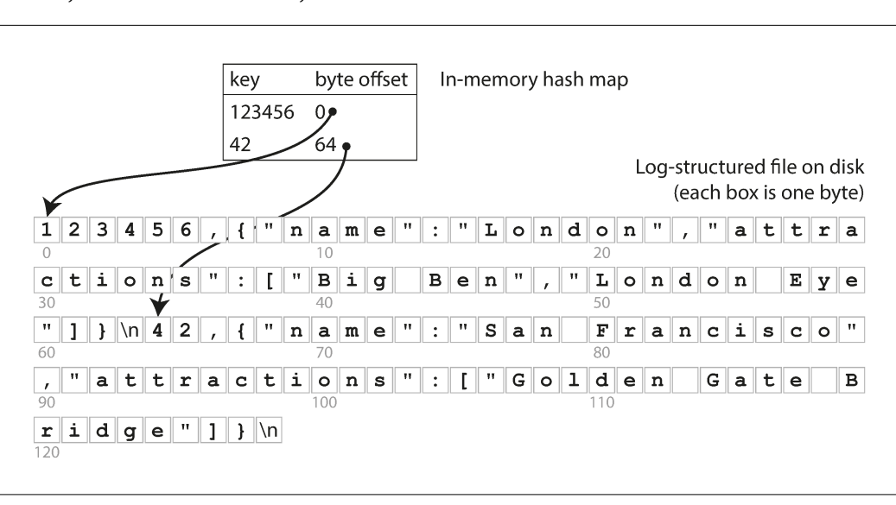

*شکل ۳-۱ — ترجمهٔ توضیح شکل: فایل log به‌صورت key-value نگه‌داری می‌شود و hash map در حافظه، کلید را به byte offset مقدار در فایل وصل می‌کند.*

## &rlm;<span dir="ltr">`Hash index`</span>

با index برای دادهٔ key-value شروع کنیم. این تنها نوع index نیست، اما یک building block مهم برای ساختارهای پیچیده‌تر است. `Hash map` یا `hash table` در بسیاری از زبان‌های برنامه‌نویسی برای پیاده‌سازی dictionary استفاده می‌شود. اگر دادهٔ اصلی فقط با append به یک فایل اضافه شود، ساده‌ترین راه این است که یک hash map در حافظه داشته باشیم که هر کلید را به `byte offset` آن در فایل وصل کند.

هنگام append کردن جفت جدید، hash map را نیز update می‌کنیم. هنگام خواندن، ابتدا offset را از hash map پیدا می‌کنیم، سپس با `seek` به همان محل فایل می‌رویم و مقدار را می‌خوانیم. این ایده تقریباً همان کاری است که `Bitcask`، storage engine پیش‌فرض `Riak`، انجام می‌دهد.

این روش وقتی مناسب است که همهٔ کلیدها در RAM جا شوند. مقدارها می‌توانند بزرگ‌تر از حافظه باشند، چون برای خواندن هر مقدار فقط یک seek لازم است. اگر بخش موردنظر از فایل در `filesystem cache` باشد، حتی همان read هم ممکن است I/O دیسک ایجاد نکند.

فرض کنید کلید، URL یک ویدیوی گربه باشد و مقدار، تعداد دفعات پخش آن. هر بار که کاربر روی play می‌زند، مقدار افزایش پیدا می‌کند. در این workload تعداد write زیاد است، اما تعداد کلیدهای متمایز ممکن است کم باشد؛ یعنی هر کلید بارها update می‌شود و نگه‌داشتن همهٔ کلیدها در حافظه ممکن است.

### &rlm;segment و `compaction`

&rlm;append-only بودن فایل در نهایت آن را بیش از حد بزرگ می‌کند. راه معمول این است که log را به `segment`هایی با اندازهٔ مشخص تقسیم کنیم. وقتی یک segment به اندازهٔ حدی رسید، آن را ببندیم و writeهای بعدی را در segment جدید ادامه دهیم.

در مرحلهٔ `compaction`، رخدادهای تکراری یک کلید را کنار می‌گذاریم و فقط جدیدترین مقدار را نگه می‌داریم. چون compaction معمولاً segment را کوچک می‌کند، می‌توانیم چند segment را هم‌زمان merge کنیم و یک segment جدید بسازیم:

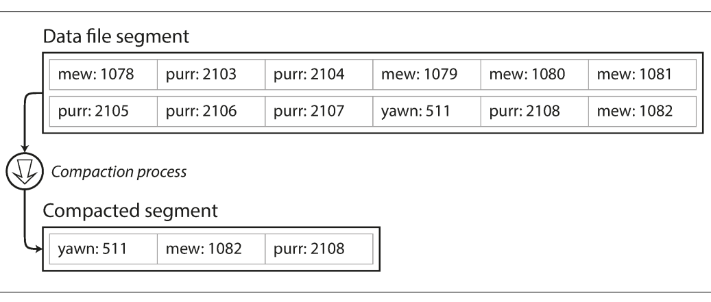

*شکل ۳-۲ — در log شمارندهٔ پخش ویدیو، نسخه‌های قدیمی کنار گذاشته می‌شوند و آخرین مقدار هر کلید باقی می‌ماند.*

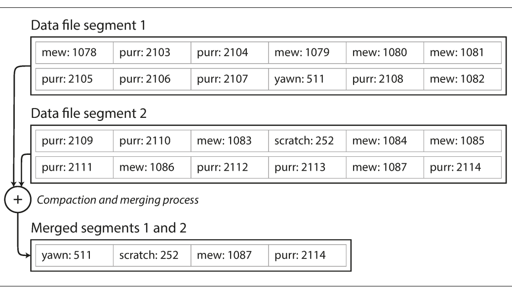

*شکل ۳-۳ — segmentهای قدیمی در پس‌زمینه merge می‌شوند و پس از آماده شدن نسخهٔ جدید، خواندن به آن منتقل می‌شود.*

&rlm;segmentهایی که نوشته شده‌اند دیگر تغییر نمی‌کنند. بنابراین merge می‌تواند در یک thread پس‌زمینه انجام شود و در همین زمان database همچنان از segmentهای قدیمی به read و write پاسخ دهد. پس از پایان merge، readها به segment جدید هدایت می‌شوند و segmentهای قدیمی قابل حذف‌اند.

هر segment hash table خودش را دارد. برای lookup، ابتدا جدیدترین segment را بررسی می‌کنیم، سپس segment قبل از آن و همین‌طور ادامه می‌دهیم. compaction تعداد segmentها را پایین نگه می‌دارد تا لازم نباشد تعداد زیادی hash map بررسی شود.

### جزئیات لازم در پیاده‌سازی واقعی

چند مسئلهٔ عملی مهم وجود دارد:

#### فرمت فایل

&rlm;`CSV` برای log بهترین فرمت نیست. فرمت binary می‌تواند ابتدا طول string را به‌صورت byte ذخیره کند و بعد خود string خام را بیاورد؛ در نتیجه نیاز به escape کردن جداکننده‌ها کمتر می‌شود و پردازش هم ساده‌تر و سریع‌تر است.

#### حذف record

اگر بخواهیم یک کلید و مقدارش را حذف کنیم، نمی‌توانیم معمولاً نسخهٔ قدیمی را از فایل append-only پاک کنیم. به‌جای آن یک record ویژه به نام `tombstone` اضافه می‌کنیم. هنگام merge، tombstone به فرآیند می‌گوید همهٔ مقدارهای قبلی آن کلید کنار گذاشته شوند.

#### &rlm;<span dir="ltr">crash recovery</span>

بعد از restart، hash mapهای حافظه از بین رفته‌اند. راه ساده این است که هر segment را از ابتدا تا انتها بخوانیم و offset آخرین مقدار هر کلید را ثبت کنیم. برای segment بزرگ این کار می‌تواند restart را طولانی کند. `Bitcask` با ذخیرهٔ snapshot از hash map هر segment روی دیسک recovery را سریع‌تر می‌کند.

#### &rlm;record ناقص

&rlm;database ممکن است وسط append کردن یک record crash کند. فایل‌های Bitcask `checksum` دارند و با آن‌ها می‌توان بخش خراب یا نیمه‌نوشتهٔ log را تشخیص داد و نادیده گرفت.

#### کنترل هم‌زمانی

چون writeها به‌ترتیب و به‌صورت sequential به log اضافه می‌شوند، یک پیاده‌سازی رایج فقط یک writer thread دارد. segmentها append-only و در بقیهٔ زمان immutable هستند؛ بنابراین چند thread می‌توانند آن‌ها را هم‌زمان بخوانند.

### چرا append-only؟

در نگاه اول شاید append-only اسراف به نظر برسد: چرا مقدار قدیمی را در محل خودش overwrite نکنیم؟ چند دلیل مهم وجود دارد:

1. &rlm;append و merge، writeهای sequential هستند و معمولاً از random write سریع‌ترند؛ این مزیت روی hard driveهای مغناطیسی چشمگیر است و روی SSD هم تا حدی اهمیت دارد.
2. هم‌زمانی و recovery ساده‌تر می‌شود. لازم نیست نگران حالتی باشیم که crash وسط overwrite رخ دهد و فایل ترکیبی از بخشی از مقدار قدیم و بخشی از مقدار جدید باشد.
3. &rlm;merge کردن segmentهای قدیمی از fragment شدن فایل‌ها در طول زمان جلوگیری می‌کند.

اما hash index محدودیت‌هایی دارد:

- &rlm;hash map باید کامل در حافظه جا شود. نگه‌داشتن hash map روی دیسک معمولاً به random I/O زیاد، resize دشوار و مدیریت پیچیدهٔ collision نیاز دارد.
- &rlm;`range query` کارآمد نیست. مثلاً برای یافتن کلیدهای بین `kitty00000` و `kitty99999` باید هر کلید را جداگانه lookup کنیم، زیرا hash ترتیب کلیدها را حفظ نمی‌کند.

## &rlm;`SSTable` و `LSM-tree`

در log segment معمولی، جفت‌های key-value به ترتیب write شدن می‌آیند. تنها نکتهٔ مهم این است که نسخهٔ جدیدتر یک کلید بر نسخهٔ قدیمی‌تر مقدم است. حالا یک تغییر مفید انجام می‌دهیم: جفت‌ها را در هر segment بر اساس key مرتب می‌کنیم.

این فرمت `Sorted String Table` یا به‌اختصار `SSTable` نام دارد. در segmentی که merge شده است، هر کلید فقط یک بار ظاهر می‌شود؛ چون compaction نسخه‌های قدیمی‌تر را حذف کرده است.

&rlm;SSTable چند مزیت مهم دارد:

### &rlm;۱. merge مرتب و کم‌هزینه

حتی اگر فایل‌ها از حافظهٔ موجود بزرگ‌تر باشند، می‌توان آن‌ها را با روش شبیه `mergesort` merge کرد. از ابتدای فایل‌های ورودی جلو می‌رویم، کوچک‌ترین key فعلی را به خروجی می‌نویسیم و بعد همین کار را تکرار می‌کنیم. خروجی دوباره بر اساس key مرتب است. اگر یک key در چند segment وجود داشته باشد، چون segment جدیدتر را می‌شناسیم، مقدار آن را نگه می‌داریم و مقدارهای قدیمی‌تر را حذف می‌کنیم.

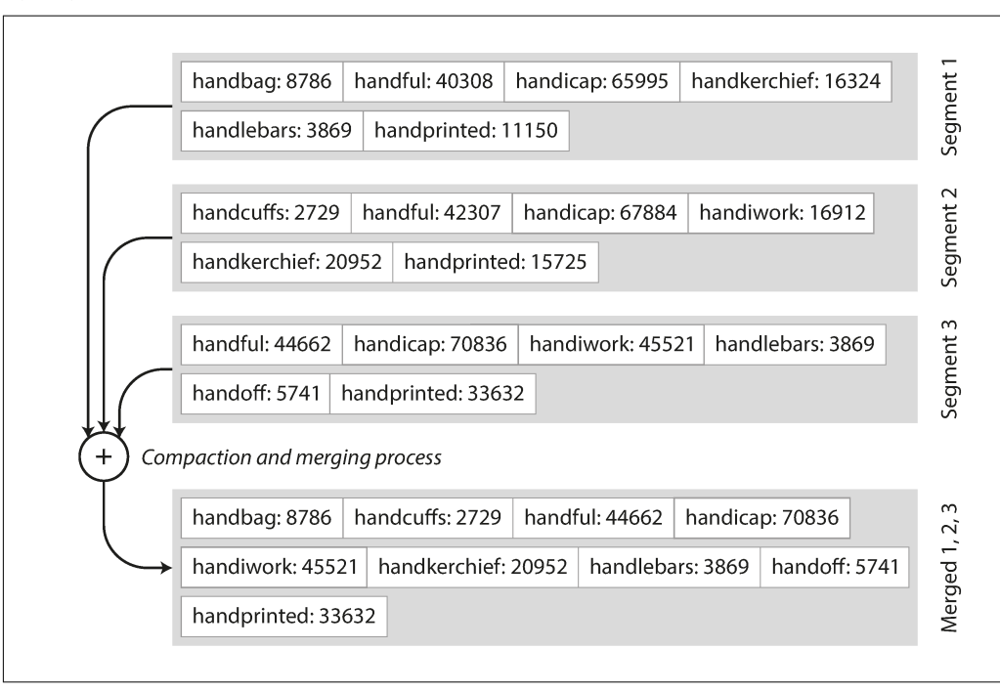

*شکل ۳-۴ — چند SSTable به‌ترتیب key خوانده می‌شوند و در خروجی، جدیدترین مقدار هر کلید نگه داشته می‌شود.*

### &rlm;۲. index درون‌حافظه‌ای sparse

برای پیدا کردن یک key دیگر لازم نیست offset همهٔ کلیدها را در حافظه نگه داریم. اگر دنبال `handiwork` باشیم و بدانیم `handbag` و `handsome` کجا شروع می‌شوند، به‌دلیل ترتیب حروف می‌دانیم `handiwork` میان آن دو قرار دارد. به offset `handbag` می‌پریم و چند kilobyte بعدی را scan می‌کنیم.

پس index حافظه می‌تواند `sparse` باشد: مثلاً برای هر چند kilobyte فقط یک key و offset را نگه دارد. scan کردن چند kilobyte معمولاً بسیار سریع است.

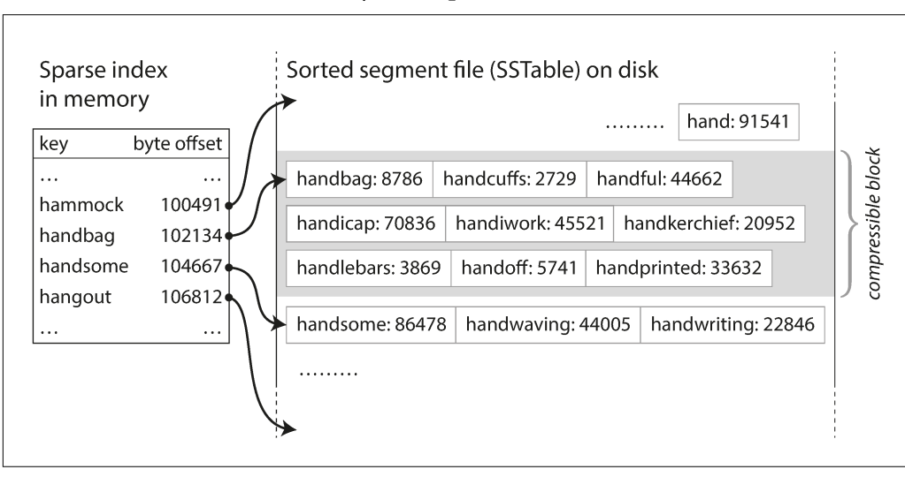

*شکل ۳-۵ — index درون‌حافظه‌ای فقط بخشی از keyها را نشان می‌دهد و هر entry به ابتدای یک block فشرده اشاره می‌کند.*

### ۳. فشرده‌سازی blockها

چون read مربوط به یک range معمولاً چند جفت key-value پشت سر هم را می‌خواهد، می‌توان این جفت‌ها را به‌صورت یک block گروه‌بندی و قبل از نوشتن روی دیسک compress کرد. entryهای index sparse به ابتدای blockها اشاره می‌کنند. این کار هم فضای دیسک و هم bandwidth موردنیاز I/O را کاهش می‌دهد.

### ساختن SSTable از writeهای نامرتب

&rlm;writeهای ورودی ممکن است با هر ترتیبی برسند. مرتب نگه‌داشتن ساختار روی دیسک دشوار است، اما در حافظه آسان‌تر است. می‌توان از treeهایی مثل `red-black tree` یا `AVL tree` استفاده کرد؛ این ساختارها keyها را با هر ترتیبی می‌پذیرند و به‌ترتیب مرتب پس می‌دهند.

&rlm;storage engine می‌تواند این مراحل را اجرا کند:

1. هر write جدید را در یک tree متوازن در حافظه قرار دهد. این ساختار را `memtable` می‌نامیم.
2. وقتی memtable از آستانه‌ای، مثلاً چند megabyte، بزرگ‌تر شد، آن را به‌صورت SSTable روی دیسک بنویسد. چون tree از قبل مرتب است، ساخت فایل مرتب کارآمد است. هم‌زمان writeهای تازه وارد memtable جدید می‌شوند.
3. برای read، ابتدا memtable، سپس جدیدترین segment روی دیسک، بعد segment قدیمی‌تر و به همین ترتیب بررسی شود.
4. در پس‌زمینه، merge و compaction اجرا شود تا مقدارهای overwriteشده و deleteشده کنار گذاشته شوند.

این طرح یک مشکل دارد: اگر database قبل از flush شدن memtable crash کند، writeهای اخیر از دست می‌روند. برای حل آن، یک log جداگانه روی دیسک داریم که هر write بلافاصله در آن append می‌شود. این log لازم نیست مرتب باشد؛ فقط برای بازسازی memtable پس از crash است. وقتی memtable به SSTable تبدیل شد، log مربوط به آن دیگر لازم نیست.

این سازوکار اساساً در `LevelDB` و `RocksDB` به‌کار رفته است. `Cassandra` و `HBase` نیز از storage engineهای مشابه استفاده می‌کنند و این ایده از مقالهٔ `Bigtable` گوگل الهام گرفته شده است. نام `Log-Structured Merge-Tree` یا `LSM-tree` برای همین خانواده انتخاب شده است.

&rlm;`Lucene`، engine جست‌وجوی full-text که `Elasticsearch` و `Solr` از آن استفاده می‌کنند، برای dictionary واژه‌ها ایدهٔ مشابهی دارد. در full-text index، key یک واژه و value فهرست ID سندهایی است که آن واژه را دارند؛ این فهرست `postings list` نام دارد. فایل‌های مرتب شبیه SSTable در پس‌زمینه merge می‌شوند.

### بهینه‌سازی‌های LSM-tree

یافتن keyای که وجود ندارد می‌تواند در LSM-tree کند باشد، چون باید memtable و segmentها را تا قدیمی‌ترین مورد بررسی کنیم. برای این حالت معمولاً از `Bloom filter` استفاده می‌شود. Bloom filter ساختاری کم‌حافظه برای تقریب‌زدن عضویت یک key در مجموعه است. می‌تواند بگوید key قطعاً وجود ندارد؛ در نتیجه از readهای بیهودهٔ دیسک جلوگیری می‌شود. اگر بگوید «ممکن است وجود داشته باشد»، هنوز باید segment را بررسی کنیم؛ پس false positive ممکن است، اما false negative نباید رخ دهد.

برای merge کردن SSTableها دو راه رایج وجود دارد:

- در `size-tiered compaction`، SSTableهای جدید و کوچک به‌تدریج با SSTableهای قدیمی‌تر و بزرگ‌تر merge می‌شوند.
- در `leveled compaction`، range کلیدها به SSTableهای کوچک‌تر تقسیم می‌شود و دادهٔ قدیمی به levelهای جدا منتقل می‌شود. این روش compaction را تدریجی‌تر می‌کند و معمولاً فضای کمتری می‌خواهد.

در هر دو حالت، ایدهٔ اصلی یک cascade از SSTableهاست که در پس‌زمینه merge می‌شوند. چون داده مرتب است، range query کارآمد می‌ماند و چون writeها عمدتاً sequential هستند، write throughput می‌تواند زیاد باشد.

## &rlm;<span dir="ltr">`B-tree`</span>

&rlm;`B-tree` که از سال ۱۹۷۰ مطرح شده، هنوز index استاندارد تقریباً همهٔ relational databaseهاست و در بسیاری از databaseهای nonrelational هم استفاده می‌شود. مانند SSTable، key-valueها را مرتب نگه می‌دارد؛ بنابراین هم lookup دقیق و هم range query را پشتیبانی می‌کند، اما فلسفهٔ طراحی‌اش متفاوت است.

&rlm;LSM معمولاً database را به segmentهای متغیر و نسبتاً بزرگ تقسیم می‌کند و هر segment را sequential می‌نویسد. B-tree database را به block یا `page`های ثابت تقسیم می‌کند؛ اندازهٔ سنتی page حدود ۴ KB است، هرچند ممکن است بزرگ‌تر باشد. هر بار یک page خوانده یا نوشته می‌شود؛ این با ساختار block-based سخت‌افزار دیسک سازگار است.

هر page یک address دارد و می‌تواند با reference به page دیگر وصل شود؛ شبیه pointer، اما روی دیسک. از این pageها tree می‌سازیم. یک page به‌عنوان root انتخاب می‌شود. root چند key و reference به childها دارد. هر child مسئول یک بازهٔ پیوسته از keyهاست و keyهای بین referenceها مرز این بازه‌ها را مشخص می‌کنند.

اگر دنبال key `251` باشیم و root مرزهای ۲۰۰ و ۳۰۰ را داشته باشد، child مربوط به بازهٔ ۲۰۰ تا ۳۰۰ را دنبال می‌کنیم. در page بعدی این بازه دوباره به زیر‌بازه‌ها تقسیم می‌شود تا به `leaf page` برسیم. leaf یا value را در خود نگه می‌دارد یا به pageای که value در آن است reference می‌دهد.

تعداد referenceهای child در یک page، `branching factor` نام دارد. این مقدار به اندازهٔ referenceها و مرزهای key بستگی دارد و در عمل اغلب چند صد است.

برای update مقدار یک key موجود، leaf مربوط را پیدا می‌کنیم، مقدار را تغییر می‌دهیم و page را روی دیسک می‌نویسیم؛ referenceهای page ثابت می‌مانند. برای insert یک key جدید، pageای را پیدا می‌کنیم که range آن شامل key است. اگر جا کافی نباشد، page به دو page تقریباً نیمه‌پر split می‌شود و parent نیز برای معرفی دو range جدید update می‌شود.

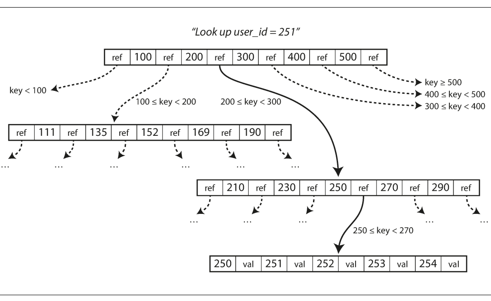

*شکل ۳-۶ — جست‌وجو از root شروع می‌شود و با دنبال کردن reference مربوط به range، به leaf page می‌رسد.*

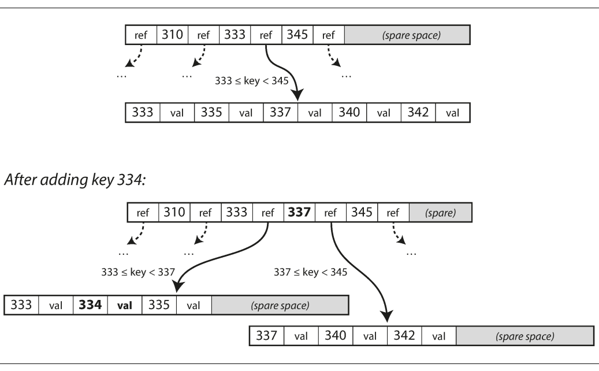

*شکل ۳-۷ — پس از اضافه شدن key جدید، page پر به دو page تقسیم می‌شود و parent مرز تازه را ثبت می‌کند.*

این الگوریتم tree را balanced نگه می‌دارد؛ B-tree با `n` key عمق `O(log n)` دارد. بسیاری از databaseها در treeای سه یا چهارسطحی جا می‌شوند و برای lookup به دنبال کردن referenceهای زیادی نیاز ندارند. مثلاً tree چهارسطحی با pageهای ۴ KB و branching factor برابر ۵۰۰ می‌تواند تا حدود ۲۵۶ ترابایت را index کند.

### قابل‌اعتماد کردن B-tree

عملیات اصلی B-tree، overwrite کردن یک page روی دیسک با دادهٔ جدید است. فرض می‌شود محل page تغییر نمی‌کند، پس referenceهای موجود همچنان معتبرند. این کاملاً با LSM فرق دارد که فایل موجود را تغییر نمی‌دهد و فقط append می‌کند و بعد فایل‌های قدیمی را حذف می‌کند.

اگر insert باعث split شود، ممکن است چند page باید نوشته شوند: دو page حاصل از split و parent که referenceهای جدید را نگه می‌دارد. اگر database بعد از نوشتن فقط بخشی از این pageها crash کند، tree خراب می‌شود؛ مثلاً pageای یتیم می‌ماند که هیچ parentای به آن reference نمی‌کند.

برای resilient کردن B-tree در برابر crash، پیاده‌سازی‌ها معمولاً یک `write-ahead log` یا `WAL` (که `redo log` هم نامیده می‌شود) دارند. هر modification ابتدا در این فایل append-only نوشته می‌شود و بعد روی pageهای اصلی اعمال می‌شود. پس از بالا آمدن database، WAL برای برگرداندن B-tree به state سازگار استفاده می‌شود.

&rlm;update در محل، کنترل هم‌زمانی را هم دشوار می‌کند. اگر چند thread هم‌زمان tree را بخوانند و بنویسند، ممکن است یکی از آن‌ها state نیمه‌تغییرکرده ببیند. معمولاً data structureهای tree با `latch` یا lock سبک محافظت می‌شوند. در LSM، merge در پس‌زمینه انجام می‌شود و نسخهٔ قدیمی و جدید segment در نقطه‌ای مشخص به‌صورت atomic جابه‌جا می‌شوند؛ این بخش از کار ساده‌تر است.

### چند بهینه‌سازی B-tree

در سال‌های طولانی، راه‌های زیادی برای بهبود B-tree پیدا شده است:

- به‌جای overwrite کردن page و نگهداری WAL، بعضی databaseها مانند `LMDB` از `copy-on-write` استفاده می‌کنند. page تغییر‌یافته در محل دیگری نوشته می‌شود و نسخهٔ جدید parentها به آن محل اشاره می‌کند. این شیوه برای کنترل هم‌زمانی و snapshot هم مفید است.
- لازم نیست در pageهای داخلی کل key را ذخیره کنیم؛ گاهی چند حرف یا بخش کافی است تا مرز range را نشان دهد. با جای دادن keyهای بیشتر در یک page، branching factor بالا می‌رود و عمق tree کم می‌شود. این نوع گاهی `B+ tree` نامیده می‌شود، هرچند این بهینه‌سازی آن‌قدر رایج است که همیشه جداگانه نام‌گذاری نمی‌شود.
- &rlm;pageهایی که range نزدیک دارند الزاماً روی دیسک کنار هم نیستند. اگر query بخش بزرگی از range مرتب را scan کند، seek برای هر page هزینه‌بر است. بسیاری از پیاده‌سازی‌ها تلاش می‌کنند leaf pageها را پشت سر هم بچینند، اما حفظ این نظم هنگام رشد tree دشوارتر از LSM است.
- &rlm;leaf pageها می‌توانند به sibling سمت چپ و راست reference داشته باشند تا scan مرتب بدون برگشتن به parent انجام شود.
- گونه‌هایی مانند `fractal tree` برخی ایده‌های log-structured را برای کاهش disk seek قرض می‌گیرند؛ نام آن‌ها به‌معنای استفاده از fractal ریاضی نیست.

## مقایسهٔ `B-tree` و `LSM-tree`

به‌طور تجربی LSM-tree معمولاً برای write سریع‌تر و B-tree برای read سریع‌تر تصور می‌شود. read در LSM می‌تواند مجبور باشد چند data structure و چند SSTable را، بسته به مرحلهٔ compaction، بررسی کند. بااین‌حال benchmarkها به جزئیات workload بسیار حساس‌اند؛ هیچ قاعدهٔ ساده‌ای جای آزمایش با workload واقعی را نمی‌گیرد.

### مزیت‌های LSM-tree

در B-tree هر قطعه داده دست‌کم یک بار در WAL و یک بار در page tree نوشته می‌شود؛ هنگام split ممکن است دوباره هم نوشته شود. حتی اگر فقط چند byte تغییر کرده باشد، گاهی کل page باید نوشته شود. بعضی engineها برای جلوگیری از page ناقص، یک page را بیش از یک بار overwrite می‌کنند.

&rlm;LSM هم داده را در طول compaction چند بار بازنویسی می‌کند. این پدیده که یک write منطقی به چند write دیسکی در طول عمر database تبدیل شود، `write amplification` نام دارد. روی SSD اهمیت خاصی دارد، چون هر block تعداد محدودی overwrite را تحمل می‌کند.

در workloadهای write-heavy، سرعت نوشتن روی دیسک ممکن است bottleneck باشد. هرچه write amplification بیشتر باشد، بخش بیشتری از bandwidth دیسک صرف بازنویسی می‌شود و تعداد write قابل‌پردازش در ثانیه پایین می‌آید. بااین‌حال LSM در بسیاری از تنظیمات write throughput بیشتری از B-tree می‌دهد: بخشی به‌خاطر write amplification کمتر و بخشی به‌خاطر نوشتن sequential فایل‌های فشردهٔ SSTable به‌جای overwrite کردن pageهای پراکنده.

&rlm;LSM معمولاً بهتر compress می‌شود و فایل‌های کوچک‌تری می‌سازد. B-tree به‌دلیل fragmentation، split page یا باقی‌ماندن فضای خالی، بخشی از دیسک را استفاده‌نشده می‌گذارد. LSM با بازنویسی دوره‌ای SSTableها این fragmentation را کم می‌کند، به‌ویژه در leveled compaction.

بسیاری از SSDها در firmware خود write تصادفی را به write sequential روی chip تبدیل می‌کنند؛ پس تفاوت الگوی write کمتر می‌شود. بااین‌حال کاهش write amplification و fragmentation همچنان مفید است، چون دادهٔ فشرده‌تر اجازه می‌دهد در bandwidth موجود درخواست‌های بیشتری پاسخ داده شوند.

### هزینه‌ها و خطرهای LSM-tree

&rlm;compaction ممکن است با read و write جاری رقابت کند. engineها تلاش می‌کنند compaction را تدریجی و در پس‌زمینه اجرا کنند، اما disk منابع محدودی دارد. میانگین latency ممکن است کم تغییر کند، ولی در percentileهای بالا گاهی query منتظر عملیات سنگین compaction می‌ماند؛ B-tree از این نظر ممکن است predictableتر باشد.

در write throughput زیاد، bandwidth محدود دیسک باید میان write اولیه، flush کردن memtable و threadهای compaction تقسیم شود. اگر compaction از ورودی عقب بیفتد، تعداد segmentهای mergeنشده زیاد می‌شود، فضای دیسک تمام می‌شود و read باید فایل‌های بیشتری را بررسی کند. بعضی SSTable engineها حتی وقتی compaction عقب افتاده است write ورودی را throttle نمی‌کنند؛ بنابراین monitoring صریح برای تشخیص این وضعیت لازم است.

در B-tree هر key معمولاً یک محل مشخص دارد، اما در LSM ممکن است نسخه‌های یک key در چند segment باشند. همین موضوع B-tree را برای databaseهایی که semantics تراکنشی قوی می‌خواهند جذاب می‌کند. در بسیاری از relational databaseها، `transaction isolation` با lock روی rangeهای key پیاده می‌شود و این lockها را می‌توان مستقیماً به B-tree وصل کرد.

پس B-tree به‌دلیل performance باثبات و بلوغ زیاد از بین نمی‌رود، و LSM هم در datastoreهای جدید محبوب‌تر می‌شود. انتخاب درست باید با benchmark واقعی، اندازهٔ داده، نسبت read و write، الگوی range query، فضای دیسک و نیاز تراکنشی انجام شود.

## ساختارهای دیگر برای index

تا اینجا بیشتر دربارهٔ `key-value index` صحبت کردیم؛ چیزی شبیه `primary key index` در مدل relational. primary key یک row، یک document یا یک vertex را به‌طور یکتا مشخص می‌کند و recordهای دیگر با آن ID به این مورد reference می‌دهند.

### &rlm;<span dir="ltr">`Secondary index`</span>

در relational database می‌توان برای یک table چند `secondary index` با دستور `CREATE INDEX` ساخت. این indexها برای join هم بسیار مهم‌اند؛ مثلاً در مثال رزومهٔ فصل ۲، احتمالاً روی ستون‌های `user_id` index ثانویه می‌ساختیم تا rowهای مربوط به یک user در tableهای مختلف سریع پیدا شوند.

ساخت secondary index از key-value index ممکن است، با این تفاوت که keyها الزاماً unique نیستند. چند row می‌توانند key یکسان داشته باشند. دو راه رایج وجود دارد:

1. &rlm;value index را فهرستی از IDهای rowهای مطابق قرار دهیم؛ شبیه `postings list` در full-text index.
2. با اضافه کردن row ID به key، key ترکیبی را unique کنیم.

هم B-tree و هم LSM-tree می‌توانند secondary index باشند.

### ذخیرهٔ خود value در index

&rlm;key چیزی است که query جست‌وجو می‌کند؛ value می‌تواند خود row، document یا vertex باشد، یا referenceای به محلی که داده در آن نگه‌داری می‌شود. اگر داده جای دیگری باشد، محل نگهداری آن `heap file` نام دارد. heap file ترتیب خاصی ندارد؛ ممکن است append-only باشد یا محل rowهای حذف‌شده را برای استفادهٔ دوباره نگه دارد.

&rlm;heap file برای حالتی مناسب است که چند secondary index داریم: هر index فقط به location اشاره می‌کند و دادهٔ واقعی یک‌بار ذخیره می‌شود. اگر مقدار بدون تغییر key update شود و مقدار جدید از قبلی بزرگ‌تر نباشد، می‌توان record را در محل overwrite کرد. اگر بزرگ‌تر شود، باید آن را به محل جدیدی منتقل کنیم. آن‌وقت یا همهٔ indexها را update می‌کنیم، یا در محل قدیمی یک `forwarding pointer` می‌گذاریم.

گاهی رفتن از index به heap برای read هزینهٔ زیادی دارد. در این حالت row مستقیماً در index نگه‌داری می‌شود که `clustered index` نام دارد. در `MySQL InnoDB`، primary key table همیشه clustered index است و secondary indexها به primary key اشاره می‌کنند، نه مستقیماً به محل heap. در `SQL Server` می‌توان یک clustered index برای هر table تعیین کرد.

حالت میانی `covering index` یا `index with included columns` است: بعضی columnهای table داخل index هم ذخیره می‌شوند. در این صورت برخی queryها بدون رفتن به دادهٔ اصلی پاسخ داده می‌شوند و می‌گوییم index آن query را cover می‌کند.

این duplicate شدن داده read را سریع‌تر می‌کند، اما storage و هزینهٔ write را بالا می‌برد. database باید تضمین‌های تراکنشی را هم رعایت کند تا application به‌دلیل ناهماهنگی میان نسخه‌های duplicate داده، state متناقض نبیند.

### &rlm;index چندستونه

یک index تک‌ستونه برای queryای که چند column را هم‌زمان شرط می‌گذارد کافی نیست. رایج‌ترین نوع، `concatenated index` است: چند field را با ترتیب مشخص پشت سر هم به یک key تبدیل می‌کند. مثل دفتر تلفن کاغذی که ابتدا بر اساس نام خانوادگی و سپس نام مرتب شده است. چنین indexی برای یافتن همهٔ افراد با نام خانوادگی مشخص یا ترکیب نام خانوادگی–نام مفید است، اما برای یافتن همهٔ افراد با نام کوچک مشخص کارایی ندارد؛ زیرا ترتیب اصلی با نام خانوادگی شروع شده است.

برای queryهای چندبعدی، به‌خصوص دادهٔ جغرافیایی، `multi-dimensional index` مناسب‌تر است. فرض کنید سایت جست‌وجوی رستوران مختصات latitude و longitude دارد و باید همهٔ رستوران‌های یک مستطیل روی نقشه را پیدا کند:

```sql
SELECT * FROM restaurants
WHERE latitude > 51.4946 AND latitude < 51.5079
  AND longitude > -0.1162 AND longitude < -0.1004;
```

&rlm;B-tree یا LSM معمولی نمی‌تواند این دو range را هم‌زمان به‌شکل ایده‌آل پاسخ دهد؛ یکی از rangeها را خوب پیدا می‌کند و برای شرط دوم باید scan و filter بیشتری انجام دهد. می‌توان مختصات دوبعدی را با `space-filling curve` به یک عدد تبدیل کرد و بعد B-tree ساخت، یا از ساختارهای تخصصی مانند `R-tree` استفاده کرد. `PostGIS` از R-tree برای geospatial index در چارچوب `PostgreSQL Generalized Search Tree` استفاده می‌کند.

این ایده فقط برای جغرافیا نیست. در فروشگاه آنلاین می‌توان روی سه بُعد `red`، `green` و `blue` index ساخت تا محصولاتی با بازهٔ رنگی خاص پیدا شوند. در دادهٔ هواشناسی، index دوبعدی `(date, temperature)` می‌تواند همهٔ مشاهده‌های سال ۲۰۱۳ با دمای بین ۲۵ و ۳۰ درجه را سریع‌تر پیدا کند.

### &rlm;full-text search و fuzzy index

&rlm;indexهای قبلی برای مقدار دقیق یا range مرتب مناسب بودند. برای جست‌وجوی keyهای مشابه، غلط املایی، مترادف یا شکل‌های دستوری باید از تکنیک‌های دیگری استفاده کرد. موتورهای `full-text search` می‌توانند مترادف‌ها را اضافه کنند، شکل‌های مختلف یک کلمه را یکی بدانند، واژه‌های نزدیک به هم را در یک document پیدا کنند و برای typoها تا فاصلهٔ ویرایشی مشخص جست‌وجو کنند. `edit distance` برابر ۱ یعنی یک حرف اضافه، حذف یا جایگزین شده باشد.

&rlm;dictionary واژهٔ Lucene ساختاری شبیه SSTable دارد. یک index کوچک در حافظه می‌گوید برای key موردنظر از چه offsetی در فایل مرتب شروع کنیم. `LevelDB` معمولاً بخشی از keyها را در index sparse نگه می‌دارد، اما Lucene برای کاراکترهای key از `finite state automaton` شبیه trie استفاده می‌کند. این automaton را می‌توان به `Levenshtein automaton` تبدیل کرد تا واژه‌های با edit distance مشخص سریع پیدا شوند.

روش‌های fuzzy دیگر به classification اسناد و machine learning نزدیک می‌شوند؛ مثلاً وقتی هدف فقط پیدا کردن یک واژه نیست و باید نتیجه‌ها ranking شوند.

## نگه‌داشتن همه‌چیز در حافظه

ساختارهای قبلی پاسخی به محدودیت‌های دیسک بودند. دیسک نسبت به main memory سخت‌دست‌وپاگیرتر است: برای performance خوب باید داده را با دقت چید، و رفتار read و write به seek، page و I/O وابسته است. بااین‌حال دیسک دو مزیت مهم دارد: با قطع برق محتوایش از بین نمی‌رود و هزینهٔ هر gigabyte آن از RAM کمتر است.

با ارزان‌تر شدن RAM، برای datasetهای نه‌چندان بزرگ ممکن شده است همهٔ داده را در حافظه نگه داریم، حتی اگر میان چند machine توزیع شود. به این خانواده `in-memory database` می‌گوییم.

&rlm;`Memcached` نمونه‌ای از in-memory key-value store است که بیشتر برای cache به‌کار می‌رود و از دست رفتن داده پس از restart قابل‌قبول است. اما in-memory databaseهای durable هم وجود دارند. durability با سخت‌افزار خاص مانند battery-backed RAM، نوشتن log تغییرها روی دیسک، snapshot دوره‌ای یا replication state در machineهای دیگر به‌دست می‌آید.

پس از restart، database باید state را از دیسک یا replica شبکه reload کند. این سیستم همچنان in-memory database به حساب می‌آید، چون دیسک فقط برای log append-only یا recovery استفاده می‌شود و read از حافظه پاسخ می‌گیرد. فایل دیسک مزیت عملیاتی دیگری هم دارد: backup، inspect و تحلیل آن با ابزارهای بیرونی آسان است.

&rlm;`VoltDB`، `MemSQL` و `Oracle TimesTen` مدل relational درون‌حافظه‌ای دارند. `RAMCloud` یک key-value store متن‌باز با durability است. `Redis` و `Couchbase` با write asynchronous روی دیسک durability ضعیف‌تری ارائه می‌دهند.

مزیت performance این databaseها لزوماً از این نیست که هرگز دیسک را نمی‌خوانند. اگر حافظه کافی باشد، حتی storage engine دیسکی هم ممکن است داده را از `OS page cache` بگیرد و read واقعی دیسک نداشته باشد. in-memory database می‌تواند سریع‌تر باشد چون لازم نیست data structureهای حافظه را مدام به فرمت مناسب دیسک encode کند.

مزیت دیگر، امکان ارائهٔ data modelهایی است که در index دیسکی سخت‌تر پیاده می‌شوند؛ مثلاً Redis interfaceهایی برای priority queue و set ارائه می‌دهد. چون همه‌چیز در حافظه است، implementation آن‌ها ساده‌تر است.

یک رویکرد به نام `anti-caching` تلاش می‌کند dataset بزرگ‌تر از حافظه را هم پشتیبانی کند. وقتی حافظه کم می‌شود، کم‌استفاده‌ترین داده‌ها از حافظه به دیسک می‌روند و هنگام نیاز دوباره load می‌شوند. این شبیه virtual memory و swap در OS است، با این تفاوت که database می‌تواند در granularity رکورد کار کند، نه pageهای بزرگ حافظه. در این روش indexها همچنان باید کاملاً در حافظه جا شوند. اگر فناوری‌های `non-volatile memory` یا `NVM` فراگیر شوند، احتمالاً storage engineها نیز نیاز به طراحی دوباره خواهند داشت.

## &rlm;`Transaction Processing` یا `Analytics`؟

در آغاز، بسیاری از writeهای database با یک تراکنش تجاری همراه بودند: فروش، سفارش از supplier یا پرداخت حقوق. بعدها database برای comment وبلاگ، حرکت بازی و contact هم استفاده شد، اما واژهٔ `transaction` برای یک گروه منطقی از read و write باقی ماند.

&rlm;`transaction processing` فقط به‌معنای داشتن ویژگی‌های `ACID` نیست. در این فصل منظور، اجازه دادن به clientها برای read و write با latency پایین است؛ در مقابل، batch processing معمولاً jobهایی است که دوره‌ای، مثلاً روزی یک بار، اجرا می‌شوند. ویژگی‌های ACID در فصل ۷ و batch processing در فصل ۱۰ بررسی می‌شوند.

### &rlm;<span dir="ltr">`OLTP`</span>

در workload `online transaction processing` یا `OLTP`، application معمولاً تعداد کمی record را با key پیدا می‌کند، بر اساس input کاربر insert یا update انجام می‌دهد و باید interactive و کم‌تأخیر باشد. ثبت سفارش، تغییر رمز عبور یا افزایش شمارندهٔ بازدید نمونه‌هایی از OLTP هستند.

### &rlm;<span dir="ltr">`OLAP`</span>

در `online analytic processing` یا `OLAP`، query معمولاً تعداد بسیار زیادی record را scan می‌کند، فقط چند column را می‌خواند و aggregateهایی مثل `COUNT`، `SUM` یا `AVG` حساب می‌کند. نمونهٔ پرسش‌های تحلیلی:

- مجموع درآمد هر فروشگاه در ژانویه چقدر بوده است؟
- در آخرین promotion چند موز بیشتر از حالت عادی فروخته‌ایم؟
- کدام برند غذای کودک بیشتر از همه همراه با پوشک برند X خریده شده است؟

این queryها معمولاً توسط business analystها نوشته می‌شوند و به reportهایی برای تصمیم‌گیری مدیریت تبدیل می‌شوند. جدول زیر تفاوت معمول دو workload را نشان می‌دهد؛ مرز این دو همیشه مطلق نیست.

| ویژگی | سیستم transaction processing (`OLTP`) | سیستم analytic (`OLAP`) |
| --- | --- | --- |
| الگوی اصلی read | تعداد کم record با lookup بر اساس key | aggregate روی تعداد بسیار زیادی record |
| الگوی اصلی write | random-access و latency پایین از input کاربر | import حجیم (`ETL`) یا event stream |
| استفاده‌کننده | end user یا customer از طریق web app | analyst داخلی برای decision support |
| معنای داده | آخرین state فعلی | تاریخچهٔ eventهای رخ‌داده در طول زمان |
| اندازهٔ معمول | gigabyte تا terabyte | terabyte تا petabyte |

در ابتدا از همان database برای هر دو استفاده می‌شد و SQL هم برای queryهای OLTP و هم OLAP انعطاف‌پذیر است. اما از اواخر دههٔ ۱۹۸۰ و اوایل دههٔ ۱۹۹۰ شرکت‌ها به سمت database جداگانه برای analytics رفتند که `data warehouse` نام گرفت.

## &rlm;<span dir="ltr">`Data warehouse`</span>

یک enterprise ممکن است ده‌ها سیستم transaction processing داشته باشد: سایت مشتری، سیستم checkout فروشگاه، inventory انبار، route خودروها، supplierها و منابع انسانی. هرکدام پیچیده است و تیم نگه‌داری خودش را دارد؛ بنابراین این سیستم‌ها نسبتاً مستقل از یکدیگر فعالیت می‌کنند.

&rlm;OLTPها معمولاً باید highly available باشند و transaction را با latency کم پردازش کنند، چون عملیات کسب‌وکار به آن‌ها وابسته است. به همین دلیل database administratorها اجازه نمی‌دهند analyst هر query سنگینی را مستقیم روی OLTP اجرا کند؛ query تحلیلی با scan کردن بخش بزرگی از داده می‌تواند به transactionهای هم‌زمان آسیب بزند.

&rlm;`Data warehouse` database جداگانه‌ای است که analyst می‌تواند آزادانه روی آن query بزند، بدون اینکه عملیات OLTP را کند کند. warehouse معمولاً یک copy فقط‌خواندنی از دادهٔ سیستم‌های مختلف است. داده از OLTP با dump دوره‌ای یا stream پیوستهٔ updateها استخراج می‌شود، به schema مناسب تحلیل تبدیل و تمیز می‌شود، سپس در warehouse load می‌گردد. این فرآیند `Extract–Transform–Load` یا `ETL` نام دارد.

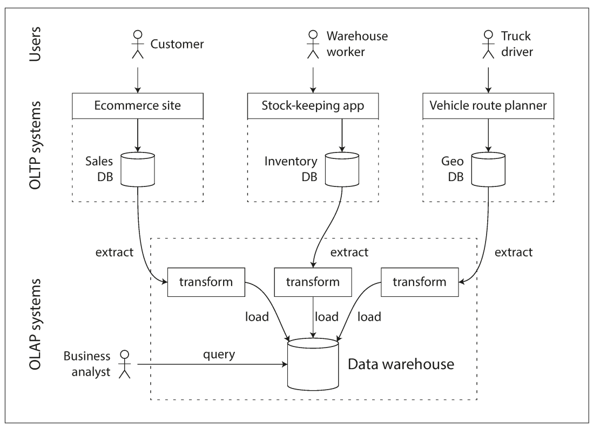

*شکل ۳-۸ — داده از سیستم‌های OLTP استخراج، transform و در data warehouse load می‌شود؛ analyst به warehouse query می‌زند.*

در شرکت کوچک شاید warehouse لازم نباشد: سیستم‌های OLTP کمترند و dataset آن‌قدر کوچک است که با SQL معمولی یا حتی spreadsheet تحلیل می‌شود. در enterprise بزرگ، جدا کردن این workloadها ارزش بیشتری دارد.

مزیت اصلی warehouse این است که برای الگوی analytic بهینه می‌شود. indexهایی که برای OLTP عالی‌اند، برای queryهایی که باید میلیون‌ها row را اسکن کنند لزوماً مناسب نیستند؛ در ادامه storage engineهای تحلیلی را بررسی می‌کنیم.

مدل دادهٔ warehouse اغلب relational است، چون SQL برای queryهای تحلیلی مناسب است و ابزارهای گرافیکی متعددی SQL تولید و نتیجه را visualize می‌کنند. از بیرون، warehouse و relational OLTP هر دو SQL دارند، اما internals آن‌ها ممکن است کاملاً متفاوت باشد. برخی محصولات روی transaction processing و برخی روی analytics تمرکز دارند؛ محصولاتی مانند `SQL Server` و `SAP HANA` هر دو را ارائه می‌کنند، اما حتی در آن‌ها engineهای storage و query برای دو workload به‌سمت جدایی می‌روند.

## &rlm;`Star schema` و `Snowflake schema`

در transaction processing، data modelهای متنوعی بر اساس نیاز application وجود دارد. در analytics، الگوها معمولاً فرمولی‌ترند و بسیاری از warehouseها از `star schema` یا همان `dimensional modeling` استفاده می‌کنند.

در مرکز star schema یک `fact table` قرار دارد. هر row آن یک event رخ‌داده در زمان مشخص است؛ در فروشگاه، هر row می‌تواند خرید یک محصول توسط یک customer باشد. برای ترافیک وب، row می‌تواند page view یا click باشد.

&rlm;factها معمولاً به‌صورت eventهای جداگانه ذخیره می‌شوند تا آزادی تحلیل آینده حفظ شود. نتیجه این است که fact table بسیار بزرگ می‌شود؛ enterpriseهایی مانند فروشگاه‌های بزرگ ممکن است ده‌ها petabyte تاریخچهٔ transaction داشته باشند که بیشتر آن در fact tableهاست.

بعضی columnهای fact attribute هستند، مثل قیمت فروش و هزینهٔ خرید از supplier که برای محاسبهٔ margin استفاده می‌شوند. columnهای دیگر `foreign key` به tableهای دیگری به نام `dimension table` هستند. هر row fact یک event است و dimensionها پاسخ پرسش‌های چه کسی، چه چیزی، کجا، چه زمانی، چگونه و چرا را نگه می‌دارند.

در مثال فروش، `dim_product` برای هر نوع محصول یک row دارد و SKU، توضیح، brand، category، میزان چربی و اندازهٔ بسته را نگه می‌دارد. هر row در `fact_sales` با foreign key مشخص می‌کند کدام محصول در آن transaction فروخته شده است. اگر customer چند محصول بخرد، برای سادگی هر محصول یک row جدا در fact table دارد.

حتی date و time هم اغلب dimension table دارند تا metadataیی مثل تعطیل رسمی، فصل یا روز هفته ذخیره شود. به این ترتیب query می‌تواند فروش روز تعطیل را از فروش روز عادی جدا کند.

نام star schema از شکل رابطه‌ها می‌آید: fact table در مرکز است و dimension tableها اطراف آن قرار دارند؛ اتصال‌ها مانند پرتوهای ستاره‌اند.

در `snowflake schema`، dimensionها بیشتر شکسته می‌شوند. مثلاً brand و category table جدا دارند و `dim_product` به‌جای ذخیرهٔ string به آن‌ها foreign key می‌دهد. snowflake از star `normalization` بیشتری دارد و joinهای بیشتری می‌خواهد، اما star برای analyst معمولاً ساده‌تر است.

&rlm;tableهای warehouse اغلب بسیار wide هستند؛ fact table ممکن است بیش از ۱۰۰ column و گاهی چند صد column داشته باشد. dimension table هم ممکن است metadata فراوانی داشته باشد، مثل خدمات فروشگاه، داشتن bakery، مساحت، تاریخ افتتاح، آخرین بازسازی و فاصله از highway.

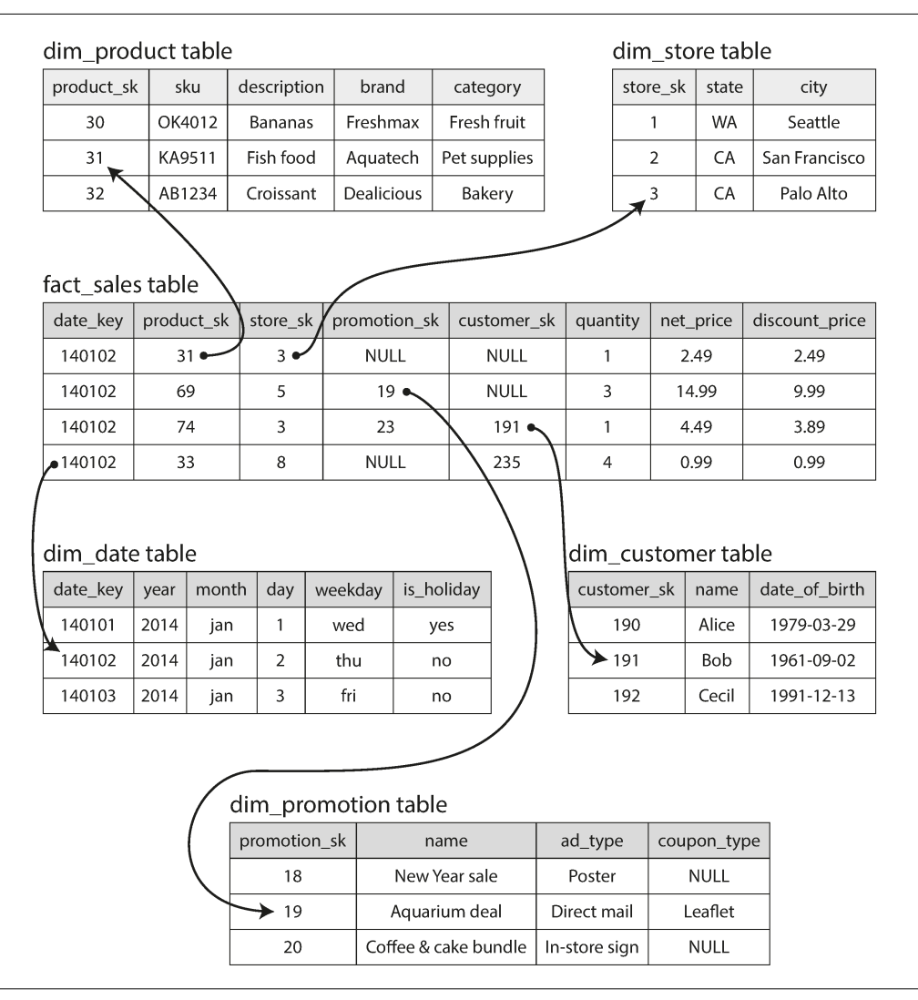

*شکل ۳-۹ — fact table فروش در مرکز قرار دارد و به dimensionهای date، product، store، customer و promotion وصل است.*

## &rlm;<span dir="ltr">`Column-oriented storage`</span>

وقتی fact table تریلیون‌ها row و petabyteها داده دارد، storage و query کردن آن چالش‌برانگیز است. dimension tableها معمولاً کوچک‌ترند؛ بنابراین تمرکز اصلی روی fact table است.

اگر table بیش از ۱۰۰ column داشته باشد، query تحلیلی معمولاً فقط ۴ یا ۵ مورد را لازم دارد و `SELECT *` در analytics کمتر رایج است. مثال زیر می‌خواهد بررسی کند مردم در کدام روز هفته بیشتر میوهٔ تازه یا candy می‌خرند:

```sql
SELECT
  dim_date.weekday, dim_product.category,
  SUM(fact_sales.quantity) AS quantity_sold
FROM fact_sales
JOIN dim_date ON fact_sales.date_key = dim_date.date_key
JOIN dim_product ON fact_sales.product_sk = dim_product.product_sk
WHERE
  dim_date.year = 2013 AND
  dim_product.category IN ('Fresh fruit', 'Candy')
GROUP BY
  dim_date.weekday, dim_product.category;
```

این query rowهای زیادی را بررسی می‌کند، اما فقط سه column از `fact_sales` لازم دارد: `date_key`، `product_sk` و `quantity`.

در بیشتر OLTPها data به شکل row-oriented ذخیره می‌شود؛ یعنی مقدارهای یک row کنار هم قرار دارند. document database هم معمولاً یک document را به‌صورت دنبالهٔ پیوسته‌ای از byte نگه می‌دارد. در نتیجه برای query بالا، حتی اگر index روی date یا product داشته باشیم، storage engine باید rowهای مطابق را با بیش از ۱۰۰ attribute از دیسک به حافظه بیاورد، parse کند و columnهای غیرلازم را کنار بگذارد.

ایدهٔ `column-oriented storage` ساده است: مقدارهای هر column را کنار هم ذخیره کنیم، نه همهٔ مقدارهای یک row را. اگر هر column فایل جدا داشته باشد، query فقط همان columnهای موردنیاز را می‌خواند. این اصل در شکل ۳-۱۰ نشان داده شده است.

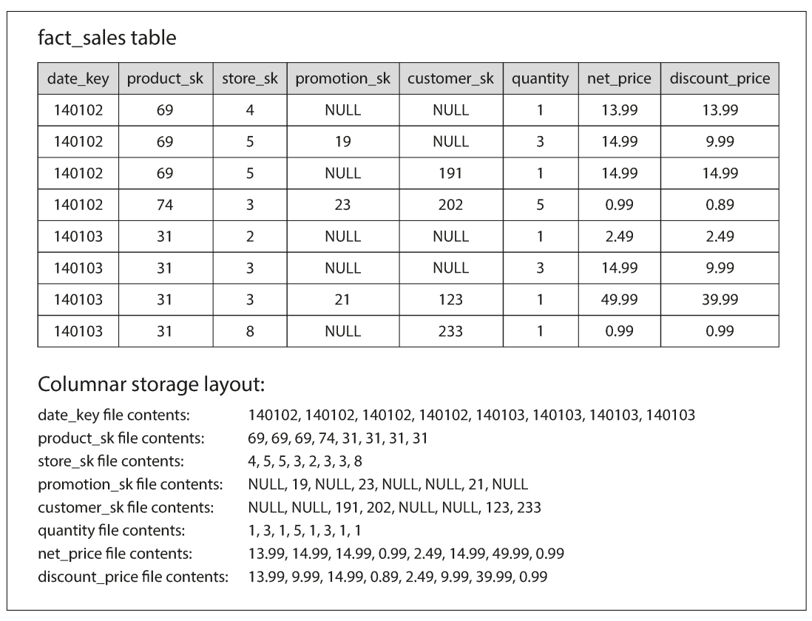

*شکل ۳-۱۰ — هر column به‌صورت دنباله‌ای جدا نگه‌داری می‌شود، اما ترتیب rowها در تمام columnها یکسان است و می‌توان row را از entryهای هم‌مکان بازسازی کرد.*

در storage ستونی، اگر بخواهیم row کامل را بازسازی کنیم، entry شمارهٔ ۲۳ از هر column را کنار هم می‌گذاریم. این روش فقط برای مدل relational نیست؛ `Parquet` نمونه‌ای از فرمت columnar برای data model از نوع document است و از ایده‌های `Dremel` گوگل استفاده می‌کند.

### فشرده‌سازی column

&rlm;column-oriented storage علاوه بر نخواندن columnهای غیرلازم، معمولاً compression خوبی هم می‌دهد. sequence مقدارها در هر column اغلب تکراری است. یکی از روش‌های مناسب warehouse، `bitmap encoding` است.

فرض کنید column تعداد `n` مقدار متمایز دارد. برای هر مقدار یک bitmap جدا می‌سازیم و برای هر row یک bit داریم. bit برابر ۱ است اگر row آن مقدار را داشته باشد و در غیر این صورت ۰. اگر تعداد مقدارهای متمایز کم باشد، همان یک bit برای هر row فشرده است. اگر مقدارها زیاد باشند، bitmapها sparse می‌شوند و می‌توان دنباله‌های صفر و یک را با `run-length encoding` فشرده کرد.

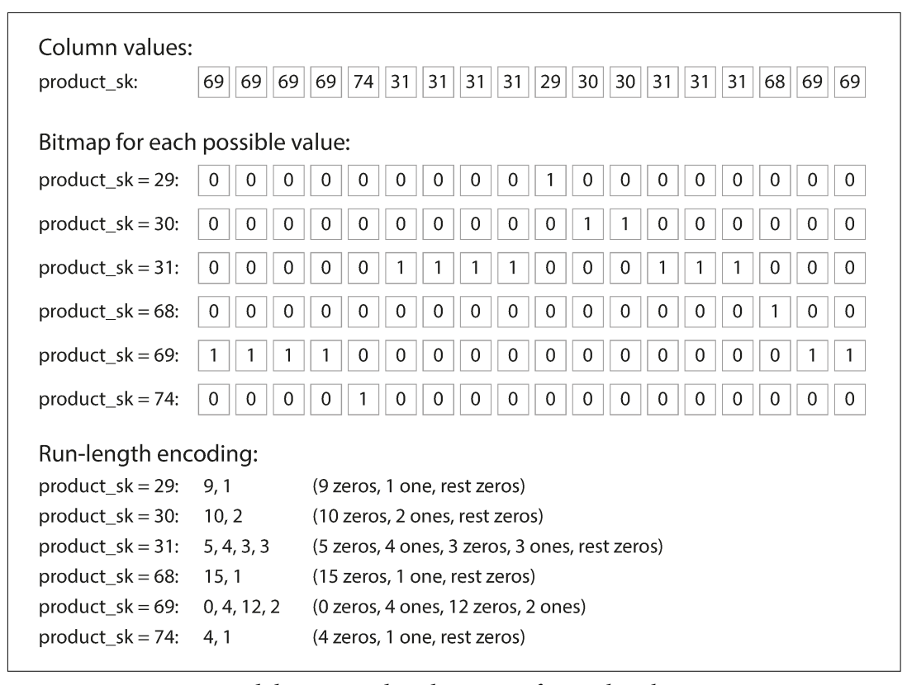

*شکل ۳-۱۱ — برای هر مقدار `product_sk` یک bitmap ساخته شده و دنباله‌های تکراری با run-length encoding کوچک‌تر شده‌اند.*

&rlm;bitmap index برای queryهای warehouse بسیار مناسب است:

```sql
WHERE product_sk IN (30, 68, 69)
```

سه bitmap مربوط به ۳۰، ۶۸ و ۶۹ را load می‌کنیم و `bitwise OR` می‌گیریم. برای شرط زیر:

```sql
WHERE product_sk = 31 AND store_sk = 3
```

&rlm;bitmap محصول ۳۱ و فروشگاه ۳ را load می‌کنیم و `bitwise AND` می‌گیریم. چون rowها در تمام columnها یک ترتیب دارند، bit شمارهٔ k در هر دو bitmap به همان row اشاره می‌کند.

روش‌های compression دیگری هم وجود دارد، اما اصل مهم این است که column storage با الگوی تکرار داده و scan تحلیلی سازگار است.

### &rlm;column family لزوماً column-oriented نیست

&rlm;`Cassandra` و `HBase` مفهومی به نام `column family` دارند که از `Bigtable` گرفته شده است. اما نام آن ممکن است گمراه‌کننده باشد: این سیستم‌ها داخل هر column family همهٔ columnهای یک row را همراه row key کنار هم ذخیره می‌کنند و از column compression استفاده نمی‌کنند. بنابراین مدل Bigtable بیشتر row-oriented است تا column-oriented.

### &rlm;bandwidth حافظه و `vectorized processing`

در queryای که میلیون‌ها row را scan می‌کند، انتقال داده از دیسک به حافظه یک bottleneck است؛ اما تنها bottleneck نیست. انتقال از main memory به CPU cache، branch misprediction، وقفه در pipeline دستور CPU و استفاده از instructionهای `SIMD` هم اهمیت دارد.

&rlm;column storage به استفادهٔ بهتر از CPU کمک می‌کند. query engine می‌تواند یک chunk فشرده را که در `L1 cache` جا می‌شود بردارد و در یک loop فشرده پردازش کند؛ بدون function call و شرط اضافی برای هر record. compression هم اجازه می‌دهد rowهای بیشتری در همان cache جا شوند. عملگرهایی مانند bitwise AND و OR مستقیماً روی chunk فشرده اجرا می‌شوند. این تکنیک `vectorized processing` نام دارد.

## ترتیب مرتب‌سازی در column storage

لازم نیست rowها در column store دقیقاً به ترتیب ورود قرار بگیرند. ترتیب ورود ساده‌ترین حالت است، چون insert فقط append به فایل هر column است. اما می‌توان مثل SSTable یک order تحمیل کرد و از آن به‌عنوان ابزار index استفاده کرد.

نباید هر column را جداگانه sort کنیم؛ در این صورت دیگر نمی‌دانیم entryهای columnها متعلق به کدام row هستند. باید کل row را sort کنیم، حتی اگر داده فیزیکی بر اساس column ذخیره شده باشد.

مدیر database می‌تواند بر اساس queryهای رایج، columnهای sort را انتخاب کند. اگر بیشتر queryها بازهٔ زمانی را هدف می‌گیرند، `date_key` را sort key اول می‌کنیم تا query فقط rowهای ماه اخیر را scan کند. می‌توان `product_sk` را sort key دوم قرار داد تا فروش یک محصول در یک روز کنار هم باشد.

&rlm;sort order compression را هم بهتر می‌کند. اگر column اول مقدارهای متمایز کمی داشته باشد، بعد از sort دنباله‌های طولانی از یک مقدار ایجاد می‌شود و `run-length encoding` آن را بسیار کوچک می‌کند. اثر روی sort key اول بیشترین است؛ keyهای بعدی به‌هم‌ریخته‌ترند، اما سود کلی همچنان قابل‌توجه است.

### چند sort order

ایده‌ای از `C-Store` که در `Vertica` تجاری استفاده شد این است که یک داده را با چند sort order ذخیره کنیم. queryهای متفاوت به ترتیب‌های متفاوت سود می‌برند. داده معمولاً برای تحمل failure روی چند machine replicate می‌شود؛ می‌توان replicaهای redundant را با orderهای مختلف مرتب کرد و برای هر query نسخهٔ مناسب را خواند.

این شبیه داشتن چند secondary index در row store است، اما تفاوت مهمی وجود دارد: row store row را در heap یا clustered index یک‌جا نگه می‌دارد و indexهای ثانویه pointer دارند، در حالی که column store معمولاً خود columnهای value را در orderهای مختلف نگه می‌دارد.

## نوشتن در column-oriented storage

&rlm;column storage، compression و sorting برای warehouseهایی عالی‌اند که بار اصلی‌شان queryهای بزرگ و read-only است، اما write را سخت‌تر می‌کنند. update در محل مانند B-tree برای columnهای فشرده ممکن نیست. اگر row جدیدی وسط جدول مرتب insert شود، احتمالاً باید همهٔ فایل‌های column دوباره نوشته شوند؛ چون position row در تمام columnها باید هماهنگ بماند.

راه‌حل آشناست: از ایدهٔ LSM استفاده کنیم. writeها ابتدا در store حافظه‌ای جمع می‌شوند و به‌صورت ساختار مرتب آمادهٔ flush می‌گردند. وقتی write کافی جمع شد، با column fileهای روی دیسک merge و به‌صورت bulk در فایل‌های جدید نوشته می‌شود. `Vertica` اساساً از همین رویکرد استفاده می‌کند.

&rlm;query باید هم data روی دیسک و هم writeهای اخیر در memory را بخواند و دو بخش را ترکیب کند، اما query optimizer این تفاوت را از analyst پنهان می‌کند. از دید کاربر، insert، update و delete پس از ثبت، در queryهای بعدی دیده می‌شوند.

## &rlm;`Materialized view`، aggregation و `data cube`

هر data warehouse الزاماً column store نیست؛ row-oriented databaseهای سنتی هم برای analytics استفاده می‌شوند. بااین‌حال columnar storage برای ad hoc analytic query در بسیاری از workloadها سریع‌تر است.

&rlm;queryهای warehouse اغلب `COUNT`، `SUM`، `AVG`، `MIN` یا `MAX` دارند. اگر چند query مرتباً aggregateهای مشابه را محاسبه کنند، scan کردن دادهٔ خام در هر بار waste است. می‌توان نتیجهٔ aggregateهای پرتکرار را cache کرد.

در مدل relational، `materialized view` شبیه view معمولی است، اما تفاوت مهم دارد. view معمولی فقط shortcut نوشتن query است؛ هنگام read، SQL engine query اصلی را expand و اجرا می‌کند. materialized view copy واقعی نتیجه است که روی دیسک نوشته شده است.

وقتی دادهٔ زیرین تغییر می‌کند، materialized view هم باید update شود؛ چون یک copy `denormalized` از داده است. database ممکن است این کار را خودکار انجام دهد، اما write گران‌تر می‌شود. در OLTP معمولاً استفاده از آن محدود است، در warehouseهای read-heavy می‌تواند مفید باشد؛ البته سود واقعی به workload بستگی دارد.

نوع خاصی از materialized view، `data cube` یا `OLAP cube` است: شبکه‌ای از aggregateها بر اساس dimensionهای مختلف.

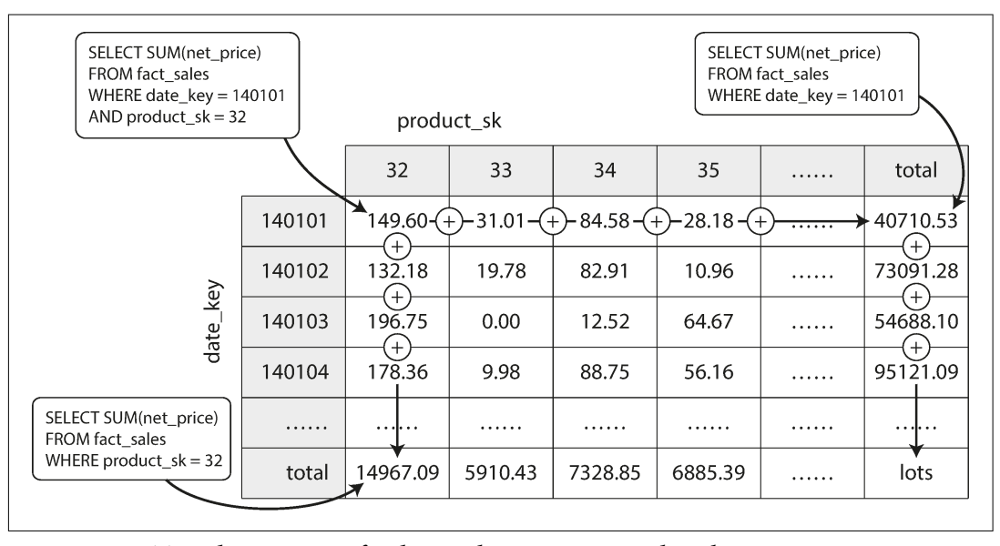

*شکل ۳-۱۲ — در هر cell، مجموع مقدار برای ترکیب date و product قرار دارد و با جمع ردیف یا ستون می‌توان یک dimension را خلاصه کرد.*

فرض کنید هر fact فقط دو foreign key به dimensionهای date و product دارد. یک محور را برای date و محور دیگر را برای product می‌گذاریم. هر cell مقدار aggregate، مثلاً `SUM(net_price)`، برای آن ترکیب date–product است. بعد می‌توان هر row یا column را جمع کرد و خلاصه‌ای با یک dimension کمتر به‌دست آورد: فروش هر product بدون توجه به date یا فروش هر date بدون توجه به product.

در واقعیت fact ممکن است dimensionهای بیشتری داشته باشد؛ مثلاً date، product، store، promotion و customer. تصور hypercube پنج‌بعدی سخت است، اما اصل همان است: هر cell فروش یک ترکیب خاص را نگه می‌دارد و می‌توان بارها در امتداد dimensionها خلاصه‌سازی کرد.

مزیت data cube این است که queryهای مشخص از قبل محاسبه شده‌اند و بسیار سریع جواب می‌گیرند. برای دانستن مجموع فروش هر store در روز گذشته، لازم نیست میلیون‌ها row scan شود. عیب آن انعطاف کمتر است؛ مثلاً اگر price یکی از dimensionها نباشد، از cube نمی‌توان فهمید چه نسبتی از فروش متعلق به کالاهای بالای ۱۰۰ دلار بوده است.

به همین دلیل warehouseها معمولاً تا حد امکان دادهٔ خام را نگه می‌دارند و data cube را فقط به‌عنوان boost برای queryهای پرتکرار استفاده می‌کنند.

## جمع‌بندی فصل

در این فصل دیدیم database هنگام ذخیره و بازیابی داده چه انتخاب‌هایی دارد. storage engineها در سطحی کلی به دو خانواده تقسیم می‌شوند:

- &rlm;engineهای مناسب `OLTP` که با requestهای بسیار و کوچک سروکار دارند. application معمولاً در هر query تعداد کمی record را با key می‌خواهد و index برای پیدا کردن آن به‌کار می‌رود. در اینجا disk seek یا random I/O می‌تواند bottleneck باشد.
- &rlm;engineهای مناسب `OLAP` که queryهای کمتری دارند، اما هر query باید میلیون‌ها record را در زمان کوتاه scan کند. اینجا disk bandwidth مهم‌تر از seek است و column-oriented storage راه‌حل محبوبی است.

در سمت OLTP دو مکتب اصلی دیدیم:

1. **مکتب log-structured:** فقط به فایل append می‌کند و فایل‌های قدیمی را حذف می‌کند؛ `Bitcask`، `SSTable`، `LSM-tree`، `LevelDB`، `Cassandra`، `HBase` و `Lucene` نمونه‌هایی از این خانواده‌اند.
2. **مکتب update-in-place:** دیسک را مجموعه‌ای از pageهای ثابت می‌بیند که می‌توان overwrite کرد؛ `B-tree` نمونهٔ اصلی است و در بیشتر relational databaseها استفاده می‌شود.

ایدهٔ کلیدی storage log-structured تبدیل random-access write به sequential write است؛ این کار با ویژگی‌های hard drive و SSD سازگار است و می‌تواند write throughput را بالا ببرد. در عوض compaction، read amplification و عقب‌ماندن merge باید پایش شوند.

همچنین indexهای secondary، clustered و covering، indexهای چندستونه و چندبعدی، full-text و databaseهای in-memory را دیدیم. در analytics، ساختار query متفاوت است: به‌جای lookup چند row، باید حجم زیادی داده scan شود. بنابراین encoding فشرده، column storage، sort order و bitmap index اهمیت بیشتری دارند. materialized view و data cube می‌توانند queryهای پرتکرار را سریع کنند، اما تازگی داده، فضای مصرفی و هزینهٔ update را به مسئله تبدیل می‌کنند.

این دانستن internals به developer کمک می‌کند ابزار مناسب را آگاهانه انتخاب کند و اثر تغییر tuning parameterها را حدس بزند. هدف، متخصص شدن در tuning یک storage engine خاص نیست؛ هدف داشتن واژگان و مدل ذهنی لازم برای فهمیدن مستندات database موردنظر است.

## مثال کاربردی مستقل: مسیر سفارش و گزارش فروش

یک فروشگاه online را در نظر بگیرید:

1. مسیر ثبت سفارش در `OLTP` از یک B-tree یا LSM مناسب برای lookup مشتری، وضعیت سفارش و updateهای کوچک استفاده می‌کند.
2. هر رویداد سفارش به‌صورت append در event stream ثبت می‌شود.
3. &rlm;pipeline `ETL` رویدادها را تمیز و به fact table فروش، dimension محصول، date و فروشگاه تبدیل می‌کند.
4. &rlm;queryهای dashboard فقط columnهای لازم را از یک column store می‌خوانند.
5. &rlm;aggregateهای پرتکرار، مثل فروش روزانهٔ هر فروشگاه، در materialized view یا data cube نگه داشته می‌شوند.

این جداسازی باعث می‌شود query سنگین گزارش‌گیری روی مسیر خرید فشار نیاورد. در عوض باید چند تصمیم صریح داشته باشیم: warehouse با چه تأخیری به‌روز می‌شود؟ سفارش برگشتی چگونه در fact table اصلاح می‌شود؟ materialized view چه زمانی refresh می‌شود؟ اگر دادهٔ دیررس رسید، آیا بازهٔ زمانی مربوط دوباره محاسبه می‌شود؟ storage engine به‌تنهایی این semantics را انتخاب نمی‌کند؛ معماری application باید آن‌ها را تعریف کند.

## تعریف مستقل اصطلاحات

### &rlm;<span dir="ltr">`storage engine`</span>

بخشی از database که مسئول نوشتن، خواندن، layout داده، index، cache و recovery است. SQL interface می‌تواند یکسان باشد، اما storage engine تعیین می‌کند query در عمل چگونه اجرا شود.

### &rlm;<span dir="ltr">`log`</span>

دنبالهٔ append-only از recordها. log می‌تواند متن، binary، برای انسان قابل‌خواندن یا فقط برای برنامه باشد.

### &rlm;<span dir="ltr">`index`</span>

ساختار کمکی برای پیدا کردن داده بدون scan کامل. index read را سریع‌تر می‌کند، اما write، storage و recovery را گران‌تر می‌کند.

### &rlm;<span dir="ltr">`tombstone`</span>

&rlm;record ویژه‌ای که می‌گوید مقدار قبلی یک key حذف شده است. در storage append-only، tombstone جای پاک کردن در محل را می‌گیرد و هنگام compaction پردازش می‌شود.

### &rlm;<span dir="ltr">`SSTable`</span>

مخفف `Sorted String Table`؛ فایل immutable که key-valueهای آن بر اساس key مرتب شده‌اند. index sparse، compression و merge مرتب از مزیت‌های آن است.

### &rlm;<span dir="ltr">`memtable`</span>

ساختار مرتب در حافظه که writeهای جدید پیش از تبدیل شدن به SSTable در آن قرار می‌گیرند.

### &rlm;<span dir="ltr">`LSM-tree`</span>

&rlm;`Log-Structured Merge-Tree`؛ الگویی که writeها را در حافظه و فایل‌های مرتب جمع می‌کند و با compaction آن‌ها را merge می‌کند. برای writeهای sequential و range query مناسب است، اما ممکن است read و compaction هزینهٔ بیشتری داشته باشد.

### &rlm;<span dir="ltr">`B-tree`</span>

درختی از pageهای مرتب که برای lookup و range query استفاده می‌شود. pageها در محل overwrite می‌شوند و برای crash recovery معمولاً به WAL نیاز است.

### &rlm;<span dir="ltr">`WAL`</span>

مخفف `Write-Ahead Log`. تغییر قبل از اعمال روی data structure اصلی در log پایدار نوشته می‌شود تا پس از crash بتوان آن را دوباره اعمال کرد.

### &rlm;<span dir="ltr">`write amplification`</span>

حالتی که یک write منطقی باعث چند write فیزیکی روی دیسک می‌شود؛ compaction در LSM و WAL به‌همراه page update در B-tree از علت‌های آن هستند.

### &rlm;<span dir="ltr">`OLTP`</span>

مخفف `Online Transaction Processing`. workload تعاملی با read و write کوچک، lookup بر اساس key و latency پایین؛ مانند ثبت سفارش.

### &rlm;<span dir="ltr">`OLAP`</span>

مخفف `Online Analytic Processing`. workload تحلیلی که تعداد زیادی row را scan و aggregate می‌کند؛ مانند محاسبهٔ فروش ماهانه.

### &rlm;<span dir="ltr">`ETL`</span>

مخفف `Extract–Transform–Load`: استخراج داده از سیستم مبدأ، تبدیل و تمیز کردن آن، و load در مقصدی مانند data warehouse.

### &rlm;`fact table` و `dimension table`

&rlm;`fact table` eventها یا اندازه‌گیری‌های پرتعداد را نگه می‌دارد. `dimension table` اطلاعات توصیفی مانند محصول، date، customer یا store را نگه می‌دارد و fact با foreign key به آن وصل می‌شود.

### &rlm;<span dir="ltr">`column-oriented storage`</span>

چیدمانی که مقدارهای یک column را کنار هم ذخیره می‌کند. برای queryهایی که چند column را از rowهای بسیار زیاد می‌خوانند و aggregate می‌کنند مناسب است.

### &rlm;<span dir="ltr">`materialized view`</span>

&rlm;copy ذخیره‌شدهٔ نتیجهٔ یک query. read را سریع می‌کند، اما با تغییر دادهٔ اصلی باید refresh شود و به‌دلیل `denormalization` هزینهٔ نگه‌داری دارد.

### &rlm;<span dir="ltr">`data cube`</span>

نوعی materialized aggregate که نتیجه را بر اساس چند dimension، مانند date و product، در قالب grid یا hypercube نگه می‌دارد.

## ارتباط با فصل‌های دیگر

- [فصل ۲: `Data Models` و `Query Languages`](../02-data-models-query-languages/README.md) — مدل relational، document و graph که روی این storageها قرار می‌گیرند.
- [فصل ۴: `Encoding` و `Evolution`](../04-encoding-evolution/README.md) — شکل ذخیره و تغییر schema و recordها.
- [فصل ۵: `Replication`](../05-replication/README.md) — نگه‌داشتن copyهای storage روی چند machine.
- [فصل ۷: `Transactions`](../07-transactions/README.md) — رابطهٔ B-tree، isolation و WAL با transaction.
- [فصل ۱۰: `Batch Processing`](../10-batch-processing/README.md) — pipelineهای ETL و پردازش حجیم.
- [فصل ۱۱: `Stream Processing`](../11-stream-processing/README.md) — event streamهایی که وارد warehouse یا materialized view می‌شوند.
