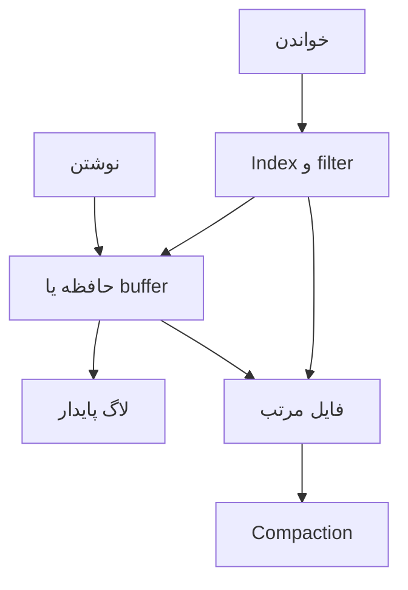

# فصل ۳: `Storage` و `Retrieval`

## Storage and Retrieval

این فصل از ساختارهای data داخل `database` شروع می‌کند و نشان می‌دهد چرا تفاوت میان `storage engine`، `index` و شیوهٔ ذخیره‌سازی تحلیلی مستقیماً روی performance اثر می‌گذارد.

## هدف فصل

نوشتن یک رکورد و پیدا کردن آن دو مسئلهٔ متفاوت‌اند. storage engine باید میان سرعت نوشتن، سرعت خواندن، فضای ذخیره، recovery و الگوی query تعادل برقرار کند. برای workload `OLTP` نیز نیازها با workload `OLAP` یکسان نیست.

## نقشهٔ مطالب

- log و indexهای hash
- SSTable و LSM-tree در برابر B-tree
- `secondary indexes` و ساختارهای خاص
- جدایی OLTP از analytics و نقش data warehouse
- schemaهای star و snowflake، `column-oriented storage`، compression و data cube

## خلاصهٔ زمینه‌محور

### index و log

ساده‌ترین storage engine می‌تواند هر write را به انتهای یک log append کند و یک hash map در حافظه، کلید را به offset آخر وصل کند. این روش برای writeهای پیوسته سریع است، اما log بی‌نهایت رشد می‌کند و برای range query مناسب نیست. compaction رکوردهای قدیمی یا tombstoneها را جمع می‌کند و index باید پس از restart بازسازی یا checkpoint شود.

در طراحی index باید هزینهٔ خواندن، نوشتن، حافظه و recovery با هم سنجیده شود. index اضافی read را سریع می‌کند، اما هر write باید آن را هم به‌روز کند و فضای بیشتری می‌گیرد.

### SSTable و LSM-tree

در الگوی LSM، writeهای جدید ابتدا در ساختاری مرتب در حافظه قرار می‌گیرند. پس از پرشدن، به فایل immutable مرتب‌شده روی دیسک تبدیل می‌شوند. چند فایل در سطح‌های مختلف با compaction ترکیب می‌شوند. merge مرتب، write sequential و فشرده‌سازی را خوب می‌کند، اما read ممکن است مجبور شود چند فایل و filter را بررسی کند. Bloom filter و انتخاب درست اندازهٔ levelها این هزینه را کم می‌کنند.

SSTable به engine اجازه می‌دهد فایل‌های تغییرناپذیر و قابل‌پردازش مجدد داشته باشد. در برابر، compaction می‌تواند I/O پس‌زمینه و فشار ناگهانی ایجاد کند و باید با workload هماهنگ شود.

### B-tree

B-tree data را در صفحه‌های مرتب‌شده نگه می‌دارد. هر صفحه چند فرزند دارد و با split و merge، عمق درخت کم می‌ماند. جست‌وجوی key و range query قابل‌پیش‌بینی است و update در محل، برای databaseهای `OLTP` مناسب است. در عوض، نوشتن صفحه، WAL، fragmentation و قفل‌گذاری هزینه دارند.

مقایسهٔ LSM و B-tree یک برندهٔ عمومی ندارد. LSM معمولاً write و فشرده‌سازی خوبی می‌دهد، ولی compaction و read amplification دارد. B-tree خواندن نقطه‌ای و range را پایدار می‌کند، ولی update و نگه‌داری صفحه‌ها هزینه‌بر است. workload، اندازهٔ داده، الگوی update و سخت‌افزار تصمیم را تعیین می‌کنند.

### indexهای دیگر

برای queryهای غیرکلیدی می‌توان index ثانویه، composite index، full-text index، bitmap یا ساختارهای جغرافیایی استفاده کرد. هر index باید همراه با تعریف دقیق semantics و هزینهٔ به‌روزرسانی انتخاب شود. یک index ممکن است query را سریع کند اما uniqueness یا ترتیب را تضمین نکند.

### `OLTP` و `OLAP`

سامانهٔ OLTP معمولاً درخواست‌های کوچک، خواندن و نوشتن رکوردهای محدود و latency پایین دارد. در analytics، queryها حجم زیادی از رکوردها را اسکن و aggregate می‌کنند. اجرای هر دو روی یک storage engine ممکن است باعث رقابت منابع و planهای نامناسب شود؛ به همین دلیل data warehouse یا derived store برای تحلیل ساخته می‌شود.

در schema ستاره‌ای، جدول fact بزرگ به dimensionهای نسبتاً کوچک وصل می‌شود. schema دانه‌برفی برخی dimensionها را با `normalization` جدا می‌کند و join بیشتری دارد. این انتخاب بین سادگی query، تکرار data و هزینهٔ نگه‌داری است.

### `Column-oriented storage` و aggregation

در storage ستونی، مقادیر هر ستون کنار هم قرار می‌گیرند. query تحلیلی که فقط چند ستون را نیاز دارد، دادهٔ کمتری می‌خواند و compression بهتر می‌شود؛ ستون‌های با مقدار تکراری می‌توانند با encoding فشرده ذخیره شوند. sort order روی یک یا چند ستون، فیلتر و aggregation را سریع‌تر می‌کند، اما update رکوردی و افزودن داده باید با ساختار batch هماهنگ شود.

data cube و materialized view نتیجهٔ aggregationهای پرکاربرد را از قبل ذخیره می‌کنند. این کار read را سریع می‌کند، اما refresh، تازگی داده و فضای مصرفی را به مسئله تبدیل می‌کند.

### مثال مستقل: گزارش فروش

یک فروشگاه online می‌تواند سفارش‌ها را در storage `OLTP` با index روی شناسه و زمان ذخیره کند. برای داشبورد، eventهای سفارش به warehouse می‌روند و fact table فروش با dimension محصول و منطقه ساخته می‌شود. dashboard از `materialized view` روزانه می‌خواند؛ بنابراین فشار queryهای سنگین روی مسیر خرید نمی‌افتد، اما تیم باید تأخیر ورود data و روش اصلاح سفارش برگشتی را تعریف کند.

## نکته‌های کلیدی

1. storage engine را بر اساس الگوی خواندن و نوشتن انتخاب کنید.
2. compaction، cache و indexها بخشی از رفتار عملیاتی engine هستند، نه جزئیات پنهان بی‌اهمیت.
3. OLTP و analytics معمولاً الگوهای متفاوتی دارند.
4. materialized view سرعت را با هزینهٔ تازگی و پیچیدگی refresh می‌خرد.

## ارتباط با فصل‌های دیگر

- [فصل ۲: `Data Models` و `Query Languages`](../02-data-models-query-languages/README.md)
- [فصل ۴: `Encoding` و `Evolution`](../04-encoding-evolution/README.md)
- [فصل ۱۰: `Batch Processing`](../10-batch-processing/README.md)

## جدول مقایسهٔ storage engine

| ویژگی | B-tree | LSM-tree | ذخیره‌سازی ستونی |
| --- | --- | --- | --- |
| نقطهٔ قوت | lookup و range پایدار | write پیوسته و compaction | scan و aggregate تحلیلی |
| هزینهٔ اصلی | update صفحه و قفل | compaction و read amplification | update رکوردی و refresh |
| workload مناسب | OLTP عمومی | ingestion سنگین و append | OLAP و query روی چند ستون |
| پرسش کلیدی | آیا range و update فوری مهم است؟ | آیا write burst و فایل immutable داریم؟ | آیا query بیشتر ستون‌ها را انتخاب می‌کند؟ |

## مسیر نوشتن و خواندن

در این مدل، durability، cache و compaction سه مسیر جدا اما مرتبط‌اند. اگر لاگ پایدار باشد ولی recovery آن کند باشد، downtime همچنان زیاد است. اگر compaction بدون سقف اجرا شود، latency کاربر در زمان فشار بالا می‌رود.

## روش انتخاب index

- برای lookup دقیق، کلید و اندازهٔ cardinality را بررسی کنید.
- برای range، ترتیب کلید و locality فیزیکی مهم است.
- برای query چندشرطی، ترتیب ستون‌های composite index را با فیلترهای واقعی بسنجید.
- برای متن، تحلیل واژه و ranking را از lookup ساده جدا کنید.
- تعداد indexها را با هزینهٔ write، فضای backup و زمان recovery مقایسه کنید.

## سناریوی طراحی: داشبورد عملیاتی

data خام سفارش برای status و lookup مشتری به `OLTP storage engine` می‌رود. هر شب snapshot و eventهای تغییر به `column-oriented storage` منتقل می‌شوند. داشبورد لحظه‌ای از view کوچک و تازه می‌خواند؛ گزارش‌های چندماهه از warehouse. برای اصلاح سفارش، pipeline باید بتواند بازهٔ زمانی مشخص را دوباره محاسبه کند و نسخهٔ view را تغییر دهد، نه اینکه فقط چند record را دستی ویرایش کند.

## چک‌لیست عملیاتی

- [ ] زمان recovery با اندازهٔ log و index آزمایش شده است.
- [ ] compaction و cache hit rate متریک دارند.
- [ ] فضای موقت compaction و backup در ظرفیت‌سنجی آمده است.
- [ ] queryهای پرتکرار با دادهٔ واقعی و توزیع واقعی benchmark شده‌اند.
- [ ] view مادی‌شده زمان آخرین به‌روزرسانی خود را نشان می‌دهد.

## تمرین‌های مرور

1. برای یک workload با ۹۰٪ append و ۱۰٪ range query، trade-off دو engine را بنویسید.
2. توضیح دهید چرا افزودن یک index می‌تواند latency نوشتن را افزایش دهد.
3. یک policy برای حذف یا فشرده‌سازی دادهٔ قدیمی طراحی کنید.

## تعریف مستقل اصطلاحات

### `database`

**چیست؟** سیستمی که داده را نگه می‌دارد و با قرارداد مشخص امکان خواندن و نوشتن می‌دهد.

**اشتباه رایج:** database فقط محل فایل‌ها نیست؛ durability، transaction، index و recovery هم بخشی از رفتار آن‌اند.

### `index`

**چیست؟** ساختار کمکی برای پیدا کردن داده بدون خواندن همهٔ رکوردها.

**هزینه:** هر index خواندن را ممکن است سریع‌تر کند، اما write، storage و recovery را گران‌تر می‌کند.

### `WAL`

`WAL` مخفف **Write-Ahead Log** است. تغییر ابتدا در log پایدار ثبت می‌شود و بعد ساختار اصلی update می‌شود. اگر process وسط کار crash کند، database از log برای recovery استفاده می‌کند.

### `B-tree`

**چیست؟** درختی از pageهای مرتب که برای lookup و range query مناسب است.

**اشتباه رایج:** B-tree خودش تضمین نمی‌کند هر query سریع باشد؛ ترتیب key و انتخاب index هنوز مهم است.

### `LSM-tree` و `SSTable`

`LSM-tree` تغییرها را ابتدا در memory و سپس در فایل‌های مرتب‌شده جمع می‌کند. `SSTable` یکی از همان فایل‌های مرتب و immutable است. `compaction` فایل‌ها را با هم ادغام می‌کند و نسخه‌های قدیمی یا delete marker را پاک می‌کند.

### `OLTP` و `OLAP`

- `OLTP`: کارهای کوچک و روزمره مانند ثبت سفارش یا تغییر وضعیت.
- `OLAP`: خواندن و aggregate حجم زیادی از داده برای گزارش و تحلیل.

**اشتباه رایج:** یک engine می‌تواند هر دو را پشتیبانی کند، اما workload آن‌ها یکسان نیست و ممکن است جداسازی لازم شود.
