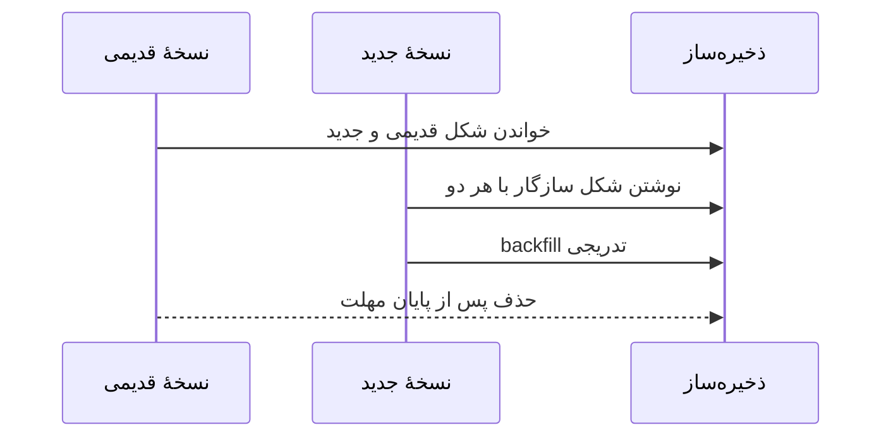

# فصل ۴: `Encoding` و `Evolution`

## Encoding and Evolution

data یک system فقط در لحظهٔ تولید وجود ندارد. مدتی در `database` می‌ماند، بین serviceها حرکت می‌کند و ممکن است توسط چند نسخهٔ software خوانده شود. این فصل قراردادهای `encoding` و روش `schema evolution` را بررسی می‌کند.

## هدف فصل

قالب data باید هم برای امروز قابل‌استفاده باشد و هم اجازه دهد برنامه بدون توقف یک‌باره تکامل پیدا کند. `Backward compatibility` و `Forward compatibility`، versioning API و روش عبور data از database و message broker هستهٔ فصل‌اند.

## نقشهٔ مطالب

- قالب‌های مخصوص زبان و قالب‌های متنی/باینری
- JSON، XML، Protocol Buffers، Thrift و Avro
- نقش schema و قراردادهای `compatibility`
- dataflow از راه database، service و پیام

## خلاصهٔ زمینه‌محور

### `Encoding` formats

serialization دادهٔ درون برنامه را به بایت یا متن تبدیل می‌کند. قالب‌های مخصوص یک زبان ممکن است سریع و راحت باشند، اما به همان runtime وابسته‌اند و برای storage بلندمدت یا سرویس چندزبانه مناسب نباشند. JSON و XML خوانا و در وب رایج‌اند، ولی نوع‌دهی و اندازهٔ آن‌ها برای همهٔ workloadها ایده‌آل نیست. قالب باینری فشرده‌تر است، اما ابزار مشاهده و قرارداد دقیق‌تری می‌خواهد.

### schema و قالب‌های قراردادی

Protocol Buffers و Thrift برای fieldها شناسهٔ عددی و نوع مشخص تعریف می‌کنند. حذف یا اضافه‌کردن field می‌تواند با مقدار پیش‌فرض و حفظ شناسه، با نسخه‌های دیگر سازگار بماند. تغییر نوع، reuseکردن شمارهٔ حذف‌شده یا اجباری‌کردن فیلد قدیمی می‌تواند دادهٔ ذخیره‌شده و نسخه‌های قدیمی را بشکند.

Avro schema را به‌صورت جداگانه نگه می‌دارد و هنگام خواندن، schema نویسنده و خواننده را تطبیق می‌دهد. این model برای data file و messageهایی که schema آن‌ها با evolution همراه است مناسب است. نکتهٔ مشترک همهٔ encoding formatها این است که schema بخشی از قرارداد است و باید با آزمون `compatibility` و registry یا فرایند review مدیریت شود.

### `Backward` و `Forward compatibility`

نسخهٔ جدید باید بتواند دادهٔ قدیمی را بخواند و نسخهٔ قدیمی، در صورت نیاز، دادهٔ تولیدشده توسط نسخهٔ جدید را تحمل کند. این دو جهت الزاماً هم‌زمان برقرار نیستند. اضافه‌کردن field اختیاری معمولاً کم‌خطرتر از تغییر معنای field موجود است. به‌جای تغییر درجا، گاهی field جدید با نام جدید افزوده می‌شود و migration تدریجی انجام می‌گیرد.

### dataflow از database

در database، schema جدید ممکن است در کنار رکوردهای قدیمی وجود داشته باشد. برنامهٔ جدید باید هر دو شکل را بخواند و writeهای آینده را به شکل تازه بنویسد. migration می‌تواند lazy و هنگام خواندن انجام شود یا با یک job همهٔ رکوردها را تبدیل کند. هر روش باید برای rollback، توقف job و رکوردهای ناقص برنامه داشته باشد.

### dataflow از service

در REST، قرارداد معمولاً با نام فیلد، status code و semantics endpoint شکل می‌گیرد. در RPC، schema و code generation می‌تواند قرارداد را دقیق‌تر کند، اما coupling نسخه‌ها و timeoutها اهمیت پیدا می‌کنند. تغییر API بهتر است additive باشد؛ حذف یا تغییر ناگهانی رفتار، مشتریان مستقل را می‌شکند. یک service نباید فرض کند همهٔ مصرف‌کنندگان هم‌زمان deploy می‌شوند.

### dataflow از پیام

وقتی پیام در broker یا log ذخیره می‌شود، ممکن است مدت زیادی بعد مصرف شود. بنابراین consumer باید با نسخه‌های قدیمی و جدید کنار بیاید، duplicate را تحمل کند و در صورت retry رفتار idempotent داشته باشد. پیام immutable و event معمولاً با record وضعیت فعلی یکسان نیست؛ این تفاوت در طراحی schema و retention مهم است.

### مثال مستقل: انتشار تدریجی سرویس

فرض کنید سرویس پرداخت فیلد `currency` را به سفارش اضافه می‌کند. نسخهٔ جدید می‌تواند آن را اختیاری بخواند، نسخهٔ قدیمی آن را نادیده بگیرد و producer تا مدتی مقدار پیش‌فرض ارسال کند. پس از اطمینان از rollout، فیلد اجباری می‌شود و داده‌های قدیمی backfill می‌شوند. اگر قرارداد از ابتدا با این مراحل طراحی نشده باشد، deploy هم‌زمان همهٔ سرویس‌ها تنها راه پرریسک باقی می‌ماند.

## نکته‌های کلیدی

1. دادهٔ ذخیره‌شده و پیام‌های در حال انتقال، بخشی از API سامانه‌اند.
2. قابلیت حذف یا اضافه‌کردن field را پیش از نیاز واقعی آزمایش کنید.
3. نسخه‌بندی باید با rollout، rollback و دادهٔ قدیمی هماهنگ باشد.
4. schema registry یا تست قرارداد، جایگزین طراحی خوب semantics نمی‌شود.

## ارتباط با فصل‌های دیگر

- [فصل ۳: `Storage` و `Retrieval`](../03-storage-retrieval/README.md)
- [فصل ۵: `Replication`](../05-replication/README.md)
- [فصل ۱۱: `Stream Processing`](../11-stream-processing/README.md)

## ماتریس تغییر قرارداد

| تغییر | معمولاً کم‌خطر | شرط لازم |
| --- | --- | --- |
| اضافه‌کردن field اختیاری | بله | consumer قدیمی آن را نادیده بگیرد |
| حذف field | گاهی | همهٔ readerهای قدیمی دیگر به آن وابسته نباشند |
| تغییر نام field | خیر | alias یا migration دو مرحله‌ای لازم است |
| تغییر معنای مقدار | خیر | field جدید یا version معنایی تعریف شود |
| تغییر نوع عدد/رشته | وابسته | محدوده، overflow و readerهای قدیمی آزمون شوند |

## نمودار انتشار تدریجی

در rollout واقعی، «نسخهٔ جدید» ممکن است مدت کوتاهی کنار نسخهٔ قدیمی اجرا شود. بنابراین `compatibility` باید با ترتیب deploy، rollback و messageهای معوق هماهنگ باشد؛ فقط تست unit برای این مسئله کافی نیست.

## قرارداد خوب چه چیزهایی دارد؟

- مالک هر field و معنی دقیق null، مقدار پیش‌فرض و واحد اندازه‌گیری.
- policy برای field ناشناخته و version نامعتبر.
- تستی که payloadهای نسخهٔ قدیمی را به reader جدید و برعکس می‌دهد.
- روش backfill، توقف migration و بازگشت به نسخهٔ قبلی.
- ثبت schema و تغییرات آن در review، نه فقط در کد تولیدشده.

## سناریوی طراحی: تغییر واحد اندازه‌گیری

سرویس ارسال ابتدا فاصله را به کیلومتر ذخیره می‌کند، اما مشتری جدید مایل می‌خواهد. تغییر معنای `distance` خطرناک است؛ راه امن‌تر افزودن `distance_meters` به‌عنوان مقدار canonical و تولید نمایش محلی در client است. با این کار تبدیل فقط یک‌بار تعریف می‌شود و consumerهای قدیمی همچنان رفتار قابل‌پیش‌بینی دارند.

## تمرین‌های مرور

1. برای افزودن فیلد اجباری به پیام، rollout سه‌مرحله‌ای طراحی کنید.
2. یک payload بسازید که reader قدیمی باید آن را بدون crash نادیده بگیرد.
3. فرق schema compatibility و compatibility معنایی را با یک مثال توضیح دهید.

## تعریف مستقل اصطلاحات

### `encoding`

**چیست؟** تبدیل دادهٔ برنامه به text یا byte برای ذخیره یا انتقال.

**مثال:** object سفارش در حافظه به یک پیام JSON یا binary تبدیل می‌شود.

### `schema evolution`

**چیست؟** تغییر تدریجی قرارداد داده در حالی که رکوردها یا consumerهای قدیمی هنوز وجود دارند.

**قانون ساده:** field جدید را ابتدا optional کنید، consumerهای قدیمی را تحمل کنید و حذف را به مرحلهٔ جدا موکول کنید.

### `backward compatibility` و `forward compatibility`

- `backward compatibility`: نسخهٔ جدید می‌تواند دادهٔ نسخهٔ قدیمی را بخواند.
- `forward compatibility`: نسخهٔ قدیمی می‌تواند دادهٔ نسخهٔ جدید را تا حد قابل‌قبول تحمل کند.

این دو یکی نیستند و باید جداگانه تست شوند.

### `REST`

**چیست؟** سبکی برای API که معمولاً resource، HTTP method و status code را به‌عنوان قرارداد به کار می‌گیرد.

**اشتباه رایج:** REST فقط یعنی «JSON روی HTTP» نیست؛ semantics درخواست، cache و خطا هم مهم‌اند.

### `RPC`

**چیست؟** روشی که فراخوانی یک operation روی سرویس دیگر را شبیه function call نشان می‌دهد.

**خطر:** شبکه function محلی نیست؛ timeout، retry، latency و partial failure همیشه ممکن‌اند.

### `idempotency key`

**چیست؟** شناسه‌ای که client همراه درخواست می‌فرستد تا server اجرای تکراری همان operation را تشخیص دهد.

**مثال:** در پرداخت، `payment_request_123` فقط یک charge معتبر می‌سازد، حتی اگر response اول گم شود.
