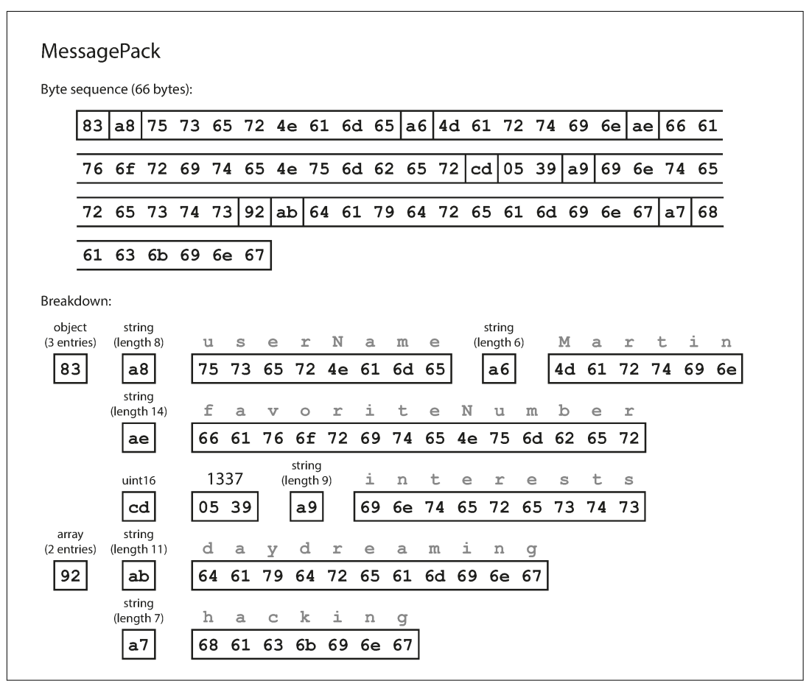
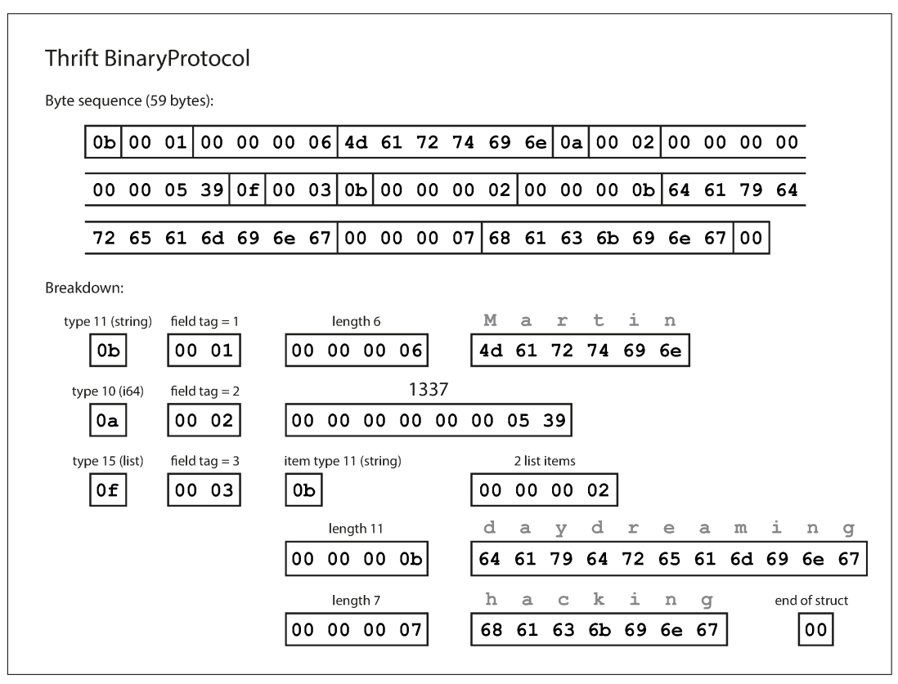
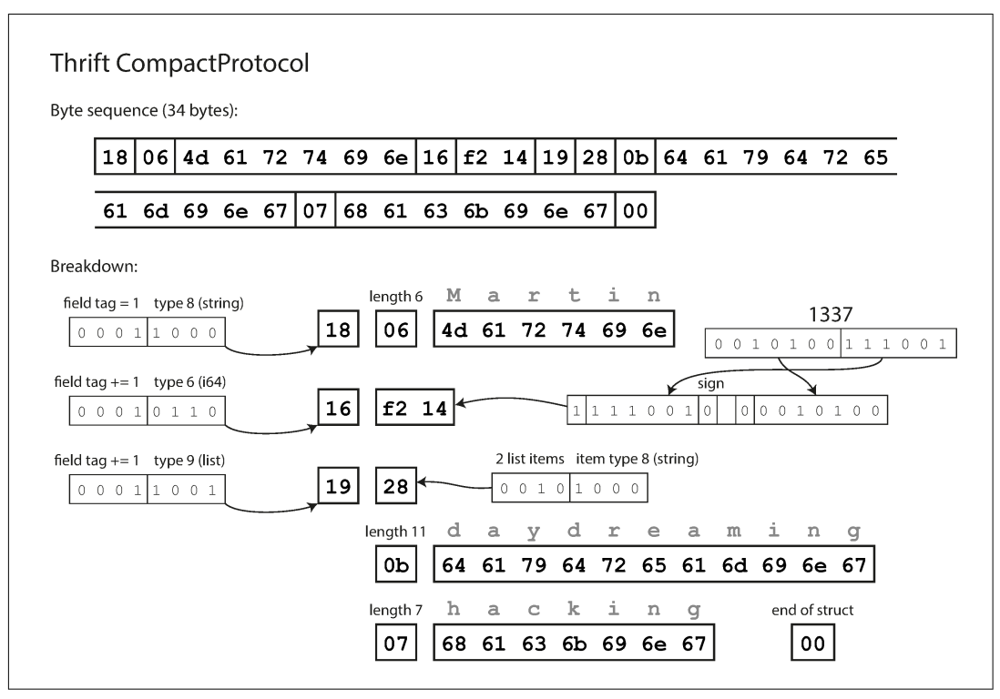
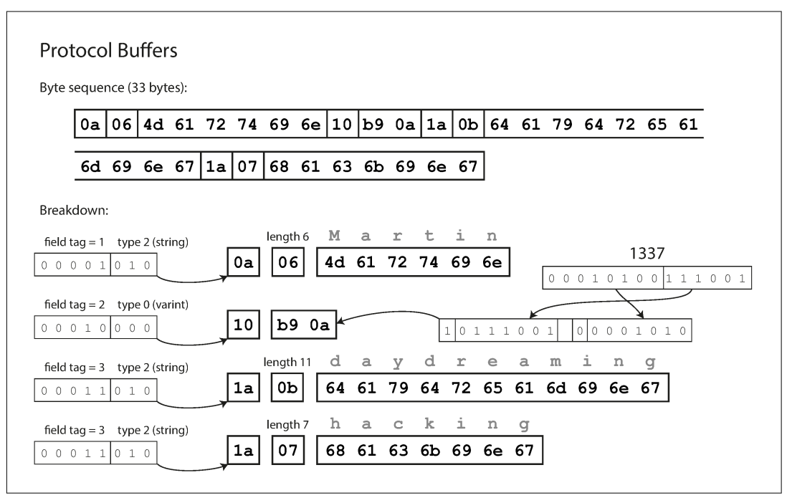
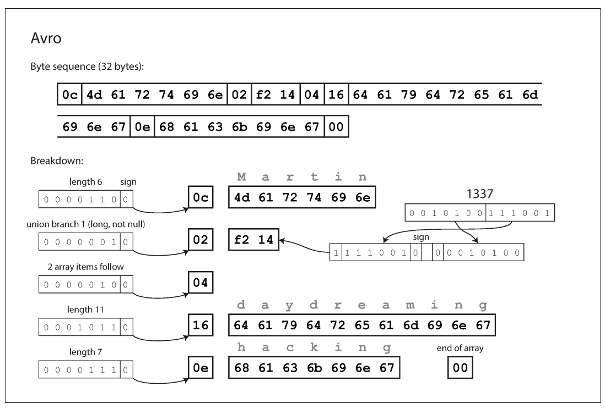
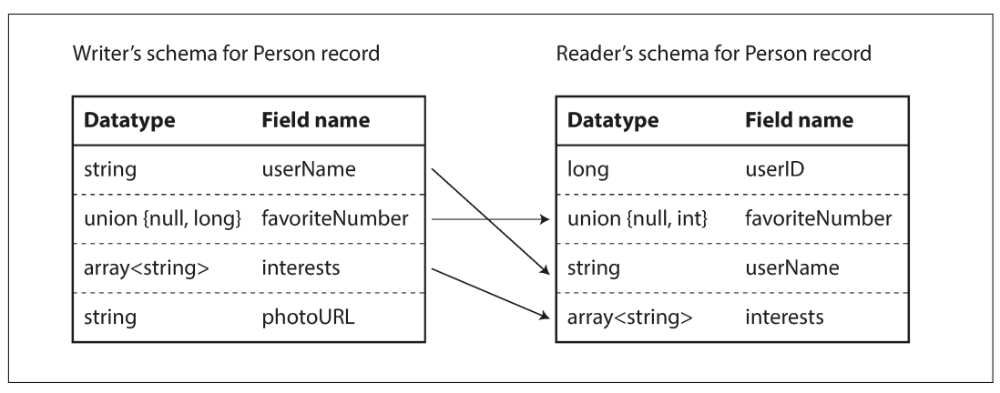
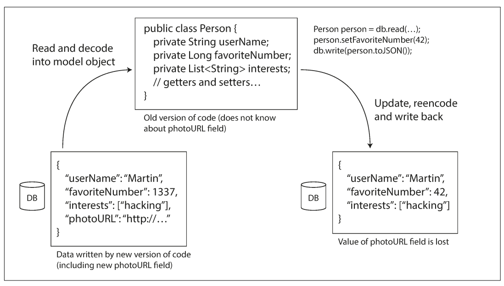

# فصل ۴: Encoding و Evolution

## &rlm;<span dir="ltr">Encoding and Evolution</span>

<blockquote dir="rtl" align="right">
  <p dir="rtl" align="right">همه‌چیز تغییر می‌کند و هیچ‌چیز ثابت نمی‌ماند. — هراکلیتوس</p>
</blockquote>

&rlm;applicationها در طول زمان ناچار تغییر می‌کنند. feature تازه‌ای اضافه می‌شود، feature قدیمی شکل دیگری پیدا می‌کند، محصول جدیدی عرضه می‌شود یا نیاز کسب‌وکار بهتر فهمیده می‌شود. اگر سیستم را طوری بسازیم که تغییر دادن آن آسان باشد، به `evolvability` رسیده‌ایم.

تغییر feature معمولاً با تغییر داده‌ای که ذخیره می‌کنیم همراه است: field جدید، نوع record جدید یا روش تازه‌ای برای نمایش داده. مدل‌های `relational` و `document` راه‌های متفاوتی برای برخورد با این تغییر دارند. relational database معمولاً فرض می‌کند همهٔ داده‌ها با یک schema سازگارند؛ تغییر schema با migration یا دستورهایی مانند `ALTER` انجام می‌شود. در مقابل، databaseهای `schema-on-read` یا «schemaless» ممکن است هم‌زمان recordهای قدیمی و جدید را نگه دارند.

تغییر schema معمولاً نیازمند تغییر code هم هست. اما code در یک سیستم بزرگ یک‌باره عوض نمی‌شود:

- در server-side application معمولاً `rolling upgrade` یا `staged rollout` داریم؛ نسخهٔ تازه ابتدا روی چند node نصب می‌شود، رفتار آن بررسی می‌شود و بعد به‌تدریج روی بقیهٔ nodeها می‌رود. این روش downtime را کم می‌کند و releaseهای کوچک و مکرر را ممکن می‌سازد.
- در client-side application، زمان نصب نسخهٔ جدید دست ما نیست. ممکن است کاربر ماه‌ها نسخهٔ قدیمی را اجرا کند.

پس مدتی old و new code و همچنین old و new data format در یک سیستم کنار هم زندگی می‌کنند. برای اینکه این همزیستی سالم باشد، دو نوع compatibility لازم است:

- &rlm;`backward compatibility`: code جدید بتواند داده‌ای را که code قدیمی نوشته است بخواند.
- &rlm;`forward compatibility`: code قدیمی بتواند داده‌ای را که code جدید نوشته است بخواند.

&rlm;backward compatibility معمولاً ساده‌تر است، چون نویسندهٔ code جدید قالب قدیمی را می‌شناسد و می‌تواند آن را صریحاً پشتیبانی کند. forward compatibility سخت‌تر است؛ code قدیمی باید بتواند additionهای ناشناختهٔ نسخهٔ جدید را نادیده بگیرد.

در این فصل قالب‌های `JSON`، `XML`، `Protocol Buffers`، `Thrift` و `Avro` را بررسی می‌کنیم و می‌بینیم تغییر schema در هرکدام چگونه انجام می‌شود. سپس به مسیرهایی می‌رسیم که داده از یک process به process دیگر می‌رود: database، web service، `REST`، `RPC`، message broker و actor.

## قالب‌های Encoding داده

یک برنامه معمولاً داده را دست‌کم در دو نمایش متفاوت دارد:

1. در حافظه، داده object، struct، list، array، hash table یا tree است؛ این ساختارها برای دسترسی و تغییر سریع CPU بهینه شده‌اند و معمولاً pointer دارند.
2. برای نوشتن در فایل یا فرستادن روی network، داده باید به دنباله‌ای مستقل از حافظه از byte تبدیل شود؛ مثلاً یک JSON document. pointer در process دیگر معنا ندارد، پس نمایش byteای با structure درون حافظه متفاوت است.

تبدیل نمایش حافظه به دنبالهٔ byte را `encoding` می‌نامیم؛ گاهی به آن `serialization` یا `marshalling` هم می‌گویند. تبدیل معکوس `decoding`، `parsing`، `deserialization` یا `unmarshalling` نام دارد. در این متن از encoding استفاده می‌کنیم تا با معنای دیگری از serialization در بحث transaction اشتباه نشود. encoding همچنین با encryption فرق دارد؛ هدف آن فشرده یا رمزکردن امنیتی نیست، بلکه تبدیل representation است.

## قالب‌های مخصوص زبان برنامه‌نویسی

بسیاری از زبان‌ها امکان ذخیرهٔ objectهای حافظه را دارند: `java.io.Serializable` در Java، `Marshal` در Ruby، `pickle` در Python یا libraryهایی مانند `Kryo` برای Java. این روش‌ها برای ذخیره و بازیابی سریع یک object بسیار راحت‌اند، اما مشکل‌های عمیقی دارند:

- قالب اغلب به یک language خاص وابسته است. خواندن داده از زبان دیگر سخت می‌شود و با ذخیرهٔ بلندمدت آن، خودمان را به language فعلی متعهد می‌کنیم.
- برای بازسازی object، decoder ممکن است بتواند class دلخواه را instantiate کند. اگر attacker byte دلخواهی را وارد decoder کند، این موضوع می‌تواند به اجرای code دلخواه و مشکل امنیتی `deserialization of untrusted data` منجر شود.
- &rlm;versioning و forward/backward compatibility معمولاً بعداً و به‌صورت ناقص به library اضافه می‌شود.
- &rlm;CPU موردنیاز و حجم encoded data گاهی نادیده گرفته می‌شود؛ serialization داخلی Java به پرحجمی و performance ضعیف معروف است.

بنابراین encoding داخلی یک language را برای دادهٔ موقتی در یک process می‌توان استفاده کرد، اما برای فایل دائمی، API عمومی یا ارتباط میان تیم‌ها انتخاب مناسبی نیست.

## &rlm;`JSON`، `XML` و گونه‌های متنی

برای قالب‌های استاندارد و قابل‌خواندن در چند language، `JSON` و `XML` گزینه‌های شناخته‌شده‌اند و `CSV` هم بسیار رایج است. XML معمولاً verbose و پیچیده‌تر است؛ محبوبیت JSON بیشتر به سادگی و پشتیبانی browserها برمی‌گردد.

این قالب‌ها تا حدی human-readable هستند، اما چند ابهام دارند:

### ابهام در number

در XML و CSV بدون schema نمی‌توان فهمید رشتهٔ `123` عدد است یا string. JSON فرق number و string را می‌داند، اما integer و floating-point و precision را دقیق مشخص نمی‌کند. این مسئله برای عددهای بزرگ مهم است: عددهای بزرگ‌تر از `2^53` در IEEE 754 double به‌طور دقیق قابل نمایش نیستند. Twitter برای شناسهٔ ۶۴بیتی tweet، ID را هم به شکل JSON number و هم به شکل decimal string برمی‌گرداند تا clientهای JavaScript عدد را اشتباه نخوانند.

### &rlm;<span dir="ltr">binary string</span>

&rlm;JSON و XML برای stringهای Unicode خوب‌اند، اما دنبالهٔ byte بدون encoding کاراکتری را مستقیماً ندارند. راه رایج تبدیل binary به text با `Base64` است. این راه کار می‌کند، ولی اندازهٔ داده را حدود ۳۳٪ زیاد می‌کند و schema باید بگوید این string در واقع Base64 است.

### &rlm;schema اختیاری و CSV مبهم

&rlm;XML Schema و JSON Schema امکان validation دقیق می‌دهند، اما خودشان پیچیده‌اند و یادگیری و پیاده‌سازی‌شان هزینه دارد. اگر schema استفاده نشود، application باید نوع و معنای fieldها را hardcode کند.

&rlm;CSV اصلاً schema ندارد؛ معنی هر row و column را application تعیین می‌کند. با اضافه شدن column یا row باید code دستی تغییر کند. همچنین اگر مقدار شامل comma یا newline باشد، parser و escaping اهمیت پیدا می‌کند و همهٔ parserها رفتار کاملاً یکسانی ندارند.

با وجود این ضعف‌ها، JSON، XML و CSV برای بسیاری از کاربردها کافی‌اند، به‌خصوص برای data interchange میان دو organization. در آن موقعیت توافق روی یک format معمولاً از بهینه‌سازی چند byte مهم‌تر است.

## &rlm;<span dir="ltr">Binary encoding</span>

برای دادهٔ داخلی یک organization، می‌توان format سریع‌تر و فشرده‌تری انتخاب کرد. وقتی حجم از gigabyte به terabyte می‌رسد، تفاوت format روی storage و network محسوس می‌شود.

&rlm;JSON از XML کم‌حجم‌تر است، اما هر دو field nameها و syntax متنی زیادی حمل می‌کنند. به همین دلیل گونه‌های binary مانند `MessagePack`، `BSON`، `BJSON`، `UBJSON`، `BISON` و `Smile` برای data model شبیه JSON و `WBXML` و `Fast Infoset` برای XML ساخته شدند. بیشتر این‌ها schema را تحمیل نمی‌کنند و برای همین باید نام fieldهایی مثل `userName`، `favoriteNumber` و `interests` را همچنان در داده بگذارند.

رکورد نمونه:

```json
{
  "userName": "Martin",
  "favoriteNumber": 1337,
  "interests": ["daydreaming", "hacking"]
}
```

در `MessagePack`، byte اول نوع object و تعداد fieldها را نشان می‌دهد؛ byte بعد نوع و طول string را مشخص می‌کند؛ سپس خود نام و مقدارها می‌آیند. این رکورد در MessagePack حدود ۶۶ byte می‌شود، در حالی که JSON بدون whitespace حدود ۸۱ byte است. صرفه‌جویی کم است و در برابر از دست رفتن خوانایی انسان همیشه ارزش ندارد.



*شکل ۴-۱ — در MessagePack برای هر object و string، type و length در byteهای encoded آمده است.*

در ادامه می‌بینیم schema-driven binary encoding می‌تواند همین رکورد را در حدود ۳۲ تا ۳۳ byte نگه دارد، چون لازم نیست نام fieldها را در هر record تکرار کند.

## &rlm;`Thrift` و `Protocol Buffers`

&rlm;`Apache Thrift` و `Protocol Buffers` یا `protobuf` بر اصل مشترکی بنا شده‌اند: schema لازم است و از روی schema code تولید می‌شود. Protocol Buffers ابتدا در Google و Thrift ابتدا در Facebook ساخته شد و هر دو بعداً open source شدند.

&rlm;schema رکورد نمونه در Thrift:

```thrift
struct Person {
  1: required string userName,
  2: optional i64 favoriteNumber,
  3: optional list<string> interests
}
```

معادل در Protocol Buffers:

```protobuf
message Person {
  required string user_name = 1;
  optional int64 favorite_number = 2;
  repeated string interests = 3;
}
```

ابزار code generation بر اساس این schema classهایی برای languageهای مختلف تولید می‌کند. application از class تولیدشده برای encode و decode استفاده می‌کند.

&rlm;Thrift چند binary protocol دارد. `BinaryProtocol` رکورد نمونه را حدود ۵۹ byte می‌کند:



*شکل ۴-۲ — هر field type، tag و در صورت نیاز length خود را دارد، اما نام field در دادهٔ binary تکرار نمی‌شود.*

به‌جای `userName`، `favoriteNumber` و `interests`، encoded data tagهای ۱، ۲ و ۳ را دارد. tag مانند alias فشردهٔ field است. `CompactProtocol` همان معنا را در حدود ۳۴ byte جا می‌دهد: type و tag در یک byte فشرده می‌شوند و integerها variable-length هستند. عدد ۱۳۳۷ به‌جای هشت byte در دو byte قرار می‌گیرد و bit بالایی مشخص می‌کند byte بعدی هم ادامه دارد.



*شکل ۴-۳ — type و field tag فشرده شده‌اند و integer بزرگ با variable-length encoding می‌آید.*

&rlm;Protocol Buffers هم رکورد را با روش مشابهی در حدود ۳۳ byte ذخیره می‌کند:



*شکل ۴-۴ — Protocol Buffers همان fieldها را با tag و wire type encode می‌کند.*

&rlm;`required` و `optional` روی شکل binary اثر مستقیمی ندارند. `required` فقط یک check در runtime ایجاد می‌کند که اگر field مقداردهی نشده باشد failure بدهد. در نتیجه بیشتر برای پیدا کردن bug مفید است.

## &rlm;field tag و schema evolution

&rlm;record encoded از کنار هم قرار گرفتن fieldهای encoded ساخته شده است. هر field با tag number و datatype خود شناخته می‌شود. اگر field مقدار نداشته باشد، اصلاً در record نمی‌آید.

نام field را می‌توان در schema عوض کرد، چون نام در data نیست؛ اما tag را نباید تغییر داد، چون همهٔ recordهای موجود آن عدد را به معنای قبلی می‌شناسند.

### اضافه کردن field

می‌توان field جدید اضافه کرد، به‌شرط اینکه tag number جدیدی بگیرد. code قدیمی که tag را نمی‌شناسد می‌تواند field را با استفاده از datatype skip کند؛ در نتیجه old code دادهٔ new code را می‌خواند و `forward compatibility` حفظ می‌شود.

برای `backward compatibility`، code جدید می‌تواند record قدیمی را بخواند چون tagهای موجود همان معنا را دارند. fieldی که بعد از انتشار اولیه اضافه می‌شود نباید required باشد؛ اگر required باشد، code جدید هنگام خواندن record قدیمی field را پیدا نمی‌کند و check شکست می‌خورد. field جدید باید optional یا دارای default باشد.

### حذف field

حذف field معکوس اضافه کردن آن است. فقط field اختیاری را حذف کنید؛ field required را نمی‌توان بی‌خطر حذف کرد. tag حذف‌شده را هرگز دوباره استفاده نکنید، چون ممکن است record قدیمی‌ای در جایی باشد که آن tag را دارد و code جدید باید آن را نادیده بگیرد.

### تغییر datatype

تغییر نوع گاهی ممکن است، اما خطر از دست رفتن precision یا truncation دارد. تبدیل integer ۳۲بیتی به ۶۴بیتی برای new code که دادهٔ قدیمی را می‌خواند آسان است؛ بیت‌های کمبود را می‌توان صفر کرد. اما old code هنگام خواندن عدد ۶۴بیتی ممکن است آن را در variable ۳۲بیتی جا دهد و بخش اضافی را از دست بدهد.

&rlm;Protocol Buffers به‌جای datatype جداگانهٔ list، marker به نام `repeated` دارد. در binary، field tag یکسان چند بار می‌آید. بنابراین تبدیل field اختیاری تک‌مقداری به repeated ممکن است: new code از دادهٔ قدیمی list صفر یا یک‌عضوی می‌بیند و old code از دادهٔ جدید فقط آخرین مقدار را می‌خواند. Thrift list datatype جدا دارد و nested list را بهتر پشتیبانی می‌کند، اما این نوع evolution را به‌سادگی protobuf ندارد.

## &rlm;<span dir="ltr">`Avro`</span>

&rlm;`Apache Avro` binary encoding دیگری است که با Thrift و Protocol Buffers تفاوت مهمی دارد. Avro در سال ۲۰۰۹ در Hadoop شروع شد. دو زبان schema دارد: `Avro IDL` برای نوشتن انسان و schema مبتنی بر JSON برای پردازش ماشین.

نمونه در Avro IDL:

```avro
record Person {
  string userName;
  union { null, long } favoriteNumber = null;
  array<string> interests;
}
```

نمای JSON همان schema:

```json
{
  "type": "record",
  "name": "Person",
  "fields": [
    {"name": "userName", "type": "string"},
    {"name": "favoriteNumber", "type": ["null", "long"], "default": null},
    {"name": "interests", "type": {"type": "array", "items": "string"}}
  ]
}
```

در Avro tag number وجود ندارد و رکورد نمونه فقط ۳۲ byte می‌شود. encoded data فقط valueها را به ترتیب schema کنار هم می‌گذارد؛ مثلاً string یک length prefix و byteهای UTF-8 است، اما خود data نمی‌گوید این مقدار string است. برای decode درست باید schema دقیق را داشته باشیم.



*شکل ۴-۵ — Avro نام field و type را از binary حذف می‌کند و آن‌ها را از ترتیب schema می‌فهمد.*

### &rlm;writer’s schema و reader’s schema

برنامه هنگام encode از schemaای استفاده می‌کند که می‌شناسد؛ این `writer’s schema` است. برنامه‌ای که بعداً داده را می‌خواند schema مورد انتظار خود را دارد؛ این `reader’s schema` است. در Avro این دو لازم نیست دقیقاً یکسان باشند؛ کافی است compatible باشند.

&rlm;library Avro هر دو schema را کنار هم می‌گذارد و تفاوت‌ها را resolve می‌کند:

- جابه‌جا شدن ترتیب fieldها مشکلی ندارد، چون fieldها با name match می‌شوند.
- &rlm;field موجود در writer اما غایب در reader نادیده گرفته می‌شود.
- &rlm;field موردانتظار reader که در writer وجود ندارد با default مقداردهی می‌شود.



*شکل ۴-۶ — reader با تطبیق nameها و استفاده از default، تفاوت دو schema را حل می‌کند.*

در Avro، `forward compatibility` یعنی schema جدید writer و schema قدیمی reader باشد؛ `backward compatibility` یعنی schema جدید reader و schema قدیمی writer باشد.

برای compatibility، fieldی را اضافه یا حذف کنید که default داشته باشد. اگر field بدون default اضافه شود، reader جدید نمی‌تواند record قدیمی را کامل کند و backward compatibility از بین می‌رود. اگر field بدون default حذف شود، reader قدیمی هنگام خواندن record جدید چیزی برای آن ندارد و forward compatibility خراب می‌شود.

در Avro `null` خودبه‌خود برای هر variable مجاز نیست. اگر field می‌تواند null باشد باید union بنویسیم:

```avro
union { null, long, string } field;
```

تغییر datatype وقتی ممکن است که Avro بتواند تبدیلش کند. تغییر name با alias در reader schema ممکن است؛ این تغییر backward-compatible است، اما لزوماً forward-compatible نیست. اضافه کردن branch به union هم همین احتیاط را می‌خواهد.

### &rlm;writer’s schema را از کجا بیاوریم؟

نمی‌توان کل schema را همراه هر record فرستاد، چون ممکن است از خود data بزرگ‌تر باشد. راه‌حل به context بستگی دارد:

- **فایل بزرگ با recordهای زیاد:** اگر میلیون‌ها record با یک schema نوشته شوند، schema یک بار ابتدای فایل قرار می‌گیرد. Avro برای این کار `object container file` دارد.
- &rlm;**database با recordهای مستقل:** recordها در زمان‌های مختلف با schemaهای مختلف نوشته می‌شوند. می‌توان version number را ابتدای هر record گذاشت و schema versionها را در database نگه داشت. reader version را می‌خواند و writer’s schema مناسب را پیدا می‌کند.
- &rlm;**network connection:** دو process هنگام setup نسخهٔ schema را مذاکره می‌کنند و در طول connection همان را استفاده می‌کنند. Avro RPC چنین روشی دارد.

&rlm;schema registry علاوه بر decode، documentation و check compatibility قبل از deploy را هم فراهم می‌کند. version می‌تواند integer افزایشی یا hash schema باشد.

### &rlm;schemaهای dynamically generated

&rlm;Avro چون tag number ندارد، برای schemaهای تولیدشده به‌صورت dynamic مناسب است. مثلاً اگر بخواهیم محتوای relational database را به فایل binary dump کنیم، می‌توان از schema table و columnها یک Avro schema JSON ساخت، هر table را record گرفت و هر column را field نام‌گذاری کرد.

اگر database schema تغییر کند، schema جدید از ساختار جدید تولید می‌شود و export بعدی با آن انجام می‌گیرد. چون fieldها با name شناخته می‌شوند، reader قدیمی می‌تواند fieldهای مشترک را پیدا کند و field جدید را با default یا نادیده‌گرفتن مدیریت کند.

در Thrift و Protocol Buffers، field tag باید پایدار باشد و معمولاً mapping نام column به tag دستی یا با احتیاط زیاد مدیریت می‌شود؛ schema generator نباید tag قبلی را دوباره اختصاص دهد. dynamic schema از ابتدا هدف اصلی Avro بوده است.

### &rlm;code generation و languageهای dynamic

&rlm;Thrift و Protocol Buffers با code generation برای languageهای statically typed مانند Java، C++ و C# مفیدند؛ type checking و autocompletion و ساختارهای حافظه‌ای کارآمد به‌دست می‌آید. در JavaScript، Ruby یا Python که compile-time type checker ندارند، تولید code الزاماً سودی ندارد و حتی یک مرحلهٔ اضافه است.

&rlm;Avro code generation را اختیاری می‌کند. اگر object container file شامل writer’s schema باشد، می‌توان آن را بدون تولید class باز کرد؛ فایل self-describing است. این ویژگی برای ابزارهای dynamically typed مانند `Apache Pig` مناسب است: فایل Avro را باز می‌کنید، تحلیل می‌کنید و dataset مشتق‌شده را دوباره در Avro می‌نویسید.

## فایدهٔ schema

&rlm;schema languageهای Thrift، Protocol Buffers و Avro از XML Schema و JSON Schema ساده‌ترند؛ schemaهای XML/JSON می‌توانند ruleهایی مانند regex یا بازهٔ عددی تعریف کنند، اما پیچیدگی بیشتری دارند. سادگی این binary schemaها باعث شده library آن‌ها برای languageهای زیادی نوشته شود.

این ایده کاملاً جدید نیست. `ASN.1` که از سال ۱۹۸۴ استاندارد شده، tag number و schema evolution مشابهی دارد و encoding `DER` آن در certificateهای SSL/X.509 استفاده می‌شود. بااین‌حال ASN.1 پیچیده و مستنداتش دشوار است.

مزیت‌های schema-driven binary encoding:

- از binary JSON فشرده‌تر است، چون field name در data تکرار نمی‌شود.
- &rlm;schema documentation قابل‌اعتماد است؛ چون برای decode لازم است و نمی‌تواند خیلی از واقعیت داده عقب بماند.
- &rlm;schema registry اجازه می‌دهد compatibility قبل از deploy بررسی شود.
- در languageهای statically typed، code generation type checking را در compile time ممکن می‌کند.

در مجموع، schema evolution انعطاف databaseهای schema-on-read را می‌دهد، اما با guarantee و tooling بهتر.

## مسیرهای Dataflow

هر وقت داده از processی به process دیگر می‌رود—روی network یا در فایل—باید به byte encode شود. compatibility رابطهٔ میان process نویسنده و process خواننده است. سه مسیر معمول را بررسی می‌کنیم:

1. از طریق database
2. از طریق service call یعنی REST و RPC
3. از طریق message-passing asynchronous

## &rlm;Dataflow از طریق database

&rlm;processی که در database می‌نویسد، data را encode می‌کند و processی که بعداً می‌خواند decode. حتی اگر فقط یک application به database دسترسی داشته باشد، می‌توان ذخیره کردن data را مانند فرستادن پیام به future version خودمان دید؛ پس backward compatibility ضروری است.

اغلب چند process یا چند instance از یک service هم‌زمان database را می‌خوانند و می‌نویسند. هنگام rolling upgrade، بعضی instanceها new code و بعضی old code دارند. بنابراین valueای ممکن است با new code نوشته و با old code خوانده شود؛ forward compatibility هم لازم است.

یک دام مهم این است: new code field تازه‌ای می‌نویسد، سپس old code که field را نمی‌شناسد record را می‌خواند، آن را update و دوباره write می‌کند. رفتار مطلوب معمولاً این است که field ناشناخته سالم بماند. formatهای مناسب می‌توانند unknown field را preserve کنند، اما application هم باید مراقب باشد.

اگر data را به model object تبدیل و بعد object را دوباره encode کنیم، field ناشناخته ممکن است دور ریخته شود. یعنی حتی اگر wire format درست باشد، round-trip در code می‌تواند داده را از بین ببرد.



*شکل ۴-۷ — old code field جدید را نمی‌فهمد؛ اگر هنگام decode و encode دوباره آن را نگه نداریم، دادهٔ جدید حذف می‌شود.*

### مقدارهای نوشته‌شده در زمان‌های مختلف

&rlm;database اجازه می‌دهد هر value در هر زمان update شود. در یک database ممکن است رکوردی پنج millisecond پیش و رکوردی دیگر پنج سال پیش نوشته شده باشد. deployment code را می‌توان در چند دقیقه عوض کرد، اما data قدیمی همچنان روی دیسک می‌ماند؛ مگر اینکه عمداً migration انجام داده باشیم. به این واقعیت می‌گوییم `data outlives code`.

بازنویسی کل dataset برای schema جدید ممکن است، اما در حجم زیاد گران است. بسیاری از relational databaseها می‌توانند column جدیدی با default برابر null اضافه کنند بدون اینکه تمام rowهای قبلی را rewrite کنند؛ هنگام read، null برای column غایب در data disk در نظر گرفته می‌شود. `Espresso` در LinkedIn از Avro برای storage استفاده می‌کند و از schema evolution آن بهره می‌گیرد.

به این ترتیب database از بیرون مثل یک database با schema واحد دیده می‌شود، هرچند recordهای درون آن با نسخه‌های تاریخی مختلف encode شده باشند.

### &rlm;<span dir="ltr">archival storage</span>

برای backup یا load کردن data warehouse گاهی snapshot می‌گیریم. dump معمولاً با آخرین schema encode می‌شود؛ چون همین حالا قرار است copy بسازیم، بهتر است نسخهٔ جدید همهٔ داده را یکدست ذخیره کند. فایل یک‌باره نوشته و بعد immutable می‌شود، پس Avro object container مناسب است. همین مرحله فرصت خوبی برای تبدیل به فرمت analytics-friendly مانند `Parquet` است.

## &rlm;Dataflow از طریق Service: `REST` و `RPC`

در ارتباط شبکه‌ای معمولاً دو نقش داریم: `client` و `server`. server یک API روی network expose می‌کند و client برای آن request می‌فرستد. این API همان service است.

وب چنین الگویی دارد: browser با `GET`، HTML، CSS، JavaScript و تصویر می‌گیرد و با `POST` داده می‌فرستد. پروتکل‌ها و formatهایی مانند HTTP، URL، SSL/TLS و HTML میان browser و server توافق مشترک ایجاد می‌کنند.

&rlm;client فقط browser نیست؛ native app موبایل یا desktop و JavaScript داخل browser هم می‌توانند با `XMLHttpRequest` یا Ajax به HTTP client تبدیل شوند. response ممکن است HTML نباشد، بلکه JSONی باشد که code سمت client آن را پردازش می‌کند.

&rlm;server خودش می‌تواند client یک service دیگر باشد؛ مثلاً web app server از database request کند. شکستن application بزرگ به serviceهای مستقل با این الگو به `service-oriented architecture` یا امروزه `microservices architecture` نزدیک است.

&rlm;service مانند database امکان submit و query می‌دهد، اما برخلاف database اجازهٔ query دلخواه نمی‌دهد؛ API فقط input و outputهایی را می‌پذیرد که business logic تعریف کرده است. این محدودیت encapsulation ایجاد می‌کند. هدف microservices این است که هر service مستقل deploy و evolve شود، بنابراین old و new client و server باید مدتی با هم کار کنند.

### &rlm;<span dir="ltr">web service</span>

وقتی transport پروتکل HTTP باشد، به آن web service می‌گوییم. کاربردهای رایج:

1. &rlm;application روی device کاربر که از طریق اینترنت به service request می‌دهد.
2. &rlm;serviceای که به service دیگرِ همان organization، معمولاً در همان datacenter، request می‌فرستد.
3. &rlm;service یک organization که به service organization دیگر request می‌دهد؛ مانند payment provider یا OAuth.

دو سبک شناخته‌شده `REST` و `SOAP` هستند. REST protocol جداگانه نیست؛ design philosophyای بر پایهٔ HTTP است. resourceها با URL مشخص می‌شوند و از قابلیت‌های HTTP برای cache، authentication و content type negotiation استفاده می‌شود. API پیرو این اصول `RESTful` نام دارد.

&rlm;`SOAP` پروتکلی XML-based برای request شبکه‌ای است. هرچند بیشتر روی HTTP اجرا می‌شود، هدفش وابسته نبودن به HTTP و استفاده نکردن از بیشتر featureهای آن است. در عوض مجموعهٔ بزرگی از استانداردهای WS-* دارد.

&rlm;API یک SOAP service با `WSDL` یا `Web Services Description Language` توصیف می‌شود. WSDL code generation را ممکن می‌کند تا client به‌جای ساختن XML، class و method محلی صدا بزند. این روش برای languageهای statically typed مفید است، اما WSDL برای انسان خوانا نیست و SOAP به tool و IDE وابستگی دارد. تفاوت پیاده‌سازی vendorها هم گاهی interoperability را دشوار می‌کند. SOAP در enterpriseهای بزرگ هنوز دیده می‌شود، اما REST در بسیاری از کاربردها غالب شده است.

&rlm;RESTful API معمولاً ساده‌تر است و به code generation کمتر نیاز دارد. formatهایی مانند `OpenAPI` یا `Swagger` می‌توانند API را توصیف و مستندات تولید کنند.

## مشکل‌های `Remote Procedure Call`

فناوری‌هایی مانند `EJB`، `RMI`، `DCOM` و `CORBA` نسل‌های قدیمی API شبکه‌اند. همه بر ایدهٔ `RPC` بنا شده‌اند: remote service طوری به نظر برسد که انگار function یا method محلی را صدا می‌زنیم؛ این خیال `location transparency` نام دارد.

این abstraction خطرناک است، چون network request با local function call تفاوت بنیادی دارد:

- &rlm;function محلی معمولاً بر اساس parameterهای تحت کنترل ما predictable است. network ممکن است request یا response را از دست بدهد، machine مقصد کند یا unavailable باشد و این‌ها خارج از کنترل caller است؛ بنابراین retry لازم می‌شود.
- &rlm;function محلی result می‌دهد، exception می‌اندازد یا هیچ‌وقت برنمی‌گردد. network outcome چهارمی هم دارد: `timeout` بدون نتیجه. در این حالت نمی‌دانیم request اصلاً به مقصد رسید یا نه.
- اگر response گم شده باشد اما request اجرا شده باشد، retry می‌تواند operation را دوباره انجام دهد. برای جلوگیری به `deduplication` یا `idempotency` در protocol نیاز داریم.
- زمان function محلی تقریباً ثابت است. latency شبکه هم بزرگ‌تر و هم بسیار متغیر است؛ یک request گاهی زیر millisecond و گاهی در congestion چند ثانیه طول می‌کشد.
- در call محلی می‌توان pointer به objectهای حافظه داد، اما network باید همهٔ parameterها را encode کند. objectهای بزرگ و تو در تو هزینهٔ زیادی دارند.
- &rlm;client و server ممکن است با languageهای متفاوت نوشته شده باشند و RPC باید datatypeها را ترجمه کند. همهٔ languageها typeهای یکسان ندارند؛ مشکل numberهای بزرگ در JavaScript نمونه‌ای از این تفاوت است.

پس نباید remote service را بیش از حد شبیه object محلی جلوه داد. REST دست‌کم network بودن ارتباط را پنهان نمی‌کند.

### جهت‌های جدید RPC

&rlm;RPC از بین نرفته است. `Thrift` و `Avro` پشتیبانی RPC دارند، `gRPC` روی Protocol Buffers است، `Finagle` از Thrift و `Rest.li` از JSON روی HTTP استفاده می‌کند.

نسل جدید صریح‌تر می‌گوید remote call با local call فرق دارد:

- &rlm;`futures` یا promiseها عملیات asynchronous و failureپذیر را مدل می‌کنند و اجرای موازی requestها را ساده می‌سازند.
- &rlm;gRPC از stream پشتیبانی می‌کند؛ ارتباط می‌تواند مجموعه‌ای از request و response در طول زمان باشد، نه یک جفت منفرد.
- برخی frameworkها `service discovery` دارند تا client IP و port service را پیدا کند.

&rlm;RPC binary سفارشی ممکن است از JSON روی REST سریع‌تر باشد، اما RESTful API برای experimentation و debugging عالی است: با browser یا `curl` می‌توان آن را امتحان کرد، تقریباً همهٔ languageها پشتیبانی‌اش می‌کنند و ecosystem بزرگی از server، cache، load balancer، proxy، firewall، monitoring و testing دارد.

به همین دلیل REST معمولاً برای public API مناسب‌تر است و RPC بیشتر درون یک organization و datacenter استفاده می‌شود.

### &rlm;encoding و evolution در RPC

در dataflow بین serviceها معمولاً فرض می‌کنیم serverها زودتر از clientها update می‌شوند. پس روی requestها بیشتر به backward compatibility و روی responseها به forward compatibility نیاز داریم. قواعد از format underlying به ارث می‌رسد:

- &rlm;Thrift، gRPC و Avro RPC قواعد format خودشان را دارند.
- &rlm;SOAP از XML schema استفاده می‌کند؛ evolution ممکن است، ولی ظرافت‌های زیادی دارد.
- &rlm;REST معمولاً JSON بدون schema رسمی دارد. افزودن request parameter اختیاری یا field جدید به response معمولاً compatibility را حفظ می‌کند.

وقتی client متعلق به organization دیگری است، provider شاید نتواند client را مجبور به upgrade کند. در تغییرهای ناسازگار، گاهی چند version از API هم‌زمان نگه داشته می‌شود. version می‌تواند در URL، در HTTP `Accept` header یا در تنظیمات client ذخیره شود.

## &rlm;Dataflow با Message-passing

در RPC، sender request می‌فرستد و سریع response می‌خواهد. در database، یک process data را write می‌کند و process دیگری مدتی بعد آن را می‌خواند. `asynchronous message passing` میان این دو قرار می‌گیرد.

&rlm;client message را با latency کم به process دیگر می‌فرستد، اما پیام از connection مستقیم عبور نمی‌کند؛ واسطه‌ای به نام `message broker`، `message queue` یا `message-oriented middleware` آن را موقتاً ذخیره می‌کند.

&rlm;message broker چند مزیت دارد:

- اگر recipient unavailable یا overloaded باشد، broker مانند buffer عمل می‌کند.
- می‌تواند message را پس از crash consumer دوباره تحویل دهد و از گم‌شدن آن جلوگیری کند.
- &rlm;sender لازم نیست IP و port recipient را بداند؛ در cloud که machineها مرتب جابه‌جا می‌شوند مهم است.
- یک message را می‌توان به چند recipient فرستاد.
- &rlm;sender و recipient از نظر منطقی decouple می‌شوند؛ producer فقط publish می‌کند و لازم نیست مصرف‌کننده را بشناسد.

تفاوت با RPC این است که ارتباط معمولاً یک‌طرفه است. sender منتظر response نمی‌ماند؛ message را می‌فرستد و ادامه می‌دهد. response ممکن است روی channel جدا یا reply queue برگردد.

### &rlm;<span dir="ltr">message broker</span>

&rlm;`RabbitMQ`، `ActiveMQ`، `HornetQ`، `NATS` و `Apache Kafka` نمونه‌های رایج‌اند. معمولاً producer message را به queue یا `topic` نام‌دار می‌فرستد و broker تحویل آن را به یک یا چند consumer یا subscriber مدیریت می‌کند. یک topic می‌تواند producer و consumerهای زیادی داشته باشد.

&rlm;topic ذاتاً one-way است، اما consumer می‌تواند پیام را به topic بعدی publish کند و pipeline بسازد، یا به reply queue بفرستد تا sender اولیه آن را بخواند.

&rlm;broker معمولاً data model خاصی enforce نمی‌کند؛ message دنباله‌ای از byte با metadata است، پس JSON، Avro، protobuf یا هر format دیگری ممکن است. اگر encoding forward/backward-compatible باشد، publisher و consumer را می‌توان مستقل و با ترتیب‌های متفاوت deploy کرد. اگر consumer پیام را دوباره publish می‌کند، باید fieldهای ناشناخته را حفظ کند تا مانند مشکل database داده دور ریخته نشود.

## &rlm;<span dir="ltr">distributed actor framework</span>

&rlm;`actor model` مدلی برای concurrency در یک process است. به‌جای کار مستقیم با thread و race condition و lock و deadlock، منطق در actorها encapsulate می‌شود. هر actor معمولاً یک entity یا client است، state محلی خودش را دارد و با messageهای asynchronous با actorهای دیگر حرف می‌زند.

تحویل message در actor model الزاماً guaranteed نیست؛ در بعضی failureها message گم می‌شود. هر actor در هر لحظه یک message را پردازش می‌کند، پس نیاز به lock داخلی کمتر است و framework می‌تواند actorها را مستقل schedule کند.

در distributed actor framework همین مدل روی چند node اجرا می‌شود. فرقی نمی‌کند sender و recipient در یک node باشند یا دو node؛ اگر جدا باشند، message به byte encode، از network فرستاده و در مقصد decode می‌شود. `location transparency` اینجا بهتر از RPC کار می‌کند، چون actor model از ابتدا احتمال گم‌شدن message را پذیرفته است و تفاوت local/remote بنیادی‌تر پنهان نمی‌شود.

بااین‌حال rolling upgrade همچنان به compatibility نیاز دارد؛ ممکن است node جدید برای node قدیمی message بفرستد.

- &rlm;`Akka` به‌طور پیش‌فرض از Java serialization استفاده می‌کند که forward/backward compatibility خوبی ندارد؛ می‌توان آن را با protobuf جایگزین کرد.
- &rlm;`Orleans` format سفارشی‌ای دارد که rolling upgrade را پیش‌فرض پشتیبانی نمی‌کند؛ معمولاً cluster جدید ساخته و traffic منتقل می‌شود.
- در `Erlang OTP` تغییر record schema دشوار است. rolling upgrade ممکن است، اما باید با دقت برنامه‌ریزی شود؛ datatype جدید `maps` می‌تواند بعضی کارها را ساده‌تر کند.

## جمع‌بندی فصل

در این فصل دیدیم چگونه data structure به byte روی دیسک یا network تبدیل می‌شود و چرا جزئیات encoding فقط مسئلهٔ efficiency نیست؛ روی معماری و deployment هم اثر دارد.

بسیاری از serviceها به rolling upgrade نیاز دارند. در این حالت nodeها مدتی versionهای متفاوت code را اجرا می‌کنند، پس دادهٔ در حال حرکت باید backward-compatible و forward-compatible باشد.

سه خانوادهٔ اصلی encoding را مقایسه کردیم:

- &rlm;encoding مخصوص یک language ساده است، اما به همان language محدود می‌شود و معمولاً compatibility ضعیفی دارد.
- &rlm;JSON، XML و CSV گسترده و قابل‌خواندن‌اند؛ compatibility آن‌ها به نحوهٔ استفاده بستگی دارد و دربارهٔ number و binary string ابهام دارند.
- &rlm;Thrift، Protocol Buffers و Avro schema-driven و فشرده‌اند و قواعد compatibility روشن‌تری دارند. schema documentation و code generation مفید است، اما برای خواندن انسان باید decode شوند.

همچنین سه مسیر dataflow را دیدیم:

- در database، writer encode و reader decode می‌کند؛ old و new code هم‌زمان ممکن است داده را ببینند.
- در REST/RPC، client request را encode، server decode و response را encode می‌کند و client دوباره decode می‌کند.
- در message-passing، sender message را encode و recipient decode می‌کند؛ broker یا actorها واسطهٔ ارتباط هستند.

با کمی دقت، schema evolution، compatibility و rolling upgrade کاملاً شدنی‌اند. releaseهای کوچک و مکرر زمانی امن می‌شوند که format داده به‌جای شکستن، امکان همزیستی versionها را فراهم کند.

## تعریف مستقل اصطلاحات

### &rlm;`encoding` و `decoding`

&rlm;`encoding` تبدیل object یا data structure در memory به دنبالهٔ byte برای فایل یا network است. `decoding` تبدیل byte به representation قابل‌استفاده در برنامه است. این دو با encryption یکی نیستند.

### &rlm;<span dir="ltr">`schema`</span>

قرارداد ساختاری داده: نام fieldها، datatype، ترتیب یا constraintها. schema ممکن است در زمان write enforce شود یا در زمان read تفسیر شود.

### &rlm;<span dir="ltr">`schema evolution`</span>

تغییر تدریجی schema در طول زمان، به‌گونه‌ای که recordهای قدیمی و جدید و codeهای چند version تا حد ممکن با هم کار کنند.

### &rlm;<span dir="ltr">`backward compatibility`</span>

&rlm;code یا schema جدید بتواند data نوشته‌شده با نسخهٔ قدیمی را بخواند.

### &rlm;<span dir="ltr">`forward compatibility`</span>

&rlm;code یا schema قدیمی بتواند data نوشته‌شده با نسخهٔ جدید را بخواند؛ معمولاً با نادیده گرفتن fieldهای ناشناخته.

### &rlm;<span dir="ltr">`field tag`</span>

عدد پایدار و فشرده‌ای که در Thrift و Protocol Buffers هویت یک field را مشخص می‌کند. نام field قابل‌تغییر است، اما tag استفاده‌شده نباید عوض یا reuse شود.

### &rlm;`writer’s schema` و `reader’s schema`

در Avro، schema مورد استفاده برای encode، `writer’s schema` است و schema مورد انتظار برنامهٔ خواننده، `reader’s schema`. Avro اختلاف آن‌ها را هنگام decode resolve می‌کند.

### &rlm;<span dir="ltr">`rolling upgrade`</span>

&rlm;deploy تدریجی version جدید روی nodeها، بدون خاموش کردن کل service. در این مدت old و new code هم‌زمان فعال‌اند.

### &rlm;<span dir="ltr">`REST`</span>

سبک طراحی API بر پایهٔ اصول HTTP، resource و URL. REST خود protocol جداگانه نیست؛ API منطبق با این اصول `RESTful` نام دارد.

### &rlm;<span dir="ltr">`RPC`</span>

&rlm;`Remote Procedure Call`؛ فراخوانی یک operation روی process دیگر از طریق network. باید timeout، retry، latency متغیر و احتمال اجرای دوباره را صریحاً مدیریت کند.

### &rlm;<span dir="ltr">`idempotency`</span>

ویژگی operation یا protocol که اجرای دوبارهٔ همان request نتیجهٔ نهایی متفاوتی ایجاد نکند. برای retry کردن requestهایی که response آن‌ها گم شده، idempotency یا deduplication حیاتی است.

### &rlm;<span dir="ltr">`message broker`</span>

واسطه‌ای که messageها را موقتاً نگه می‌دارد و از producer به consumer یا subscriber تحویل می‌دهد. queue، topic، redelivery و decoupling از قابلیت‌های معمول آن‌اند.

### &rlm;<span dir="ltr">`actor`</span>

واحدی از مدل concurrency که state خصوصی دارد و فقط با messageهای asynchronous با دیگران ارتباط می‌گیرد. در distributed actor system، message میان nodeها هم encode و decode می‌شود.

## ارتباط با فصل‌های دیگر

- [پیشگفتار](../../preface/README.md) — ایدهٔ evolvability و تغییر تدریجی سیستم.
- [فصل ۱: `Reliable, Scalable, Maintainable`](../01-reliable-scalable-maintainable/README.md) — maintainability و deploy بدون downtime.
- [فصل ۲: `Data Models` و `Query Languages`](../02-data-models-query-languages/README.md) — schema، document و relational model.
- [فصل ۳: `Storage` و `Retrieval`](../03-storage-retrieval/README.md) — نحوهٔ ذخیره و index کردن byteها.
- [فصل ۵: `Replication`](../05-replication/README.md) — dataflow میان replicaها و versionهای متفاوت nodeها.
- [فصل ۷: `Transactions`](../07-transactions/README.md) — معنای serialization در transaction و اثر retry.
- [فصل ۸: `Distributed Systems`](../08-distributed-systems/README.md) — timeout، network failure و محدودیت RPC.
- [فصل ۱۱: `Stream Processing`](../11-stream-processing/README.md) — message broker، event و schema registry.
