# فصل ۵: `Replication`

## &rlm;<span dir="ltr">Replication</span>

<blockquote dir="rtl" align="right">
  <p dir="rtl" align="right">تفاوت بزرگ بین چیزی که ممکن است خراب شود و چیزی که محال است خراب شود این است که وقتی دومی خراب می‌شود، معمولاً دسترسی به آن یا تعمیرش غیرممکن از آب درمی‌آید. — داگلاس آدامز</p>
</blockquote>

&rlm;`Replication` یعنی نگه‌داشتن copy یکسانی از داده روی چند machine که با network به هم متصل‌اند. معمولاً به چهار دلیل داده را replicate می‌کنیم:

- نزدیک نگه‌داشتن data به userهای جغرافیایی مختلف و کم کردن latency
- ادامهٔ کار سیستم هنگام خرابی بخشی از آن و افزایش availability
- پخش کردن read query میان چند machine و افزایش read throughput
- تحمل disconnected operation در بعضی applicationها

در این فصل فرض می‌کنیم dataset آن‌قدر کوچک است که هر machine می‌تواند یک copy کامل داشته باشد. فصل ۶ این فرض را کنار می‌گذارد و `partitioning` یا `sharding` برای dataset بزرگ را بررسی می‌کند.

اگر داده هرگز تغییر نکند، replication ساده است: یک بار آن را به همهٔ nodeها copy می‌کنیم. دشواری اصلی در replicate کردن changeهاست. سه خانوادهٔ اصلی را می‌بینیم:

1. &rlm;`single-leader replication`
2. &rlm;`multi-leader replication`
3. &rlm;`leaderless replication`

در هرکدام باید دربارهٔ synchronous یا asynchronous بودن replication و رفتار replica خراب تصمیم بگیریم. جزئیات محصول‌ها متفاوت است، اما trade-offهای بنیادی مشابه‌اند.

---

## &rlm;`Leader` و `Follower`

هر node دارای copy database یک `replica` است. چون هر write باید در تمام replicaها اعمال شود، باید سازوکاری داشته باشیم که همهٔ آن‌ها سرانجام به state یکسان برسند.

رایج‌ترین راه `leader-based replication` است که `active/passive` یا `master–slave replication` هم نامیده می‌شود:

1. یکی از replicaها `leader`، `master` یا `primary` می‌شود. client برای write فقط به leader request می‌فرستد و leader ابتدا data را در storage محلی خود می‌نویسد.
2. بقیهٔ replicaها `follower`، `read replica`، `slave`، `secondary` یا `hot standby` هستند. leader change را در `replication log` یا `change stream` برای آن‌ها می‌فرستد. هر follower log را به همان ترتیبی که leader پردازش کرده اعمال می‌کند.
3. &rlm;client برای read می‌تواند leader یا follower را query کند، اما از نگاه client فقط leader write می‌پذیرد.

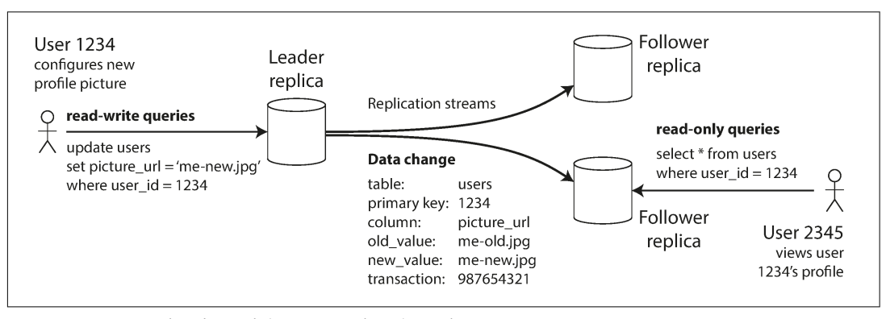

*شکل ۵-۱ — write کاربر به leader می‌رود؛ leader change را به followerها می‌فرستد و read می‌تواند از replica مناسب انجام شود.*

این قابلیت در `PostgreSQL`، `MySQL`، `Oracle Data Guard`، `SQL Server AlwaysOn`، `MongoDB`، `RethinkDB` و `Espresso` دیده می‌شود. message brokerهایی مانند `Kafka` و queueهای highly available در `RabbitMQ` نیز از الگوی مشابهی استفاده می‌کنند.

## &rlm;`Synchronous` در برابر `Asynchronous replication`

فرض کنید کاربر عکس پروفایل خود را update می‌کند. request به leader می‌رسد و leader change را برای followerها می‌فرستد. اگر follower ۱ synchronous باشد، leader صبر می‌کند تا follower دریافت write را تأیید کند؛ بعد success را به user اعلام و write را برای clientهای دیگر visible می‌کند. اگر follower ۲ asynchronous باشد، leader پیام را می‌فرستد ولی منتظر response نمی‌ماند.

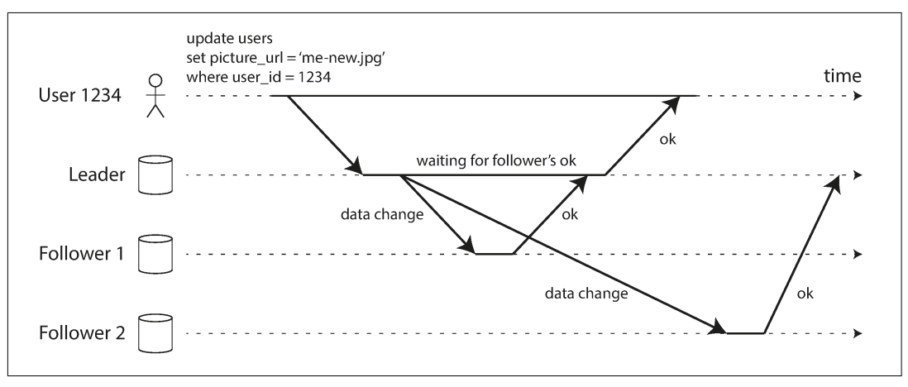

*شکل ۵-۲ — leader برای follower synchronous منتظر confirmation می‌ماند، اما ارسال به follower asynchronous در پس‌زمینه ادامه پیدا می‌کند.*

در حالت عادی followerها در کمتر از یک ثانیه عقب‌ماندگی را جبران می‌کنند، اما guarantee زمانی وجود ندارد. recovery بعد از failure، فشار نزدیک ظرفیت یا مشکل network می‌تواند replica را چند دقیقه عقب بیندازد.

مزیت synchronous replication این است که دست‌کم یک follower copy جدید و سازگار دارد؛ اگر leader ناگهان از کار بیفتد، داده در آن follower هست. عیب آن این است که اگر follower synchronous پاسخ ندهد—به‌دلیل crash یا network fault—leader مجبور است write را متوقف کند.

همهٔ followerها را synchronous کردن معمولاً عملی نیست؛ خرابی هر node کل write path را متوقف می‌کند. configuration رایج این است که یک follower synchronous و بقیه asynchronous باشند. اگر آن follower کند یا unavailable شود، یکی از asynchronousها جای آن را می‌گیرد. چون leader و دست‌کم یک follower جدیدترین داده را دارند، این حالت `semi-synchronous` هم نامیده می‌شود.

گاهی همهٔ replication کاملاً asynchronous است. اگر leader غیرقابل‌بازگشت crash کند، writeهایی که هنوز به follower نرسیده‌اند از دست می‌روند؛ حتی اگر leader success را به client داده باشد. بااین‌حال asynchronous replication وقتی followerها زیاد یا در datacenterهای دور هستند محبوب است، چون leader می‌تواند حتی در صورت عقب‌افتادن همهٔ followerها write را ادامه دهد.

پژوهش‌هایی مانند `chain replication` تلاش کرده‌اند durability قوی را با performance و availability خوب ترکیب کنند. رابطهٔ consistency و `consensus`—به توافق رسیدن چند node روی یک مقدار—در فصل ۹ دقیق‌تر بررسی می‌شود.

## راه‌اندازی follower جدید

گاهی برای افزایش تعداد replica یا جایگزین کردن node خراب، follower جدید می‌سازیم. copy سادهٔ فایل‌های دیسک کافی نیست، چون client هم‌زمان write می‌کند و بخش‌های مختلف file copy مربوط به زمان‌های متفاوت خواهند بود.

فرآیند مفهومی راه‌اندازی follower چنین است:

1. از leader یک `consistent snapshot` در زمان مشخص بگیرید؛ ترجیحاً بدون lock کردن کل database. همین قابلیت برای backup هم لازم است.
2. &rlm;snapshot را به node جدید copy کنید.
3. &rlm;follower به leader وصل شود و همهٔ changeهایی را که بعد از snapshot رخ داده‌اند درخواست کند. snapshot باید با موقعیت دقیق در replication log گره خورده باشد؛ مثلاً `log sequence number` در PostgreSQL یا `binlog coordinates` در MySQL.
4. &rlm;follower backlog را اعمال کند. وقتی به آخر log رسید، می‌گوییم `caught up` شده و از آن به بعد stream جدید را می‌گیرد.

محصول‌ها این کار را گاهی خودکار و گاهی با workflow چندمرحله‌ای administrator انجام می‌دهند.

## خرابی nodeها

&rlm;node ممکن است به‌خاطر fault یا maintenance برنامه‌ریزی‌شده خاموش شود. هدف high availability این است که reboot یا از دست رفتن یک node کل system را متوقف نکند.

### خرابی follower: `catch-up recovery`

&rlm;follower log changeهایی را که از leader گرفته روی دیسک دارد. اگر crash کند یا ارتباط network موقتاً قطع شود، آخرین transaction اعمال‌شده را می‌داند. پس از برگشت، به leader وصل می‌شود، changeهای بعد از آن position را می‌گیرد و اعمال می‌کند. سپس دوباره به stream عادی می‌پیوندد.

### خرابی leader: `failover`

&rlm;failover سخت‌تر است: یک follower باید leader شود، clientها باید به آن route شوند و followerهای دیگر باید stream جدید را از leader جدید بگیرند. failover می‌تواند دستی یا خودکار باشد.

&rlm;failover خودکار معمولاً سه مرحله دارد:

1. **تشخیص خرابی:** crash، قطع برق، network issue و overload شبیه هم دیده می‌شوند. راه مطمئن تشخیص وجود ندارد، پس nodeها پیام ردوبدل می‌کنند و اگر leader مثلاً ۳۰ ثانیه پاسخ ندهد، آن را dead فرض می‌کنند.
2. **انتخاب leader جدید:** ممکن است با election و رأی اکثریت انجام شود یا controller قبلی node را منصوب کند. replicaای که جدیدترین data changeها را دارد معمولاً بهترین candidate است. توافق روی leader جدید یک consensus problem است.
3. &rlm;**reconfigure کردن:** clientها write را به leader جدید می‌فرستند. اگر leader قدیمی برگردد، باید بفهمد دیگر leader نیست؛ وگرنه دو leader خواهیم داشت.

&rlm;failover دام‌های زیادی دارد:

- در asynchronous replication، leader جدید ممکن است آخرین writeهای leader قدیمی را نداشته باشد. معمولاً آن writeها discard می‌شوند و این با انتظار durability client ناسازگار است.
- &rlm;discard کردن write وقتی سیستم دیگری هم به database وابسته است خطرناک‌تر است. اگر primary key خودافزا به‌خاطر عقب‌بودن counter دوباره استفاده شود، مثلاً database و Redis می‌توانند دادهٔ یک user را به user دیگر نشان دهند.
- ممکن است دو node هم‌زمان خودشان را leader بدانند؛ این حالت `split brain` است. اگر هر دو write قبول کنند، داده conflict یا corrupt می‌شود. برخی سیستم‌ها با `fencing` یا `STONITH` یکی را خاموش می‌کنند، اما طراحی بد می‌تواند هر دو را خاموش کند.
- &rlm;timeout کوتاه failover بی‌مورد ایجاد می‌کند؛ timeout بلند recovery را کند می‌کند. load spike یا packet delay می‌تواند با timeout کوتاه اشتباه گرفته شود و failover وضعیت بد را بدتر کند.

به همین دلیل بعضی تیم‌های عملیاتی failover دستی را ترجیح می‌دهند، حتی وقتی software خودکارسازی دارد.

## پیاده‌سازی replication log

### &rlm;<span dir="ltr">statement-based replication</span>

در ساده‌ترین روش leader هر statement را log و برای follower ارسال می‌کند. در relational database، `INSERT`، `UPDATE` و `DELETE` دوباره روی follower parse و اجرا می‌شوند.

این روش در چند حالت می‌شکند:

- تابع nondeterministic مانند `NOW()` یا `RAND()` روی هر replica نتیجهٔ متفاوت می‌دهد.
- &rlm;autoincrement یا شرط‌هایی مانند `UPDATE ... WHERE ...` باید دقیقاً با همان ترتیب اجرا شوند. transactionهای هم‌زمان این کار را دشوار می‌کنند.
- &rlm;trigger، stored procedure یا user-defined function می‌تواند side effect متفاوت ایجاد کند.

می‌توان function nondeterministic را هنگام log کردن با مقدار ثابت جایگزین کرد، اما edge caseها زیادند. MySQL قبل از نسخهٔ 5.1 از این روش استفاده می‌کرد؛ امروز معمولاً برای statement nondeterministic به row-based replication می‌رود. `VoltDB` آن را با الزام transactionهای deterministic امن می‌کند.

### &rlm;<span dir="ltr">`WAL shipping`</span>

در فصل ۳ دیدیم تقریباً هر storage engine یک log دارد. در LSM، log بخش اصلی storage است؛ در B-tree، هر modification قبل از pageها در `WAL` ثبت می‌شود. همان دنبالهٔ byte را می‌توان علاوه بر دیسک، از leader به follower فرستاد.

&rlm;follower با پردازش WAL دقیقاً همان data structureهای leader را می‌سازد. مزیت این روش سادگی و performance است؛ عیب آن وابستگی شدید به internals storage engine است. WAL ممکن است مشخص کند کدام byte در کدام disk block تغییر کرده است. اگر format داخلی database عوض شود، leader و follower اغلب نمی‌توانند versionهای متفاوت software باشند.

این موضوع operationally مهم است: اگر follower بتواند version جدیدتر داشته باشد، ابتدا followerها را upgrade و بعد با failover یکی را leader می‌کنیم و zero-downtime upgrade داریم. WAL shipping اغلب چنین mismatchای را اجازه نمی‌دهد.

### &rlm;`Logical` یا `row-based log replication`

روش دیگر این است که replication log از format داخلی storage جدا باشد. در relational database، logical log معمولاً sequenceای از changeهای row-level است:

- برای insert، مقدار همهٔ columnهای جدید
- برای delete، اطلاعاتی که row را unique مشخص کند، معمولاً primary key
- برای update، شناسهٔ row و مقدار columnهای جدید یا تغییرکرده

&rlm;transactionی که چند row را عوض می‌کند چند log record و در پایان record `commit` تولید می‌کند. MySQL binlog در حالت row-based چنین کاری می‌کند.

چون logical log به storage engine وابسته نیست، می‌تواند backward-compatible بماند و leader و follower versionهای متفاوت یا حتی storage engineهای مختلف داشته باشند. برنامه‌های بیرونی هم راحت‌تر آن را parse می‌کنند؛ برای فرستادن data به warehouse، ساخت index یا cache سفارشی، این روش `change data capture` یا `CDC` نام دارد.

### &rlm;<span dir="ltr">trigger-based replication</span>

گاهی replication باید فقط subset داده را منتقل کند، از database دیگری استفاده کند یا conflict resolution سفارشی داشته باشد. در این صورت replication را به application layer می‌بریم.

&rlm;`trigger` code سفارشی‌ای است که هنگام write transaction اجرا می‌شود. trigger تغییر را در table جدا log می‌کند. process بیرونی log را می‌خواند، منطق لازم را اجرا و change را به system دیگر replicate می‌کند. `Databus for Oracle` و `Bucardo for Postgres` نمونه‌هایی از این روش‌اند.

&rlm;trigger-based replication معمولاً overhead و bug بیشتری از replication داخلی دارد، اما انعطافش ارزشمند است.

## مشکل‌های `Replication lag`

&rlm;replication فقط برای تحمل failure نیست؛ read scalability و کاهش latency هم مهم‌اند. در leader-based replication همهٔ writeها از یک node می‌گذرند، اما read را می‌توان بین followerها پخش کرد. برای workloadهای عمدتاً read، با افزودن follower ظرفیت read بالا می‌رود.

این معماری عملاً asynchronous است. اگر همهٔ followerها synchronous باشند، خرابی یک node یا network outage کل write path را متوقف می‌کند؛ هرچه follower بیشتر باشد احتمال خرابی یکی بیشتر است.

در asynchronous follower ممکن است data قدیمی ببینیم. اگر query یکسان را هم‌زمان روی leader و follower اجرا کنیم نتیجه‌ها متفاوت می‌شوند. اگر write متوقف شود و زمان کافی بدهیم، followerها catch up می‌کنند؛ این حالت `eventual consistency` نام دارد. «eventually» حد مشخصی ندارد؛ در بار عادی lag کسری از ثانیه است، اما ممکن است به دقیقه برسد.

### &rlm;`Read-after-write` یا `read-your-writes`

کاربر معمولاً داده‌ای را submit می‌کند و بلافاصله همان را می‌بیند. write به leader می‌رود، اما read ممکن است از follower عقب‌افتاده انجام شود و به نظر برسد داده گم شده است.

&rlm;`read-after-write consistency` تضمین می‌کند user همیشه updateهای خودش را بعد از reload ببیند؛ دربارهٔ updateهای دیگران چیزی تضمین نمی‌کند.

راه‌های پیاده‌سازی:

- داده‌ای را که user احتمالاً تغییر داده از leader بخوانید و بقیه را از follower. مثلاً profile خود user از leader و profile دیگران از follower.
- بعد از آخرین update تا مدت مشخصی—مثلاً یک دقیقه—read را به leader بفرستید، یا followerهایی را که بیش از یک دقیقه lag دارند کنار بگذارید.
- &rlm;client timestamp یا logical position آخرین write خود را نگه دارد. سیستم فقط replicaای را انتخاب کند که دست‌کم تا آن position catch up شده؛ وگرنه از replica دیگر بخواند یا صبر کند. اگر timestamp ساعت واقعی باشد، clock synchronization اهمیت پیدا می‌کند.
- اگر leader در datacenter دیگری است، requestهایی که نیازمند leader هستند باید به همان datacenter route شوند.

اگر user با چند device کار کند، metadata آخرین write باید مرکزی باشد و route شدن deviceها به datacenterهای متفاوت هم در نظر گرفته شود.

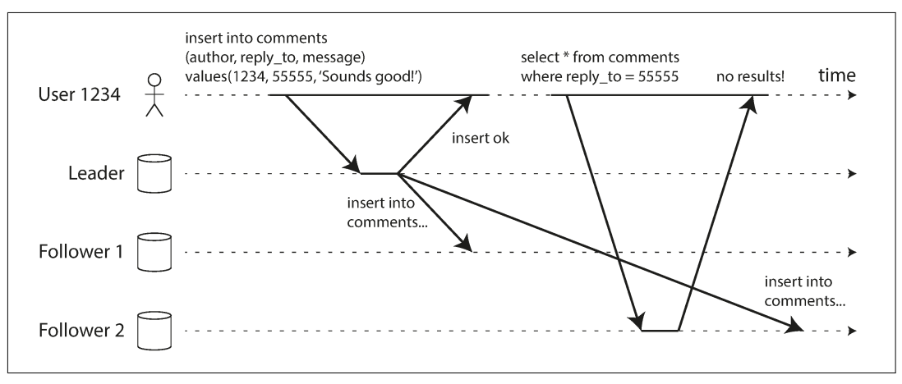

*شکل ۵-۳ — اگر read بعد از insert از follower عقب‌افتاده انجام شود، کاربر نتیجه‌ای نمی‌بیند که خودش تازه ثبت کرده است.*

### &rlm;<span dir="ltr">`Monotonic reads`</span>

کاربر ممکن است یک بار از follower تازه نتیجه بگیرد و بار دوم، به‌دلیل route تصادفی، از follower عقب‌افتاده همان query را بزند؛ نتیجهٔ دوم قدیمی‌تر است و داده‌ای که دیده بود ناپدید می‌شود.

&rlm;`monotonic reads` می‌گوید یک user در readهای پشت‌سرهم نباید به گذشته برگردد. این از strong consistency ضعیف‌تر، اما از eventual consistency قوی‌تر است. راه ساده، route کردن هر user به همان replica است؛ مثلاً hash کردن user ID. اگر آن replica خراب شد، باید انتقال به replica دیگر با توجه به position انجام شود.

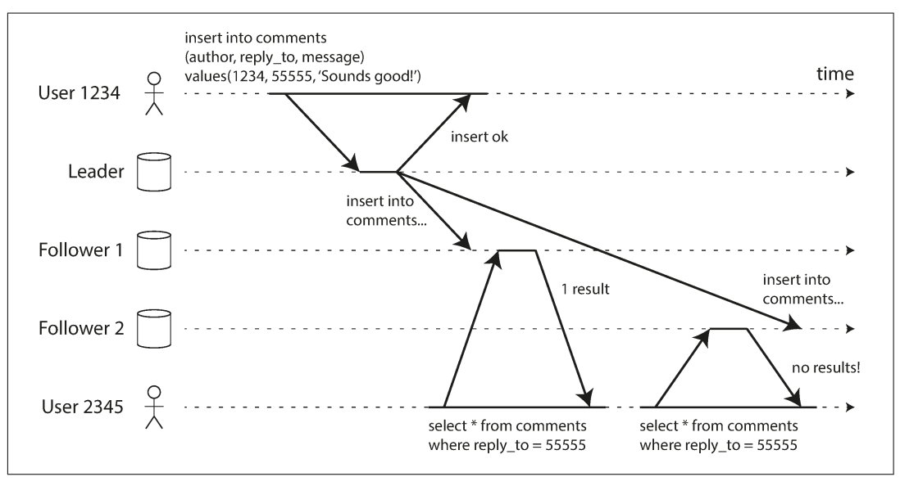

*شکل ۵-۴ — برای user زمان ظاهراً به عقب برمی‌گردد: comment را می‌بیند و بعد همان comment ناپدید می‌شود.*

### &rlm;<span dir="ltr">`Consistent prefix reads`</span>

اگر writeها رابطهٔ علّی داشته باشند، reader باید آن‌ها را در همان ترتیب ببیند. مثلاً پاسخ Mrs. Cake به پرسش Mr. Poons وابسته است؛ نباید observer پاسخ را قبل از پرسش ببیند.

&rlm;`consistent prefix reads` تضمین می‌کند اگر writeها در یک ترتیب رخ داده باشند، خواننده همان prefix مرتب را ببیند. این مشکل در database partitioned بیشتر دیده می‌شود، چون partitionها مستقل‌اند و global ordering ندارند. راه‌حل می‌تواند قرار دادن writeهای علّی در یک partition یا track کردن explicit dependencyها باشد.

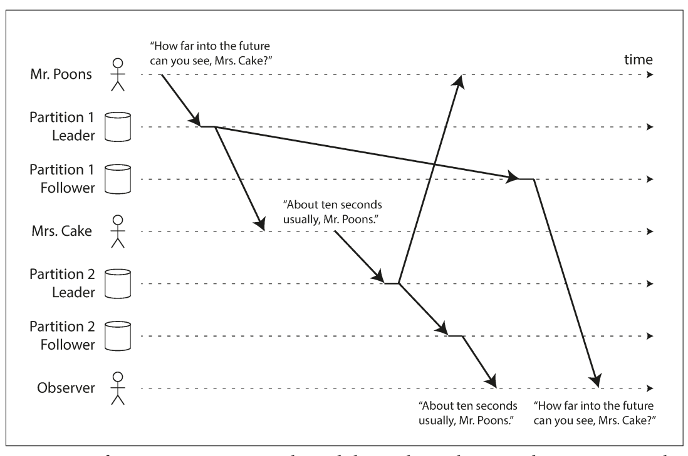

*شکل ۵-۵ — اگر پیام پاسخ زودتر از پیام پرسش به observer برسد، رابطهٔ causality شکسته به نظر می‌رسد.*

### دربارهٔ lag چه کنیم؟

باید application را با lag چند دقیقه یا حتی چند ساعت آزمایش کرد. اگر نتیجه مشکلی ندارد، eventual consistency مناسب است. اگر تجربهٔ بدی برای user می‌سازد، guarantee قوی‌تری مثل read-after-write لازم است.

&rlm;application می‌تواند بعضی readها را به leader بفرستد، اما پیاده‌سازی این منطق در همهٔ مسیرها پیچیده و مستعد bug است. transactionها برای همین وجود دارند: database guarantee قوی‌تری می‌دهد تا application ساده‌تر شود. distributed databaseها گاهی transaction را به‌خاطر performance و availability کنار می‌گذارند، اما این نتیجه که scalability حتماً eventual consistency می‌خواهد بیش از حد ساده‌سازی است.

## &rlm;<span dir="ltr">`Multi-leader replication`</span>

در single-leader اگر به leader دسترسی نداشته باشیم، write ممکن نیست. extension طبیعی این است که چند node write بپذیرند. هر node علاوه بر leader بودن برای clientهای خودش، follower leaderهای دیگر است؛ این را `multi-leader`، `master–master` یا `active/active replication` می‌نامیم.

### &rlm;<span dir="ltr">multi-datacenter</span>

اگر database در چند datacenter باشد، single leader همهٔ writeها را به یک datacenter می‌کشاند. در multi-leader هر datacenter leader خودش را دارد؛ داخل هر datacenter replication معمولی و میان datacenterها replication میان leaderها انجام می‌شود.

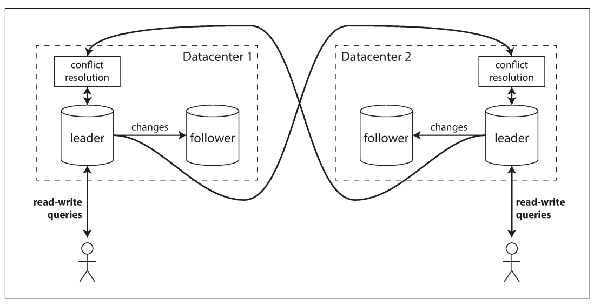

*شکل ۵-۶ — هر datacenter leader محلی دارد، follower محلی از آن می‌گیرد و changeها میان leaderهای دور با conflict resolution ردوبدل می‌شوند.*

مقایسه:

- &rlm;**performance:** write در datacenter محلی انجام می‌شود و latency بین datacenterها از user پنهان می‌ماند.
- **خرابی datacenter:** هر datacenter می‌تواند موقتاً مستقل کار کند و پس از برگشت، changeها sync شوند.
- &rlm;**network problem:** قطع موقت link بین datacenterها write محلی را متوقف نمی‌کند.

عیب اصلی conflict است: یک record ممکن است هم‌زمان در دو datacenter تغییر کند. ابزارهایی مانند `Tungsten Replicator`، `BDR` و `GoldenGate` این روش را فراهم می‌کنند، اما autoincrement key، trigger و integrity constraint می‌تواند رفتار غافلگیرکننده داشته باشد. در نتیجه multi-leader معمولاً territory خطرناکی است و فقط وقتی مزیتش لازم است باید استفاده شود.

### &rlm;clientهای offline

&rlm;calendar app روی mobile، laptop و deviceهای دیگر باید هنگام قطع اینترنت هم read و write کند و بعداً تغییرها را sync کند. هر device database محلی خود را به‌عنوان leader دارد و replication asynchronous میان deviceها انجام می‌شود؛ lag ممکن است ساعت یا روز باشد.

از نظر معماری، هر device یک datacenter با network بسیار ناپایدار است. history طولانی sync خراب‌شده نشان می‌دهد این کار دشوار است. `CouchDB` از جمله ابزارهایی است که برای چنین modeای طراحی شده است.

### &rlm;<span dir="ltr">collaborative editing</span>

در Etherpad یا Google Docs چند user یک document را هم‌زمان edit می‌کنند. تغییر ابتدا روی replica محلی browser اعمال و بعد asynchronous به server و userهای دیگر ارسال می‌شود.

اگر conflict مطلقاً نباید رخ دهد، باید پیش از edit lock بگیریم؛ این عملاً single leader با transaction است. برای collaboration سریع‌تر می‌توان unit change را کوچک، مثلاً یک keystroke، و lock را حذف کرد؛ آن‌وقت مشکل‌های multi-leader و conflict resolution وارد می‌شوند.

## &rlm;<span dir="ltr">`Write conflict`</span>

فرض کنید دو user هم‌زمان عنوان wiki را از A به B و از A به C تغییر دهند. هر دو write روی leader محلی موفق‌اند، اما وقتی changeها replicate شوند conflict آشکار می‌شود.

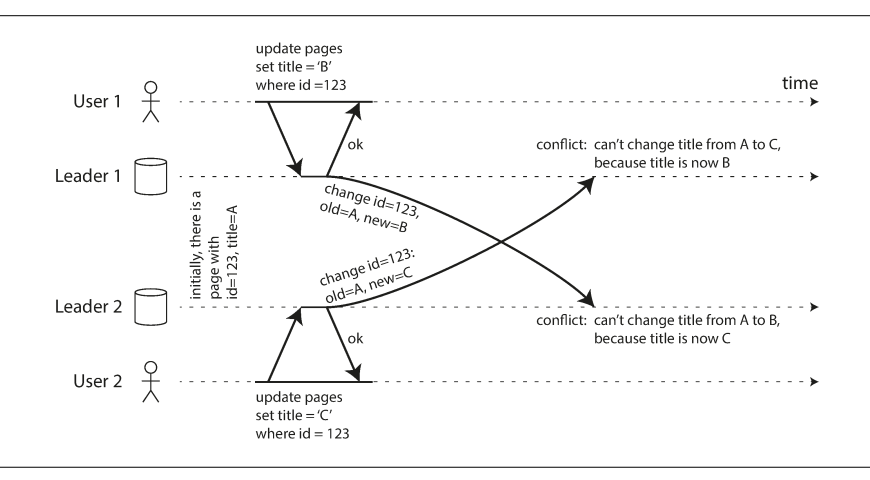

*شکل ۵-۷ — هر leader از دید خودش write معتبر است، اما پس از sync، نمی‌توان هر دو عنوان متفاوت را بدون rule نگه داشت.*

در single-leader writer دوم block یا abort می‌شود. در multi-leader conflict بعداً کشف می‌شود و شاید دیگر user در دسترس نباشد.

### تشخیص synchronous یا asynchronous

می‌توان detection را synchronous کرد و تا replicate شدن write به همهٔ replicaها success نداد؛ اما در این صورت مزیت multi-leader—پذیرش مستقل write—از بین می‌رود و بهتر است single-leader استفاده کنیم.

### جلوگیری از conflict

بهترین strategy اغلب avoid کردن conflict است. اگر همهٔ writeهای یک record به همان leader بروند، conflict رخ نمی‌دهد. مثلاً دادهٔ هر user به datacenter home خودش route شود. اگر datacenter fail کند یا user جابه‌جا شود، designated leader تغییر می‌کند و دوباره احتمال concurrent write پدید می‌آید.

### رسیدن replicaها به state یکسان

&rlm;single leader ترتیب writeها را مشخص می‌کند و آخرین write مقدار نهایی است. در multi-leader ترتیب global وجود ندارد: leader ۱ ممکن است B سپس C ببیند و leader ۲ C سپس B. اگر هرکدام local order را نهایی بداند، replicaها متفاوت می‌مانند.

راه‌های convergent conflict resolution:

- برای هر write ID بدهیم و بالاترین ID را برنده کنیم. با timestamp به آن `last write wins` یا `LWW` می‌گوییم؛ ساده و خطرناک است و می‌تواند داده را دور بیندازد.
- &rlm;replica ID بالاتر را همیشه برنده کنیم؛ این هم data loss دارد.
- مقدارها را merge کنیم؛ مثلاً alphabetically مرتب و با `/` ترکیب کنیم.
- &rlm;conflict را در data structure صریح نگه داریم تا application یا user بعداً آن را حل کند.

### &rlm;conflict handler سفارشی

منطق resolution بسته به application است و ممکن است در write یا read اجرا شود:

- &rlm;**on write:** به‌محض کشف conflict، background handler صدا زده می‌شود. سریع اجرا می‌شود و نمی‌تواند از user سؤال کند.
- &rlm;**on read:** همهٔ versionهای conflict نگه داشته می‌شوند و هنگام read به application داده می‌شوند. application می‌تواند user را درگیر کند یا خودکار merge کند.

&rlm;resolution معمولاً در سطح یک row یا document است، نه کل transaction. اگر transaction چند write اتمیک داشته باشد، هر write برای conflict جداگانه بررسی می‌شود.

### &rlm;<span dir="ltr">automatic conflict resolution</span>

&rlm;rule سفارشی زود پیچیده و خطاپذیر می‌شود. ممکن است cart منطق «افزودن کالا را نگه می‌دارد، حذف را نه» داشته باشد و کالای حذف‌شده دوباره ظاهر شود.

پژوهش‌های مهم:

- &rlm;`CRDT`ها برای set، map، ordered list و counter طوری طراحی می‌شوند که چند user هم‌زمان تغییر دهند و merge sensible انجام شود.
- &rlm;`mergeable persistent data structure` history را مانند Git نگه می‌دارد و از three-way merge استفاده می‌کند.
- &rlm;`operational transformation` در collaborative editing متن استفاده می‌شود و برای list مرتب characterها مناسب است.

&rlm;conflict فقط تغییر هم‌زمان یک field نیست. در booking اتاق، دو reservation هم‌زمان برای یک اتاق conflict‌اند، حتی اگر هر دو client پیش از ثبت availability را درست دیده باشند.

### &rlm;topologyهای multi-leader

&rlm;`replication topology` مسیر انتقال write میان nodeهاست:

- &rlm;**circular:** هر node از یک node می‌گیرد و به node بعدی می‌فرستد.
- &rlm;**star:** root change را به بقیه می‌فرستد؛ می‌تواند به tree تعمیم پیدا کند.
- &rlm;**all-to-all:** هر leader به همهٔ leaderهای دیگر می‌فرستد.

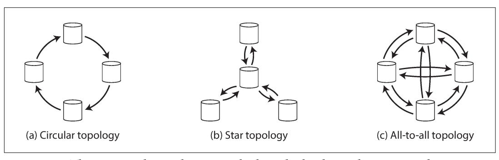

در circular و star یک write ممکن است از چند node عبور کند، پس nodeها باید change دریافتی را forward کنند. برای جلوگیری از loop، هر node ID دارد و write با ID nodeهای طی‌شده tag می‌شود؛ اگر node خودش را دید، change را دوباره اعمال نمی‌کند.

&rlm;topology محدود با خرابی یک node ممکن است مسیر کل replication را قطع کند. all-to-all مسیر جایگزین بیشتری دارد، اما linkها سرعت یکسان ندارند و messageها ممکن است از یکدیگر جلو بزنند.

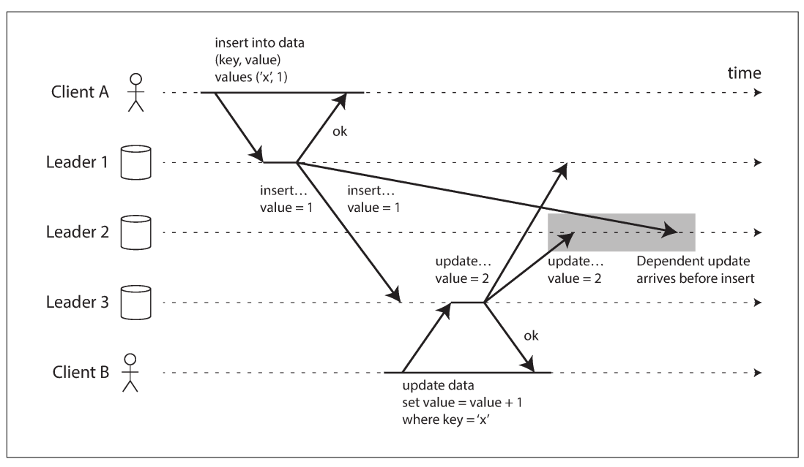

مثلاً client A row را insert می‌کند و client B همان row را update؛ leader دیگری ممکن است update را قبل از insert بگیرد. timestamp به‌تنهایی کافی نیست، چون clockها دقیق sync نیستند. `version vector` برای حفظ causality مناسب‌تر است، اما همهٔ پیاده‌سازی‌ها conflict و causal ordering را درست ارائه نمی‌کنند؛ documentation و test ضروری است.

## &rlm;<span dir="ltr">`Leaderless replication`</span>

در single و multi-leader، leader ترتیب write را تعیین می‌کند. در `leaderless replication` هر replica می‌تواند مستقیماً write بگیرد و هیچ coordinatorی ترتیب خاصی را enforce نمی‌کند. `Dynamo-style` نام رایج این خانواده است؛ `Riak`، `Cassandra` و `Voldemort` از نمونه‌های آن هستند.

&rlm;client ممکن است write را مستقیماً به چند replica بفرستد یا از coordinator کمک بگیرد. اما coordinator مانند leader ترتیب global نمی‌سازد.

### &rlm;write وقتی یک node down است

فرض کنید سه replica داریم و یکی reboot است. client write را هم‌زمان به هر سه می‌فرستد؛ دو replica جواب ok می‌دهند و کافی است `w = 2` باشد. بعد از برگشت node سوم، ممکن است read از آن value قدیمی بدهد.

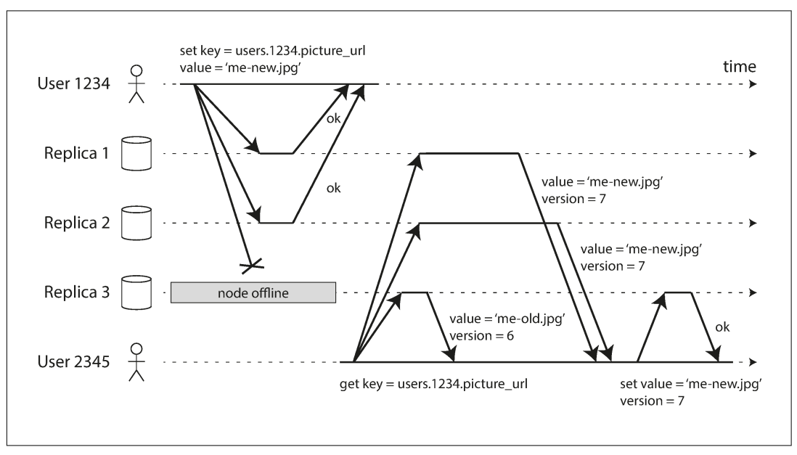

برای read نیز request را به چند node می‌فرستیم. اگر یک replica version ۶ و دو replica version ۷ بدهند، client version جدید را می‌فهمد و می‌تواند آن را به replica stale برگرداند. این `read repair` است.

### &rlm;`Read repair` و `anti-entropy`

- &rlm;**read repair:** هنگام read چند node، response stale تشخیص داده و نسخهٔ جدید به آن node write می‌شود. برای valueهای پرتکرار خوب است.
- &rlm;**anti-entropy:** process پس‌زمینه مرتب تفاوت replicaها را پیدا و data missing را copy می‌کند. ترتیب writeها برای آن مهم نیست و ممکن است با تأخیر انجام شود.

اگر فقط read repair وجود داشته باشد، value کم‌خوانده‌شده ممکن است مدت زیادی در بعضی replicaها قدیمی بماند؛ پس durability عملی پایین‌تر است.

### &rlm;`Quorum` برای read و write

اگر `n` replica داشته باشیم، write باید دست‌کم در `w` node تأیید شود و read دست‌کم از `r` node پاسخ بگیرد. وقتی:

```text
w + r > n
```

مجموعهٔ nodeهای write و read دست‌کم یک عضو مشترک دارد؛ بنابراین انتظار داریم یکی از responseها جدیدترین value را داشته باشد. این‌ها `quorum read` و `quorum write` هستند.

تنظیم رایج `n = 3` و `w = r = 2` است. برای پنج replica می‌توان `w = r = 3` داشت و خرابی دو node را تحمل کرد. اگر write کم و read زیاد باشد، `w = n` و `r = 1` read را سریع می‌کند، اما خرابی یک node تمام writeها را متوقف می‌کند.

در عمل request به همهٔ n replicaها هم‌زمان فرستاده می‌شود، اما فقط تا w یا r پاسخ صبر می‌کنیم. اگر تعداد nodeهای reachable کمتر باشد، operation error می‌دهد.

### محدودیت‌های quorum consistency

شرط `w + r > n` ضمانت مطلق نیست:

- در `sloppy quorum`، w write ممکن است روی nodeهایی خارج از n home node ذخیره شود و با r read overlap نداشته باشد.
- &rlm;writeهای concurrent ترتیب مشخصی ندارند و LWW با timestamp ممکن است به‌خاطر clock skew write را از دست بدهد.
- &rlm;read و write هم‌زمان ممکن است old یا new value را به‌طور نامعین ببینند.
- &rlm;write روی بعضی replica موفق و روی بعضی fail شود؛ اگر مجموعاً به w نرسد rollback نمی‌شود و read بعدی شاید آن value را ببیند.
- اگر node دارای value جدید خراب و از replica قدیمی restore شود، تعداد copyهای جدید کم می‌شود.
- حتی با operation سالم، timing بد در edge caseهای خاص می‌تواند read stale بدهد.

&rlm;Dynamo-style database معمولاً برای eventual consistency بهینه شده است. w و r احتمال stale read را تغییر می‌دهند، اما نباید آن‌ها را guarantee مطلق دانست. read-your-writes، monotonic reads و consistent prefix reads معمولاً transaction یا consensus قوی‌تری می‌خواهند.

### &rlm;<span dir="ltr">monitoring staleness</span>

باید تازگی نتیجه‌ها و سلامت replication را metric کنیم. در leader-based، leader و follower writeها را به ترتیب یکسان اعمال می‌کنند و هرکدام position در log دارند؛ اختلاف position مقدار lag است.

در leaderless ترتیب ثابت وجود ندارد و monitoring سخت‌تر است. اگر anti-entropy هم نباشد، value کم‌خوانده‌شده می‌تواند بسیار قدیمی باشد. اندازه‌گیری سن replica و درصد stale read باید بخشی از metricهای استاندارد باشد؛ eventual نباید کاملاً مبهم بماند.

### &rlm;`Sloppy quorum` و `hinted handoff`

&rlm;quorum معمولی اگر client به nodeهای لازم دسترسی نداشته باشد، error می‌دهد؛ حتی ممکن است nodeها سالم باشند ولی network partition آن‌ها را unreachable کرده باشد. در cluster بزرگ، client شاید به nodeهای دیگری دسترسی داشته باشد.

در `sloppy quorum` write و read همچنان به w و r response نیاز دارند، اما این responseها می‌توانند از nodeهایی خارج از n home node باشند. node موقت مانند همسایه‌ای است که به‌جای خانهٔ خودتان چیزی را نگه می‌دارد. بعد از رفع network problem، data به home node برگردانده می‌شود؛ این مرحله `hinted handoff` است.

&rlm;sloppy quorum availability write را بالا می‌برد، اما حتی با w+r>n هم تا پایان hinted handoff تضمین نمی‌کند read جدیدترین value را ببیند. پس در معنای دقیق، sloppy quorum quorum نیست؛ فقط تضمین می‌کند data در w node somewhere ذخیره شده است.

### &rlm;multi-datacenter در leaderless system

&rlm;leaderless replication برای چند datacenter مناسب است چون concurrent write، interruption و latency spike را تحمل می‌کند. در Cassandra و Voldemort، n شامل nodeهای همهٔ datacenterهاست و client معمولاً فقط برای quorum محلی صبر می‌کند؛ write به datacenter دور asynchronous است. Riak cluster هر datacenter را جدا نگه می‌دارد و cross-datacenter replication را در پس‌زمینه انجام می‌دهد.

## تشخیص `Concurrent writes`

در Dynamo-style چند client می‌توانند هم‌زمان یک key را write کنند. network delay و partial failure باعث می‌شود nodeها messageها را با ترتیب متفاوت بگیرند.

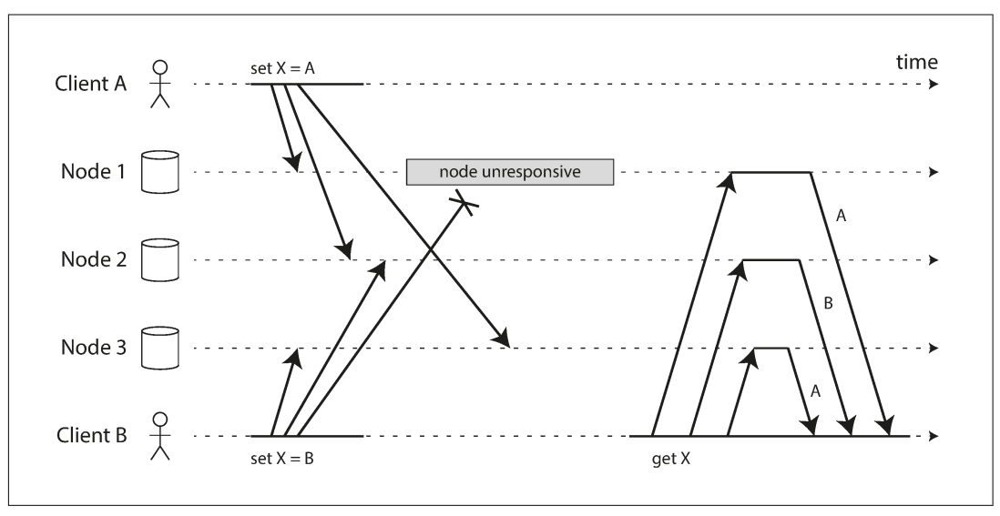

*شکل ۵-۱۲ — یک node فقط write A را می‌بیند، node دیگر A سپس B و node سوم B سپس A را؛ overwrite ساده replicaها را دائماً متفاوت می‌کند.*

### &rlm;<span dir="ltr">`Last write wins`</span>

برای convergence می‌توان هر write را با timestamp یا ID مقایسه کرد و فقط «جدیدترین» را نگه داشت. این الگوریتم `last write wins` یا `LWW` است.

اما writeهای concurrent ذاتاً «اول» و «آخر» ندارند؛ clientها از هم خبر نداشتند. LWW با تحمیل order دلخواه به convergence می‌رسد، ولی writeهای موفق دیگر را بی‌صدا discard می‌کند و حتی ممکن است writeهای غیرconcurrent را به‌خاطر clock skew حذف کند.

&rlm;LWW فقط برای dataهایی مثل cache که loss قابل‌قبول است مناسب است. اگر loss قابل‌قبول نیست، راه امن این است که key فقط یک بار نوشته و بعد immutable شود؛ مثلاً از UUID به‌عنوان key استفاده کنیم.

### رابطهٔ `happens-before`

در یک مثال، insert کلید A قبل از update کلید B رخ داده، چون B مقداری را تغییر می‌دهد که A ساخته است؛ B از A خبر دارد و `causally dependent` است. در مثال دیگر دو client بدون آگاهی از هم write کرده‌اند؛ عملیات concurrent هستند.

تعریف دقیق: operation A `happens-before` B است اگر B از A خبر داشته باشد، به A وابسته باشد یا state حاصل از A را ادامه دهد. دو operation concurrent هستند اگر هیچ‌کدام happens-before دیگری نباشد.

سه حالت ممکن است: A قبل از B، B قبل از A یا A و B concurrent. اگر قبل‌بودن برقرار باشد، عملیات بعدی می‌تواند قبلی را supersede کند؛ اگر concurrent باشند conflict داریم.

این تعریف به «دقیقاً هم‌زمان بودن» وابسته نیست. network کند یا قطع می‌تواند دو operation را با فاصلهٔ زمانی زیاد اما بدون آگاهی از هم اجرا کند. clock و سرعت نور نمی‌تواند جای information flow را بگیرد.

### ثبت dependency با version

مثال shopping cart را در نظر بگیرید. دو client هم‌زمان milk و eggs را اضافه می‌کنند و بعد flour، ham و bacon. server برای هر key version number دارد:

1. &rlm;client ۱ milk را می‌فرستد؛ server version ۱ می‌دهد.
2. &rlm;client ۲ بدون اطلاع از milk، eggs می‌فرستد؛ server آن را concurrent با milk نگه می‌دارد و version ۲ می‌دهد.
3. &rlm;client ۱ با version قبلی ۱، `[milk, flour]` را می‌فرستد. server می‌فهمد این write نسخهٔ ۱ را overwrite می‌کند، اما با eggs concurrent است؛ پس هر دو را نگه می‌دارد و version ۳ می‌دهد.
4. &rlm;client ۲ مقدار `[eggs, milk, ham]` را با version ۲ می‌فرستد. این eggs را supersede می‌کند، ولی با `[milk, flour]` concurrent است؛ دو مقدار باقی می‌ماند.
5. &rlm;client ۱ با merge کردن مقدارهایی که دیده، `[milk, flour, eggs, bacon]` را با version ۳ می‌فرستد. server آن را جای نسخهٔ ۳ می‌گذارد، اما sibling طرف دیگر را نگه می‌دارد.

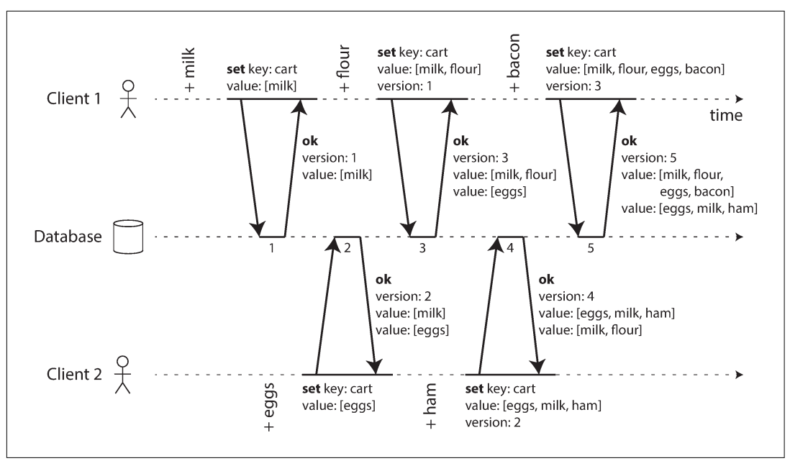

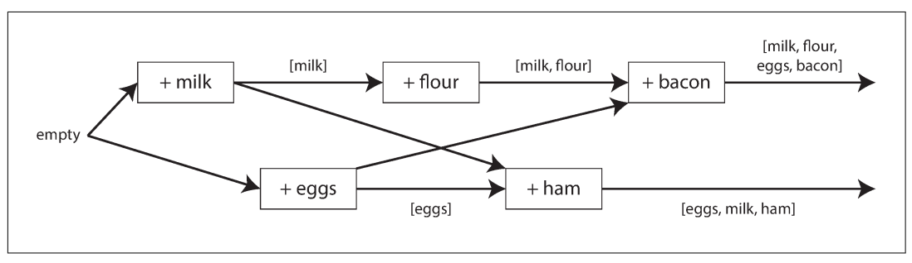

&rlm;server برای تشخیص concurrent بودن لازم نیست value را بفهمد؛ versionها کافی‌اند:

- &rlm;server برای هر key version را نگه می‌دارد و با هر write آن را افزایش می‌دهد.
- &rlm;read همهٔ valueهایی را که هنوز overwrite نشده‌اند و آخرین version را برمی‌گرداند.
- &rlm;client قبل از write باید key را read کرده باشد، version read را همراه write بفرستد و valueهای readشده را merge کند.
- &rlm;server writeهایی با version پایین‌تر یا مساوی را می‌تواند overwrite کند، چون write جدید آن‌ها را دیده و merge کرده است؛ version بالاتر concurrent است و باید باقی بماند.

اگر write بدون version باشد، با همهٔ writeهای دیگر concurrent تلقی می‌شود و چیزی را overwrite نمی‌کند.

### &rlm;merge کردن siblingها

&rlm;valueهای concurrent که هم‌زمان باقی می‌مانند `siblings` نام دارند. client باید آن‌ها را merge کند. برای shopping cart union مناسب است: `[milk, flour, eggs, bacon]` و `[eggs, milk, ham]` به `[milk, flour, eggs, bacon, ham]` تبدیل می‌شوند.

اما اگر cart اجازهٔ remove هم داشته باشد، union ممکن است کالای حذف‌شده را برگرداند. بنابراین delete باید با marker و version مشخص شود؛ این marker `tombstone` نام دارد. `CRDT`ها می‌توانند merge و delete را خودکارتر و ایمن‌تر انجام دهند.

### &rlm;<span dir="ltr">`Version vector`</span>

در چند replica، یک version number کافی نیست. هر replica باید version خودش و versionهایی را که از replicaهای دیگر دیده نگه دارد. مجموعهٔ این عددها برای همهٔ replicaها `version vector` است.

&rlm;version vector همراه value هنگام read به client برمی‌گردد و هنگام write دوباره به database داده می‌شود. با آن می‌توان تشخیص داد write جدید overwrite است یا concurrent. برخی آن را `vector clock` می‌نامند، اما در کاربرد دقیق برای مقایسهٔ state replicaها version vector اصطلاح مناسب‌تری است. `dotted version vector` گونه‌ای از این ایده است.

## جمع‌بندی فصل

&rlm;Replication برای چند هدف به‌کار می‌رود:

- &rlm;**high availability:** ادامهٔ کار هنگام خرابی machine یا datacenter
- &rlm;**disconnected operation:** ادامهٔ کار هنگام قطع network
- &rlm;**latency:** نزدیک کردن data به user
- &rlm;**scalability:** پاسخ به readهای بیشتر با چند replica

هدف ظاهراً ساده است—داشتن copy یکسان روی چند machine—اما replication به concurrency، node unavailable، network interruption، data loss و faultهای پنهان حساس است.

سه رویکرد اصلی:

1. &rlm;**single-leader:** همهٔ writeها به leader؛ leader change stream را برای followerها می‌فرستد؛ read از هر replica ممکن است stale باشد.
2. &rlm;**multi-leader:** چند node write می‌پذیرند و changeها را بین هم و followerها پخش می‌کنند؛ conflict resolution لازم است.
3. &rlm;**leaderless:** write به چند node و read از چند node؛ quorum، read repair و merge برای کشف و اصلاح stale data به‌کار می‌رود.

&rlm;single-leader ساده‌تر است، اما به leader وابسته است. multi-leader و leaderless خرابی node، interruption و latency spike را بهتر تحمل می‌کنند، اما reasoning سخت‌تر و consistency معمولاً ضعیف‌تر است.

&rlm;synchronous و asynchronous بودن replication رفتار failure را عوض می‌کند. asynchronous سریع و scalable است، اما lag و فقدان writeهای تأییدشده در failover را باید پذیرفت.

سه guarantee مفید برای lag:

- &rlm;`read-after-write`: user updateهای خودش را ببیند.
- &rlm;`monotonic reads`: user بعد از دیدن state جدید به state قدیمی برنگردد.
- &rlm;`consistent prefix reads`: eventهای علّی را به ترتیب منطقی ببیند.

در پایان دیدیم multi-leader و leaderless به concurrent write و conflict می‌رسند. با `happens-before`، version number و version vector می‌توان dependency را تشخیص داد؛ سپس application، CRDT یا الگوریتم merge باید conflict را حل کند.

## تعریف مستقل اصطلاحات

### &rlm;<span dir="ltr">`replication`</span>

نگه‌داشتن چند copy از یک dataset روی nodeهای مختلف. replication برای availability، read scalability، latency و گاهی offline operation است.

### &rlm;`leader` و `follower`

در leader-based replication، leader write را می‌پذیرد و change را در log به followerها می‌فرستد. follower معمولاً read-only از دید client است.

### &rlm;<span dir="ltr">`synchronous replication`</span>

&rlm;leader تا تأیید replica مشخصی برای write صبر می‌کند. durability و consistency قوی‌تر، اما latency و حساسیت به failure بیشتر است.

### &rlm;<span dir="ltr">`asynchronous replication`</span>

&rlm;leader بدون انتظار برای follower success می‌دهد. write throughput و availability بهتر است، اما replication lag و data loss در failover ممکن است.

### &rlm;<span dir="ltr">`replication lag`</span>

فاصلهٔ زمانی یا log position بین leader و replica. lag زیاد می‌تواند stale read و نقض read-your-writes ایجاد کند.

### &rlm;<span dir="ltr">`eventual consistency`</span>

اگر write متوقف شود و repair ادامه یابد، replicaها سرانجام به state مشترک می‌رسند؛ اما زمان «سرانجام» الزاماً bound مشخصی ندارد.

### &rlm;<span dir="ltr">`read-after-write consistency`</span>

کاربر پس از نوشتن، update خودش را در readهای بعدی می‌بیند.

### &rlm;<span dir="ltr">`monotonic reads`</span>

&rlm;readهای متوالی یک user به state قدیمی‌تر از state قبلی برنمی‌گردند.

### &rlm;<span dir="ltr">`consistent prefix reads`</span>

اگر writeها رابطهٔ علّی و ترتیب مشخص داشته باشند، reader آن‌ها را در همان ترتیب می‌بیند.

### &rlm;`failover` و `split brain`

&rlm;`failover` انتقال نقش leader به node دیگر است. `split brain` حالتی است که دو node هم‌زمان خود را leader می‌دانند و هر دو write می‌پذیرند.

### &rlm;<span dir="ltr">`multi-leader`</span>

چند replica هم‌زمان write می‌پذیرند و changeها را asynchronous یا synchronous بین خود replicate می‌کنند. conflict resolution جزء ضروری آن است.

### &rlm;<span dir="ltr">`leaderless`</span>

هیچ replica نقش leader انحصاری ندارد؛ client write و read را به چند node می‌فرستد و با quorum و versionها state را بررسی می‌کند.

### &rlm;<span dir="ltr">`quorum`</span>

تعداد حداقلی پاسخ‌های موفق برای معتبر دانستن read یا write. با `n` replica، اگر `w + r > n` باشد، مجموعهٔ write و read دست‌کم یک عضو مشترک دارد.

### &rlm;`read repair` و `anti-entropy`

&rlm;`read repair` هنگام read value stale را اصلاح می‌کند. `anti-entropy` process پس‌زمینه‌ای است که تفاوت replicaها را مستقل از read پیدا و repair می‌کند.

### &rlm;`sloppy quorum` و `hinted handoff`

در sloppy quorum، nodeهای موقت خارج از home replicaها write را می‌پذیرند. پس از رفع مشکل، `hinted handoff` داده را به home node برمی‌گرداند.

### &rlm;<span dir="ltr">`conflict resolution`</span>

قواعدی برای رسیدن چند replica به state مشترک پس از concurrent write؛ می‌تواند LWW، merge، handler سفارشی یا CRDT باشد.

### &rlm;<span dir="ltr">`happens-before`</span>

رابطه‌ای که می‌گوید operation B از A خبر دارد یا بر state حاصل از A بنا شده است. اگر هیچ‌کدام از دو operation از دیگری خبر نداشته باشند، concurrent هستند.

### &rlm;<span dir="ltr">`version vector`</span>

مجموعه‌ای از version numberها، معمولاً یکی برای هر replica، که dependency و concurrent بودن writeها را نشان می‌دهد.

## ارتباط با فصل‌های دیگر

- [فصل ۳: `Storage` و `Retrieval`](../03-storage-retrieval/README.md) — log، WAL و storage engineهایی که replication از آن‌ها استفاده می‌کند.
- [فصل ۴: `Encoding` و `Evolution`](../04-encoding-evolution/README.md) — compatibility داده در replication log و rolling upgrade.
- [فصل ۶: `Partitioning`](../06-partitioning/README.md) — ترکیب replication با تقسیم dataset.
- [فصل ۷: `Transactions`](../07-transactions/README.md) — transaction، isolation و multi-object write.
- [فصل ۸: `Distributed Systems`](../08-distributed-systems/README.md) — network fault، timeout و failure detection.
- [فصل ۹: `Consistency` و `Consensus`](../09-consistency-consensus/README.md) — consensus، linearizability و guaranteeهای قوی‌تر.
- [فصل ۱۱: `Stream Processing`](../11-stream-processing/README.md) — CDC، log و event stream.
