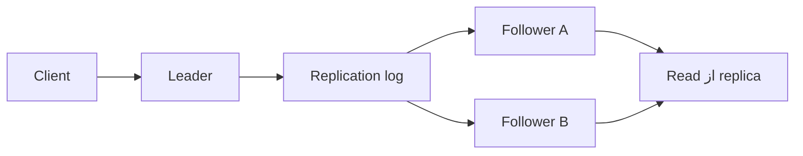

# فصل ۵: `Replication`

## Replication

`Replication` یعنی نگه‌داری چند copy از data روی چند node. هدف می‌تواند availability بیشتر، نزدیک‌کردن data به کاربر، افزایش read capacity یا تحمل fault باشد؛ اما هر copy اضافی، مسئلهٔ هماهنگی و conflict را هم وارد می‌کند.

## هدف فصل

فصل سه خانوادهٔ اصلی `Replication` را مقایسه می‌کند: `leader-follower`، `multi-leader` و `leaderless`. همچنین نشان می‌دهد `replication lag` چگونه باعث می‌شود دو خواننده در زمان کوتاه پاسخ‌های متفاوت ببینند.

## نقشهٔ مطالب

- `leader` و `follower`، `synchronous` و `asynchronous replication`
- ساخت follower، خرابی گره و پیاده‌سازی replication log
- read-your-writes، monotonic reads و consistent prefix
- multi-leader و conflict
- leaderless replication، quorum و تشخیص نوشتن هم‌زمان

## خلاصهٔ زمینه‌محور

### `Leader` و `Follower`

در الگوی `leader-follower`، نوشتن ابتدا به leader می‌رسد و تغییر از راه log به followerها منتقل می‌شود. خواندن می‌تواند از follower انجام شود و ظرفیت read افزایش یابد. در `synchronous replication`، leader تا دریافت تأیید follower صبر می‌کند؛ در `asynchronous replication`، پاسخ سریع‌تر است اما ممکن است follower عقب باشد یا آخرین write را از دست بدهد.

هیچ انتخابی همیشه بهتر نیست. اگر همهٔ followerها synchronous باشند، خرابی یا کندی یک گره می‌تواند نوشتن را متوقف کند. اگر همه asynchronous باشند، تأیید write به معنی ماندگاری آن روی چند گره نیست. بسیاری از سامانه‌ها یک follower را برای تأیید نزدیک نگه می‌دارند و بقیه را asynchronous replicate می‌کنند.

ساخت follower جدید نباید با کپی‌ای انجام شود که تغییرهای هم‌زمان را نادیده می‌گیرد. روش معمول، گرفتن snapshot سازگار، ثبت موقعیت log و سپس catch-upکردن از همان نقطه است. در failover باید انتخاب leader جدید، تشخیص عقب‌ماندگی و جلوگیری از دو leader هم‌زمان (split brain) روشن باشد.

### replication log

تغییرها می‌توانند به‌شکل statement، row change یا log منطقی منتقل شوند. statement ساده به نظر می‌رسد، اما nondeterminism، زمان و trigger می‌تواند اجرای یکسانی ایجاد نکند. log سطح پایین دقیق‌تر است، ولی به نسخه و storage engine وابستگی دارد. logical log تعادلی برای streamکردن تغییرهای معنادارتر فراهم می‌کند.

### `Replication lag` و read guarantees

در asynchronous replication، خواننده‌ای که به follower وصل می‌شود ممکن است write تازهٔ خودش را نبیند. **read-your-writes** برای جلوگیری از این تجربه به session یا مسیر خواندن از leader نیاز دارد. **monotonic reads** می‌گوید یک کاربر نباید نسخهٔ جدیدتر را ببیند و بعد به نسخهٔ قدیمی برگردد. **consistent prefix reads** از دیدن اثرات علت و معلول در ترتیب نادرست جلوگیری می‌کند.

راه‌حل‌ها شامل sticky session، انتخاب follower بر اساس موقعیت log، نگه‌داشتن حداقل timestamp خوانده‌شده و read از leader است. هر راه‌حل هزینهٔ routing، state session یا latency دارد.

### `Multi-leader`

در multi-leader، چند مرکز داده یا چند دستگاه می‌توانند write بپذیرند. این مدل برای multi-region، کار آفلاین و همکاری چند کاربر جذاب است، اما ترتیب متفاوت writeها به conflict می‌انجامد. conflict ممکن است در زمان نوشتن یا پس از همگام‌سازی کشف شود. آخرین write بر اساس زمان ساده است اما ممکن است تغییر معتبر را از بین ببرد؛ merge معنایی، version vector یا نیاز به حل دستی می‌تواند دقیق‌تر باشد.

topology دایره‌ای، ستاره‌ای یا all-to-all روی latency، تحمل خرابی و احتمال loop اثر می‌گذارد. هرچه مسیرها پیچیده‌تر شوند، ترتیب و تشخیص duplicate دشوارتر می‌شود.

### `Leaderless`

در leaderless replication، client یا coordinator write را به چند replica می‌فرستد. با پارامترهای `N`، `W` و `R` می‌توان حد نصاب نوشتن و خواندن را تعریف کرد. اگر `W + R > N` باشد، احتمال هم‌پوشانی نسخه‌ها وجود دارد، اما این شرط به‌تنهایی linearizability یا تازه‌ترین مقدار را تضمین نمی‌کند.

وقتی یک گره موقتاً خاموش است، sloppy quorum و hinted handoff می‌توانند write را روی گرهٔ دیگری نگه دارند. read repair یا anti-entropy بعداً replicaها را همگرا می‌کند. این انعطاف دسترس‌پذیری را بالا می‌برد، اما تشخیص ترتیب و ماندگاری واقعی را سخت‌تر می‌کند.

برای writeهای هم‌زمان، timestamp ساده ممکن است یکی از تغییرها را پنهان کند. version vector، مقدارهای چندگانه یا merge application-level اطلاعات بیشتری نگه می‌دارند. در نهایت، conflict resolution بخشی از مدل داده و کسب‌وکار است، نه صرفاً یک گزینهٔ storage.

### مثال مستقل: سبد خرید چنددستگاهی

کاربر می‌تواند از تلفن و مرورگر به‌طور هم‌زمان کالا به سبد اضافه کند. multi-leader یا leaderless اجازه می‌دهد هر دستگاه آفلاین هم تغییر را ثبت کند. هنگام sync، merge بر اساس شناسهٔ کالا و عملیات add/remove بهتر از انتخاب کورکورانهٔ آخرین snapshot است. اگر موجودی کالا موضوع دیگری است، سبد خرید نباید به‌تنهایی منبع حقیقت موجودی تلقی شود.

## نکته‌های کلیدی

1. `Synchronous replication` و availability را به یک trade-off تبدیل می‌کند.
2. replication lag یک رفتار قابل‌مشاهده برای کاربر است، نه فقط عددی در dashboard.
3. quorum به‌تنهایی همهٔ تضمین‌های `consistency` را ایجاد نمی‌کند.
4. conflict باید با semantics داده حل شود.

## ارتباط با فصل‌های دیگر

- [فصل ۶: `Partitioning` و `Sharding`](../06-partitioning/README.md)
- [فصل ۸: `Distributed Systems`: `Failure`, `Timeout`, `Retry`](../08-distributed-systems/README.md)
- [فصل ۹: `Consistency` و `Consensus`](../09-consistency-consensus/README.md)

## جدول انتخاب `Replication` pattern

| الگو | مزیت | هزینه | مناسب برای |
| --- | --- | --- | --- |
| `leader-follower` | ترتیب نوشتن ساده و فهم‌پذیر | failover و lag | بیشتر workloadهای عملیاتی |
| `multi-leader` | نوشتن محلی در چند region یا دستگاه | conflict و ترتیب پیچیده | کار آفلاین و چندمرکزی |
| `leaderless` | دسترس‌پذیری بالا و حذف leader واحد | merge و semantics دشوار | key-valueهای مقاوم به قطع |

## مسیر یک write در `leader-follower`

این شکل یک قرارداد کامل نیست. باید جداگانه تعیین شود که پاسخ client پس از نوشتن محلی صادر می‌شود یا پس از تأیید حداقل replica، read از کدام نسخه مجاز است و در failover با logهای نابرابر چه می‌کنیم.

## ماتریس تضمین خواندن

| تضمین | سؤال کاربر | راه معمول |
| --- | --- | --- |
| read-your-writes | آیا تغییر خودم را می‌بینم؟ | sticky session یا read از replica به‌اندازهٔ کافی جلو |
| monotonic reads | آیا به نسخهٔ قدیمی برمی‌گردم؟ | session token یا انتخاب replica با موقعیت بالاتر |
| consistent prefix | آیا علت پیش از معلول دیده می‌شود؟ | ترتیب‌دادن log و نگه‌داشتن dependency |
| freshness | چقدر داده قدیمی مجاز است؟ | حد lag و ردکردن replica بیش‌ازحد عقب‌مانده |

## runbook خرابی replica

1. آخرین موقعیت log هر replica را ثبت کنید.
2. مشخص کنید خرابی crash است یا network partition؛ از promoteکردن دو node جلوگیری کنید.
3. replica عقب‌مانده را ابتدا read-only نگه دارید.
4. پس از catch-up، lag، checksum و ترتیب eventها را بررسی کنید.
5. بعد از بازگشت node قدیمی، آن را از snapshot معتبر rebuild کنید، نه از فرض اینکه هنوز مالک داده است.

## سناریوی طراحی: یادداشت مشترک

دو کاربر ممکن است یک سند را در حالت آفلاین ویرایش کنند. ذخیرهٔ فقط آخرین snapshot یکی از ویرایش‌ها را حذف می‌کند. نگه‌داری operationهای کوچک، version vector و merge در سطح بخش سند اطلاعات بیشتری می‌دهد. اگر merge خودکار ممکن نیست، conflict باید قابل‌مشاهده و قابل‌حل برای کاربر باشد؛ انتخاب تصادفی یا timestamp محلی پاسخ قابل‌اعتمادی نیست.

## تمرین‌های مرور

1. برای یک سرویس خرید، مقدارهای `N`، `W` و `R` را انتخاب و محدودیتشان را توضیح دهید.
2. سناریویی بسازید که sticky session از read قدیمی جلوگیری کند اما خودش bottleneck شود.
3. یک conflict دوطرفه تعریف کنید که با last-write-wins نتیجهٔ نادرست بدهد.

## تعریف مستقل اصطلاحات

### `replication`

**چیست؟** نگه‌داشتن چند نسخه از یک داده روی چند node.

**چرا؟** برای تحمل خرابی، read بیشتر یا نزدیک‌کردن داده به کاربر.

**اشتباه رایج:** replication backup نیست؛ اگر حذف اشتباه به همهٔ replicaها برسد، همهٔ نسخه‌ها ممکن است حذف شوند.

### `leader` و `follower`

`leader` معمولاً write را ترتیب می‌دهد. `follower` تغییرهای leader را دنبال می‌کند و می‌تواند read بدهد. اگر follower عقب باشد، پاسخ آن الزاماً تازه‌ترین پاسخ نیست.

### `replication lag`

**چیست؟** فاصلهٔ زمانی یا ترتیبی میان leader و یک replica.

**مثال:** کاربر profile را تغییر می‌دهد، اما refresh بعدی به followerای می‌رسد که هنوز آن تغییر را نگرفته است.

### `quorum`

**چیست؟** حداقل تعداد replicaهایی که باید پاسخ بدهند تا یک read یا write معتبر دانسته شود.

**اشتباه رایج:** هم‌پوشانی `R` و `W` احتمال دیدن نسخهٔ مشترک را بالا می‌برد، اما به‌تنهایی تضمین linearizability نیست.

### `read-your-writes`

**چیست؟** کاربر بعد از نوشتن، دست‌کم تغییر خودش را ببیند.

**راه ساده:** برای مدتی از leader بخوانیم یا به replicaای برویم که offset کافی دارد.

### `multi-leader`

**چیست؟** چند node یا region هم‌زمان اجازهٔ write دارند.

**خطر:** دو write معتبر ممکن است دربارهٔ یک field با هم conflict داشته باشند؛ حل آن باید از منطق business بیاید.
