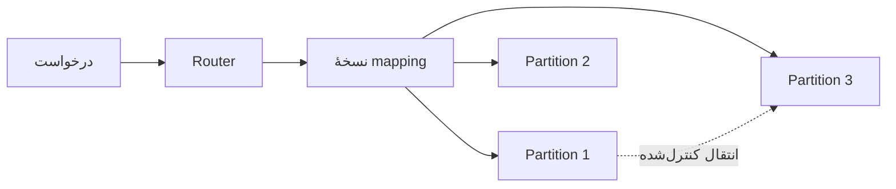

# فصل ۶: `Partitioning` و `Sharding`

## Partitioning

`Replication` چند copy از یک data می‌سازد؛ `Partitioning` data را بین nodeها تقسیم می‌کند و `Sharding` نام رایج همین تقسیم افقی است. ترکیب این دو امکان capacity و throughput بیشتر را می‌دهد، اما انتخاب key، routing، `rebalancing` و queryهای چندpartitionی را دشوار می‌کند.

## هدف فصل

فصل توضیح می‌دهد چگونه داده را طوری تقسیم کنیم که بار متعادل باشد، queryهای رایج کم‌هزینه بمانند و هنگام اضافه یا حذف گره، جابه‌جایی داده قابل‌کنترل باشد.

## نقشهٔ مطالب

- `Partitioning` همراه با `Replication`
- `range partitioning` یا `hash partitioning`
- `hotspot` و `skewed workload`
- local و global `secondary indexes`
- `rebalancing`، routing و `parallel query`

## خلاصهٔ زمینه‌محور

### `Range` یا `hash partitioning`

در range partitioning، کلیدها در بازه‌های مرتب قرار می‌گیرند. range query و scan مرتب ساده است و تقسیم بر اساس زمان می‌تواند برای دادهٔ تاریخی مناسب باشد. اگر بیشتر writeها به جدیدترین بازه برسند، همان بازه hotspot می‌شود.

در hash partitioning، hash کلید به‌طور یکنواخت‌تری data را پخش می‌کند و برای lookup نقطه‌ای مناسب است. در مقابل، range query باید چند `partition` را بپرسد و order طبیعی از بین می‌رود. بعضی سامانه‌ها ابتدا بر اساس hash تقسیم و داخل هر partition range index نگه می‌دارند.

### `Skewed workload` و `hotspot`

حتی hash خوب هم یک کلید بسیار پرطرفدار را از فشار نجات نمی‌دهد. یک کاربر مشهور، tenant بزرگ یا کلید ثابت می‌تواند سهم نامتناسبی از درخواست‌ها را جذب کند. افزودن suffix تصادفی یا شکستن یک کلید داغ به چند bucket بار را پخش می‌کند، اما خواندن باید همهٔ bucketها را جمع کند و ترتیب و اتمیک‌بودن پیچیده‌تر می‌شود.

### `Secondary indexes`

در local secondary index، هر `partition` فقط index دادهٔ خودش را دارد. نوشتن ساده‌تر است، ولی query بر اساس آن فیلد باید به همهٔ partitionها fan-out شود. در global secondary index، کلیدهای index هم partition می‌شوند؛ query سریع‌تر است اما یک write منطقی ممکن است چند partition را درگیر کند و `rebalancing` index دشوارتر شود.

تقسیم بر اساس document برای عملیات روی یک رکورد یا entity مناسب است. تقسیم بر اساس term برای search و queryهای «چه documentهایی این واژه را دارند؟» مناسب‌تر است. هیچ index ثانویه‌ای رایگان نیست؛ باید freshness، هزینهٔ write و رفتار هنگام خرابی تعریف شود.

### `rebalancing`

وقتی node جدید اضافه شود یا nodeای از دست برود، partitionها باید جابه‌جا شوند. hash ساده با تغییر تعداد nodeها، keyهای زیادی را جابه‌جا می‌کند. `consistent hashing` تعداد حرکت را کم می‌کند، اما load distribution و مدیریت rangeها هنوز به metadata نیاز دارد.

روش fixed number of partitions اجازه می‌دهد ابتدا partitionهای بیشتر از تعداد nodeها بسازیم و بعد مالکیت آن‌ها را جابه‌جا کنیم. split پویا برای rangeها با رشد data انعطاف دارد، اما باید جلوی split هم‌زمان و metadata ناسازگار گرفته شود. `rebalancing` خودکار راحت‌تر است ولی می‌تواند بدون اطلاع تیم، network و disk را اشباع کند؛ عملیات حساس ممکن است manual یا با rate limit باشد.

### routing و `parallel query`

Client باید بداند درخواست به کدام node برود. این اطلاعات می‌تواند در client، یک routing tier یا coordinator باشد. تغییر mapping `partition`ها باید atomic یا versioned دیده شود تا درخواست به مالک قدیمی و جدید سرگردان نشود.

multi-partition query با fan-out اجرا و پاسخ‌ها در coordinator merge می‌شوند. latency معمولاً به کندترین `partition` وابسته است و `partial failure` باید مدیریت شود. aggregation، sort و pagination در چنین queryهایی به memory و ترتیب جهانی نیاز دارند.

### مثال مستقل: رخدادهای tenantها

یک سامانهٔ تحلیل رخداد، data را بر اساس `tenant_id` partition می‌کند تا درخواست یک مشتری بیشتر local باشد. اگر یک tenant بسیار بزرگ باشد، همان key به چند bucket زمانی تقسیم می‌شود. index سراسری برای جست‌وجوی `event_type` ممکن است query را سریع کند، اما هر ingestion باید آن را هم به‌روزرسانی کند. در زمان افزودن node، partitionهای ثابت به‌آرامی منتقل می‌شوند تا ingestion اصلی متوقف نشود.

## نکته‌های کلیدی

1. `partition key` هم توزیع load و هم locality query را تعیین می‌کند.
2. hash hotspot ناشی از کلید داغ را حل نمی‌کند.
3. rebalancing را از ابتدا به‌عنوان عملیات پرهزینه و قابل‌مشاهده طراحی کنید.
4. `parallel query` به معنی latency ثابت نیست؛ کندترین partition و partial failure مهم‌اند.

## ارتباط با فصل‌های دیگر

- [فصل ۵: `Replication`](../05-replication/README.md)
- [فصل ۷: `Transactions` و `Concurrency`](../07-transactions/README.md)
- [فصل ۱۰: `Batch Processing`](../10-batch-processing/README.md)

## چک‌لیست انتخاب `partition key`

| معیار | پرسش |
| --- | --- |
| یکنواختی | آیا چند کلید سهم بزرگی از requestها را می‌گیرند؟ |
| locality | آیا query معمولاً یک tenant یا بازهٔ زمانی را می‌خواند؟ |
| رشد | آیا نرخ ورود داده در یک range خاص متمرکز می‌شود؟ |
| تغییر | آیا کلید قابل‌تغییر است یا باید immutable باشد؟ |
| routing | آیا client می‌تواند مالک `partition` را پیدا کند؟ |

## مسیر routing و `rebalancing`

هنگام انتقال، باید مالک قدیم و جدید دربارهٔ نسل mapping و بازهٔ انتقال توافق داشته باشند. یک روش عملی، کپی‌کردن داده، catch-upکردن تغییرها، تغییر مالکیت و سپس پاک‌کردن نسخهٔ قدیمی است. در هر مرحله، requestهای تکراری و قطع برق باید قابل‌تحمل باشند.

## الگوی مبارزه با hotspot

1. ابتدا توزیع کلید و توزیع بار را جداگانه اندازه بگیرید.
2. اگر یک entity داغ است، آن را به bucketهای محدود و قابل‌جمع تقسیم کنید.
3. write را پخش کنید اما مسیر خواندن و ترتیب aggregation را صریح نگه دارید.
4. برای tenant بسیار بزرگ، quota و مسیر پردازش اختصاصی در نظر بگیرید.
5. بعد از اصلاح کلید، rebalancing و اثر آن بر cache را benchmark کنید.

## سناریوی طراحی: آرشیو رخدادهای زمانی

تقسیم فقط بر اساس timestamp، writeهای امروز را روی یک node متمرکز می‌کند. تقسیم بر اساس hash tenant، ingestion را پخش می‌کند اما query بازهٔ زمانی به همهٔ partitionها می‌رود. راه ترکیبی می‌تواند partitionهای زمانی بزرگ و bucketهای hash داخلی داشته باشد؛ انتخاب نهایی به نسبت query تاریخی، تأخیر قابل‌قبول و اندازهٔ هر tenant وابسته است.

## تمرین‌های مرور

1. برای یک سامانهٔ چندمستاجری، کلیدی طراحی کنید که tenant کوچک و بزرگ را متفاوت مدیریت کند.
2. تفاوت index ثانویهٔ محلی و سراسری را با یک query واقعی توضیح دهید.
3. مراحل انتقال یک `partition` را طوری بنویسید که قطع شبکه در هر مرحله recovery داشته باشد.

## تعریف مستقل اصطلاحات

### `partitioning`

**چیست؟** تقسیم یک dataset بزرگ به چند قسمت تا هر node همهٔ داده را نگه ندارد.

**اشتباه رایج:** partitioning با replication فرق دارد؛ اولی تقسیم می‌کند، دومی کپی می‌سازد.

### `sharding`

`sharding` نام رایج تقسیم افقی داده بین shardهاست. هر shard مالک بخشی از keyهاست و معمولاً چند replica دارد.

### `partition key`

**چیست؟** کلیدی که تعیین می‌کند یک رکورد در کدام partition قرار بگیرد.

**مثال:** `tenant_id` می‌تواند query یک مشتری را local کند، اما tenant بسیار بزرگ ممکن است hotspot بسازد.

### `hotspot`

**چیست؟** key یا partitionای که بیشتر از سهم عادلانه بار دریافت می‌کند.

**راه‌حل‌ها:** شکستن key داغ به bucket، cache، مسیر جدا یا تغییر access pattern. hash به‌تنهایی یک key بسیار محبوب را حل نمی‌کند.

### `rebalancing`

**چیست؟** جابه‌جایی مالکیت partitionها هنگام اضافه یا حذف node.

**قانون ساده:** ابتدا کپی، سپس catch-up، بعد تغییر مالکیت و در پایان پاک‌کردن نسخهٔ قدیمی.

### `consistent hashing`

**چیست؟** روشی برای mapping key به node که با تغییر nodeها، مقدار جابه‌جایی را کم می‌کند.

**اشتباه رایج:** consistent hashing مشکل query، hotspot و metadata را خودکار حل نمی‌کند.

### `scatter-gather`

**چیست؟** فرستادن یک query به چند partition و جمع‌کردن جواب‌ها.

**خطر:** latency معمولاً به کندترین partition وابسته می‌شود و خطای یک بخش باید جدا مدیریت شود.
