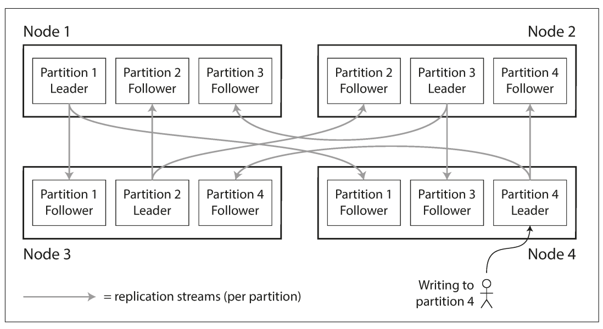
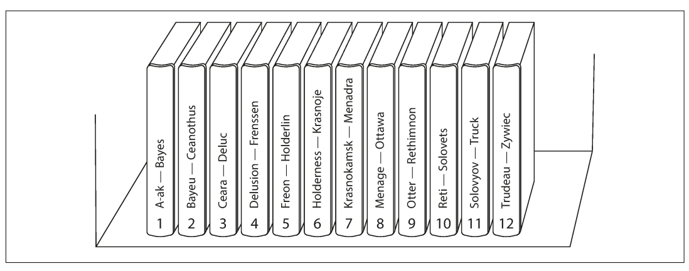
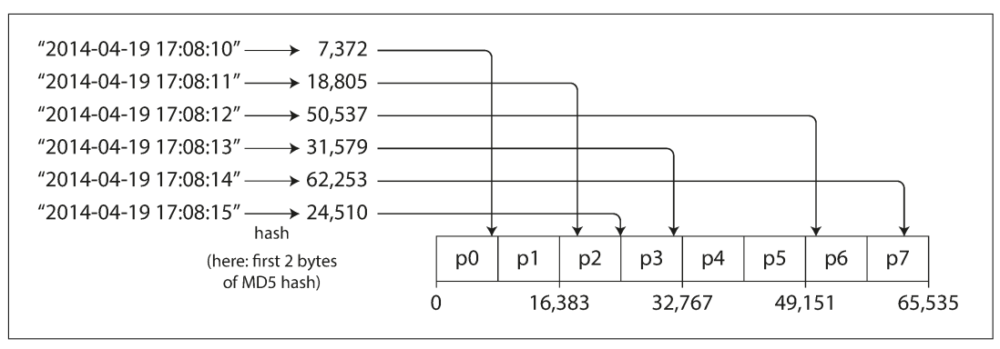
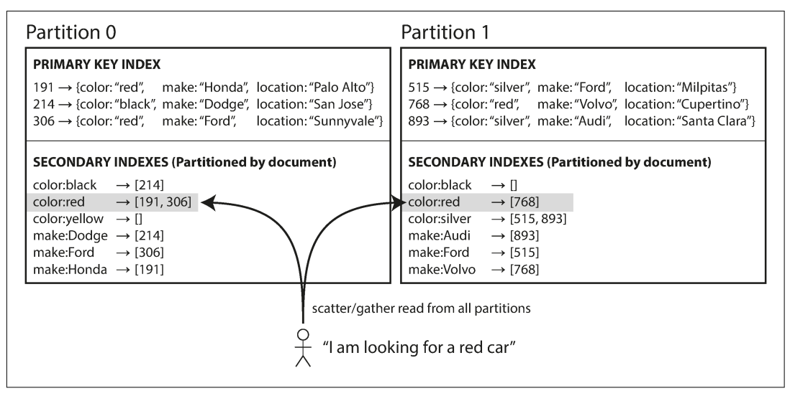
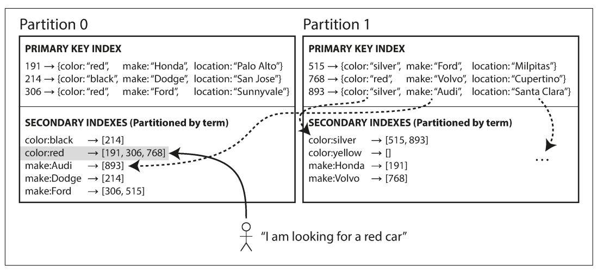
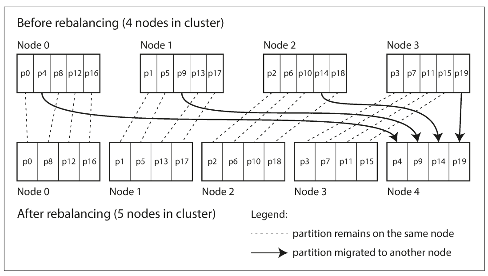
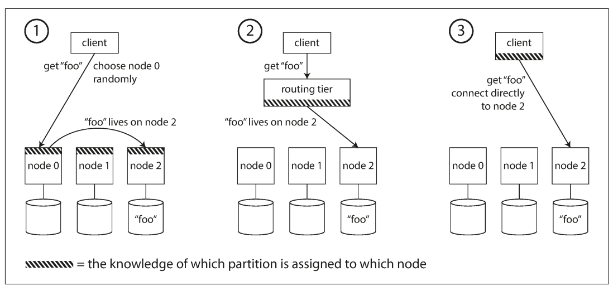
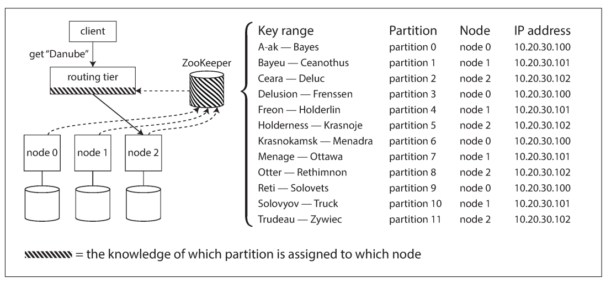

# فصل ۶: `Partitioning`

## Partitioning

در فصل ۵ چند copy از یک data را روی nodeهای مختلف نگه داشتیم. اما اگر dataset یا query throughput از توان یک machine بیشتر باشد، replication به‌تنهایی کافی نیست؛ باید خود data را به چند بخش تقسیم کنیم. این کار `partitioning` است و در بعضی محصولات `sharding` نامیده می‌شود.

> نکتهٔ واژگانی: `partition` در این فصل شکستن عمدی database به قسمت‌های کوچک‌تر است، نه `network partition` یا قطع ارتباط میان nodeها که نوعی fault شبکه است.

نام همین مفهوم در ابزارهای مختلف فرق می‌کند:

- `shard` در MongoDB، Elasticsearch و SolrCloud
- `region` در HBase
- `tablet` در Bigtable
- `vnode` در Cassandra و Riak
- `vBucket` در Couchbase

معمولاً هر record، row یا document دقیقاً به یک partition تعلق دارد. هر partition مثل database کوچک خودش است، هرچند database ممکن است operationهایی داشته باشد که چند partition را هم‌زمان لمس کنند.

دلیل اصلی partitioning، `scalability` است. partitionها روی nodeهای مستقل در shared-nothing cluster قرار می‌گیرند؛ در نتیجه dataset میان diskهای بیشتری پخش و query load میان CPUهای بیشتری تقسیم می‌شود. query یک partition را همان node مستقل اجرا می‌کند و با افزودن node می‌توان throughput را بالا برد. queryهای بزرگ هم ممکن است parallel شوند، اما اجرای آن‌ها دشوارتر است.

Partitioned databaseها از دههٔ ۱۹۸۰ در محصولاتی مانند Teradata و Tandem NonStop SQL وجود داشتند و بعد در NoSQL و data warehouseهای Hadoop دوباره محبوب شدند. اصل partitioning برای workloadهای transaction و analytics یکسان است، هرچند tuning آن‌ها متفاوت است.

در این فصل سه پرسش را دنبال می‌کنیم:

1. data را با چه قاعده‌ای میان partitionها تقسیم کنیم؟
2. وقتی node اضافه یا حذف شد، چگونه `rebalancing` انجام دهیم؟
3. client چگونه request را به partition درست route کند و query چندبخشی چگونه اجرا شود؟

---

## ترکیب `Partitioning` و `Replication`

Partitioning معمولاً با replication ترکیب می‌شود. هر record فقط یک partition دارد، اما آن partition روی چند node copy می‌شود. در مدل leader–follower، leader هر partition روی یک node و followerهای آن روی nodeهای دیگر قرار می‌گیرند. یک node می‌تواند برای برخی partitionها leader و برای برخی follower باشد.

تمام مباحث فصل ۵ دربارهٔ replication partitionها هم صدق می‌کند. scheme تقسیم data تا حد زیادی از scheme replication مستقل است؛ در ادامه برای ساده ماندن بیشتر روی partition تمرکز می‌کنیم.

*شکل ۶-۱ — هر node برای بعضی partitionها leader و برای بعضی دیگر follower است.*

## Partitioning دادهٔ `Key-Value`

هدف این است که data و query load تا حد ممکن عادلانه بین nodeها پخش شود. اگر ده node هرکدام سهم برابر داشته باشند، در حالت ایده‌آل باید بتوانند تقریباً ده برابر یک node data و read/write throughput را تحمل کنند.

اگر بعضی partitionها data یا query بیشتری داشته باشند، workload `skewed` است. partition با load نامتناسب زیاد `hot spot` نام دارد. در حالت بد، همهٔ requestها به یک partition می‌روند و بقیهٔ nodeها بیکار می‌مانند.

پخش تصادفی recordها data را متعادل می‌کند، اما برای read یک record نمی‌دانیم کدام node آن را دارد و مجبوریم همهٔ nodeها را query کنیم. اگر data model فقط key-value باشد و record همیشه با primary key خوانده شود، می‌توان scheme بهتری ساخت.

### Partitioning بر اساس `Key Range`

در این روش هر partition یک range پیوسته از keyها را می‌گیرد؛ مثل جلدهای یک encyclopedia که A تا B در جلدی و T تا Z در جلدی دیگر است. اگر مرز range و mapping آن به node را بدانیم، request را مستقیماً به node درست می‌فرستیم.

rangeها لازم نیست طول برابر داشته باشند. چون data یکنواخت نیست، مرزها باید بر اساس توزیع واقعی انتخاب شوند. administrator می‌تواند دستی تعیین کند یا database به‌صورت خودکار آن‌ها را بسازد.

*شکل ۶-۲ — هر partition بخشی از range مرتب keyها را مالک است؛ rangeها برای متعادل کردن اندازهٔ واقعی برابر نیستند.*

این راه در Bigtable، HBase، RethinkDB و نسخه‌های قدیمی MongoDB استفاده شده است. داخل هر partition می‌توان keyها را مرتب نگه داشت؛ در این صورت range scan آسان است و key ترکیبی مانند concatenated index برای recordهای مرتبط به‌کار می‌رود.

مثلاً در database سنسورها، key timestamp شامل سال، ماه، روز، ساعت و ثانیه است. range query تمام اندازه‌گیری‌های یک ماه را ساده می‌کند.

عیب آن hot spot است. اگر timestamp اولین بخش key باشد و partitionها بر اساس روز ساخته شوند، تمام writeهای لحظهٔ فعلی به partition «امروز» می‌رود؛ در حالی که partition روزهای قبل بیکار است.

راه اصلاح این است که timestamp اولین component نباشد؛ مثلاً key را با `sensor_name` شروع کنیم و زمان را بعد از آن بیاوریم. با وجود سنسورهای زیاد، writeها بهتر پخش می‌شوند، اما query یک بازهٔ زمانی برای چند sensor باید برای هر نام یک range query جدا بزند.

### Partitioning بر اساس `Hash of Key`

hash function مناسب دادهٔ skewed را به عددهایی تقریباً یکنواخت تبدیل می‌کند. مثلاً hash ۳۲بیتی یک string را به عددی میان صفر و `2^32 - 1` تبدیل می‌کند؛ stringهای مشابه هم خروجی‌های پراکنده می‌گیرند.

برای partitioning cryptographic بودن hash لازم نیست. Cassandra و MongoDB از MD5 و Voldemort از Fowler–Noll–Vo استفاده کرده‌اند. hash function داخلی language ممکن است مناسب نباشد؛ مثلاً `Object.hashCode()` در Java یا `Object#hash` در Ruby ممکن است همان key را در processهای متفاوت به مقدار متفاوت تبدیل کند.

پس از hash کردن key، به‌جای range خود key، range عدد hash را به partitionها می‌دهیم:

این کار keyها را نسبتاً عادلانه پخش می‌کند. مرزها می‌توانند مساوی یا pseudo-random باشند. اصطلاح `consistent hashing` تاریخی است، اما با consistency replicaها یا consistency در ACID ارتباط ندارد و برای databaseها همیشه بهترین روش نیست؛ به‌همین دلیل گفتن `hash partitioning` دقیق‌تر است.

هزینهٔ مهم hash partitioning این است که ترتیب keyها از بین می‌رود. keyهای مجاور حالا در partitionهای متفاوت پخش‌اند و range query باید همهٔ partitionها را بپرسد. MongoDB در حالت hash sharding چنین queryای را به همهٔ partitionها می‌فرستد؛ بعضی datastoreها range query روی primary key را پشتیبانی نمی‌کنند.

`Cassandra` میان این دو راه compromise می‌سازد: primary key چند column دارد. فقط اولین بخش برای تعیین partition hash می‌شود؛ بخش‌های بعدی در SSTable به‌عنوان concatenated index مرتب‌اند. query نمی‌تواند روی بخش اول range بزند، اما اگر مقدار اول ثابت باشد، روی columnهای بعدی range scan سریع دارد.

این مدل برای رابطهٔ one-to-many مفید است. اگر primary key updateها `(user_id, update_timestamp)` باشد، همهٔ updateهای یک user در یک partition با ترتیب timestamp ذخیره می‌شوند و query بازهٔ زمانی سریع است.

### workload skewed و کاهش hot spot

hash کردن hot spot را کم می‌کند، اما اگر همهٔ requestها برای یک key واحد باشند، hash آن key همچنان یکسان است. user مشهور شبکهٔ اجتماعی ممکن است با یک action میلیون‌ها comment و write روی یک key ایجاد کند.

راه application-level این است که برای key داغ یک عدد تصادفی به ابتدا یا انتهای آن اضافه کنیم. random دو رقمی write را به ۱۰۰ key پخش می‌کند و keyها می‌توانند در partitionهای مختلف باشند.

اما read باید هر ۱۰۰ key را بخواند و merge کند. همچنین فقط برای چند key داغ باید این کار را انجام دهیم، نه همهٔ keyها؛ پس application باید فهرست keyهای split‌شده را نگه دارد. بیشتر systemها این skew شدید را خودکار حل نمی‌کنند و trade-off با application است.

## Partitioning و `Secondary Index`

اگر record فقط با primary key خوانده شود، از روی key partition را پیدا می‌کنیم و request را route می‌کنیم. `secondary index` جست‌وجوی یک value را ممکن می‌کند: همهٔ actionهای user ۱۲۳، مقاله‌های حاوی واژهٔ مشخص یا خودروهای قرمز.

secondary index در relational databaseها بنیادی و در document databaseها رایج است. بسیاری از key-value storeها به‌دلیل پیچیدگی از آن دوری کرده‌اند، اما search serverهایی مانند Solr و Elasticsearch اساساً برای آن ساخته شده‌اند.

مشکل این است که secondary index به‌طور طبیعی با primary-key partition یکی نیست. دو روش اصلی داریم:

1. `document-partitioned` یا local index
2. `term-partitioned` یا global index

### Partitioning index بر اساس document

فرض کنید سایت فروش خودرو داریم. هر listing یک document ID دارد و database بر اساس همان ID partition شده است؛ مثلاً ۰ تا ۴۹۹ در partition صفر و ۵۰۰ تا ۹۹۹ در partition یک. برای filter کردن بر اساس `color` و `make`، هر partition index خودش را روی documentهای محلی می‌سازد. وقتی خودرو قرمز اضافه می‌شود، آن partition ID document را به entry `color:red` اضافه می‌کند.

*شکل ۶-۴ — هر partition local index خودش را نگه می‌دارد و فقط documentهای همان partition را پوشش می‌دهد.*

مزیت: write یک document فقط یک partition و index محلی را update می‌کند. این index `local index` است. عیب: خودروهای قرمز احتمالاً در چند partition هستند؛ برای query `color:red` باید به همهٔ partitionها request بدهیم و resultها را ترکیب کنیم. این روش `scatter/gather` نام دارد.

scatter/gather حتی اگر queryها موازی باشند، tail latency را زیاد می‌کند؛ چون latency کل تحت تأثیر کندترین partition است. بااین‌حال MongoDB، Riak، Cassandra، Elasticsearch، SolrCloud و VoltDB از این مدل یا گونه‌ای از آن استفاده می‌کنند. توصیهٔ رایج این است که partition key را طوری انتخاب کنیم که query secondary index تا حد امکان در یک partition جواب بگیرد، اما در query چند index همیشه ممکن نیست.

اگر key-value store خودش secondary index ندارد و آن را در application بسازیم، باید consistency index و data اصلی را با دقت مدیریت کنیم. race condition یا failure وسط چند write به‌راحتی index را از data جدا می‌کند؛ این موضوع در بحث multi-object transaction مهم است.

### Partitioning index بر اساس term

به‌جای index محلی، می‌توان یک `global index` ساخت که data همهٔ partitionها را پوشش دهد. index خودش هم باید partition شود؛ وگرنه یک node bottleneck می‌شود. این partitioning می‌تواند مستقل از primary key باشد.

در مثال خودرو، همهٔ documentهای قرمز زیر `color:red` در global index قرار می‌گیرند، اما خود index بر اساس term partition می‌شود؛ مثلاً colorهای a تا r در partition صفر و s تا z در partition یک. همین کار برای `make` هم انجام می‌شود.

*شکل ۶-۵ — term موردجست‌وجو partition index را مشخص می‌کند؛ entry یک term می‌تواند documentهای تمام primary partitionها را شامل شود.*

به آن `term-partitioned` می‌گوییم، چون term مثل `color:red` مقصد index را تعیین می‌کند. می‌توان term را مستقیم range کرد که برای price مناسب است، یا hash term را گرفت که load یکنواخت‌تر می‌شود.

مزیت global index، read کارآمد است: client فقط partition term را می‌پرسد، نه همهٔ partitionها. عیب، write سخت‌تر و کندتر است؛ یک document ممکن است چند term داشته باشد و هر term در partition index جدا باشد.

در حالت ایده‌آل index بلافاصله update می‌شود، اما این کار به distributed transaction میان partitionهای متعدد نیاز دارد. بسیاری از databaseها آن را پشتیبانی نمی‌کنند، پس global index معمولاً asynchronous به‌روز می‌شود و read بلافاصله پس از write ممکن است change را نبیند. Amazon DynamoDB برای global secondary index propagation delay معمولاً کوتاه اما در failure طولانی‌تر را اعلام می‌کند.

## `Rebalancing` partitionها

با گذشت زمان شرایط عوض می‌شود:

- query throughput بالا می‌رود و CPU بیشتری می‌خواهیم.
- dataset بزرگ‌تر می‌شود و disk و RAM بیشتری لازم است.
- machine خراب می‌شود و nodeهای دیگر باید مسئولیتش را بگیرند.

انتقال data و request load از nodeی به node دیگر `rebalancing` نام دارد. هر scheme باید سه شرط داشته باشد:

1. پس از rebalancing، data و read/write load نسبتاً عادلانه توزیع شود.
2. حین rebalancing، database read و write را ادامه دهد.
3. فقط data لازم جابه‌جا شود تا network و disk I/O بیهوده نشود.

### روشی که نباید استفاده کنیم: `hash mod N`

ممکن است بخواهیم `hash(key) % N` را node مقصد بگیریم. با ۱۰ node، hash برابر ۱۲۳۴۵۶ روی node شش است؛ با ۱۱ node روی node سه و با ۱۲ node روی node صفر. با هر تغییر N بیشتر keyها باید حرکت کنند؛ rebalancing بسیار پرهزینه می‌شود.

### تعداد ثابت partitionهای زیاد

راه ساده این است که از ابتدا partitionهای بسیار بیشتری از nodeها بسازیم. مثلاً cluster ده‌node را به ۱۰۰۰ partition تقسیم کنیم و حدود ۱۰۰ partition به هر node بدهیم. با ورود node جدید، از هر node چند partition می‌گیرد تا سهم‌ها متعادل شوند؛ با حذف node همین کار برعکس می‌شود.

فقط partition کامل جابه‌جا می‌شود؛ mapping key به partition ثابت می‌ماند و فقط مالک partition عوض می‌شود. تا پایان انتقال، read و write از assignment قدیمی استفاده می‌کنند.

می‌توان به node قوی‌تر partition بیشتری داد. این روش در Riak، Elasticsearch، Couchbase و Voldemort استفاده شده است.

تعداد partition معمولاً در آغاز ثابت می‌شود. عدد خیلی کم رشد آینده را محدود و recovery را سنگین می‌کند؛ عدد خیلی زیاد metadata و management overhead ایجاد می‌کند. اگر dataset از کوچک به بسیار بزرگ رشد کند، اندازهٔ fixed partition یا بیش از حد بزرگ و کند می‌شود یا آن‌قدر کوچک که overhead غالب می‌گردد.

### dynamic partitioning

در key-range partitioning، تعیین مرز ثابت از ابتدا خطرناک است؛ ممکن است همهٔ data در یک range بیفتد. در HBase و RethinkDB، وقتی partition از thresholdی بزرگ‌تر شود—مثلاً حدود ۱۰ GB در HBase—به دو partition split می‌شود. اگر data زیادی حذف شود، partition کوچک با همسایه merge می‌شود.

هر partition روی یک node است و node می‌تواند چند partition داشته باشد. پس از split، یک نیمه را می‌توان به node دیگر منتقل کرد. مزیت dynamic partitioning این است که تعداد partition با حجم dataset رشد می‌کند و اندازهٔ هر partition سقف دارد.

database خالی با یک partition شروع می‌شود؛ تا پیش از اولین split همهٔ writeها به یک node می‌روند. HBase و MongoDB برای حل این bottleneck اجازهٔ `pre-splitting` می‌دهند، اما در key-range باید توزیع آیندهٔ key را از قبل بدانیم. dynamic partitioning با hash partitioning هم ممکن است؛ MongoDB از هر دو پشتیبانی می‌کند.

### partition متناسب با تعداد node

Cassandra و Ketama تعداد partition را متناسب با تعداد node می‌گیرند؛ یعنی هر node تعداد ثابتی partition دارد. با رشد dataset و ثابت بودن node، هر partition بزرگ‌تر می‌شود؛ با اضافه شدن node، partitionها split و کوچک‌تر می‌شوند.

node جدید چند partition موجود را تصادفی split می‌کند و نصف هرکدام را می‌گیرد. randomization ممکن است یک‌باره load نابرابر بدهد، اما با partitionهای زیاد—مثلاً ۲۵۶ partition برای هر node در Cassandra—میانگین متعادل می‌شود. این رویکرد به hash partitioning و ایدهٔ تاریخی consistent hashing نزدیک است، اما hash functionهای جدید می‌توانند metadata کمتری بخواهند.

### automatic یا manual rebalancing؟

در یک سر طیف، سیستم خودش زمان و مقصد انتقال را انتخاب می‌کند؛ در سر دیگر administrator mapping را صریح تنظیم می‌کند. Couchbase، Riak و Voldemort assignment پیشنهادی می‌سازند، اما administrator باید آن را commit کند.

automatic rebalancing کار عملیاتی را کم می‌کند، اما operation گران و غیرقابل‌پیش‌بینی است. انتقال data می‌تواند network و nodeها را overload کند. ترکیب failure detection خودکار و rebalancing خودکار خطرناک‌تر است: nodeی به‌دلیل overload موقت کند می‌شود، بقیه آن را dead فرض می‌کنند و انتقال load، فشار را بیشتر می‌کند؛ این چرخه می‌تواند cascading failure ایجاد کند. وجود انسان در loop کندتر است، اما surprise عملیاتی را کم می‌کند.

## `Request routing`

حالا data روی nodeهای متعدد است، اما client برای key `foo` چگونه IP و port درست را پیدا کند؟ با rebalancing mapping مرتب تغییر می‌کند. این مسئله نمونه‌ای از `service discovery` است.

سه الگوی اصلی وجود دارد:

1. client به هر node یا load balancer round-robin وصل شود. اگر node partition را نداشته باشد، request را به node درست forward کند و response را برگرداند.
2. همهٔ requestها ابتدا به routing tier بروند. این لایه خودش query را پاسخ نمی‌دهد؛ فقط partition-aware load balancer است.
3. client خودش partitioning و mapping را بداند و مستقیماً به node مربوط وصل شود.

در هر سه، component تصمیم‌گیرنده باید mapping تغییرکرده را بفهمد. اگر participantها روی metadata توافق نداشته باشند، request به node اشتباه می‌رود.

بسیاری از systemها برای این metadata از coordination service جداگانه مانند `ZooKeeper` استفاده می‌کنند. nodeها خودشان را register می‌کنند، ZooKeeper mapping authoritative partition-to-node را نگه می‌دارد و routing tier یا client روی changeها subscribe می‌شود.

`Espresso` از `Helix` برای cluster management استفاده می‌کند؛ HBase، SolrCloud و Kafka هم ZooKeeper دارند. MongoDB config server و `mongos` را به‌کار می‌برد.

Cassandra و Riak از `gossip protocol` میان nodeها استفاده می‌کنند. request می‌تواند به هر node برود و آن node آن را forward کند؛ این کار dependency به coordination service خارجی را کم می‌کند اما nodeها را پیچیده‌تر می‌سازد. Couchbase معمولاً routing tier به نام `moxi` دارد و rebalancing خودکار را ساده نمی‌گیرد.

client برای یافتن IP اولیهٔ routing tier یا nodeها می‌تواند از DNS استفاده کند، چون IPهای دسترسی معمولاً از assignment partition کندتر تغییر می‌کنند.

## اجرای موازی query

بیشتر NoSQL distributed datastoreها query سادهٔ یک key و گاهی scatter/gather را پشتیبانی می‌کنند. در مقابل، relational MPP databaseها برای analytics queryهای پیچیده‌ای با join، filter، group و aggregate دارند.

`MPP query optimizer` query را به stageها و partitionهایی می‌شکند که روی nodeهای مختلف موازی اجرا می‌شوند. queryهایی که بخش بزرگی از dataset را scan می‌کنند از این parallelism سود زیادی می‌برند. تکنیک‌های آن موضوع تخصصی و مرتبط با batch processing است.

## جمع‌بندی فصل

Partitioning وقتی لازم است که ذخیره و پردازش data روی یک machine عملی نباشد. هدف، پخش عادلانهٔ data و query load و جلوگیری از hot spot است. scheme مناسب باید با data و queryهای واقعی هماهنگ باشد و rebalancing هنگام تغییر cluster انجام شود.

دو رویکرد اصلی:

- **key-range partitioning:** keyها مرتب‌اند و هر partition rangeای را می‌گیرد. range query سریع است، اما keyهای مجاور می‌توانند hot spot بسازند. partition بزرگ معمولاً با split پویا تقسیم می‌شود.
- **hash partitioning:** hash key range partition را تعیین می‌کند. load یکنواخت‌تر است، اما ترتیب key از بین می‌رود و range query گران می‌شود. معمولاً partitionهای ثابت زیادی می‌سازیم و هنگام تغییر node، partition کامل جابه‌جا می‌شود.

compound key می‌تواند ترکیبی باشد: یک بخش partition را مشخص کند و بخش دیگر ترتیب مرتب را حفظ کند.

secondary index هم باید partition شود:

- **document-partitioned/local:** write ساده و محلی است، اما read به scatter/gather همهٔ partitionها نیاز دارد.
- **term-partitioned/global:** read از یک partition index پاسخ می‌گیرد، اما write ممکن است چند partition index را update کند و اغلب asynchronous است.

در پایان، request routing از load balancer ساده تا ZooKeeper، gossip و query engine موازی بررسی شد. مستقل بودن partitionها scalability را ممکن می‌کند، اما operationی که چند partition را write می‌کند به failureهای جزئی و transactionهای دشوار می‌رسد؛ فصل‌های بعدی همین مسئله را دنبال می‌کنند.

## تعریف مستقل اصطلاحات

### `partition` و `shard`

بخش مستقل database که هر record در یکی از آن‌ها قرار می‌گیرد. `shard` نام رایج همین مفهوم در بعضی محصولات است؛ با network partition اشتباه نشود.

### `partitioning`

تقسیم عمدی dataset و load بین nodeهای متعدد برای scalability. partitioning معمولاً با replication ترکیب می‌شود.

### `sharding`

نام دیگری برای partitioning افقی dataset؛ در MongoDB و چند datastore دیگر رایج‌تر است.

### `hot spot`

partition یا nodeای که به‌دلیل توزیع نابرابر key یا workload، سهم نامتناسبی از request یا data را دارد.

### `key-range partitioning`

هر partition یک بازهٔ مرتب از keyها را نگه می‌دارد. range query خوب است، اما writeهای مجاور یا timestamp می‌توانند hot spot بسازند.

### `hash partitioning`

hash key مقصد partition را تعیین می‌کند. توزیع load بهتر است، اما ترتیب key و range query از بین می‌رود.

### `scatter/gather`

فرستادن یک query به چند یا همهٔ partitionها و جمع کردن نتیجه‌ها. ساده است، اما هزینه و tail latency را بالا می‌برد.

### `local index` و `global index`

`local index` در همان partition primary data نگه داشته می‌شود و write ساده‌ای دارد. `global index` جداگانه partition می‌شود و read را هدفمندتر می‌کند، اما write چندبخشی و معمولاً asynchronous است.

### `rebalancing`

انتقال partition و load میان nodeها هنگام اضافه یا حذف node یا تغییر حجم data. باید با کمترین جابه‌جایی، بدون توقف read/write و با توزیع متعادل انجام شود.

### `fixed partitioning` و `dynamic partitioning`

در fixed partitioning تعداد partition از ابتدا تعیین می‌شود و فقط مالکیت آن عوض می‌شود. در dynamic partitioning partition با بزرگ شدن split و با کوچک شدن merge می‌شود.

### `service discovery`

پیدا کردن location و endpoint سرویس یا node درست در یک سیستم توزیع‌شده. mapping partition-to-node نمونه‌ای از metadata آن است.

### `routing tier`

لایه‌ای که partition mapping را می‌داند و request را به node مالک partition می‌فرستد. خودش معمولاً data query را اجرا نمی‌کند.

## ارتباط با فصل‌های دیگر

- [فصل ۱: `Reliability`، `Scalability` و `Maintainability`](../01-reliable-scalable-maintainable/README.md) — shared-nothing و scale out.
- [فصل ۳: `Storage` و `Retrieval`](../03-storage-retrieval/README.md) — SSTable، B-tree و index داخل partition.
- [فصل ۵: `Replication`](../05-replication/README.md) — replica کردن هر partition و consistency آن.
- [فصل ۷: `Transactions`](../07-transactions/README.md) — دشواری write اتمیک روی چند partition.
- [فصل ۸: `Distributed Systems`](../08-distributed-systems/README.md) — faultهای network و routing.
- [فصل ۹: `Consistency` و `Consensus`](../09-consistency-consensus/README.md) — توافق بر mapping و metadata cluster.
- [فصل ۱۰: `Batch Processing`](../10-batch-processing/README.md) — MPP و queryهای موازی روی dataset بزرگ.
