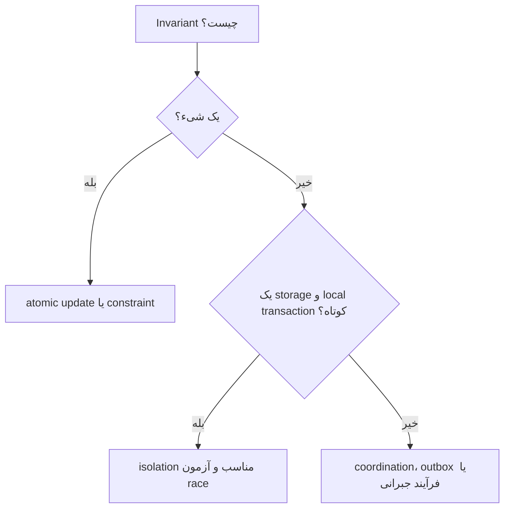

# فصل ۷: `Transactions` و `Concurrency`

## Transactions

`Transactions` مجموعه‌ای از قراردادها برای ترکیب چند operation و کنترل `concurrency` هستند. آن‌ها برنامه‌نویس را از بخشی از raceها و خرابی جدا می‌کنند، اما هزینهٔ lock، log، contention و محدودیت scale دارند.

## هدف فصل

فصل معنای دقیق ACID، سطح‌های isolation و تفاوت میان اجرای ترتیبی واقعی، two-phase locking و serializable snapshot isolation را توضیح می‌دهد.

## نقشهٔ مطالب

- مفهوم `transaction` و معنای `ACID`
- عملیات تک‌شیء و چندشیء
- read committed، snapshot isolation و جلوگیری از lost update
- write skew و phantom
- `serializability` با اجرای ترتیبی، `2PL` و `SSI`

## خلاصهٔ زمینه‌محور

### ACID با زبان دقیق

- **Atomicity:** شکست بخشی از یک واحد، نباید اثر نهایی نیمه‌کاره بسازد.
- **Consistency:** invariantهای دامنه پس از commit برقرار بمانند؛ این بخش بیشتر قرارداد application است تا ویژگی جادویی database.
- **`Isolation`:** `transaction`های هم‌زمان اثر یکدیگر را طبق level انتخاب‌شده ببینند.
- **Durability:** پس از تأیید، داده در برابر خرابی مجاز باقی بماند.

`transaction` یک برچسب همه‌کاره نیست. برخی operationهای تک‌ردیفی به multi-object transaction نیاز ندارند؛ برخی invariantها هم فقط با coordination یا طراحی application قابل حفظ‌اند.

### isolation ضعیف

در read uncommitted، خواندن ممکن است data تأییدنشده را ببیند. read committed dirty read را حذف می‌کند، اما یک query تکرارشونده می‌تواند پاسخ متفاوت بدهد. snapshot isolation هر `transaction` را روی snapshot ثابتی اجرا می‌کند و خواندن‌ها را پایدارتر می‌کند، ولی همهٔ raceها را از بین نمی‌برد.

در repeatable read، هدف این است که رکوردی که خوانده‌ایم در همان `transaction` تغییر نکرده به نظر برسد. پیاده‌سازی‌های مختلف نام‌های یکسان را دقیقاً یکسان معنا نمی‌کنند؛ رفتار واقعی باید با آزمون و مستندات engine بررسی شود.

### lost update، write skew و phantom

lost update وقتی رخ می‌دهد که دو `transaction` مقدار قبلی را بخوانند و یکی نتیجهٔ دیگری را overwrite کند. راه‌حل‌ها شامل lock صریح، update اتمیک، compare-and-set، version check یا serializable isolation هستند.

write skew زمانی رخ می‌دهد که هر `transaction` رکوردی متفاوت را تغییر دهد اما invariant به مجموعهٔ رکوردها وابسته باشد. phantom هم ظاهرشدن یا ناپدیدشدن رکوردهایی است که با شرط query سازگارند. برای این موارد lock روی یک رکورد موجود کافی نیست؛ باید predicate را قفل کرد، constraint را به database سپرد یا از isolation قوی‌تر استفاده کرد.

### `Serializability`

قوی‌ترین هدف معمول این است که نتیجهٔ `transaction`های هم‌زمان با یک ترتیب ترتیبی معتبر سازگار باشد. اجرای واقعی و ترتیبی ساده و قابل‌فهم است، اما throughput را محدود می‌کند مگر اینکه workload و partition مناسب باشد.

در `Two-Phase Locking (2PL)`، `transaction` در مرحلهٔ رشد قفل می‌گیرد و تا زمان مناسب قفل‌ها را نگه می‌دارد. این روش conflict را کنترل می‌کند، اما deadlock، انتظار طولانی و contention دارد.

`Serializable Snapshot Isolation (SSI)` از snapshot برای خواندن و از تشخیص dependency خطرناک برای abortکردن یکی از `transaction`ها استفاده می‌کند. این روش blocking کمتری دارد، اما به memory برای tracking و retry در application نیازمند است.

### مثال مستقل: رزرو صندلی

اگر دو کاربر آخرین صندلی را هم‌زمان رزرو کنند، فقط بررسی «صندلی آزاد است» کافی نیست. یکی باید با lock یا constraint اتمیک برنده شود و دیگری پاسخ قابل‌فهم بگیرد. اگر رزرو شامل پرداخت، صدور بلیت و کاهش موجودی در چند سرویس باشد، یک local `transaction` به‌تنهایی کافی نیست؛ `saga`، `outbox` یا فرآیند جبرانی ممکن است مناسب‌تر باشد.

## نکته‌های کلیدی

1. ACID را به چهار ویژگی عملی و قابل‌آزمون بشکنید.
2. نام isolation level بدون بررسی semantics engine کافی نیست.
3. invariantهای چندردیفی منبع اصلی write skew و phantom هستند.
4. `serializability` قوی است، اما هزینهٔ قفل، abort یا throughput دارد.

## ارتباط با فصل‌های دیگر

- [فصل ۶: `Partitioning` و `Sharding`](../06-partitioning/README.md)
- [فصل ۸: `Distributed Systems`: `Failure`, `Timeout`, `Retry`](../08-distributed-systems/README.md)
- [فصل ۹: `Consistency` و `Consensus`](../09-consistency-consensus/README.md)

## جدول سطح‌های isolation

| سطح | چیزی که کاهش می‌دهد | چیزی که هنوز ممکن است رخ دهد |
| --- | --- | --- |
| Read committed | dirty read | non-repeatable read، برخی raceها |
| Snapshot isolation | تغییر رکوردهای خوانده‌شده در snapshot | write skew و برخی phantomها |
| 2PL سریال‌پذیر | اجرای ناسازگار هم‌زمان | deadlock و انتظار |
| SSI سریال‌پذیر | anomalyهای dependency | abort و retry |

نام سطح‌ها را باید با semantics واقعی engine تطبیق داد. این جدول راهنمای مفهومی است، نه جایگزین مستندات محصول.

## مسیر تصمیم برای invariant

هرچه invariant از مرز یک database فراتر رود، نگه‌داشتن آن با یک transaction محلی دشوارتر می‌شود. در چنین وضعی باید بخشی از state را reservation دانست و مسیر جبران، expiration و reconciliation تعریف کرد.

## الگوی جلوگیری از lost update

برای رکوردی با فیلد `version`، client مقدار فعلی را همراه نسخه می‌خواند و update را با شرط `version = old_version` انجام می‌دهد. اگر تعداد ردیف تغییرکرده صفر باشد، دیگری زودتر نوشته است و client باید دوباره بخواند یا conflict را به کاربر نشان دهد. این الگو وقتی مناسب است که merge معنایی ممکن باشد و transaction طولانی لازم نباشد.

## سناریوی طراحی: پرداخت و رزرو

رزرو صندلی در database محلی commit می‌شود، سپس درخواست پرداخت به سرویس بیرونی می‌رود. اگر پرداخت موفق و پاسخ رزرو timeout شود، retry نباید رزرو دوم بسازد. شناسهٔ عملیات، outbox، وضعیت‌های میانی و job reconciliation لازم‌اند. اگر پرداخت شکست خورد، صندلی باید آزاد یا برای مدت محدود نگه داشته شود؛ این رفتار یک invariant کسب‌وکار است، نه صرفاً rollback SQL.

## چک‌لیست `Transaction`

- [ ] مرز transaction و resourceهایی که تحت آن هستند مشخص است.
- [ ] رفتار timeout، deadlock، abort و retry تعریف شده است.
- [ ] invariantها با constraint یا آزمون هم‌زمانی پشتیبانی می‌شوند.
- [ ] عملیات بیرونی با idempotency key انجام می‌شود.
- [ ] recovery از وضعیت‌های نیمه‌تمام مستند است.

## تمرین‌های مرور

1. یک write skew برای برنامهٔ شیفت کارکنان طراحی کنید.
2. مشخص کنید کدام constraint را database و کدام را application باید کنترل کند.
3. برای workflow سه‌مرحله‌ای رزرو، پرداخت و ارسال یک ماشین وضعیت بسازید.

## تعریف مستقل اصطلاحات

### `transaction`

**چیست؟** چند عملیات که database آن‌ها را با یک قرارداد مشخص، مثل اتمیک‌بودن، اجرا می‌کند.

**مثال:** کم‌کردن موجودی و ثبت رزرو باید طوری انجام شود که فقط یکی از دو نتیجهٔ نیمه‌کاره نماند.

### `ACID`

- `Atomicity`: همهٔ عملیات انجام شوند یا هیچ‌کدام اثر نهایی نداشته باشند.
- `Consistency`: ruleهای business بعد از commit خراب نشوند.
- `Isolation`: transactionهای هم‌زمان طبق سطح انتخاب‌شده یکدیگر را ببینند.
- `Durability`: نتیجهٔ commit‌شده بعد از crash باقی بماند.

### `isolation`

**چیست؟** مقدار جدا نگه‌داشتن transactionهای هم‌زمان از اثر یکدیگر.

**اشتباه رایج:** قوی‌ترکردن isolation همهٔ مشکل‌ها را رایگان حل نمی‌کند؛ ممکن است lock، abort یا latency افزایش یابد.

### `lost update`

**چیست؟** دو نفر مقدار قدیمی را می‌خوانند و write نفر دوم تغییر نفر اول را پاک می‌کند.

**راه‌حل‌ها:** update اتمیک، lock، `version` check یا merge معنایی.

### `write skew`

**چیست؟** دو transaction رکوردهای جدا را تغییر می‌دهند، اما مجموع تغییرها یک invariant چندردیفی را می‌شکند.

**مثال:** هر دو پزشک فکر می‌کنند پزشک دیگری در شیفت هست و هر دو خودشان را خارج می‌کنند.

### `serializability`

**چیست؟** نتیجهٔ اجرای هم‌زمان مثل نتیجهٔ یک ترتیب معتبر و ترتیبی باشد.

**هزینه:** ممکن است transaction منتظر بماند یا abort شود و دوباره اجرا شود.

### `optimistic concurrency` و `pessimistic lock`

در `optimistic concurrency` فرض می‌کنیم conflict کم است و هنگام commit با version آن را بررسی می‌کنیم. در `pessimistic lock` از ابتدا جلوی تغییر هم‌زمان گرفته می‌شود. اولی معمولاً blocking کمتر و retry بیشتر دارد؛ دومی انتظار و احتمال deadlock دارد.
