# فصل ۷: `Transactions`

## Transactions

در data systemها اتفاق‌های بد زیادی ممکن است رخ دهد:

- software یا hardware database وسط write از کار بیفتد.
- application هنگام اجرای چند operation crash کند.
- network، application را از database یا یک node را از node دیگر جدا کند.
- چند client هم‌زمان بنویسند و تغییرهای یکدیگر را overwrite کنند.
- client بخشی از data را در حالی بخواند که هنوز update کامل نشده است.
- race condition میان clientها نتیجه‌ای غیرمنتظره بسازد.

سیستم reliable باید این failureها را مدیریت کند. ساختن چنین fault-toleranceای پرزحمت است؛ باید حالت‌های زیادی را تصور و با testهای دشوار بررسی کرد.

`Transaction` برای دهه‌ها ابزار اصلی ساده کردن این مسئله بوده است. transaction چند read و write را یک unit منطقی می‌کند: یا همهٔ آن‌ها commit می‌شوند یا کل transaction abort و rollback می‌شود. اگر fail شد، application می‌تواند آن را retry کند؛ لازم نیست بداند کدام writeهای میانی اجرا شده‌اند.

Transaction قانون طبیعت نیست؛ abstractionای است برای ساده‌تر کردن programming model. database بخشی از error scenario و concurrency را به جای application مدیریت می‌کند. البته هر applicationی به همهٔ guaranteeها نیاز ندارد و گاهی ضعیف‌تر کردن آن‌ها performance یا availability را بهتر می‌کند.

در این فصل معنی دقیق guaranteeهای transaction، خطاهای concurrency، isolation levelها و سه راه اجرای `serializability` را بررسی می‌کنیم. بحث هم برای single-node و هم distributed database مفید است؛ چالش‌های خاص چند node در فصل‌های ۸ و ۹ ادامه پیدا می‌کنند.

---

## مفهوم لغزندهٔ transaction

بیشتر relational databaseها و برخی nonrelational databaseها transaction دارند. سبک عمومی آن‌ها از `System R` در سال ۱۹۷۵ آمده و transaction در MySQL، PostgreSQL، Oracle و SQL Server از نظر ایدهٔ اصلی مشابه است.

در اواخر دههٔ ۲۰۰۰، NoSQL databaseها با data model جدید، replication و partitioning پیش‌فرض محبوب شدند و بسیاری transaction را حذف یا به مجموعه‌ای بسیار ضعیف‌تر از guaranteeها تبدیل کردند. از آن طرف، vendorها گاهی transaction را شرط هر «application جدی» معرفی می‌کنند. هر دو ادعا اغراق‌آمیز است؛ transaction مزیت و هزینه دارد و باید با access pattern سنجیده شود.

## معنای `ACID`

چهار حرف معروف ACID معمولاً این‌ها هستند:

- `Atomicity`
- `Consistency`
- `Isolation`
- `Durability`

این واژه‌ها در عمل همیشه یک معنای دقیق و یکسان ندارند. مثلاً `isolation` میان databaseها تفاوت دارد و «ACID compliant» به‌تنهایی ضمانت مشخصی نمی‌دهد. سیستم‌هایی که ACID نیستند گاهی `BASE` نامیده می‌شوند: Basically Available، Soft state و Eventual consistency؛ این اصطلاح حتی مبهم‌تر است.

### `Atomicity`

در programming چندنخی، atomic یعنی thread دیگری نتیجهٔ نیمه‌کاره را نبیند. در ACID، atomicity معنی دیگری دارد و دربارهٔ concurrency نیست؛ دربارهٔ failure وسط چند write است.

فرض کنید transaction چند record را تغییر می‌دهد و process crash، network قطع، disk پر یا constraint نقض می‌شود. اگر transaction کامل نشود، database باید همهٔ writeهای قبلی همان transaction را undo یا discard کند.

بدون atomicity application نمی‌داند کدام تغییرها انجام شده‌اند و retry می‌تواند یک تغییر را دوبار اعمال کند. با atomicity، abort یعنی «هیچ‌چیز از این transaction تغییر نکرده» و retry امن‌تر است. به همین دلیل شاید `abortability` نام دقیق‌تری بود، اما اصطلاح رایج atomicity است.

### `Consistency` در ACID

واژهٔ consistency چند معنای جدا دارد:

- consistency میان replicaها و `eventual consistency` در فصل ۵
- `consistent hashing` در partitioning
- consistency در CAP که بیشتر به `linearizability` اشاره دارد
- consistency در ACID به معنای ماندن database در یک state معتبر طبق invariantهای application

در سیستم حسابداری، مثلاً credit و debit باید متعادل بمانند. اگر transaction از state معتبر شروع شود و writeهایش invariantها را حفظ کنند، state نهایی هم معتبر است. اما تعریف invariant و نوشتن transaction درست مسئولیت application است. database فقط بعضی invariantهای عمومی مثل foreign key و uniqueness را می‌تواند enforce کند.

Atomicity، isolation و durability propertyهای database هستند؛ consistency در معنای ACID بیشتر property application است. به‌همین دلیل حرف C کمی با سه حرف دیگر متفاوت است.

### `Isolation`

چند client هم‌زمان به database دسترسی دارند. اگر بخش متفاوتی را بخوانند و بنویسند مشکلی نیست، اما دسترسی به record مشترک race condition ایجاد می‌کند.

دو client را تصور کنید که counter مقدار ۴۲ را افزایش می‌دهند. هرکدام ۴۲ را می‌خواند، ۱ اضافه می‌کند و ۴۳ را می‌نویسد. انتظار ۴۴ است، اما اگر هر دو read قبل از write دیگری باشد، نتیجه ۴۳ می‌شود و یک update گم می‌شود.

در ACID، isolation یعنی transactionهای concurrent روی هم پا نگذارند. تعریف کلاسیک آن `serializability` است: هر transaction طوری رفتار کند که انگار تنها transaction کل database است و نتیجهٔ commitش مانند اجرای transactionها یکی‌یکی باشد.

در عمل serializable isolation هزینه دارد و بعضی databaseها اصلاً آن را با این نام پیاده نمی‌کنند؛ مثلاً isolation level به نام serializable در Oracle 11g در واقع snapshot isolation است.

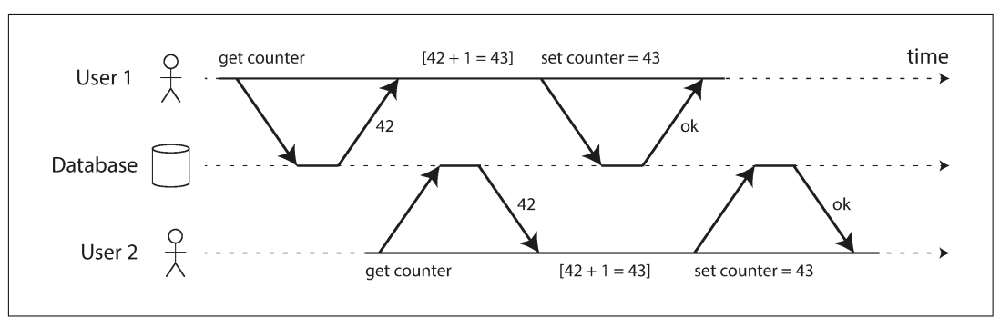

### `Durability`

پس از commit موفق، data نباید با crash database یا hardware fault فراموش شود. در single-node معمولاً data روی disk یا SSD و همراه WAL نوشته می‌شود تا recovery ممکن باشد. در replicated database ممکن است durability یعنی copy شدن روی تعداد مشخصی node.

هیچ durability مطلقی وجود ندارد: اگر همهٔ diskها و backupها هم‌زمان نابود شوند، database کاری نمی‌تواند بکند. disk، replication راه دور و backup، روش‌های کاهش ریسک‌اند و باید با هم استفاده شوند.

## replication در برابر durability

ذخیره روی disk و replication هیچ‌کدام کامل نیستند:

- disk ممکن است سالم بماند، اما با خرابی machine تا تعمیر یا انتقال disk دسترسی نداریم؛ replica می‌تواند availability را حفظ کند.
- power outage یا bug مشترک ممکن است همهٔ replicaها را هم‌زمان از بین ببرد و data فقط‌درحافظه از دست برود.
- asynchronous replication writeهای اخیر را هنگام خرابی leader از دست می‌دهد.
- قطع ناگهانی برق و bugهای firmware ممکن است guaranteeهای SSD و حتی `fsync` را نقض کند.
- تعامل پیچیدهٔ storage engine، filesystem و crash می‌تواند فایل را corrupt کند.
- data روی disk ممکن است به‌تدریج خراب شود و replica و backup جدید هم همان خرابی را copy کرده باشند؛ backup تاریخی لازم می‌شود.
- bad block و failure کامل در diskها واقعیت عملیاتی‌اند و SSD در نگه‌داری طولانی بدون برق هم risk دارد.

پس «guarantee» نظری را باید با backup، replica در محل دور و آزمایش recovery تقویت کرد.

## عملیات single-object و multi-object

atomicity و isolation در transaction چند write یعنی:

- اگر وسط sequence خطا رخ دهد، همهٔ writeهای قبلی همان transaction discard شوند.
- transactionهای هم‌زمان یا همهٔ تغییرهای یک transaction را ببینند یا هیچ‌کدام را؛ نه نصف آن را.

این وقتی مهم است که چند object باید هماهنگ بمانند. مثال application ایمیل: برای شمارش پیام‌های unread می‌توان هر بار این query را اجرا کرد:

```sql
SELECT COUNT(*)
FROM emails
WHERE recipient_id = 2 AND unread_flag = true;
```

اگر query کند باشد، counter جداگانه‌ای ذخیره می‌کنیم. هنگام ورود email باید هم email را insert و هم counter را increment کنیم؛ هنگام read شدن هم هر دو update شوند.

اگر user در لحظهٔ بین دو write بخواند، mailbox پیام unread را نشان می‌دهد اما counter صفر است. isolation این مشکل را حل می‌کند و atomicity تضمین می‌کند اگر update counter شکست خورد، insert email هم rollback شود.

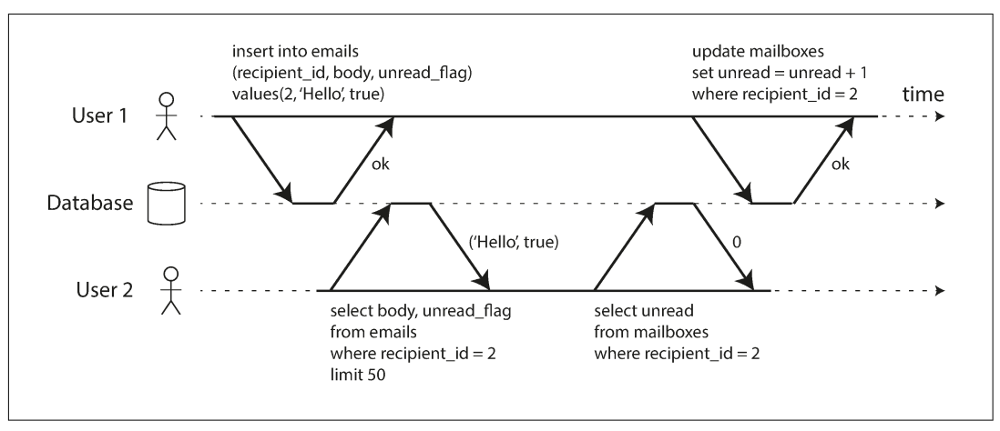

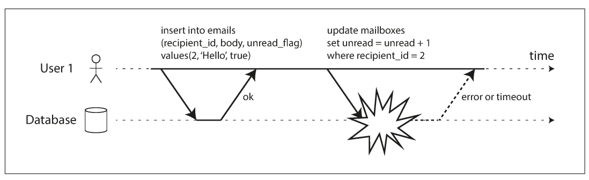

در relational database معمولاً عملیات میان `BEGIN TRANSACTION` و `COMMIT` روی همان connection یک transaction است. این model یک ضعف دارد: اگر connection قطع شود، client شاید نداند commit انجام شده یا نه. transaction manager می‌تواند به‌جای connection از transaction ID یکتا استفاده کند.

بسیاری nonrelational databaseها راهی برای گروه‌بندی چند object ندارند. حتی APIای مثل `multi-put` که چند key را یک‌جا update می‌کند الزاماً transaction نیست؛ ممکن است بعضی keyها موفق و بعضی fail شوند و state نیمه‌به‌روزشده بماند.

### write یک object

atomicity و isolation حتی برای یک object مهم‌اند. اگر document JSON بیست‌kilobyte باشد:

- آیا قطع network بعد از ارسال ده kilobyte، fragment غیرقابل‌parse را ذخیره می‌کند؟
- آیا قطع برق وسط overwrite، بخشی از value قدیم و بخشی از جدید را به‌جا می‌گذارد؟
- آیا reader در زمان write، value نیمه‌تغییرکرده می‌بیند؟

storage engineها تقریباً همیشه برای یک key-value یا document روی یک node atomicity و isolation فراهم می‌کنند. log برای recovery و lock برای جلوگیری از دسترسی هم‌زمان روش‌های معمول‌اند.

بعضی databaseها operationهای atomic پیچیده‌تری مانند increment یا `compare-and-set` دارند. این‌ها lost update را در یک object کم می‌کنند، اما transaction به معنای معمول نیستند؛ transaction معمولاً گروهی از operationهای چند object است.

## نیاز به multi-object transaction

پیاده‌سازی multi-object transaction در چند partition دشوار است و ممکن است availability یا performance را محدود کند، اما از نظر بنیادی ناممکن نیست. چرا هنوز به آن نیاز داریم؟

- در مدل relational، rowها foreign key به rowهای دیگر دارند. هنگام insert چند record مرتبط، باید همهٔ referenceها هم‌زمان درست باشند.
- در document model، fieldهای مرتبط اغلب داخل یک document هستند و update آن single-object است. اما denormalization برای حذف join رایج است؛ وقتی copyهای denormalized در چند document هستند، update همه باید هماهنگ شود.
- secondary indexها objectهای جدا از data اصلی‌اند. اگر transaction isolation نباشد، record ممکن است موقتاً در یک index باشد و در index دیگر نباشد.

بدون transaction هم می‌توان application را نوشت، اما error handling و concurrency logic بسیار سخت‌تر می‌شود.

### خطا و abort

فلسفهٔ ACID این است که اگر atomicity، isolation یا durability در خطر است، database کل transaction را abort کند، نه اینکه نصفه نگه دارد. اما leaderless datastoreها گاهی best-effort هستند: هرچه را بتوانند انجام می‌دهند و undo کامل را برعهدهٔ application می‌گذارند.

retry کردن transaction aborted روش ساده‌ای است، اما نکته‌هایی دارد:

- شاید commit واقعاً انجام شده باشد و فقط response در network گم شده باشد؛ retry می‌تواند operation را دوبار اجرا کند. deduplication یا idempotency لازم است.
- اگر علت overload باشد، retry فشار را بیشتر می‌کند. تعداد retry، `exponential backoff` و تفاوت خطای overload با خطای transient را مدیریت کنید.
- فقط خطاهای transient مانند deadlock، isolation violation، network interruption و failover مناسب retry هستند؛ constraint violation دائمی است.
- side effect بیرون از database—مثل email—با abort rollback نمی‌شود و retry نباید آن را دوباره بفرستد. برای commit هماهنگ چند سیستم به two-phase commit یا الگوهای دیگر نیاز است.
- اگر process client هنگام retry crash کند، ممکن است operation نیمه‌کاره رها شود.

## isolation levelهای ضعیف

اگر دو transaction به data مشترک دست نزنند، می‌توانند موازی اجرا شوند. مشکل وقتی رخ می‌دهد که یکی dataای را بخواند که دیگری هم‌زمان تغییر می‌دهد، یا هر دو یک data را write کنند.

concurrency bug با test معمولی سخت پیدا می‌شود؛ فقط timing بد آن را فعال می‌کند و بازتولیدش دشوار است. serializable isolation وانمود می‌کند concurrency وجود ندارد، اما performance cost دارد. به همین دلیل databaseها levelهای ضعیف‌تری دارند که بخشی از anomalyها را جلوگیری می‌کنند.

در این بخش چند level را با anomalyهای ممکن بررسی می‌کنیم، سپس serializability را می‌بینیم. صرف ACID بودن نام database کافی نیست؛ بسیاری relational databaseهای مشهور isolation ضعیف دارند.

## `Read committed`

ساده‌ترین isolation رایج دو guarantee دارد:

1. read فقط data `committed` را می‌بیند؛ `dirty read` نداریم.
2. write فقط data committed را overwrite می‌کند؛ `dirty write` نداریم.

### no dirty reads

اگر transaction A data را نوشته اما هنوز commit یا abort نکرده باشد، transaction B نباید آن را ببیند. writeهای A فقط هنگام commit visible می‌شوند و همهٔ آن‌ها یک‌جا دیده می‌شوند.

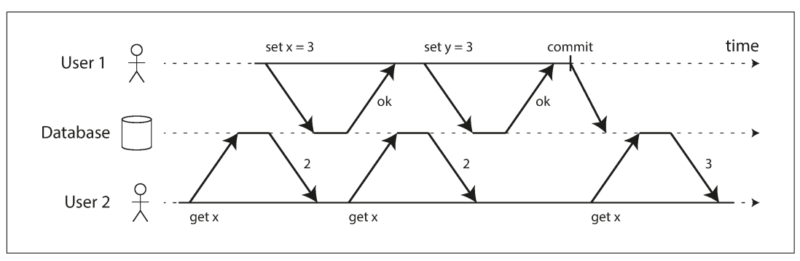

جلوگیری از dirty read مهم است، چون:

- transaction چند object را update می‌کند و reader نباید بخشی را ببیند.
- اگر transaction abort شود، dataای که دیده شده هرگز واقعاً committed نبوده؛ reasoning دربارهٔ اثر آن دشوار است.

### no dirty writes

اگر transaction A object را تغییر داده اما commit نکرده و transaction B روی همان object write کند، B مقدار uncommitted را overwrite می‌کند؛ این `dirty write` است. read committed معمولاً B را تا پایان A متوقف می‌کند.

مثلاً Alice و Bob هم‌زمان یک خودرو را می‌خرند. خرید دو write دارد: ثبت خریدار روی listing و ارسال invoice. بدون جلوگیری از dirty write ممکن است listing به Bob و invoice به Alice برسد. read committed این ترکیب را منع می‌کند.

اما read committed race counter را حل نمی‌کند؛ write دوم بعد از commit اول رخ داده و dirty write نیست، ولی همچنان lost update ممکن است.

### پیاده‌سازی read committed

برای dirty write معمولاً row-level lock استفاده می‌شود. writer lock را تا commit یا abort نگه می‌دارد و writer دیگر صبر می‌کند.

برای dirty read می‌توان reader را هم lock کرد، اما write طولانی readهای زیادی را متوقف می‌کند. روش رایج این است که database مقدار committed قبلی و مقدار جدید transaction را هم‌زمان نگه دارد. reader تا commit مقدار قدیم را می‌بیند و پس از commit به مقدار جدید سوییچ می‌کند.

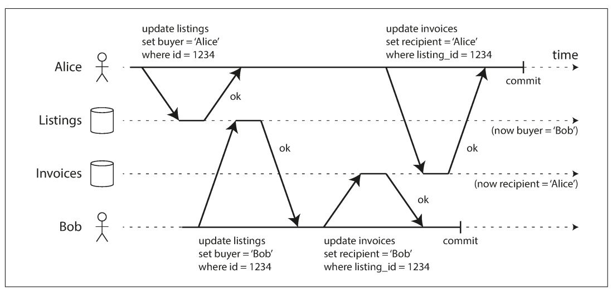

## `Snapshot isolation` و `Repeatable read`

read committed از read نصفه و write درهم‌تنیده جلوگیری می‌کند، اما anomaly دیگری دارد. Alice در بانک دو حساب ۵۰۰دلاری دارد. transaction صد دلار را از حساب اول کم و به حساب دوم اضافه می‌کند. اگر Alice بین دو write balances را بخواند، ممکن است ۵۰۰ و ۴۰۰ ببیند؛ مجموع ظاهراً ۹۰۰ است.

این `read skew` یا `nonrepeatable read` نام دارد؛ اگر حساب اول را دوباره بخواند، ۶۰۰ می‌بیند. valueهایی که دیده در زمان read committed بودند، پس این level آن را منع نمی‌کند.

این anomaly برای backup و query analytics خطرناک است؛ backup بزرگ ساعت‌ها طول می‌کشد و ممکن است بخش‌های مختلف را از زمان‌های متفاوت copy کند.

`snapshot isolation` می‌گوید هر transaction از یک snapshot سازگار می‌خواند: همهٔ dataای که در شروع transaction committed بوده، حتی اگر بعداً تغییر کند. long-running read-only query مانند backup و analytics معنای قابل‌فهم‌تری دارد.

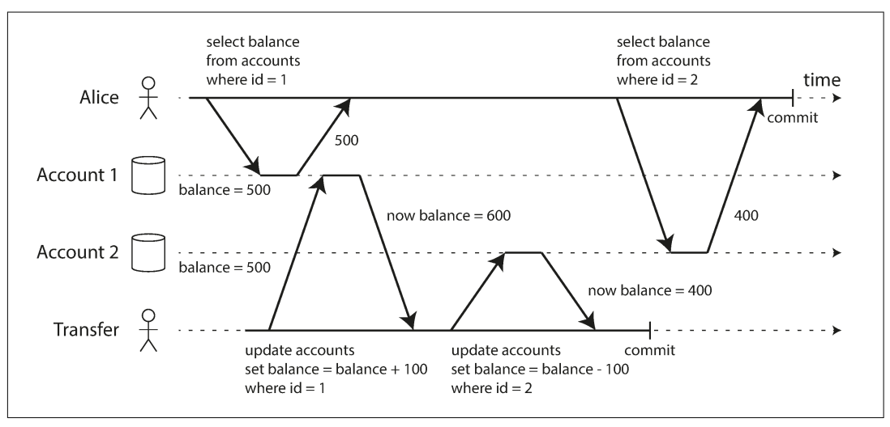

### پیاده‌سازی با `MVCC`

در snapshot isolation، read lock لازم ندارد؛ writerها فقط همدیگر را block می‌کنند. اصل مهم این است: reader writer را block نمی‌کند و writer reader را block نمی‌کند.

database چند version از هر object را نگه می‌دارد؛ این تکنیک `Multi-Version Concurrency Control` یا `MVCC` است. transaction شروع‌شده یک transaction ID افزایشی می‌گیرد. row با `created_by` شناسهٔ سازنده و `deleted_by` شناسهٔ deleteکننده مشخص می‌شود.

delete معمولاً row را فوراً پاک نمی‌کند؛ فقط deleted_by می‌گذارد. بعداً وقتی هیچ transactionی به آن version نیاز ندارد، garbage collection آن را حذف می‌کند. update از نظر داخلی delete version قدیم و create version جدید است.

visibility snapshot معمولاً چنین ruleهایی دارد:

1. transactionهای in-progress در زمان شروع snapshot نادیده گرفته می‌شوند، حتی اگر بعداً commit کنند.
2. write transactionهای aborted نادیده گرفته می‌شوند.
3. write transactionهایی با ID جدیدتر از transaction خواننده نادیده گرفته می‌شوند.
4. سایر writeهای committed دیده می‌شوند.

در نتیجه transaction طولانی می‌تواند version قدیمی‌ای را بخواند که از نگاه transactionهای جدید overwrite شده است، بدون اینکه consistency snapshot بشکند.

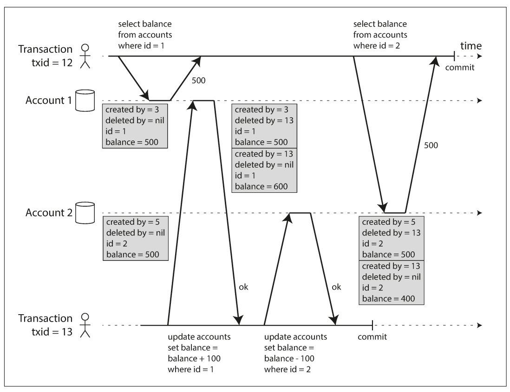

index می‌تواند به همهٔ versionها اشاره کند و reader versionهای invisible را filter کند. PostgreSQL بهینه‌سازی‌هایی برای جای دادن versionهای یک object در همان page دارد. روش دیگر `copy-on-write B-tree` است: هر write root جدید و pageهای parent جدید می‌سازد؛ root قدیمی خودش یک snapshot immutable است. در این روش هم compaction و garbage collection لازم است.

### سردرگمی نام repeatable read

Oracle snapshot isolation را `serializable` می‌نامد و PostgreSQL و MySQL آن را `repeatable read`. SQL standard مفهوم snapshot isolation را ندارد و repeatable read را با تعریف قدیمی System R توضیح می‌دهد؛ بنابراین databaseهایی با نام یکسان guarantee متفاوت دارند. حتی DB2 واژهٔ repeatable read را برای serializability به‌کار می‌برد. به نام level اکتفا نکنید؛ رفتار واقعی را test کنید.

## جلوگیری از `Lost updates`

lost update وقتی رخ می‌دهد که دو transaction چرخهٔ read–modify–write را هم‌زمان اجرا کنند و write دوم تغییر اول را شامل نکند. نمونه‌ها:

- افزایش counter یا account balance
- اضافه کردن item به list داخل JSON document
- دو user که یک wiki page را با ارسال کل محتوای کامل overwrite می‌کنند

### atomic write operation

اگر operation با atomic update قابل‌بیان است، معمولاً بهترین راه است:

```sql
UPDATE counters
SET value = value + 1
WHERE key = 'foo';
```

MongoDB برای تغییر بخشی از JSON و Redis برای data structureها operationهای مشابه دارد. این operationها معمولاً lock انحصاری می‌گیرند یا روی یک thread اجرا می‌شوند. ORMها ممکن است developer را ناخواسته به read-modify-write unsafe سوق دهند.

### explicit locking

اگر atomic operation کافی نیست، object را صریح lock کنید:

```sql
BEGIN TRANSACTION;

SELECT * FROM figures
WHERE name = 'robot' AND game_id = 222
FOR UPDATE;

-- بررسی معتبر بودن حرکت و سپس update موقعیت
UPDATE figures SET position = 'c4' WHERE id = 1234;

COMMIT;
```

`FOR UPDATE` rowهای result را lock می‌کند. این برای بازی چندنفره مفید است؛ حرکت فقط وقتی مجاز است که ruleهای بازی رعایت شوند و این منطق شاید در database قابل‌بیان نباشد. اما lock جاافتاده را نباید فراموش کرد.

### تشخیص خودکار lost update

database می‌تواند transactionهای concurrent را موازی اجرا کند و هنگام commit lost update را detect و یکی را abort کند. PostgreSQL repeatable read، Oracle serializable و SQL Server snapshot isolation چنین detectionی دارند؛ MySQL/InnoDB repeatable read در برخی نسخه‌ها ندارد.

این feature از خطای انسانی بهتر است، چون application مجبور نیست همیشه lock مخصوصی را به‌کار ببرد.

### `Compare-and-set`

در database بدون transaction، operation `compare-and-set` فقط وقتی write می‌کند که value هنوز همان چیزی باشد که در read قبلی دیده‌ایم:

```sql
UPDATE wiki_pages
SET content = 'new content'
WHERE id = 1234 AND content = 'old content';
```

اگر update اثر نکرد، باید دوباره read و retry کرد. اما اگر database شرط WHERE را از snapshot قدیمی بخواند، این operation ممکن است lost update را واقعاً منع نکند؛ implementation را بررسی کنید.

### conflict در replication

lock و compare-and-set فرض می‌کنند یک copy به‌روز وجود دارد. در multi-leader و leaderless چند copy می‌تواند هم‌زمان تغییر کند؛ lock روی یک node کافی نیست. این سیستم‌ها معمولاً siblingهای conflict را نگه می‌دارند و با application یا CRDT merge می‌کنند. operationهای commutative مانند increment counter یا add به set در replicaها امن‌ترند، چون ترتیب اعمال نتیجه را عوض نمی‌کند. LWW برعکس، به lost update حساس است.

## `Write skew` و `Phantom`

dirty write و lost update وقتی object مشترک تغییر می‌کند دیده می‌شوند. اما raceهای ظریف‌تری هم وجود دارد.

فرض کنید بیمارستان همیشه باید دست‌کم یک doctor on-call داشته باشد. Alice و Bob دو doctor حاضرند و هر دو هم‌زمان درخواست off-call می‌دهند. هر transaction ابتدا می‌بیند دو doctor on-call هستند، پس خودش را off-call می‌کند. snapshot isolation باعث می‌شود هر دو همان snapshot را ببینند؛ هر دو commit می‌کنند و هیچ doctorی باقی نمی‌ماند.

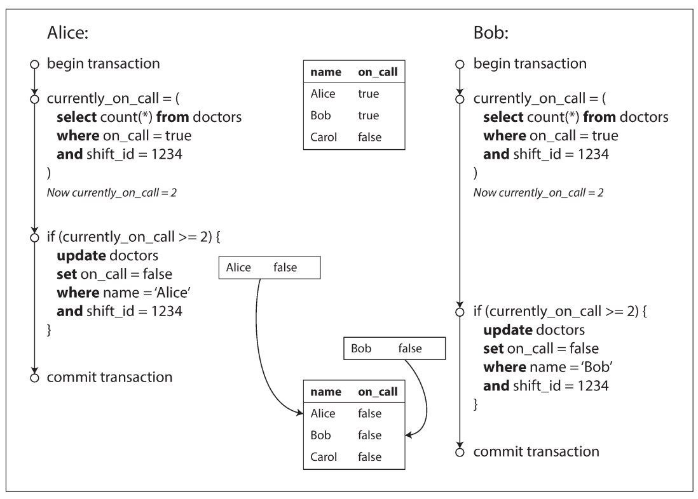

این `write skew` است: transactionها دو object متفاوت را update کرده‌اند، پس dirty write یا lost update نیست. اگر یکی زودتر اجرا می‌شد، دیگری نباید اجازهٔ off-call می‌گرفت.

### راه‌های جلوگیری

- atomic single-object کافی نیست چون چند object درگیر است.
- lost update detection معمولاً write skew را تشخیص نمی‌دهد.
- constraintهای ساده مثل uniqueness و foreign key کمک می‌کنند، اما invariant «حداقل یک doctor» چند object را می‌خواهد؛ trigger یا materialized view شاید لازم شود.
- بهترین راه serializable isolation است. اگر در دسترس نباشد، rowهای مورد اتکا را با `SELECT FOR UPDATE` قفل کنید:

```sql
BEGIN TRANSACTION;

SELECT * FROM doctors
WHERE on_call = true AND shift_id = 1234
FOR UPDATE;

UPDATE doctors
SET on_call = false
WHERE name = 'Alice' AND shift_id = 1234;

COMMIT;
```

### مثال‌های دیگر

#### رزرو اتاق

برای جلوگیری از double booking ابتدا bookingهای overlapکننده را می‌شماریم و اگر صفر بود insert می‌کنیم:

```sql
BEGIN TRANSACTION;

SELECT COUNT(*) FROM bookings
WHERE room_id = 123
  AND end_time > '2015-01-01 12:00'
  AND start_time < '2015-01-01 13:00';

INSERT INTO bookings
  (room_id, start_time, end_time, user_id)
VALUES
  (123, '2015-01-01 12:00', '2015-01-01 13:00', 666);

COMMIT;
```

دو transaction می‌توانند هر دو query صفر ببینند و هر دو insert کنند؛ snapshot isolation کافی نیست.

#### بازی چندنفره

lock روی یک figure مانع حرکت هم‌زمان همان figure می‌شود، اما ممکن است دو figure متفاوت به یک خانه بروند یا rule دیگری را نقض کنند؛ اگر unique constraint کافی نباشد، write skew باقی است.

#### username یکتا

دو user هم‌زمان availability یک username را check و account می‌سازند. unique constraint ساده transaction دوم را abort می‌کند.

#### double-spending

اگر چند spending item هم‌زمان insert شوند و هر transaction مجموع snapshot مثبت ببیند، مجموع واقعی ممکن است منفی شود.

### phantom

الگوی مشترک این مثال‌ها:

1. `SELECT` وجود یا نبود rowهای مطابق شرط را بررسی می‌کند.
2. application بر اساس نتیجه تصمیم می‌گیرد.
3. `INSERT`، `UPDATE` یا `DELETE` شرط را تغییر می‌دهد و commit می‌کند.

اگر query اول را پس از write تکرار کنیم نتیجه عوض شده است. این یعنی write روی مجموعه‌ای از rowها اثر گذاشته که query دیگر transaction هنگام snapshot ندیده است؛ چنین row تازه‌پدیداری `phantom` نام دارد.

در doctor example rowهای readشده همان rowهای updateشده بودند و lock آن‌ها کافی بود. در booking یا username query نبودن row را check می‌کند و `SELECT FOR UPDATE` چیزی برای lock کردن ندارد.

### materializing conflicts

برای phantom می‌توان object مصنوعی ساخت. در booking، tableای از همهٔ ترکیب‌های room و slot پانزده‌دقیقه‌ای بسازیم. transaction قبل از check booking، rowهای slot را `FOR UPDATE` lock کند. table اطلاعات booking نیست؛ فقط collection lockهای concrete است.

این راه `materializing conflicts` نام دارد، اما طراحی‌اش دشوار و نشت دادن سازوکار concurrency به data model است. اگر serializable isolation داریم، معمولاً گزینهٔ بهتری است.

## `Serializability`

isolation levelهای ضعیف سخت و inconsistent هستند؛ در application بزرگ تشخیص safe بودن دشوار و test کردن race nondeterministic است. پاسخ کلاسیک researchers این است: `serializable isolation` استفاده کنید.

serializable تضمین می‌کند نتیجهٔ transactionهای موازی همان نتیجهٔ اجرای serial آن‌ها باشد؛ database همهٔ race conditionهای ممکن را جلوگیری می‌کند، به‌شرط اینکه transaction به‌صورت مستقل درست باشد.

سه روش اصلی پیاده‌سازی:

1. اجرای واقعی transactionها به‌صورت serial
2. `Two-Phase Locking` یا `2PL`
3. `Serializable Snapshot Isolation` یا `SSI`

### اجرای واقعی serial

ساده‌ترین راه حذف concurrency است: فقط یک transaction در هر لحظه و روی یک thread اجرا شود. چون transactionها هم‌زمان نیستند، isolation ذاتاً serializable است.

این روش با ارزان شدن RAM و شناخت بهتر workloadهای OLTP عملی‌تر شد. active dataset می‌تواند در حافظه جا شود و transactionهای OLTP معمولاً کوتاه و کم‌operation هستند. queryهای analytic طولانی و read-only بیرون از loop و روی snapshot اجرا می‌شوند.

`VoltDB/H-Store`، Redis و Datomic از این ایده استفاده می‌کنند. حذف lock overhead گاهی یک thread را بسیار سریع می‌کند، اما throughput به یک CPU core محدود است.

#### stored procedure

در transaction interactive، application بین query و response روی network رفت‌وبرگشت دارد. اگر فقط یک transaction در هر لحظه اجرا شود، thread بیشتر زمان را منتظر query بعدی می‌ماند. پس systemهای serial معمولاً کل transaction را از قبل به database می‌دهند؛ یعنی `stored procedure`.

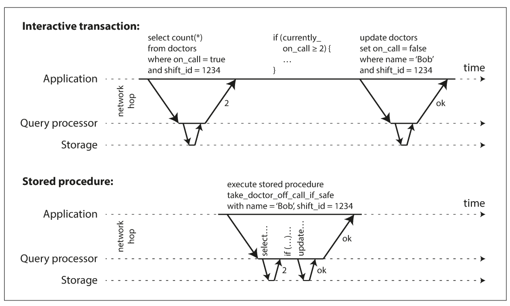

stored procedure برای مدت طولانی در relational databaseها بوده، اما زبان vendor-specific، مدیریت و debugging سخت، version control و monitoring دشوار و حساسیت database به مصرف CPU/RAM عیب‌های آن‌اند. implementationهای جدید از languageهای عمومی‌تر استفاده می‌کنند: Java/Groovy در VoltDB، Java/Clojure در Datomic و Lua در Redis.

VoltDB برای replication هم stored procedure را روی هر replica اجرا می‌کند، پس procedure باید deterministic باشد؛ زمان و random باید از APIهای deterministic گرفته شوند.

#### partitioning و serial execution

اگر dataset طوری partition شود که هر transaction فقط یک partition را لمس کند، هر partition thread خودش را دارد و throughput با CPUها تقریباً خطی رشد می‌کند. transaction چندpartitionی باید همهٔ partitionها را lock-step هماهنگ کند و بسیار کندتر است.

شرایط مناسب اجرای serial:

- transactionها کوچک و سریع باشند؛ یک transaction کند همه را متوقف می‌کند.
- active dataset در memory باشد.
- write throughput در یک core جا شود یا partitionها بدون cross-partition transaction کار کنند.
- cross-partition transaction محدود بماند.

## `Two-Phase Locking (2PL)`

2PL با `Two-Phase Commit` یا 2PC فرق دارد؛ 2PL الگوریتم isolation است، 2PC protocol commit توزیع‌شده است.

در 2PL چند transaction می‌توانند object را هم‌زمان read کنند تا وقتی هیچ‌کس write نمی‌کند. به‌محض اینکه یک transaction بخواهد object را modify یا delete کند، دسترسی exclusive لازم است:

- اگر A object را read کرده و B بخواهد write کند، B تا commit یا abort شدن A صبر می‌کند.
- اگر A object را write کرده و B بخواهد read کند، B باید صبر کند.

در snapshot isolation reader و writer همدیگر را block نمی‌کنند؛ در 2PL writer reader را هم block می‌کند و reader writer را.

### پیاده‌سازی lock

lock می‌تواند `shared` یا `exclusive` باشد:

- read، shared lock می‌گیرد؛ چند reader می‌توانند هم‌زمان باشند، مگر exclusive lock وجود داشته باشد.
- write، exclusive lock می‌گیرد؛ هیچ lock دیگری هم‌زمان مجاز نیست.
- transactionی که read و بعد write می‌کند shared lock را به exclusive upgrade می‌کند.
- lock تا commit یا abort آزاد نمی‌شود؛ phase اول گرفتن lock و phase دوم آزاد کردن همهٔ lockهاست.

اگر A منتظر lock B و B منتظر lock A باشد، `deadlock` رخ می‌دهد. database آن را detect می‌کند، یکی را abort و دیگری را آزاد می‌کند؛ application باید transaction aborted را retry کند.

### هزینهٔ 2PL

2PL lock زیاد و concurrency کم دارد. اگر transaction طولانی باشد، صف ایجاد می‌شود و tail latency بالا می‌رود. یک transaction کند یا transactionی که objectهای زیادی lock می‌کند می‌تواند کل workload را متوقف کند. deadlock هم زیر 2PL بیشتر رخ می‌دهد و retry کار انجام‌شده را دوباره تکرار می‌کند.

### `Predicate lock`

برای جلوگیری از phantom، lock روی یک row کافی نیست؛ باید روی نتیجهٔ شرط جست‌وجو lock بگذاریم. مثلاً transactionی که booking اتاق ۱۲۳ بین ظهر و ۱ را query کرده، نباید اجازه دهد transaction دیگری booking overlapکننده insert یا update کند.

predicate lock روی همهٔ objectهایی است که شرط را match می‌کنند، حتی objectهایی که هنوز وجود ندارند. read شرط را shared predicate lock می‌کند؛ insert/update/delete اگر old یا new value شرط را match کند باید با lock موجود هماهنگ شود.

### `Index-range lock`

predicate lock دقیق، بررسی lockهای زیاد را کند می‌کند. databaseها معمولاً از `index-range lock` یا `next-key lock` استفاده می‌کنند؛ predicate را کمی بزرگ‌تر اما ساده‌تر روی index اعمال می‌کنند.

اگر index روی `room_id` باشد، query اتاق ۱۲۳ می‌تواند همان index entry را shared lock کند. اگر index روی time باشد، بازهٔ هم‌پوشان زمان lock می‌شود. write مربوط به room یا time همان بخش index را تغییر می‌دهد و با lock برخورد می‌کند.

این روش phantom و write skew را مؤثر کنترل می‌کند، هرچند ممکن است range بزرگ‌تری از لازم را lock کند. اگر index مناسبی وجود نداشته باشد، database می‌تواند کل table را shared lock کند؛ safe اما بسیار کند.

## `Serializable Snapshot Isolation (SSI)`

تا اینجا 2PL performance ضعیف و serial execution scalability محدود داشت؛ isolation ضعیف هم race condition دارد. `SSI` تلاش می‌کند serializability کامل را با هزینه‌ای نزدیک snapshot isolation فراهم کند. در PostgreSQL از نسخهٔ 9.1 به‌عنوان serializable و در FoundationDB با ایده‌ای مشابه استفاده شده است.

2PL `pessimistic concurrency control` است: اگر احتمال خطر هست، صبر می‌کند. serial execution هم شکل افراطی همین بدبینی است. SSI `optimistic concurrency control` است: transaction ادامه می‌دهد و هنگام commit بررسی می‌شود؛ اگر رفتار serializable نباشد abort می‌شود.

optimistic روش خوبی برای contention کم و capacity آزاد است، اما اگر transactionهای زیادی روی object مشترک باشند، abort و retry زیاد می‌شود و throughput را بدتر می‌کند. operationهای commutative مثل چند increment هم‌زمان conflict کمتری دارند.

SSI بر snapshot isolation بنا شده است: همهٔ readهای transaction از snapshot ثابت‌اند و الگوریتم conflict میان read و write را track می‌کند.

### تصمیم بر اساس premise قدیمی

در write skew، transaction query می‌کند—مثلاً «دو doctor on-call هستند»—و بر اساس آن تصمیم می‌گیرد. تا زمان commit، data premise ممکن است تغییر کرده باشد. database باید بفهمد query و write transaction به هم causal dependency دارند و اگر premise دیگر معتبر نیست، transaction را abort کند.

دو حالت مهم برای detect کردن:

#### خواندن version قدیمی MVCC

transaction ۴۳ snapshot می‌گیرد و write uncommitted transaction ۴۲ را نمی‌بیند. اگر ۴۲ قبل از commit ۴۳ commit کند، چیزی که ۴۳ هنگام read نادیده گرفته بود حالا اثر کرده است. database این ignored write را track می‌کند و هنگام commit ۴۳ آن را بررسی می‌کند. اگر لازم باشد ۴۳ abort می‌شود.

برای read-only transaction abort لازم نیست؛ همچنین ممکن است ۴۲ در نهایت abort کند. صبر کردن تا commit از abort بی‌مورد جلوگیری می‌کند.

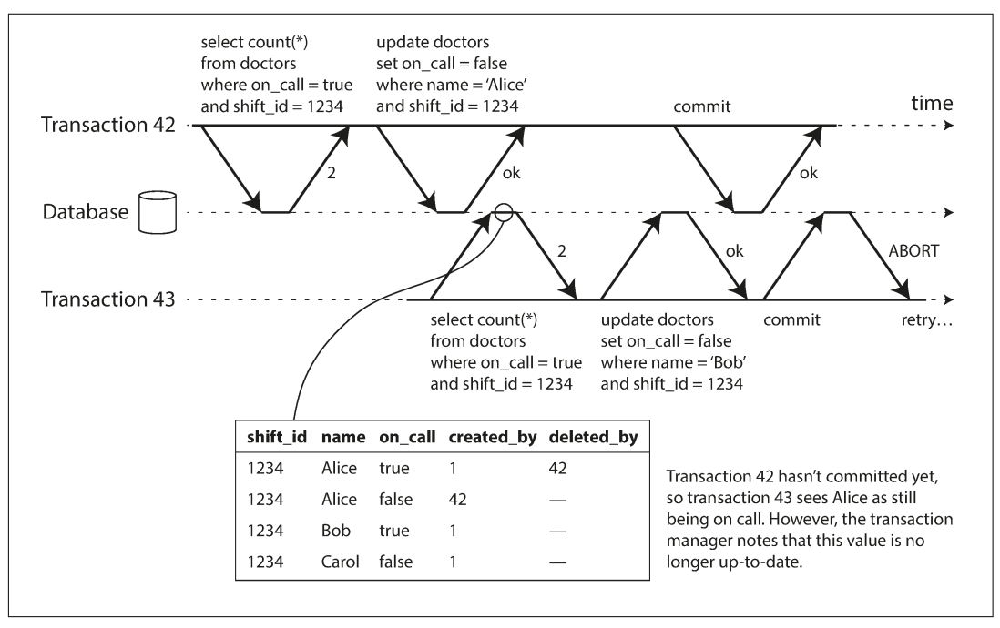

#### write مؤثر بر read قبلی

اگر transaction A شرطی را read کند و transaction B بعداً data همان شرط را تغییر دهد، B نباید بی‌خبر A را commit بگذارد. database با index یا table metadata ثبت می‌کند کدام transaction چه rangeای را خوانده است. این lockها block نمی‌کنند؛ مانند tripwire فقط reader را از invalid شدن premise باخبر می‌کنند.

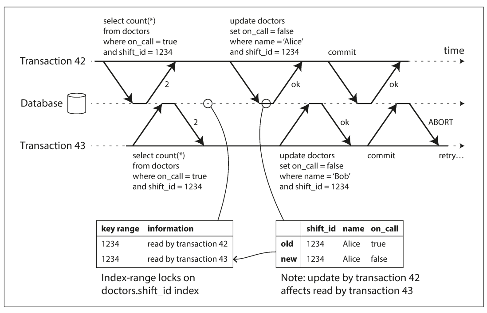

اگر A و B هر دو doctorهای shift ۱۲۳۴ را query کنند و سپس write کنند، یکی می‌تواند commit شود؛ دیگری وقتی می‌خواهد commit کند conflict قبلی را می‌بیند و abort می‌شود.

### performance SSI

هرچه جزئیات read و write دقیق‌تر track شود، abort غیرضروری کمتر اما bookkeeping گران‌تر است. tracking coarse سریع‌تر است، اما transaction بیشتری abort می‌شود. SSI نسبت به 2PL مزیت مهم دارد: transaction برای lock منتظر نمی‌ماند؛ reader و writer یکدیگر را block نمی‌کنند و read-only query روی snapshot بدون lock اجرا می‌شود.

SSI مانند serial execution به یک core محدود نیست؛ conflict detection می‌تواند میان چند machine توزیع شود و transaction چندpartitionی را هم serializable نگه دارد. بااین‌حال read-write transactionهای طولانی احتمال conflict و abort بیشتری دارند؛ read-only طولانی معمولاً مشکلی ندارد.

## جمع‌بندی فصل

transaction abstractionای است که بسیاری fault و concurrency problem را به یک outcome ساده یعنی abort تبدیل می‌کند؛ application فقط باید transaction را درست retry کند. برای access pattern سادهٔ single-record شاید transaction لازم نباشد، اما برای چند object و denormalized data، reasoning و consistency را بسیار آسان می‌کند.

anomalyهای مهم:

- **dirty read:** خواندن writeای که هنوز commit نشده؛ read committed و قوی‌تر مانع آن‌اند.
- **dirty write:** overwrite کردن write uncommitted transaction دیگر؛ تقریباً همهٔ implementationها از آن جلوگیری می‌کنند.
- **read skew:** دیدن بخش‌های database از زمان‌های مختلف؛ snapshot isolation و MVCC راه رایج‌اند.
- **lost update:** دو read-modify-write هم‌زمان و overwrite شدن یکی؛ atomic operation، lock یا detection لازم است.
- **write skew:** تصمیم بر اساس premiseای که هنگام write دیگر درست نیست؛ serializable isolation لازم است.
- **phantom:** write مجموعهٔ rowهای مطابق query دیگر را تغییر می‌دهد؛ predicate یا index-range lock لازم است.

isolation ضعیف بخشی از این anomalyها را پوشش می‌دهد و بقیه را به application می‌سپارد. serializability همه را پوشش می‌دهد و سه پیاده‌سازی اصلی دارد:

1. **serial execution:** سریع و ساده برای transactionهای کوچک، data در memory و throughput محدود.
2. **2PL:** استاندارد قدیمی و کامل، اما lock، deadlock و latency ناپایدار.
3. **SSI:** optimistic، بدون block عمده، اما با abort هنگام conflict.

این بحث با مدل relational توضیح داده شد، اما transaction برای هر data model ارزشمند است. در distributed database، transaction چند node چالش‌های جدیدی دارد که در فصل‌های بعد بررسی می‌شود.

## تعریف مستقل اصطلاحات

### `transaction`

گروهی از read و write که یک unit منطقی‌اند: یا همه commit می‌شوند یا همه abort/rollback.

### `ACID`

مخفف `Atomicity`، `Consistency`، `Isolation` و `Durability`. این acronym به‌تنهایی guarantee دقیق یک محصول را مشخص نمی‌کند؛ باید semantics واقعی isolation و commit را بخوانیم.

### `atomicity`

در ACID، اگر transaction کامل نشود هیچ write آن باقی نمی‌ماند. atomicity دربارهٔ partial failure است، نه هم‌زمانی.

### `consistency` در ACID

حفظ invariantهای application مانند balance حساب یا foreign key. تعریف invariant و transaction درست مسئولیت application است؛ با consistency replica یا linearizability یکی نیست.

### `isolation`

جلوگیری از اثرگذاری نامطلوب transactionهای هم‌زمان بر یکدیگر. قوی‌ترین صورت معمول آن serializability است.

### `durability`

پس از commit، data در برابر crash و fault نباید فراموش شود. disk، WAL، replication و backup هرکدام بخشی از راه‌حل‌اند.

### `dirty read` و `dirty write`

`dirty read` دیدن write uncommitted است. `dirty write` overwrite کردن write uncommitted transaction دیگر است.

### `read committed`

isolation levelی که فقط data committed را می‌خواند و write روی data uncommitted را متوقف می‌کند؛ read skew و lost update را الزاماً حل نمی‌کند.

### `snapshot isolation`

هر transaction از snapshot سازگار زمان شروع خود می‌خواند. معمولاً با MVCC ساخته می‌شود و read را از writer جدا می‌کند.

### `MVCC`

مخفف `Multi-Version Concurrency Control`. database چند version از object را نگه می‌دارد تا transactionهای مختلف snapshot مناسب خود را ببینند.

### `lost update`

از دست رفتن تغییر یکی از دو transaction در read-modify-write هم‌زمان. atomic update، lock، compare-and-set یا conflict detection می‌تواند جلوی آن را بگیرد.

### `write skew`

دو transaction بر اساس یک snapshot تصمیم می‌گیرند و objectهای متفاوتی را تغییر می‌دهند، به‌طوری‌که invariant مشترک نقض می‌شود.

### `phantom`

تغییر نتیجهٔ یک search query به‌دلیل insert/update/delete transaction دیگر، به‌خصوص وقتی query نبودن rowها را بررسی می‌کند.

### `serializability`

نتیجهٔ transactionهای concurrent باید معادل اجرای همان transactionها به‌صورت یکی‌یکی باشد. این قوی‌ترین isolation عمومی است.

### `2PL`

مخفف `Two-Phase Locking`. transaction در مرحلهٔ اول lock می‌گیرد و تا پایان نگه می‌دارد؛ در مرحلهٔ دوم lockها آزاد می‌شوند. با 2PC فرق دارد.

### `predicate lock` و `index-range lock`

predicate lock روی همهٔ objectهای مطابق یک شرط، حتی objectهای آینده، اعمال می‌شود. index-range lock تقریب کم‌هزینه‌تری است که روی entry یا range یک index قرار می‌گیرد.

### `SSI`

مخفف `Serializable Snapshot Isolation`. transactionها از snapshot می‌خوانند و بدون block زیاد ادامه می‌دهند؛ database conflictهای serialization را detect و transaction ناسازگار را abort می‌کند.

### `compare-and-set`

operationای که فقط اگر value هنوز برابر مقدار readشده باشد write می‌کند. برای جلوگیری از lost update در single-object datastore مفید است، اما safety آن به implementation isolation وابسته است.

### `idempotency`

ویژگی retry-safe بودن یک operation؛ اجرای دوبارهٔ request نتیجهٔ نهایی جدیدی ایجاد نمی‌کند. در transactionی که commit شده اما acknowledgement آن گم شده، idempotency از duplicate شدن side effect جلوگیری می‌کند.

## ارتباط با فصل‌های دیگر

- [فصل ۳: `Storage` و `Retrieval`](../03-storage-retrieval/README.md) — WAL، recovery و MVCC روی storage engine.
- [فصل ۴: `Encoding` و `Evolution`](../04-encoding-evolution/README.md) — retry، idempotency و side effectهای بیرون از transaction.
- [فصل ۵: `Replication`](../05-replication/README.md) — lost update و conflict در multi-leader/leaderless.
- [فصل ۶: `Partitioning`](../06-partitioning/README.md) — single-partition و cross-partition transaction.
- [فصل ۸: `Distributed Systems`](../08-distributed-systems/README.md) — timeout و ابهام commit در network failure.
- [فصل ۹: `Consistency` و `Consensus`](../09-consistency-consensus/README.md) — transaction توزیع‌شده و 2PC.
- [فصل ۱۱: `Stream Processing`](../11-stream-processing/README.md) — side effect، exactly-once و الگوهای جایگزین transaction.
