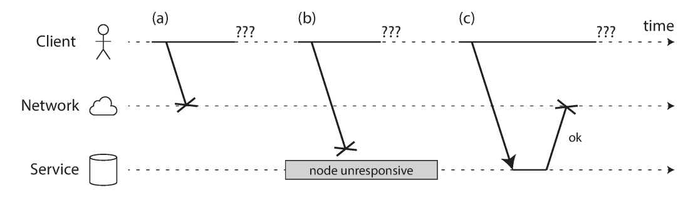
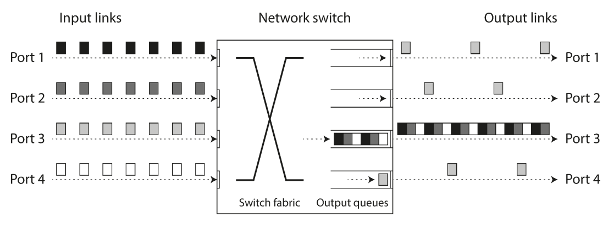
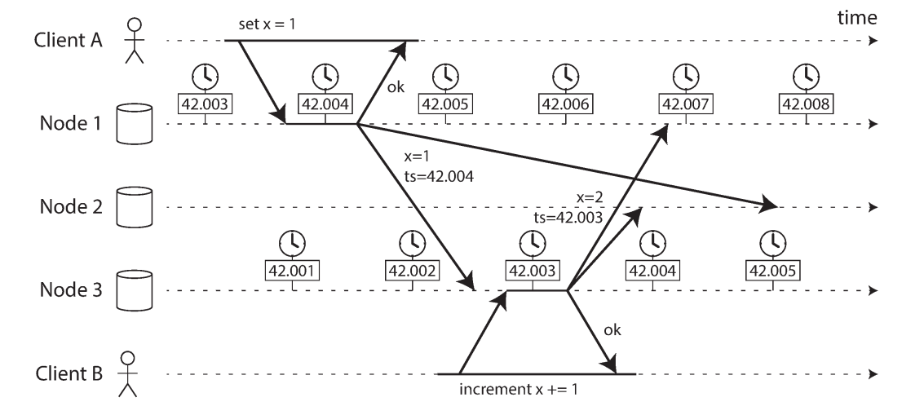
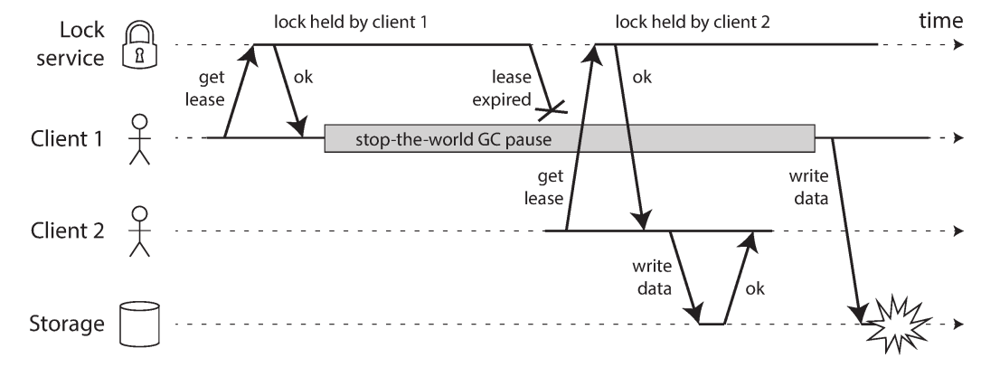
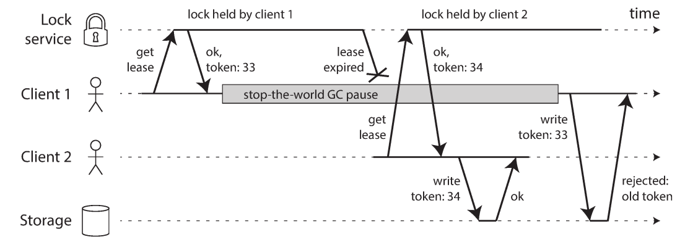

# فصل ۸: دردسرهای `Distributed Systems`

## The Trouble with Distributed Systems

> تازه با هم آشنا شده‌ایم؛
> شبکه کند است؛
> این هم دادهٔ من—اگر توانستی ذخیره‌اش کن.

در فصل‌های قبل بارها دیدیم که سیستم‌ها هنگام بروز مشکل چه رفتاری دارند: `failover` برای ازکارافتادن replica، `replication lag` و سطح‌های ضعیف `isolation` در `transaction`. با شناختن حالت‌های مرزی، می‌توانیم نرم‌افزار را طوری طراحی کنیم که در آن وضعیت‌ها نیز رفتار قابل‌قبولی داشته باشد. بااین‌حال، تا اینجا هنوز کمی بیش‌ازحد خوش‌بین بوده‌ایم. در این فصل بدترین فرض عملی را در نظر می‌گیریم: هر چیزی که بتواند خراب شود، ممکن است خراب شود.

نوشتن برنامه برای یک computer و نوشتن برنامه‌ای که روی چند computer و از راه network کار می‌کند، اساساً یکسان نیست. در سیستم چندگرهی، راه‌های بسیار بیشتری برای خطا وجود دارد و گاهی حتی نمی‌دانیم عملیاتی که درخواست کرده‌ایم انجام شده است یا نه. هدف مهندس این نیست که خرابی را انکار کند؛ هدف این است که سیستم، با وجود خرابی، ضمانت‌هایی را که کاربر انتظار دارد تا حد ممکن حفظ کند.

در این فصل مسئله‌های مربوط به network، clock و زمان‌بندی پردازش را بررسی می‌کنیم و سپس به این پرسش می‌رسیم که یک node در یک `distributed system` چه چیزهایی را واقعاً می‌داند. در پایان، مفهوم `system model` را تعریف می‌کنیم تا بتوانیم دربارهٔ درستی الگوریتم‌ها دقیق صحبت کنیم.

## خرابی و `Partial Failure`

در یک computer منفرد، رفتار برنامه معمولاً قابل پیش‌بینی است: یا عملیات نتیجه می‌دهد یا کل computer از کار می‌افتد. اگر hardware خراب شود—مثلاً memory آسیب ببیند یا اتصالی قطع شود—نتیجه معمولاً `kernel panic`، `blue screen` یا بوت‌نشدن است. این رفتار عمدی است: ترجیح می‌دهیم computer کاملاً متوقف شود تا اینکه بی‌سروصدا جواب نادرست بدهد.

این مدل، واقعیت فیزیکی مبهم را پنهان می‌کند و یک مدل آرمانی به برنامه می‌دهد. دستور CPU در شرایط یکسان همان نتیجه را دارد؛ داده‌ای که در memory یا disk نوشته شده، خودبه‌خود تصادفی تغییر نمی‌کند. اما وقتی چند computer از راه network با هم کار می‌کنند، این سپر از بین می‌رود.

در یک `distributed system` ممکن است بخشی از سامانه خراب باشد، درحالی‌که قسمت‌های دیگر سالم‌اند. به این وضعیت `partial failure` می‌گوییم. این خرابی برخلاف خرابی کامل یک computer، `nondeterministic` است: همان درخواست ممکن است یک بار موفق شود و بار دیگر شکست بخورد؛ network ممکن است یک پیام را دیر برساند یا اصلاً نرساند؛ و پاسخ ممکن است گم شود، در حالی‌که خود درخواست اجرا شده است.

در datacenter ممکن است network partition طولانی رخ دهد، یک `PDU` یا switch از کار بیفتد، برق چند rack قطع شود، backbone یک datacenter فروبریزد، یا حتی وسیله‌ای به سامانهٔ سرمایش برخورد کند. مهم نیست این رخدادها در هر روز چقدر بعید به نظر می‌رسند؛ در سامانهٔ بزرگی که دائماً کار می‌کند، دیر یا زود نمونه‌ای از آن‌ها رخ می‌دهد.

همین امکانِ خرابی جزئی دلیل اصلی دشواری سیستم‌های توزیع‌شده است. در یک برنامهٔ تک‌ماشینی، یک `function` معمولاً یا برمی‌گردد یا process می‌میرد. در network، نه‌تنها نتیجه نامعلوم است، بلکه مدت رسیدن پیام نیز نامعلوم است.

## `Cloud Computing` و `Supercomputing`

برای ساخت سیستم‌های بزرگ، از نظر شیوهٔ برخورد با خرابی، دو سر یک طیف را می‌توان دید:

- در `high-performance computing (HPC)`، ابررایانه‌ای با هزاران CPU برای کارهایی مثل پیش‌بینی آب‌وهوا یا شبیه‌سازی حرکت اتم‌ها استفاده می‌شود. کار معمولاً هر چند وقت یک‌بار `checkpoint` می‌گیرد. اگر یک node خراب شود، کل کار متوقف می‌شود؛ پس از تعمیر node، محاسبه از آخرین checkpoint از سر گرفته می‌شود.
- `cloud computing` تعریف واحد و دقیقی ندارد، اما معمولاً با datacenter چندمستاجری، computerهای معمولی، network مبتنی بر IP و Ethernet، تخصیص `elastic` و عندالطلب منابع و billing بر اساس مصرف شناخته می‌شود.
- datacenterهای سازمانی سنتی جایی میان این دو قرار می‌گیرند.

برای سرویس‌های اینترنتی، متوقف‌کردن کل cluster هنگام خرابی قابل قبول نیست. این سرویس‌ها آنلاین‌اند و باید با latency کم پاسخ دهند. nodeهای cloud معمولاً از commodity hardware ساخته شده‌اند و به‌صورت تکی از تجهیزات تخصصی ابررایانه کم‌اعتمادترند، اما تعداد زیاد و redundancy آن‌ها هزینه را پایین می‌آورد.

در networkهای datacenter معمولاً از IP و Ethernet با topologyهایی مانند `Clos` استفاده می‌شود. ابررایانه‌ها ممکن است از topologyهای تخصصی مانند mesh یا torus استفاده کنند که برای الگوی ارتباطی شناخته‌شدهٔ HPC سریع‌تر است. هرچه سیستم بزرگ‌تر باشد، احتمال خراب‌بودن دست‌کم یک جزء بیشتر می‌شود؛ اگر راهبرد خطا فقط «همه‌چیز را متوقف کن» باشد، سیستم بزرگ بخش زیادی از زمانش را صرف بازیابی می‌کند.

تحمل خرابی جزئی برای عملیات روزمره هم ارزشمند است. می‌توان یک `rolling upgrade` انجام داد، nodeها را یکی‌یکی restart کرد و سرویس را بدون توقف نگه داشت. در cloud نیز اگر یک virtual machine رفتار بدی دارد، می‌توان آن را کنار گذاشت و VM دیگری گرفت. در deployment جغرافیایی، فاصلهٔ بین datacenterها باعث می‌شود ارتباط از network کندتر و غیرقابل‌اعتمادتر عبور کند.

پس باید `fault tolerance` را داخل software بسازیم: سیستمی قابل‌اعتماد از اجزای غیرقابل‌اعتماد. این به معنی قابلیت اعتماد بی‌نهایت نیست؛ یعنی باید دقیق بدانیم چه خرابی‌هایی را پوشش می‌دهیم و در برابر بقیه چه رفتاری داریم.

## ساختن سیستم قابل‌اعتماد از اجزای غیرقابل‌اعتماد

این ایده که لایه‌ای بالاتر می‌تواند از لایهٔ پایین قابل‌اعتمادتر باشد، قدیمی است:

- `error-correcting code` می‌تواند چند bit اشتباه را در یک کانال ارتباطی تشخیص دهد و اصلاح کند؛ مثلاً interference رادیویی یک network بی‌سیم را تحمل کند.
- `IP` ممکن است packet را حذف، دیر، تکراری یا جابه‌جا تحویل دهد. `TCP` روی IP لایه‌ای قابل‌اعتمادتر می‌سازد: packet گم‌شده را دوباره می‌فرستد، duplicate را حذف می‌کند و packetها را به ترتیب مناسب کنار هم می‌گذارد.

این لایهٔ بالاتر کامل نیست. error-correcting code نمی‌تواند وقتی کل signal زیر interference مدفون شده، معجزه کند. TCP نیز delay را حذف نمی‌کند؛ فقط بخشی از packet loss و reorder را از برنامه پنهان می‌کند. بااین‌حال، همین پنهان‌کردن خطاهای سطح پایین، reasoning دربارهٔ خطاهای باقی‌مانده را ساده‌تر می‌کند. در یک سیستم واقعی، باید محدودیت هر لایه را هم در نظر گرفت و به abstraction آن بیش‌ازحد اعتماد نکرد.

## `Unreliable Networks`

سیستم‌های مورد بحث این کتاب عمدتاً `shared-nothing` هستند: چند machine که هرکدام memory و disk خودشان را دارند و برای دسترسی به دادهٔ machine دیگر فقط از network درخواست می‌فرستند. این معماری به hardware ویژه نیاز ندارد، با cloud سازگار است و می‌تواند با redundancy در چند datacenter قابل‌اعتماد شود؛ اما network تنها مسیر ارتباطی میان nodeهاست.

Internet و بیشتر networkهای داخلی datacenter، networkهای packet-based و asynchronous هستند. یک node می‌تواند packetی بفرستد، اما network تضمین نمی‌کند packet چه زمانی برسد یا اصلاً برسد. اگر client درخواستی بفرستد و پاسخی نگیرد، دست‌کم این حالت‌ها ممکن است رخ داده باشند:

1. خود request گم شده است؛ مثلاً cable قطع شده است.
2. request در یک queue مانده و بعداً تحویل می‌شود؛ شاید network یا مقصد overloaded باشد.
3. node مقصد crash کرده یا خاموش شده است.
4. node موقتاً پاسخ نمی‌دهد؛ مثلاً درگیر یک `stop-the-world GC pause` است و بعداً برمی‌گردد.
5. node request را اجرا کرده، اما response در network گم شده است.
6. node request را اجرا کرده، اما response دیر تحویل می‌شود.

در یک network asynchronous، فرستنده نمی‌تواند از روی نبود response بفهمد کدام حالت رخ داده است. حتی acknowledgement در سطح TCP نیز فقط می‌گوید packet به stack رسیده؛ ممکن است application پیش از پردازش آن crash کرده باشد. اگر موفقیت عملیات برایمان مهم است، باید از خود application پاسخ مثبت بگیریم.

### خرابی‌های network در عمل

حتی networkهای datacenter که تحت کنترل یک سازمان‌اند، گاه دچار خطا می‌شوند. علت می‌تواند switch، load balancer، تغییر topology، اشتباه operator یا حتی خرابی یک‌طرفهٔ interface باشد؛ ممکن است packetهای ورودی حذف شوند ولی packetهای خروجی همچنان عبور کنند. redundancy، خطای انسانی و misconfiguration را به‌طور کامل حذف نمی‌کند.

اگر بخشی از network از باقی جدا شود، به آن `network partition` یا `netsplit` می‌گویند. در این پروژه `partition` را بیشتر برای shardهای storage به کار می‌بریم و برای قطع ارتباط network از عبارت `network fault` استفاده می‌کنیم تا این دو با هم اشتباه نشوند.

صرف نادر بودن network fault دلیل نادیده‌گرفتن آن نیست. اگر رفتار سیستم هنگام قطع network تعریف و test نشده باشد، ممکن است cluster پس از برگشت network در deadlock بماند، دادهٔ اشتباه ارائه کند یا حتی داده‌ها را حذف کند. تحمل fault لزوماً به معنی ادامهٔ خدمت در هر شرایطی نیست؛ گاهی نمایش error به کاربر تصمیم درستی است، اما سیستم باید بعداً به وضعیت سالم برگردد. تزریق عمدی packet loss و delay، ایدهٔ اصلی ابزارهایی مانند `Chaos Monkey` است.

### تشخیص خرابی

سیستم‌ها معمولاً باید node خراب را خودکار تشخیص دهند:

- `load balancer` نباید به node مرده request بفرستد.
- در database دارای `single leader`، در صورت خرابی leader، follower مناسب باید جایگزین شود.

اما network uncertainty باعث می‌شود «کار نمی‌کند» و «پاسخ نداده» یکی نباشند. در بعضی شرایط بازخورد صریح داریم:

- اگر machine مقصد قابل دسترسی باشد ولی process روی port موردنظر گوش ندهد، operating system ممکن است با `RST` یا `FIN` اتصال TCP را رد کند. بااین‌حال، اگر process در وسط پردازش crash کرده باشد، نمی‌دانیم چه مقدار از request را انجام داده است.
- process می‌تواند پیش از timeout با script یا سیستم مدیریت node، crash خود را به بقیه اعلام کند تا failover سریع‌تر شود؛ HBase نمونه‌ای از این ایده است.
- در datacenterی که interface مدیریت switch در دسترس است، می‌توان خرابی link یا خاموش‌شدن machine را از خود switch پرسید.
- router ممکن است `ICMP Destination Unreachable` برگرداند، اما router نیز محدودیت‌های همان network را دارد و از حقیقت کامل خبر ندارد.

بهترین پاسخ برای موفقیت یک operation، acknowledgement از application است. اگر response نیامد، client معمولاً چند بار retry می‌کند، timeout را منتظر می‌ماند و در نهایت node را مشکوک یا مرده فرض می‌کند. هیچ‌کدام از این مراحل به‌تنهایی اثبات ریاضی خرابی نیست.

## `Timeout` و delay نامحدود

timeout طولانی، fault را دیر تشخیص می‌دهد و کاربر را معطل می‌کند. timeout کوتاه، fault را سریع‌تر می‌بیند اما احتمال `false positive` را بالا می‌برد: node ممکن است سالم باشد و فقط موقتاً کند شده باشد. اگر node زنده‌ای را زود مرده اعلام کنیم، مسئولیتش به nodeهای دیگر منتقل می‌شود و بار اضافی ایجاد می‌کند. در بار زیاد، همین انتقال می‌تواند `cascading failure` بسازد؛ تا جایی که nodeها یکدیگر را مرده اعلام کنند و همه‌چیز متوقف شود.

اگر network تضمین می‌کرد هر packet حداکثر در مدت `d` می‌رسد و node سالم request را حداکثر در مدت `r` پردازش می‌کند، timeout حدود `2d + r` معنا داشت: یک d برای request، r برای پردازش و d برای response. اما networkهای asynchronous چنین سقفی ندارند و بیشتر serverها نیز برای هر request بدترین زمان ثابت تضمین نمی‌کنند. بنابراین «اکثر مواقع سریع‌بودن» برای انتخاب timeout کافی نیست؛ یک جهش موقت در round-trip time می‌تواند سامانه را به‌هم بزند.

### صف و congestion

بیشترین تغییرپذیری delay معمولاً از queueing می‌آید:

- اگر چند machine هم‌زمان به یک مقصد packet بفرستند، switch باید packetها را در queue نگه دارد و یکی‌یکی به link مقصد تحویل دهد.
- اگر queue پر شود، packet drop می‌شود و باید دوباره ارسال شود، حتی اگر hardware کاملاً سالم باشد.
- اگر CPUهای مقصد مشغول باشند، operating system request ورودی را تا آماده‌شدن application در queue نگه می‌دارد.
- در محیط virtualized، VM ممکن است ده‌ها millisecond متوقف شود تا VM دیگری از CPU استفاده کند؛ در این فاصله packetها در buffer منتظر می‌مانند.
- `TCP flow control` یا `backpressure` نرخ ارسال را کم می‌کند تا sender، link یا receiver را overload نکند؛ در نتیجه حتی پیش از ورود packet به network نیز queue ساخته می‌شود.

TCP اگر acknowledgement یک packet را در مهلت محاسبه‌شده نگیرد، آن را گم‌شده فرض و دوباره ارسال می‌کند. application packet loss را نمی‌بیند، اما delay ناشی از انتظار timeout و retransmission را می‌بیند.

### `TCP` در برابر `UDP`

برخی applicationهای latency-sensitive مانند video conference و `VoIP` از UDP استفاده می‌کنند. UDP flow control ندارد و packet گم‌شده را retransmit نمی‌کند؛ بنابراین بعضی delayهای متغیر TCP را ندارد، اما همچنان از queue switch و زمان‌بندی CPU اثر می‌گیرد.

UDP وقتی مناسب است که دادهٔ دیررس دیگر ارزشی نداشته باشد. در تماس صوتی، اگر packet صدا گم شود، retransmit آن بعد از زمان پخش فایده ندارد؛ برنامه یک فاصلهٔ کوتاه سکوت می‌گذارد و ادامه می‌دهد. در اینجا retry در سطح انسان اتفاق می‌افتد: «صدای شما برای لحظه‌ای قطع شد، لطفاً تکرار کنید.»

در cloud عمومی و datacenter چندمستاجری، link، switch، CPU و interface میان مشتریان مشترک‌اند. workloadهای batch مانند `MapReduce` می‌توانند link را پر کنند و `noisy neighbor` باعث delay غیرقابل‌پیش‌بینی شود. چون کنترل مصرف مشتریان دیگر را نداریم، timeout باید با اندازه‌گیری طولانی‌مدت round-trip time و توجه به percentileهای واقعی انتخاب شود.

راه بهتر، timeout ثابت نیست؛ سیستم می‌تواند distribution زمان پاسخ و `jitter` را دائماً اندازه بگیرد و مهلت را متناسب با آن تغییر دهد. `Phi Accrual Failure Detector` نمونه‌ای از این رویکرد است و در ابزارهایی مانند Akka و Cassandra استفاده شده است. timeoutهای retransmission در TCP نیز بر پایهٔ اندازه‌گیری round-trip time تنظیم می‌شوند.

### شبکهٔ synchronous در برابر asynchronous

در network تلفن ثابت، هنگام برقراری تماس یک `circuit` و bandwidth ثابت برای مسیر رزرو می‌شود. چون برای هر hop سهم مشخصی از bandwidth از پیش کنار گذاشته شده است، queueing رخ نمی‌دهد و delay سقف معینی دارد. به این مدل `synchronous network` می‌گوییم.

TCP connection چنین circuitی نیست: packetهای آن هر مقدار bandwidth آزاد را که در آن لحظه وجود دارد، به‌صورت opportunistic مصرف می‌کنند. اگر Ethernet و IP هم circuit-switched بودند، می‌شد round-trip time را از پیش تضمین کرد؛ اما packet switching برای trafficهای bursty مناسب‌تر است. درخواست صفحهٔ وب، ارسال email یا انتقال file نرخ ثابتی در تمام مدت نمی‌خواهد؛ کاربر فقط می‌خواهد عملیات هرچه زودتر تمام شود.

رزرو circuit برای یک file transfer یا bandwidth را هدر می‌دهد یا آن را unnecessarily کند می‌کند: اگر مقدار رزروشده کم باشد انتقال طولانی می‌شود و اگر زیاد باشد ممکن است اصلاً circuit برقرار نشود. TCP با نرخ متغیر از ظرفیت موجود بهتر استفاده می‌کند. فناوری‌هایی مانند `ATM` و `InfiniBand`، `QoS` و admission control می‌کوشند بخشی از predictability circuit را روی packet network شبیه‌سازی کنند، اما به‌کارگیری آن‌ها در cloud عمومی و Internet تضمین عمومی برای application ایجاد نمی‌کند.

### latency و استفاده از resource

delay متغیر پیامد `dynamic resource partitioning` است. در یک network تلفنی، ظرفیت link به تعداد مشخصی circuit تقسیم می‌شود؛ حتی اگر تنها یک تماس فعال باشد، سهم هر تماس ثابت است. در Internet، senderها برای استفاده از link با هم رقابت می‌کنند و switch در هر لحظه تصمیم می‌گیرد کدام packet عبور کند. این کار queueing و delay متغیر دارد، اما utilization را بالا می‌برد و هزینهٔ هر byte را کم می‌کند.

همین trade-off در CPU هم وجود دارد. تقسیم پویا میان threadها باعث می‌شود thread گاهی در run queue منتظر بماند، اما hardware بهتر استفاده می‌شود. latency کاملاً قابل‌تضمین به resource اختصاصی، زمان‌بندی محدود و hardware جدا نیاز دارد و utilization را کاهش می‌دهد؛ multi-tenancy ارزان‌تر است، اما delay آن متغیر است. پس delay نامحدود قانون طبیعت نیست، بلکه نتیجهٔ انتخاب میان هزینه، utilization و predictability است.

## `Unreliable Clocks`

برنامه‌ها از clock برای سؤال‌های متفاوت استفاده می‌کنند:

1. آیا request timeout شده است؟
2. صدک ۹۹ زمان پاسخ سرویس چقدر است؟
3. سرویس در پنج دقیقهٔ گذشته به‌طور متوسط چند query در ثانیه پردازش کرده است؟
4. کاربر چه مدت در سایت بوده است؟
5. مقاله چه زمانی منتشر شده است؟
6. email یادآوری در چه تاریخ و ساعتی ارسال شود؟
7. cache entry چه زمانی منقضی شود؟
8. timestamp خطا در log چیست؟

چهار مورد اول مدت‌زمان را می‌سنجند؛ چهار مورد بعدی به یک نقطه در زمان مربوط‌اند. در `distributed system`، پیام برای عبور از network زمان می‌برد و delay آن متغیر است. علاوه بر آن، هر machine clock سخت‌افزاری خودش را دارد—معمولاً oscillator کوارتز—که ممکن است کمی جلوتر یا عقب‌تر از clock machineهای دیگر باشد.

### `Time-of-day clock` و `Monotonic clock`

computerهای امروزی دست‌کم دو نوع clock دارند و کاربرد آن‌ها را نباید قاطی کرد.

`Time-of-day clock` همان ساعت تقویمی یا `wall-clock` است. مثلاً `clock_gettime(CLOCK_REALTIME)` در Linux و `System.currentTimeMillis()` در Java تعداد ثانیه یا millisecond از epoch را برمی‌گردانند. این clock با `NTP` با serverهای بیرونی هماهنگ می‌شود تا timestamp دو machine معنای نزدیک‌تری داشته باشد. اما اگر clock محلی جلو باشد، NTP ممکن است آن را reset کند و زمان ظاهراً به عقب برگردد؛ بنابراین برای اندازه‌گیری elapsed time مناسب نیست. resolution قدیمی آن نیز ممکن بود چند millisecond باشد.

`Monotonic clock` برای اندازه‌گیری duration، timeout و response time ساخته شده است؛ مانند `clock_gettime(CLOCK_MONOTONIC)` در Linux و `System.nanoTime()` در Java. این clock باید رو به جلو حرکت کند. مقدار مطلقش معنای تقویمی ندارد و فقط اختلاف دو خواندن آن مهم است:

~~~text
start = monotonic_clock()
do_work()
elapsed = monotonic_clock() - start
~~~

مقایسهٔ مقدار monotonic clock دو machine بی‌معناست، چون مبدأ آن‌ها یکی نیست. در serverهای چند-socket نیز ممکن است timerهای جداگانه‌ای وجود داشته باشد و operating system باید اختلاف آن‌ها را پنهان کند. NTP می‌تواند سرعت جلو رفتن clock را کمی تغییر دهد (`slewing`)، اما نباید آن را ناگهان به عقب یا جلو بپراند. برای duration و timeout، monotonic clock انتخاب امن‌تری است.

### هماهنگ‌سازی و دقت clock

`NTP` می‌تواند clock را با serverهای بیرونی هماهنگ کند، اما دقت آن مطلق نیست:

- oscillator کوارتز drift دارد و سرعت آن با دما تغییر می‌کند. فرض ۲۰۰ `ppm` برای serverهای Google یعنی حدود ۶ millisecond drift در ۳۰ ثانیه یا حدود ۱۷ ثانیه در یک روز، حتی اگر همه‌چیز درست کار کند.
- اگر اختلاف clock با NTP server زیاد شود، client ممکن است synchronization را رد کند یا clock را ناگهان reset کند.
- firewall یا misconfiguration می‌تواند دسترسی node به NTP را قطع کند، بدون اینکه applicationهای دیگر فوراً خراب شوند.
- دقت synchronization به network delay محدود است. congestion و packet delay متغیر می‌تواند خطا را از ده‌ها millisecond به حدود یک ثانیه برساند.
- بعضی NTP serverها اشتباه یا misconfigured هستند. queryکردن چند server و حذف outlierها این خطر را کم می‌کند، اما هنوز نباید blind به یک زمان گزارش‌شده اعتماد کرد.
- `leap second` باعث می‌شود یک دقیقه ۵۹ یا ۶۱ ثانیه داشته باشد. بعضی سیستم‌ها در این وضعیت دچار مشکل شده‌اند. روش `smearing` این است که اصلاح را به‌تدریج در طول زمان پخش کنیم؛ رفتار serverها همیشه یکسان نیست.
- در virtual machine، hardware clock مجازی است. وقتی CPU میان VMها جابه‌جا می‌شود، VM ممکن است متوقف شود و از دید application به نظر برسد clock ناگهان جلو پریده است.
- روی deviceهایی که کنترلشان دست شما نیست، کاربر حتی می‌تواند تاریخ را عمداً تغییر دهد؛ پس clock آن device برای تصمیم‌های امنیتی قابل اعتماد نیست.

دقت بسیار بالا ممکن است، اما هزینه و عملیات زیادی می‌خواهد: GPS، `Precision Time Protocol (PTP)`، deployment دقیق و monitoring. برای نمونه، مقررات مالی ممکن است synchronization در حد ۱۰۰ microsecond از UTC بخواهد؛ چنین دقتی راه‌حل پیش‌فرض برای هر server نیست.

### تکیه بر clock هماهنگ

clock معمولاً درست کار می‌کند تا روزی که quietly خراب شود. خرابی CPU یا network احتمالاً سریع دیده می‌شود، ولی drift کوارتز یا قطع NTP ممکن است مدت‌ها پنهان بماند و نتیجه‌اش data loss خاموش باشد، نه crash واضح. اگر نرم‌افزار به clock هماهنگ نیاز دارد، باید offset همهٔ machineها را monitor کند و nodeای را که بیش‌ازحد drift کرده از cluster خارج کند.

### timestamp برای ترتیب رویدادها

استفاده از timestamp تقویمی برای اینکه بفهمیم «کدام write جدیدتر است» خطرناک است. در مثال زیر:

- client A روی node 1 مقدار `x = 1` را می‌نویسد؛
- این write به node 3 می‌رسد؛
- client B روی node 3 مقدار x را increment می‌کند و `x = 2` می‌سازد؛
- هر دو write به node 2 replicate می‌شوند.

حتی با skew کمتر از چند millisecond، ممکن است timestamp write اول `42.004` و timestamp write دوم `42.003` باشد. node 2 با راهبرد `Last Write Wins (LWW)` به‌اشتباه `x = 1` را جدیدتر تشخیص می‌دهد و increment client B را دور می‌اندازد.

مشکل‌های LWW فقط به کیفیت NTP محدود نیست:

- node دارای clock کند ممکن است نتواند مقداری را که node دارای clock سریع نوشته overwrite کند تا وقتی clockها به هم برسند؛ داده بی‌سروصدا حذف می‌شود.
- LWW نمی‌تواند تفاوت میان دو write پشت‌سرهم و دو write واقعاً concurrent را بفهمد.
- دو node ممکن است timestamp یکسان بسازند، مخصوصاً وقتی resolution فقط millisecond است؛ tie-breaker تصادفی نیز می‌تواند causality را نقض کند.

حتی اگر packet در clock فرستنده timestamp `100 ms` داشته باشد و در clock گیرنده در `99 ms` برسد، ظاهراً قبل از ارسال دریافت شده است؛ این از نظر فیزیکی ممکن نیست و نشان می‌دهد timestamp محلی معیار causality نیست. برای ترتیب رویدادها، `logical clock` و روش‌هایی مانند `version vector` مناسب‌ترند. logical clock زمان روز را نمی‌سنجد؛ فقط رابطهٔ «قبل از» و «بعد از» را دنبال می‌کند.

### هر clock reading یک `confidence interval` دارد

اینکه API زمان را با دقت microsecond یا nanosecond برگرداند، به معنی دقیق‌بودن آن تا همان حد نیست. اگر خطای واقعی ±۱۰۰ millisecond باشد، رقم‌های microsecond فقط ظاهر دقت‌اند. بهتر است زمان را یک بازه بدانیم؛ مثلاً سیستم با اطمینان ۹۵٪ می‌گوید زمان بین `10.3` و `10.5` ثانیه است.

عرض این بازه از drift کوارتز، خطای منبع زمان، زمان رفت‌وبرگشت network و مدت گذشته از آخرین synchronization به دست می‌آید. بیشتر APIها این uncertainty را گزارش نمی‌کنند. استثنای مهم `TrueTime` در Spanner است که زمان را به شکل `[earliest, latest]` می‌دهد و می‌گوید زمان واقعی جایی در این بازه است.

### clock هماهنگ برای global snapshot

`Snapshot Isolation` برای read-only transactionهای طولانی مثل backup و analytics مفید است. در database یک‌ماشینی، counter افزایشی برای transaction ID کافی است. در database توزیع‌شده، ساختن یک ID سراسریِ افزایشی که causality را هم رعایت کند دشوار است: اگر transaction B دادهٔ نوشته‌شده توسط A را بخواند، ID آن باید از A بزرگ‌تر باشد.

Spanner از confidence intervalهای TrueTime استفاده می‌کند. اگر بازهٔ A کاملاً پیش از بازهٔ B باشد، یعنی `A_latest < B_earliest`، B قطعاً بعد از A رخ داده است. اگر بازه‌ها overlap کنند، ترتیب قطعی نیست. Spanner برای اطمینان از این ترتیب، پیش از commitکردن read-write transaction به‌اندازهٔ uncertainty صبر می‌کند. Google برای کوتاه‌کردن این انتظار در هر datacenter از GPS یا atomic clock استفاده می‌کند. این ایده جالب است، اما نیازمند زیرساخت و coordination سنگین است.

## `Process Pause`

فرض کنید در هر partition یک leader داریم و فقط leader اجازهٔ write دارد. یک راه این است که leader از nodeهای دیگر `lease` بگیرد و پیش از انقضا آن را تمدید کند:

~~~java
while (true) {
    request = getIncomingRequest();

    // lease باید همیشه دست‌کم ۱۰ ثانیه اعتبار داشته باشد
    if (lease.expiryTimeMillis - System.currentTimeMillis() < 10000) {
        lease = lease.renew();
    }

    if (lease.isValid()) {
        process(request);
    }
}
~~~

این کد دو مشکل دارد. اول، زمان انقضای lease روی machine دیگری محاسبه شده، اما با ساعت محلی مقایسه می‌شود؛ چند ثانیه clock skew کافی است تا رفتار عجیب شود. دوم، حتی اگر همه‌چیز را با monotonic clock انجام دهیم، کد فرض کرده بین `isValid()` و `process()` زمان کمی می‌گذرد.

ممکن است thread درست بعد از بررسی اعتبار lease پانزده ثانیه pause شود. در این فاصله lease منقضی شده و node دیگری leader شده است، اما thread قدیمی پس از بیدارشدن از این موضوع خبر ندارد و request را پردازش می‌کند. متوقف‌شدن طولانی process غیرعادی نیست:

- `JVM` و runtimeهای دیگر ممکن است برای `stop-the-world garbage collection` همهٔ threadها را متوقف کنند؛ حتی GCهای concurrent نیز گاهی pause دارند.
- VM می‌تواند suspend و بعداً resume شود؛ این اتفاق در live migration یا هنگام کمبود resource رخ می‌دهد.
- laptop با بستن درِ آن suspend می‌شود.
- scheduler سیستم‌عامل یا hypervisor ممکن است thread را کنار بگذارد. در VM، CPUای که به VM دیگری داده شده `steal time` نام دارد.
- synchronous disk I/O، network filesystem یا block device می‌تواند thread را متوقف کند؛ حتی lazy loading یک class ممکن است I/O پنهان داشته باشد.
- با `paging`، یک memory access ممکن است page fault و disk I/O ایجاد کند. فشار زیاد memory باعث `thrashing` می‌شود.
- process Unix با `SIGSTOP` متوقف می‌شود و پس از `SIGCONT` دقیقاً از همان نقطه ادامه می‌دهد، بی‌آنکه خودش بداند چه مدت گذشته است.

هرکدام از این رخدادها می‌تواند thread را وسط یک function متوقف کند و بعداً ادامه دهد. در این فاصله، جهان بیرون حرکت کرده، nodeهای دیگر شاید آن را dead اعلام کرده‌اند و lease جدید داده‌اند. ابزارهای درون یک machine مانند mutex و shared memory مستقیماً مشکل distributed را حل نمی‌کنند؛ اینجا فقط messageهایی داریم که خودشان ممکن است دیر برسند یا گم شوند.

### تضمین response time

در برخی embedded systemها، دیر جواب‌دادن می‌تواند به crash هواپیما، خودرو یا robot منجر شود. چنین سامانه‌ای `hard real-time` است: deadline مشخص دارد و باید در همهٔ شرایط آن را رعایت کند. این کاربرد با «real-time» در وب، که صرفاً به pushکردن داده یا stream processing اشاره می‌کند، فرق دارد.

برای hard real-time به `RTOS`، زمان‌بندی CPU با سقف تضمین‌شده، libraryهایی با worst-case execution time مشخص، محدودیت در allocation حافظه و test و measurement فراوان نیاز است. همین محدودیت‌ها زبان‌ها و ابزارهای قابل‌استفاده را کم و توسعه را بسیار گران می‌کنند. real-time لزوماً high-performance نیست؛ ممکن است throughput پایین‌تر باشد چون به deadline اولویت داده می‌شود.

برای بیشتر data-processing systemهای server-side، چنین هزینه‌ای منطقی نیست. این سیستم‌ها باید pause و clock instability محیط عادی را تحمل کنند. یک راه عملی کاهش اثر GC این است که pause را مانند outage برنامه‌ریزی‌شده ببینیم: پیش از GC، ترافیک جدید را به node نفرستیم، requestهای جاری را تمام کنیم و سپس GC را اجرا کنیم. راه دیگر، استفاده از GC برای objectهای کوتاه‌عمر و restart دوره‌ای process است؛ traffic پیش از restart به nodeهای دیگر منتقل می‌شود، شبیه `rolling upgrade`. این روش pause را حذف نمی‌کند، اما اثر آن را بر کاربر و percentileهای بالای latency کم می‌کند.

## `Knowledge`، `Truth` و `Lies`

تا اینجا دیدیم که distributed system shared memory ندارد، پیام‌ها با delay متغیر از network می‌گذرند، nodeها ممکن است partial failure داشته باشند، clockها خطا کنند و processها pause شوند. بنابراین یک node تقریباً هیچ‌چیز را با قطعیت از وضعیت node دیگر نمی‌داند. اگر node دیگر پاسخ نمی‌دهد، نمی‌دانیم خودش خراب است، network خراب است یا process فقط pause شده است.

برای حل این سردرگمی، باید `system model` را صریح تعریف کنیم: چه رفتارهایی را ممکن می‌دانیم و چه رفتارهایی را خارج از مدل می‌گذاریم. سپس الگوریتمی می‌سازیم که در همان مدل guarantee داشته باشد.

### حقیقت عملی با اکثریت مشخص می‌شود

فرض کنید nodeای همهٔ پیام‌های ورودی را دریافت می‌کند، اما messageهای خروجی‌اش گم یا delayed می‌شوند. از دید خودش زنده است؛ از دید بقیه، پس از timeout مرده به نظر می‌رسد. یا node ممکن است یک دقیقه در GC pause باشد و بعد بدون اطلاع از اینکه دیگران آن را کنار گذاشته‌اند، سالم برگردد.

node نباید به قضاوت خودش به‌تنهایی اعتماد کند. بسیاری از protocolها از `quorum` استفاده می‌کنند: تصمیم به حداقل تعداد رأی از چند node نیاز دارد. رایج‌ترین quorum، اکثریت مطلق است. با سه node، یک خرابی و با پنج node، دو خرابی را می‌توان تحمل کرد. دو اکثریت متضاد هم‌زمان وجود ندارند؛ بنابراین تصمیم واحد می‌ماند.

اگر quorum nodeها node دیگری را dead اعلام کند، آن node—even اگر خودش سالم احساس شود—باید کنار برود. در فصل ۹ می‌بینیم که همین ایده چگونه در `consensus` به کار می‌رود.

### `Leader` و `Lock`

سیستم‌ها اغلب می‌خواهند فقط یک صاحب برای چیزی وجود داشته باشد:

- فقط یک node leader یک partition باشد تا `split brain` ایجاد نشود.
- فقط یک client `lock` یک resource را داشته باشد تا دو write هم‌زمان داده را خراب نکنند.
- فقط یک user نام کاربری مشخصی را ثبت کند، چون username باید یکتا باشد.

اما اینکه nodeای خودش را «chosen one» بداند کافی نیست. ممکن است قبلاً leader بوده، سپس به‌علت network interruption یا GC pause از دید اکثریت dead شده و leader دیگری انتخاب شده باشد. اگر node قدیمی پس از بازگشت همچنان به کار ادامه دهد، دو owner هم‌زمان به وجود می‌آید.

در شکل زیر client 1 lease گرفته، اما در یک GC pause طولانی متوقف شده است. lease منقضی می‌شود و client 2 lease جدید می‌گیرد و شروع به write می‌کند. client 1 که بیدار شده، هنوز تصور می‌کند lease معتبر دارد و write خودش را انجام می‌دهد؛ دو write با هم برخورد می‌کنند و file خراب می‌شود.

### `Fencing Token`

راه سادهٔ جلوگیری از اثرگذاری owner قدیمی، `fencing` است. lock service هر بار که lock یا lease می‌دهد، یک `fencing token` عددی افزایشی برمی‌گرداند. client باید این token را همراه هر write بفرستد. resource نیز باید token آخرین write را نگه دارد و هر request با token قدیمی‌تر را رد کند.

در مثال:

1. client 1 lease و token `33` می‌گیرد و سپس pause می‌شود.
2. lease منقضی می‌شود؛ client 2 token `34` می‌گیرد و write خود را انجام می‌دهد.
3. client 1 برمی‌گردد و write با token `33` می‌فرستد.
4. storage server می‌بیند token `34` قبلاً پردازش شده و request قدیمی را رد می‌کند.

در ZooKeeper، `zxid` یا `cversion` می‌تواند fencing token باشد، چون monotonic افزایش می‌یابد. نکتهٔ مهم این است که resource باید token را بررسی کند؛ کافی نیست client فقط از lock service بپرسد که lease هنوز معتبر است، چون client ممکن است pause شده باشد یا پیاده‌سازی buggy داشته باشد. اگر resource fencing را مستقیم پشتیبانی نمی‌کند، باید راهی معادل ساخت؛ مثلاً token را بخشی از نام file کرد و server آن را validate کند.

بررسی server-side حتی از نظر اعتماد نیز مفید است. سرویس نباید فرض کند همهٔ clientها همیشه درست رفتار می‌کنند؛ clientها ممکن است به‌دلیل bug، misconfiguration یا فشار عملیاتی، request خارج از قرارداد بفرستند.

### `Byzantine Fault`

در این کتاب فرض می‌کنیم nodeها unreliable اما honest هستند: ممکن است کند شوند، پاسخ ندهند یا state قدیمی داشته باشند، اما اگر پاسخ می‌دهند، عمداً protocol را جعل نمی‌کنند. اگر node بتواند token ساختگی بفرستد یا ادعا کند پیامی را دریافت کرده، با `Byzantine fault` روبه‌رو هستیم؛ یعنی node ممکن است هر رفتار دلخواه یا مخربی داشته باشد.

در `Byzantine Generals Problem` چند فرمانده باید دربارهٔ یک تصمیم توافق کنند، در حالی‌که تعدادی traitor میان آن‌ها هستند و دیگران نمی‌دانند کدام‌اند. یک سیستم `Byzantine fault-tolerant` حتی با وجود nodeهای متقلب یا حمله‌کننده باید درست کار کند.

این مدل در بعضی شرایط مهم است:

- در هوافضا، radiation می‌تواند memory یا register را corrupt کند و سیستم کنترل باید رفتار دلخواه را تحمل کند.
- در شبکه‌ای با چند سازمان مستقل، بعضی شرکت‌کنندگان ممکن است تقلب کنند. `Bitcoin` و blockchain نمونه‌ای از protocol برای توافق میان طرف‌های بی‌اعتمادند.

در data systemهای داخل یک سازمان، معمولاً فرض نبودن Byzantine fault معقول است؛ protocolهای Byzantine پیچیده و گران‌اند. برای web applicationها، browser و client کاربر را باید hostile فرض کرد، اما معمولاً با input validation، sanitization، output escaping، authentication و access control از server محافظت می‌کنیم، نه با یک protocol کامل Byzantine.

اگر bug یک نرم‌افزار را Byzantine فرض کنیم، اجرای همان binary روی همهٔ nodeها کمکی نمی‌کند؛ bug در همه تکرار می‌شود. بسیاری از الگوریتم‌های Byzantine به بیش از دوسوم nodeهای سالم نیاز دارند و برای مقابله با bug باید چند implementation مستقل داشته باشیم.

### شکل‌های ضعیف «دروغ»

حتی در نبود attacker عمدی، افزودن guardهای ساده مفید است:

- packet ممکن است به‌علت hardware، driver یا router خراب شود. checksumهای TCP و UDP معمولاً آن را می‌گیرند، اما application-level checksum لایهٔ دفاعی دیگری می‌سازد.
- input کاربر باید range معقول، طول محدود و format معتبر داشته باشد تا memory exhaustion، SQL injection یا حملهٔ مشابه رخ ندهد.
- NTP client باید چند server داشته باشد، error را تخمین بزند و زمانی را که یک outlier گزارش می‌کند کنار بگذارد.

این‌ها Byzantine fault tolerance کامل نیستند؛ فقط خطاهای سخت‌افزاری، software bug و misconfiguration معمولی را زودتر آشکار می‌کنند.

## `System Model` و واقعیت

الگوریتم distributed برای آنکه مستقل از جزئیات hardware و operating system باشد، به یک abstraction نیاز دارد که بگوید چه خرابی‌هایی ممکن‌اند. این abstraction همان `system model` است.

### فرض‌های زمانی

#### `Synchronous model`

در این مدل، سقف ثابتی برای network delay، process pause و clock error وجود دارد. clockها لزوماً کاملاً برابر نیستند و delay صفر نیست، اما upper bound آن‌ها را می‌دانیم. این مدل برای بیشتر production systemها واقع‌بینانه نیست.

#### `Partially synchronous model`

سیستم بیشتر مواقع مانند synchronous رفتار می‌کند، اما گاهی delay، pause یا clock drift از bound عبور می‌کند و حتی بسیار بزرگ می‌شود. این مدل برای بسیاری از systemهای واقعی مفیدتر است: اگر همه‌چیز همیشه نامحدود کند باشد، هیچ کاری پیش نمی‌رود؛ اما باید آمادهٔ شکستن فرض‌های زمانی باشیم.

#### `Asynchronous model`

در این مدل هیچ فرض زمانی مجازی نیست: network delay، pause و clock error bound ندارند و الگوریتم حتی نباید به clock یا timeout تکیه کند. الگوریتم‌های این مدل ممکن‌اند، اما محدودیت زیادی دارند.

### مدل خرابی node

#### `Crash-stop`

node فقط یک‌جور خراب می‌شود: ناگهان crash می‌کند و دیگر هرگز برنمی‌گردد.

#### `Crash-recovery`

node ممکن است هر لحظه crash کند و بعد از مدت نامعلوم دوباره پاسخ دهد. فرض معمول این است که `stable storage` روی disk پس از crash باقی می‌ماند، اما state داخل memory از بین می‌رود.

#### `Byzantine` یا `arbitrary fault`

node می‌تواند هر کاری بکند، از جمله دروغ‌گفتن، فرستادن پاسخ متناقض و تلاش برای فریب nodeهای دیگر.

برای بیشتر سرویس‌های داده‌ای، ترکیب `partially synchronous` با `crash-recovery` مدل کاربردی‌تری است؛ اما الگوریتم باید صریحاً بگوید تحت چه فرضی guarantee می‌دهد.

## درستی یک الگوریتم

برای تعریف «درست‌بودن»، ویژگی‌هایی را که می‌خواهیم الگوریتم همیشه داشته باشد مشخص می‌کنیم. برای fencing token مثلاً:

- **`Uniqueness`:** دو request توکن یکسان نگیرند.
- **`Monotonic sequence`:** اگر request `x` پیش از `y` کامل شده، token مربوط به `x` از token مربوط به `y` کوچک‌تر باشد.
- **`Availability`:** node سالمی که token می‌خواهد، سرانجام پاسخ بگیرد.

الگوریتم زمانی در یک system model درست است که این propertyها را در همهٔ حالت‌هایی که مدل اجازه می‌دهد رعایت کند. برای دقیق‌تر فکرکردن، propertyها را به دو گروه تقسیم می‌کنیم.

### `Safety` و `Liveness`

`Safety` یعنی اتفاق بدی رخ ندهد. اگر safety نقض شود، می‌توان نقطه‌ای مشخص را پیدا کرد که در آن خطا اتفاق افتاده است و آسیب به عقب برنمی‌گردد؛ مثلاً duplicate fencing token تحویل داده شده است.

`Liveness` یعنی اتفاق خوب سرانجام رخ دهد. ممکن است در یک لحظه برقرار نباشد—مثلاً request ارسال شده، ولی response هنوز نرسیده—اما هنوز امید است که بعداً برقرار شود. کلمهٔ «eventually» معمولاً نشانهٔ liveness است؛ `eventual consistency` نیز در همین گروه قرار می‌گیرد.

در distributed algorithm معمولاً safety باید در همهٔ شرایط برقرار بماند، حتی اگر همهٔ nodeها crash کنند یا network کاملاً قطع شود. برای liveness می‌توان شرط گذاشت: مثلاً request فقط وقتی باید سرانجام پاسخ بگیرد که اکثریت nodeها زنده باشند و network پس از مدتی برگردد. مدل partially synchronous نیز می‌گوید اختلال در نهایت finite است و سیستم دوباره وضعیت قابل‌استفاده پیدا می‌کند.

### نگاشت مدل نظری به دنیای واقعی

مدل‌ها عمداً ساده‌اند. در `crash-recovery` معمولاً فرض می‌کنیم stable storage پس از restart باقی می‌ماند، اما disk ممکن است corrupt شود، به‌علت misconfiguration پاک شود یا firmware بعد از reboot آن را نشناسد. quorum نیز فرض می‌کند node داده‌ای را که ذخیره‌شدنش را اعلام کرده به خاطر دارد؛ اگر node دچار amnesia شود و داده را از دست بدهد، شرط quorum شکسته می‌شود.

ممکن است مدل جدیدی بسازیم که بگوید disk معمولاً باقی می‌ماند اما گاهی پاک می‌شود، اما چنین مدلی reasoning را دشوارتر می‌کند. implementation باید برای رخدادهای خارج از مدل نیز مسیر عملی داشته باشد: ثبت خطا، توقف امن و دخالت operator بهتر از ادامه‌دادن با state خراب است.

اثبات درستی الگوریتم تضمین نمی‌کند که implementation واقعی همیشه درست بماند؛ hardware، configuration و فرض‌های زمانی ممکن است برخلاف مدل عمل کنند. بااین‌حال، proof و تحلیل نظری خطاهایی را آشکار می‌کنند که شاید مدت‌ها در production پنهان بمانند. test تجربی، fault injection و تحلیل نظری مکمل یکدیگرند.

## جمع‌بندی فصل

در این فصل بدترین حالت‌های عملی سیستم توزیع‌شده را بررسی کردیم:

- هر packet ممکن است گم یا به‌طور دلخواه delayed شود و reply نیز ممکن است گم شود؛ بنابراین نبود response نمی‌گوید request اجرا نشده است.
- clock یک node ممکن است با بقیه sync نباشد، ناگهان جلو یا عقب برود و uncertainty واقعی‌اش مشخص نباشد.
- process ممکن است هرجا pause شود، مثلاً به‌علت GC، suspend شدن VM، disk I/O یا `SIGSTOP`؛ nodeهای دیگر آن را dead اعلام کنند و بعد خود process بدون اطلاع از این تصمیم برگردد.
- این `partial failure` ویژگی تعریف‌کنندهٔ distributed system است. هر کاری که به node دیگری وابسته باشد ممکن است fail، کند یا timeout شود.
- detection دشوار است؛ timeout بین network fault و node fault تمایز قطعی نمی‌گذارد و حتی nodeی که فقط «limp» شده—مثلاً با throughput بسیار کم—ممکن است از node کاملاً مرده دردسرسازتر باشد.
- تصمیم‌های مهم را نباید به یک node واگذار کرد. quorum و رأی اکثریت کمک می‌کنند یک node قدیمی یا جداافتاده نتواند به‌تنهایی leader بماند.
- اگر nodeها عمداً دروغ بگویند، model به Byzantine تغییر می‌کند و راه‌حل‌های پیچیده‌تری لازم است؛ برای بیشتر serverهای تحت کنترل یک سازمان، فرض crash-recovery و nodeهای honest مناسب‌تر است.
- شبکهٔ synchronous با resource رزروشده delay محدود می‌دهد، اما utilization و هزینهٔ بدتری دارد. networkهای packet-based و cloud، resource را بهتر استفاده می‌کنند ولی delay متغیر دارند.
- distributed system را می‌توان با مدل نظری ساده تحلیل کرد، اما production به monitoring، chaos testing، checksum، validation و مسیر recovery برای رخدادهای خارج از مدل نیاز دارد.

اگر می‌توان مسئله را با یک machine حل کرد، از پیچیدگی distributed بی‌دلیل استفاده نکنید. بااین‌حال، fault tolerance، latency جغرافیایی و scale گاهی واقعاً به چند node نیاز دارند. فصل بعد از این فهرست مشکلات به سراغ الگوریتم‌هایی می‌رود که تحت فرض‌های مشخص، ضمانت‌های قابل‌اعتماد می‌سازند.

## مثال مستقل: ثبت نام کاربری در شرایط network fault

فرض کنید دو client هم‌زمان می‌خواهند username یکسانی را ثبت کنند. storage باید constraint یکتا و اتمیک داشته باشد؛ اما مسئله فقط رقابت دو client نیست. اگر client اول timeout بگیرد، نمی‌داند:

- request قبل از timeout اجرا شده و response گم شده است؛
- request هنوز در queue است؛
- request اصلاً به server نرسیده است.

راه امن این است که client یک `idempotency key` بفرستد، server نتیجهٔ آن key را نگه دارد و retry همان نتیجهٔ قبلی را برگرداند. برای تشخیص owner قدیمی، lock service باید `fencing token` بدهد و database یا storage باید token را خودش بررسی کند. اگر coordinator unreachable است، سرویس نباید با حدس‌زدن «نام آزاد است» پاسخ دهد؛ بهتر است وضعیت `unknown` را نگه دارد و امکان query دوباره فراهم کند.

## تعریف جداگانهٔ اصطلاحات

### `partial failure`

خرابی بخشی از سیستم، درحالی‌که قسمت‌های دیگر هنوز کار می‌کنند. مثلاً payment provider پاسخ نمی‌دهد ولی order service و database سالم‌اند.

### `network fault`

هر اختلالی در مسیر ارسال یا دریافت پیام: loss، delay، duplicate، reorder یا قطع link. `network partition` حالتی است که یک بخش network از بخش دیگر جدا می‌شود.

### `timeout`

مهلتی که پس از آن پاسخ را دیرشده فرض می‌کنیم. timeout موفقیت یا شکست قطعی operation را ثابت نمی‌کند.

### `retry`

تلاش دوباره برای operation پس از خطای موقت. retry باید با deadline، `backoff` و `jitter` محدود شود و operation ترجیحاً `idempotent` باشد.

### `backoff` و `jitter`

`backoff` فاصلهٔ retryها را افزایش می‌دهد. `jitter` تغییر تصادفی کوچکی به فاصله اضافه می‌کند تا هزار client هم‌زمان یک burst تازه نسازند.

### `monotonic clock`

clock مناسب اندازه‌گیری duration که نباید با اصلاح ساعت تقویمی به عقب برگردد. برای timeout و elapsed time به کار می‌رود، نه نمایش تاریخ به کاربر.

### `time-of-day clock`

clock تقویمی برای نمایش تاریخ و ساعت. ممکن است با NTP جلو یا عقب تنظیم شود و برای اندازه‌گیری duration مناسب نیست.

### `clock drift` و `clock skew`

`clock drift` سرعت متفاوت clock نسبت به زمان واقعی است. `clock skew` اختلاف reading دو clock در یک زمان تقریباً مشترک است.

### `logical clock`

counter یا سازوکاری برای ثبت رابطهٔ ترتیب رویدادها، بدون ادعای اندازه‌گیری ساعت واقعی. برای causality از wall-clock امن‌تر است.

### `confidence interval`

بازه‌ای که clock یا measurement با سطح اطمینان مشخص می‌گوید مقدار واقعی در آن قرار دارد. resolution بالای API به‌تنهایی uncertainty کم ایجاد نمی‌کند.

### `lease`

مجوز موقتی برای مالکیت resource. پس از انقضا، owner قبلی باید دیگر حق استفاده نداشته باشد؛ چون process ممکن است pause شود، lease باید با fencing محافظت شود.

### `fencing token`

عدد افزایشی همراه lease که resource با آن requestهای قدیمی را رد می‌کند. بررسی باید در خود resource انجام شود، نه فقط در client.

### `quorum`

حداقل تعداد رأی لازم برای تصمیم مشترک. اکثریت باعث می‌شود دو تصمیم متضاد هم‌زمان هر دو معتبر نباشند.

### `safety`

ویژگی «چیز بد رخ ندهد». پس از نقض safety، اثر آن معمولاً برگشت‌پذیر نیست.

### `liveness`

ویژگی «چیز خوب سرانجام رخ دهد». برای آن معمولاً فرض می‌کنیم network یا اکثریت nodeها در نهایت برمی‌گردند.

### `Byzantine fault`

خرابی‌ای که در آن node می‌تواند عمدی یا غیرعمدی هر پاسخ دلخواه، متناقض یا فریبکارانه‌ای بفرستد. این با node کند یا crashکردهٔ honest فرق دارد.

### `system model`

بیان رسمی فرض‌های الگوریتم دربارهٔ timing، network و نوع خرابی node. guarantee فقط در محدودهٔ همین model معتبر است.
