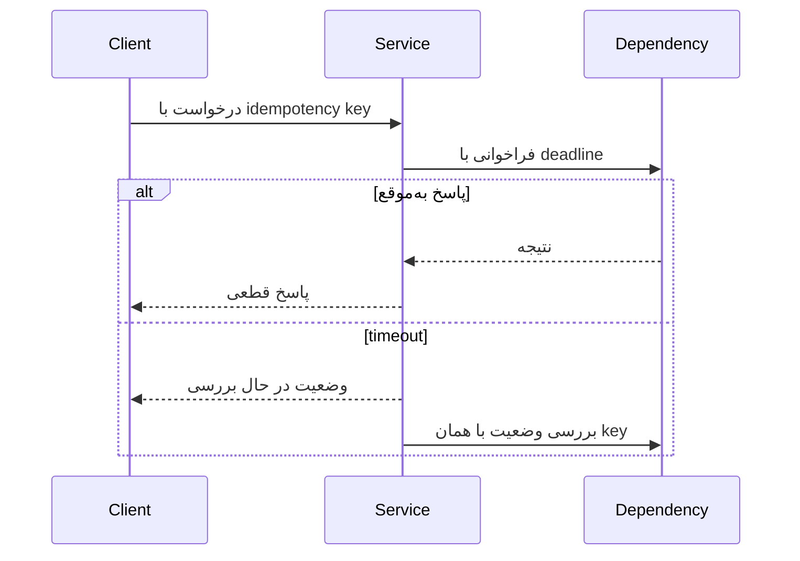

# فصل ۸: `Distributed Systems`: `Failure`, `Timeout`, `Retry`

## The Trouble with Distributed Systems

یک `distributed system` با چند ماشین شبیه یک ماشین بزرگ نیست. network، clock، process و infrastructure می‌توانند به‌صورت جزئی و نامنظم خراب شوند و هیچ observer واحدی از وضعیت واقعی کل system وجود نداشته باشد.

## هدف فصل

فصل مدل ذهنی لازم برای reasoning دربارهٔ network، timeout، clock و خرابی‌های جزئی را می‌سازد و نشان می‌دهد چرا فرض‌های سادهٔ برنامه‌های تک‌ماشینی در محیط توزیع‌شده خطرناک‌اند.

## نقشهٔ مطالب

- `partial failure`، cloud و network غیرقابل‌اعتماد
- timeout، failure detection و asynchronous بودن
- `monotonic clock` و `time-of-day`
- pause پردازش، اکثریت و `Byzantine fault`
- تفاوت مدل نظری با رفتار واقعی سیستم

## خلاصهٔ زمینه‌محور

### `Partial failure` و network

در یک برنامهٔ محلی، یا function برمی‌گردد یا process می‌میرد. در شبکه، درخواست ممکن است ارسال شده باشد اما پاسخ گم شود؛ گیرنده ممکن است آن را اجرا کرده باشد یا نه. connection می‌تواند قطع شود، packetها delay یا reorder شوند و یک گره برای دیگران کند ولی برای خودش سالم به نظر برسد.

cloud این احتمال‌ها را با virtual machine، shared infrastructure و maintenance بیشتر قابل‌مشاهده می‌کند. تعداد زیاد ماشین‌ها نیز باعث می‌شود حتی رخدادهای کم‌احتمال مرتب رخ دهند. برنامه باید duplicate، retry، timeout و partial result را به‌عنوان رفتار عادی مدل کند.

### timeout و asynchronous

هیچ timeoutی نمی‌تواند بین «گره مرده» و «پاسخ بسیار کند» قطعیت ایجاد کند. timeout فقط یک suspicion است. کوتاه‌کردن آن false positive می‌سازد؛ بلندکردنش recovery را کند می‌کند. retry نیز اگر operation idempotent نباشد می‌تواند اثر را دوباره ایجاد کند. deadline، backoff، circuit breaker و شناسهٔ idempotency به کنترل این زنجیره کمک می‌کنند.

در شبکهٔ synchronous، delay سقف مشخص دارد و failure detector می‌تواند قوی‌تر باشد. شبکهٔ واقعی بیشتر asynchronous است؛ بنابراین الگوریتم‌ها باید با delay نامحدود و نبودن پاسخ کنار بیایند.

### `Clocks`

ساعت time-of-day برای نمایش زمان تقویمی است و ممکن است با NTP به جلو یا عقب تنظیم شود. ساعت monotonic برای اندازه‌گیری فاصلهٔ زمانی مناسب‌تر است و با تغییر ساعت محلی نباید عقب برود. clock skew، leap second، suspend ماشین و خطای منبع زمان می‌توانند ترتیب ظاهری رویدادها را خراب کنند.

اعتماد به timestamp برای حل conflict، تشخیص timeout یا تعیین آخرین write خطرناک است مگر accuracy، uncertainty و رفتار clock به‌روشنی در مدل گنجانده شده باشد. lease نیز باید با فرض‌های دقیق دربارهٔ clock و pause استفاده شود.

### توقف `process` و دانستن حقیقت

یک process ممکن است به‌خاطر garbage collection، scheduler یا فشار منابع برای مدتی طولانی pause شود، در حالی که شبکه آن را زنده می‌بیند. اگر process پس از pause با دادهٔ قدیمی ادامه دهد، می‌تواند تصمیم منسوخ بگیرد. fencing token، تمدید lease و بررسی نسل عملیات از اجرای هم‌زمان صاحب قدیمی جلوگیری می‌کند.

هیچ nodeای به‌تنهایی نمی‌داند node دیگر واقعاً مرده است. سامانه‌ها با heartbeat، timeout و رأی اکثریت تصمیم عملی می‌گیرند. اکثریت برای تحمل خرابی crash-stop مفید است، اما اگر گره‌ها عمداً دروغ بگویند یا پیام جعلی بفرستند، با Byzantine fault روبه‌رو هستیم و به فرض‌های امنیتی و quorum متفاوت نیاز داریم.

### `System model` و واقعیت

برای تحلیل الگوریتم باید مشخص شود کدام خرابی مجاز است: crash، message loss، delay، partition، clock error یا رفتار مخرب. تضمینی که تحت مدل محدود اثبات شده، لزوماً در production با pause و misconfiguration برقرار نمی‌ماند. طراحی خوب مدل را صریح می‌کند و پایش و chaos testing را با همان فرض‌ها هماهنگ می‌سازد.

### مثال مستقل: رزرو نام کاربری

دو frontend ممکن است هم‌زمان برای یک نام کاربری درخواست دهند. اگر یکی timeout بگیرد، نمی‌داند ثبت انجام شده یا نه و retry ساده می‌تواند conflict بسازد. یک storage صاحب نام باید constraint اتمیک داشته باشد؛ پاسخ با شناسهٔ idempotency مرتبط شود؛ و اگر coordinator به‌طور موقت unreachable است، سرویس به‌جای اعلام «نام آزاد» از حدس‌زدن وضعیت خودداری کند.

## نکته‌های کلیدی

1. timeout تشخیص قطعی خرابی نیست.
2. retry بدون idempotency می‌تواند خرابی را بیشتر کند.
3. time-of-day و monotonic clock کاربرد یکسان ندارند.
4. مدل failure باید پیش از ادعای تضمین مشخص شود.

## ارتباط با فصل‌های دیگر

- [فصل ۵: `Replication`](../05-replication/README.md)
- [فصل ۷: `Transactions` و `Concurrency`](../07-transactions/README.md)
- [فصل ۹: `Consistency` و `Consensus`](../09-consistency-consensus/README.md)

## ماتریس failure و واکنش

| رخداد | آنچه می‌دانیم | واکنش محافظه‌کارانه |
| --- | --- | --- |
| timeout پاسخ | اجرا شده یا نشده نامعلوم است | retry فقط با idempotency و deadline |
| قطع ارتباط یک node | سلامت node نامعلوم است | suspicion، quorum و جلوگیری از دو مالک |
| pause طولانی process | node ممکن است زنده اما منسوخ باشد | fencing token و بررسی generation |
| clock عقب‌وجلو | ترتیب زمانی مشکوک است | monotonic duration و version منطقی |
| partition شبکه | هر طرف تصویر ناقص دارد | تعریف عملیات مجاز در اقلیت |

## چرخهٔ امن یک درخواست شبکه‌ای

پاسخ «در حال بررسی» بهتر از حدس‌زدن موفقیت یا شکست است. client باید بتواند وضعیت را بعداً query کند و سرویس باید نتیجهٔ یک عملیات را با همان key برگرداند.

## آزمون خرابی

- packet loss و delay محدود را در محیط آزمایشی تزریق کنید.
- process را وسط critical section متوقف کنید.
- clock wall را تغییر دهید و duration را با monotonic clock بسنجید.
- leader را هنگام commit از شبکه جدا کنید.
- بررسی کنید retry، backoff و circuit breaker باعث storm جدید نمی‌شوند.

## سناریوی طراحی: ارسال ایمیل

سرویس اعلان درخواست ارسال را می‌پذیرد و به provider خارجی می‌دهد. timeout provider به معنی شکست قطعی نیست. درخواست در outbox با شناسهٔ یکتا ثبت می‌شود، worker با backoff تلاش می‌کند و provider در صورت امکان همان شناسه را deduplicate می‌کند. dashboard باید سه حالت `sent`، `failed` و `unknown` را جدا نشان دهد.

## تمرین‌های مرور

1. توضیح دهید چرا timeout کوتاه می‌تواند false failure بسازد.
2. برای یک lease، خطر pause process و راه‌حل fencing را بنویسید.
3. failure model سامانهٔ خود را با crash، delay، loss و Byzantine از هم جدا کنید.

## تعریف مستقل اصطلاحات

### `partial failure`

**چیست؟** بخشی از سامانه خراب است، اما بخش‌های دیگر هنوز کار می‌کنند.

**مثال:** Payment provider پاسخ نمی‌دهد، اما order service و database شما سالم‌اند.

### `timeout`

**چیست؟** مهلتی که بعد از آن پاسخ را دیرشده فرض می‌کنیم.

**اشتباه رایج:** timeout نمی‌گوید operation اجرا نشده؛ ممکن است اجرا شده باشد و فقط response گم شده باشد.

### `retry`

**چیست؟** تلاش دوباره بعد از خطای موقت.

**شرط:** operation باید safe یا idempotent باشد و retry با حد، `backoff` و `jitter` انجام شود.

### `circuit breaker`

**چیست؟** وقتی نرخ خطای dependency زیاد می‌شود، callها را موقتاً قطع می‌کند تا فشار بیشتر نشود.

**اشتباه رایج:** circuit breaker مشکل dependency را حل نمی‌کند؛ فقط جلوی cascading failure را می‌گیرد و باید مسیر recovery داشته باشد.

### `bulkhead`

**چیست؟** جداکردن resourceها، مثلاً connection pool یا thread pool، تا خرابی یک dependency همهٔ سرویس را خفه نکند.

### `backoff` و `jitter`

`backoff` فاصلهٔ retry را بیشتر می‌کند. `jitter` یک تغییر کوچک تصادفی به آن اضافه می‌کند. اگر هزار client دقیقاً در زمان‌های ۱، ۲ و ۴ ثانیه retry کنند، مشکل اصلی ممکن است دوباره با یک burst بزرگ برگردد.

### `monotonic clock`

**چیست؟** ساعتی برای اندازه‌گیری مدت‌زمان که نباید با تغییر ساعت تقویمی به عقب برگردد.

**کاربرد:** اندازه‌گیری timeout و duration؛ نه نمایش ساعت به کاربر.
