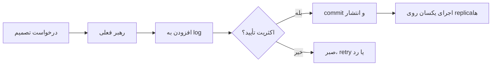

# فصل ۹: `Consistency` و `Consensus`

## Consistency and Consensus

`Replication`، `Partitioning` و fault ما را به پرسشی بنیادی می‌رسانند: چند node چگونه باید تصویری هماهنگ از یک value یا order داشته باشند؟ این فصل قراردادهای `consistency` و الگوریتم‌های `consensus` را از هم تفکیک می‌کند.

## هدف فصل

باید بدانیم «سازگار» دقیقاً به چه معناست، چه زمانی linearizability لازم است و چرا atomic commit، total order و consensus مسائل مرتبط اما یکسان نیستند.

## نقشهٔ مطالب

- `consistency guarantee` و `linearizability`
- هزینه و روش‌های پیاده‌سازی ترتیب قابل‌مشاهده
- `causality`، sequence number و `total order broadcast`
- `distributed transaction`، `2PC` و fault-tolerant `consensus`
- membership و coordination service

## خلاصهٔ زمینه‌محور

### `Consistency guarantees`

`Consistency` یک رفتار واحد نیست. سامانه ممکن است read-your-writes، monotonic reads، consistent prefix یا eventual convergence را تضمین کند. هر تضمین باید با latency، دسترس‌پذیری و نحوهٔ خرابی سنجیده شود. عبارت «strong consistency» بدون تعریف عملی برای طراحی یا آزمون کافی نیست.

### `Linearizability`

linearizability قرارداد شیء منفرد را شبیه یک copy اتمیک می‌کند: هر عملیات در نقطه‌ای بین شروع و پایانش قرار می‌گیرد و عملیات بعدی اثر آن را می‌بیند. این ویژگی برای unique name، قفل، counter یا leader election ساده و قدرتمند است، اما در شبکهٔ partitionشده ممکن است مجبور شویم بین ردکردن write و ارائهٔ پاسخ احتمالی انتخاب کنیم.

پیاده‌سازی می‌تواند با یک leader قابل‌اعتماد، quorum هم‌پوشان یا `consensus` انجام شود. cache، multi-leader و clock معمولی به‌تنهایی linearizability را ایجاد نمی‌کنند. برای بررسی آن باید history عملیات و ترتیب واقعی آن‌ها آزمون شود، نه فقط چند پاسخ موفق.

### `Ordering` و `Causality`

گاهی total order لازم نیست و حفظ causal order کافی است. اگر رویداد B پاسخ به A باشد، دیدن B پیش از A برای مصرف‌کننده گیج‌کننده است. Lamport timestamp و version vector می‌توانند بخشی از این رابطه را نمایش دهند، اما timestamp به‌تنهایی معنی واقعی علت را تضمین نمی‌کند.

sequence number برای مرتب‌کردن تغییرات یک stream مفید است. در multi-leader، شماره‌های مستقل ممکن است gap و collision داشته باشند. total order broadcast همهٔ replicaها را به یک ترتیب می‌رساند و می‌تواند برای اجرای deterministic روی یک log مشترک استفاده شود؛ هزینهٔ آن coordination و کاهش تحمل partition است.

### `Distributed transaction` و `2PC`

در distributed transaction چند resource manager باید تصمیم commit یکسانی بگیرند. Two-Phase Commit یک coordinator دارد: در مرحلهٔ prepare، شرکت‌کنندگان آمادگی را اعلام می‌کنند؛ در commit، تصمیم نهایی پخش می‌شود. اگر coordinator بعد از prepare از دسترس خارج شود، شرکت‌کنندگان ممکن است در وضعیت نامعلوم بمانند و lock نگه دارند. 2PC اتمیک‌بودن تصمیم را هدف می‌گیرد، اما خودِ آن الگوریتم `consensus` عمومی نیست و در برابر برخی failureها محدودیت دارد.

در عمل، outbox، saga، عملیات idempotent و جبران معنایی گاهی از global transaction بهترند. انتخاب به invariant، مدت transaction، نوع storage و نیاز به atomicity بستگی دارد.

### `Fault-tolerant Consensus`

در consensus، nodeها روی یک value یا log ترتیب‌دار توافق می‌کنند؛ باید agreement، uniqueness تصمیم و در شرایط مناسب termination برقرار باشد. الگوریتم‌هایی مانند خانوادهٔ Paxos یا Raft با دورهٔ leader، رأی اکثریت و log replication این هدف را دنبال می‌کنند. اکثریت اجازه می‌دهد با خرابی بخشی از nodeها ادامه دهیم، اما partitionی که اکثریت را جدا کند معمولاً فقط خواندن‌های محدود یا توقف را ممکن می‌سازد.

membership و coordination service می‌تواند leader، configuration یا lock را در اختیار برنامه‌ها بگذارد. این سرویس نباید به انبار همهٔ داده تبدیل شود؛ کوچک، قابل‌اعتماد و با semantics روشن نگه‌داشتن آن مهم است.

### مثال مستقل: نام یکتا در چند region

برای رزرو نام کاربری در چند region، eventual convergence ممکن است دو نام تکراری ایجاد کند. اگر uniqueness فوری ضروری است، باید یک مسیر linearizable با quorum یا leader مرکزی برای همان کلید داشت. اگر latency محلی مهم‌تر است، می‌توان نام موقت داد و در زمان sync conflict را حل کرد؛ اما این دیگر همان قرارداد «نام یکتا در لحظه» نیست و باید به کاربر اعلام شود.

## نکته‌های کلیدی

1. consistency guarantee را با عملیات قابل‌آزمون تعریف کنید.
2. linearizability برای برخی invariantها ضروری است اما هزینه دارد.
3. causal order با total order یکی نیست.
4. 2PC، replication log و consensus را به‌عنوان مسئله‌های جدا تحلیل کنید.

## ارتباط با فصل‌های دیگر

- [فصل ۵: `Replication`](../05-replication/README.md)
- [فصل ۷: `Transactions` و `Concurrency`](../07-transactions/README.md)
- [فصل ۸: `Distributed Systems`: `Failure`, `Timeout`, `Retry`](../08-distributed-systems/README.md)

## جدول `Consistency` contracts

| قرارداد | تجربهٔ مصرف‌کننده | هزینهٔ معمول |
| --- | --- | --- |
| read-your-writes | تغییر خودم را می‌بینم | session state یا مسیر خواندن خاص |
| monotonic reads | پاسخ‌ها به عقب برنمی‌گردند | pinکردن replica یا token |
| causal order | علت پیش از معلول دیده می‌شود | metadata و tracking dependency |
| linearizable | یک ترتیب لحظه‌ای مشترک دیده می‌شود | quorum، leader یا توقف هنگام partition |
| eventual | replicaها در سکون همگرا می‌شوند | حل conflict و پذیرش lag |

## مسیر یک `Consensus` decision

رأی اکثریت باید همراه با تعریف generation رهبر، شمارهٔ log و شرط commit باشد. صرفاً گرفتن چند پاسخ «بله» بدون جلوگیری از رأی‌دادن به دو leader، `consensus` ایجاد نمی‌کند.

## 2PC یا consensus؟

| مسئله | سؤال اصلی | ویژگی غالب |
| --- | --- | --- |
| Two-Phase Commit | آیا چند resource یک تصمیم commit یکسان می‌گیرند؟ | هماهنگی coordinator و خطر گیرکردن |
| Consensus | همهٔ nodeها روی یک تصمیم/ترتیب توافق می‌کنند؟ | رأی اکثریت و تحمل خرابی مجاز |
| Total order broadcast | همهٔ مصرف‌کنندگان eventها را در یک ترتیب می‌بینند؟ | log مشترک و هزینهٔ ترتیب |

این ابزارها ممکن است کنار هم قرار بگیرند، اما یکی را نباید بدون بررسی جای دیگری فرض کرد.

## سناریوی طراحی: موجودی محدود

برای کالایی که فقط یک واحد موجود دارد، eventual consistency به‌تنهایی کافی نیست. عملیات رزرو باید روی کلیدی با linearizability یا constraint اتمیک انجام شود. event کاهش موجودی می‌تواند بعداً به warehouse و notification برود، اما source اصلی باید جلوی دو رزرو موفق را بگیرد. اگر latency محلی ضروری باشد، باید قرارداد کسب‌وکار به «رزرو موقت» تغییر کند.

## چک‌لیست `Consensus`

- [ ] quorum قابل‌دسترس در failure model مشخص است.
- [ ] نسل leader و fencing برای leader قدیمی وجود دارد.
- [ ] log پس از restart و replay deterministic است.
- [ ] وضعیت minority partition از وضعیت committed جداست.
- [ ] membership و تغییر configuration خودشان با ترتیب ایمن انجام می‌شوند.

## تمرین‌های مرور

1. برای «نام یکتا» توضیح دهید چرا eventual consistency کافی نیست.
2. یک history کوتاه بنویسید که linearizability را نقض کند.
3. مشخص کنید در چه سناریویی saga از 2PC مناسب‌تر است.

## تعریف مستقل اصطلاحات

### `consistency`

**چیست؟** قراردادی دربارهٔ اینکه یک read چه نسخه‌ای از داده را و در چه زمانی می‌بیند.

**اشتباه رایج:** consistency به معنی «همهٔ داده‌ها همیشه یکسان‌اند» نیست؛ سطح آن باید دقیق نام‌گذاری شود.

### `linearizability`

**چیست؟** هر operation طوری دیده می‌شود که انگار در یک لحظهٔ مشخص و در ترتیب واقعی روی یک copy انجام شده است.

**مثال:** بعد از ثبت یک نام یکتا، درخواست بعدی نباید همان نام را آزاد ببیند.

### `CAP`

در مدل `CAP`، هنگام network partition نمی‌توان هم‌زمان پاسخ‌های کاملاً consistent و در دسترس‌بودن همیشگی را برای همهٔ درخواست‌ها تضمین کرد. حرف اصلی، انتخاب همیشگی بین C و A نیست؛ مسئله این است که هنگام قطع ارتباط چه رفتاری می‌خواهیم.

### `consensus`

**چیست؟** چند node روی یک تصمیم یا ترتیب مشترک توافق می‌کنند، حتی اگر بعضی nodeها crash شوند.

**مثال:** انتخاب leader و ثبت entryهای یک log مشترک.

### `2PC`

`2PC` مخفف **Two-Phase Commit** است. در phase اول participantها می‌گویند آماده‌اند؛ در phase دوم coordinator تصمیم commit یا abort را اعلام می‌کند.

**اشتباه رایج:** `2PC` همان `consensus` نیست و خرابی coordinator می‌تواند participantها را در وضعیت انتظار بگذارد.

### `Raft`

**چیست؟** الگویی برای consensus که با leader، term، log و رأی اکثریت به replicaها کمک می‌کند یک تاریخچهٔ مشترک بسازند.

**نکته:** Raft تصمیم business را جایگزین نمی‌کند؛ فقط هماهنگی state توزیع‌شده را ساده‌تر می‌کند.

### `causality` و `total order`

`causality` می‌گوید یک event می‌تواند علت event دیگر باشد. `total order` می‌گوید همهٔ مصرف‌کنندگان همهٔ eventها را در یک ترتیب واحد ببینند. حفظ causal order ارزان‌تر از total order است، اما تضمین ضعیف‌تری می‌دهد.
