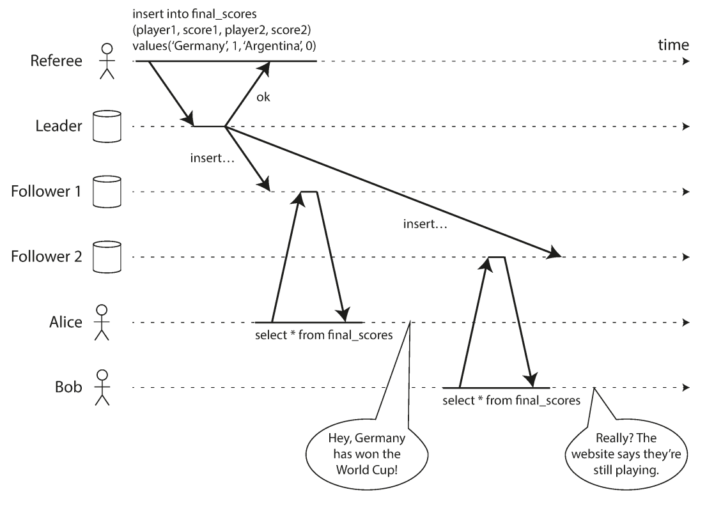
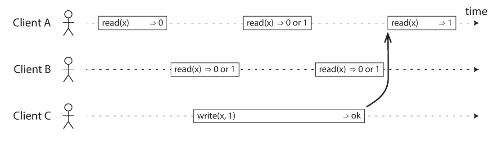
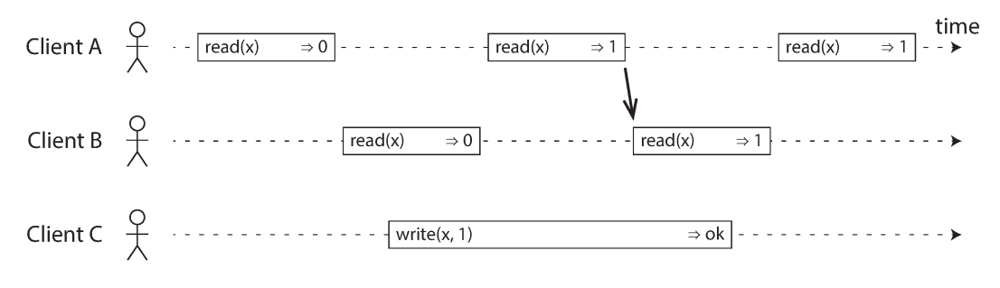
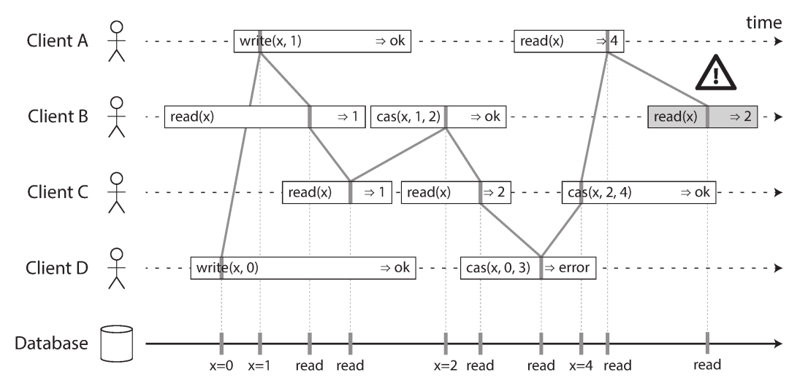
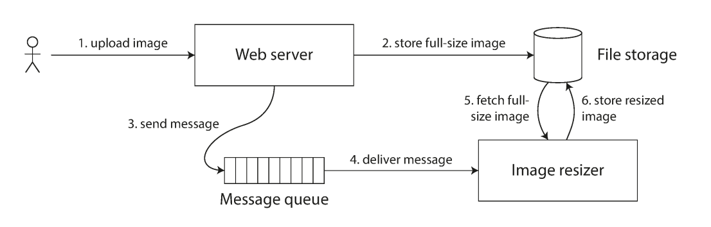
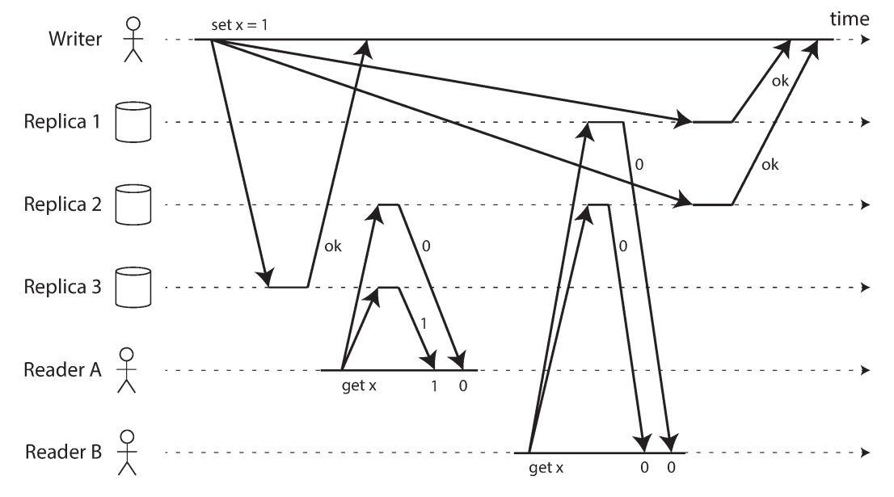
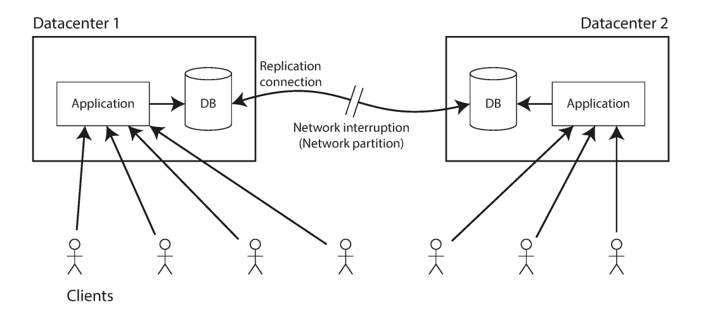
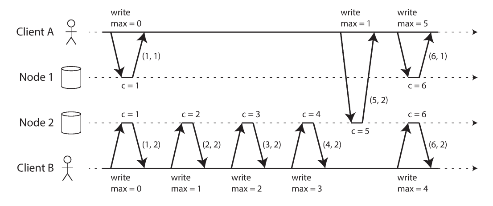
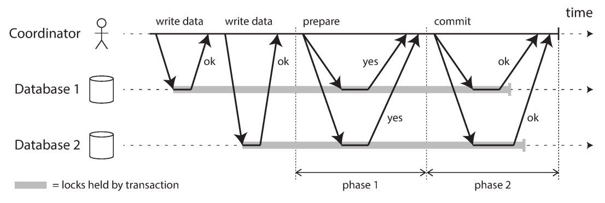
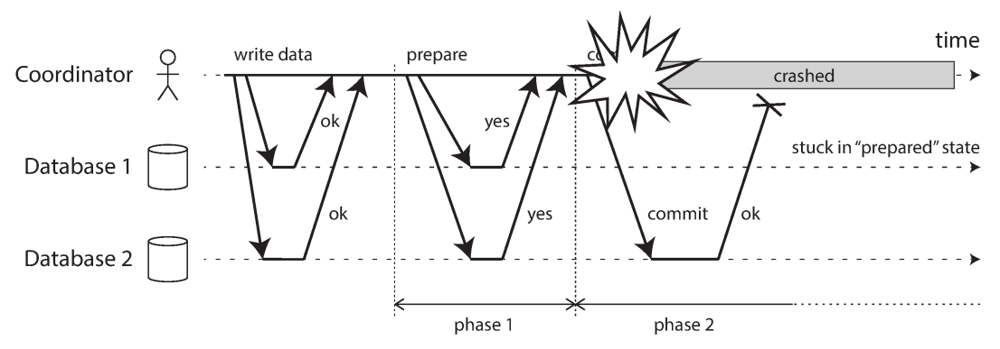

# فصل ۹: **Consistency** و **Consensus**

## &rlm;Consistency and Consensus

<blockquote dir="rtl" align="right">
  
آیا زنده‌بودن و اشتباه‌کردن بهتر است، یا درست‌بودن و مرده‌بودن؟

</blockquote>

در فصل ۸ دیدیم که packet ممکن است گم، تکراری، جابه‌جا یا بسیار دیر شود، clockها تقریبی‌اند و nodeها هر لحظه ممکن است pause یا crash کنند. ساده‌ترین راه برخورد با این وضعیت‌ها، متوقف‌کردن کل سرویس و نشان‌دادن error به کاربر است. اما اگر چنین رفتاری قابل قبول نباشد، باید راهی پیدا کنیم که سرویس با وجود خرابی بخشی از اجزای داخلی، درست کار کند.

یک روش خوب این است که abstractionهای عمومی با guaranteeهای روشن بسازیم، آن‌ها را یک بار درست پیاده کنیم و اجازه دهیم application روی آن guaranteeها حساب کند. **transaction** در فصل ۷ چنین abstractionی بود: application طوری رفتار می‌کند که انگار crash وجود ندارد (**atomicity**)، دیگری هم‌زمان به داده دسترسی ندارد (**isolation**) و storage همیشه قابل اعتماد است (**durability**). در این فصل abstractionهای دیگری مانند **linearizability**، **total order broadcast** و **consensus** را بررسی می‌کنیم.

&rlm;**Consensus** یعنی چند node روی یک تصمیم مشترک توافق کنند. مثلاً اگر leader database از دست برود، nodeهای باقی‌مانده باید دقیقاً روی یک leader جدید توافق کنند؛ وگرنه دو node ممکن است خودشان را leader بدانند و **split brain** و data loss رخ دهد. پیش از رسیدن به الگوریتم‌های consensus، ابتدا باید بفهمیم consistency چه guaranteeهایی دارد و ترتیب رویدادها چگونه تعریف می‌شود.

## &rlm;Guaranteeهای **Consistency**

در databaseی که چند replica دارد، ممکن است دو node در یک لحظه دادهٔ متفاوتی نشان دهند، چون write در زمان‌های متفاوت به آن‌ها رسیده است. تقریباً همهٔ روش‌های replication—single-leader، multi-leader و leaderless—تا حدی با این مسئله روبه‌رو هستند.

ضعیف‌ترین guarantee رایج **eventual consistency** است: اگر write را متوقف کنیم و مدت نامشخصی صبر کنیم، در نهایت همهٔ readها یک مقدار می‌بینند. نام دقیق‌تر این ویژگی شاید **convergence** باشد؛ یعنی replicaها سرانجام همگرا می‌شوند. این guarantee نمی‌گوید چه زمانی همگرایی رخ می‌دهد و تا آن زمان read می‌تواند مقدار قدیمی، مقدار متفاوت یا حتی error برگرداند.

در برنامهٔ تک‌ریسمانی، اگر مقداری را در variable بنویسیم و بلافاصله آن را بخوانیم، انتظار نداریم مقدار قدیمی را ببینیم. database ظاهراً مانند variable است، اما replica و network semantics پیچیده‌تری ایجاد می‌کنند. اگر guarantee ضعیفی انتخاب کنیم، application باید دائماً این محدودیت‌ها را در نظر بگیرد؛ خطاها ممکن است فقط هنگام network fault یا concurrency زیاد دیده شوند.

&rlm;stronger guaranteeها استفاده را ساده‌تر می‌کنند، اما رایگان نیستند: ممکن است latency و هزینهٔ coordination را بالا ببرند یا هنگام partition دسترس‌پذیری را کم کنند. **transaction isolation** و consistency توزیع‌شده نیز یکی نیستند:

- &rlm;isolation دربارهٔ جلوگیری از race میان transactionهای concurrent داخل یک database است؛
- &rlm;distributed consistency دربارهٔ هماهنگ‌کردن replicaها در برابر delay و fault است.

سه موضوع این فصل به هم پیوند دارند:

1. &rlm;**linearizability**، یکی از قوی‌ترین modelهای معمول consistency؛
2. &rlm;**causality** و روش‌های مرتب‌کردن eventها؛
3. &rlm;**distributed transaction**، atomic commit و در نهایت consensus.

## &rlm;**Linearizability**

در eventual consistency ممکن است دو client از دو replica یک سؤال یکسان بپرسند و دو جواب متفاوت بگیرند. **Linearizability** می‌کوشد این پیچیدگی را پنهان کند و چنین وانمود کند که فقط یک copy از داده وجود دارد و همهٔ operationها روی همان copy، به‌صورت اتمیک انجام می‌شوند.

نام‌های دیگری مانند **atomic consistency**، **strong consistency**، **immediate consistency** و **external consistency** هم برای این مفهوم به کار رفته‌اند، اما تعریف دقیق مهم‌تر از نام است. در سیستم linearizable، وقتی یک client write را با موفقیت تمام کرد، هر read بعدی—روی هر client یا replica—باید مقدار جدید را ببیند. بنابراین linearizability یک **recency guarantee** است.

### مثال مسابقهٔ فوتبال

&rlm;Alice و Bob در یک اتاق نتیجهٔ فینال فوتبال را با phone می‌بینند. Alice بعد از اعلام نتیجه صفحه را refresh می‌کند و برنده را می‌بیند؛ سپس با هیجان نتیجه را به Bob می‌گوید. Bob بعد از شنیدن حرف Alice صفحه را refresh می‌کند، اما request او به replica عقب‌مانده می‌رود و نتیجه هنوز «بازی در جریان است» نشان داده می‌شود.

اگر هر دو هم‌زمان refresh می‌کردند، دو نتیجهٔ متفاوت شاید قابل توضیح بود؛ اما Bob می‌داند query خودش بعد از شنیدن نتیجهٔ Alice شروع شده است. پس نتیجهٔ قدیمی نقض linearizability است.

### &rlm;register، read و write

در ادبیات distributed systems، یک key منفرد را **register** می‌نامند؛ در عمل می‌تواند یک key در key-value store، یک row در database **relational** یا یک **document** باشد. دو operation پایه داریم:

- &rlm;**read(x) ⇒ v**: مقدار x خوانده شده و v برگشته است.
- &rlm;**write(x, v) ⇒ r**: x روی v تنظیم شده و پاسخ r، مانند **ok** یا **error**، برگشته است.

فرض کنید مقدار اولیهٔ x صفر است و client C می‌خواهد آن را به یک تغییر دهد. clientهای A و B هم‌زمان مرتب x را می‌خوانند:

- &rlm;readای که پیش از شروع write تمام شده، حتماً باید صفر برگرداند.
- &rlm;readای که بعد از پایان write شروع شده، حتماً باید یک برگرداند.
- &rlm;readای که با write overlap دارد، می‌تواند صفر یا یک ببیند، چون نقطهٔ اتمیک‌شدن write در داخل بازهٔ آن معلوم نیست.

این شرط هنوز کافی نیست. اگر چند read در طول یک write یکی‌درمیان صفر و یک ببینند، سیستم شبیه یک copy واحد رفتار نمی‌کند. شرط کامل‌تر این است که وقتی یک read مقدار جدید را دید، تمام readهای بعدی نیز همان مقدار جدید را ببینند، حتی اگر write هنوز response نهایی خود را نگرفته باشد.

### نقطهٔ اتمیک هر operation

برای تحلیل، هر operation را طوری تصور می‌کنیم که در یک نقطهٔ بین شروع و پایان خود به‌صورت اتمیک اثر کرده است. علاوه بر read و write، operation زیر را نیز در نظر بگیرید:

&rlm;**cas(x, old, new) ⇒ r** مقدار x را فقط وقتی به new تغییر می‌دهد که مقدار فعلی دقیقاً old باشد؛ در غیر این صورت error برمی‌گرداند و x بدون تغییر می‌ماند.

هر operation باید بتواند در یک ترتیب متوالی معتبر قرار بگیرد:

- &rlm;read مقدار آخرین write قبل از خودش را ببیند؛
- &rlm;compare-and-set فقط وقتی موفق شود که شرطش در آن نقطه برقرار باشد؛
- ترتیب انتخاب‌شده با زمان واقعی شروع و پایان operationها تضاد نداشته باشد.

خطی‌سازی یعنی این ترتیب هیچ‌وقت به عقب برنگردد. اگر A write جدیدی انجام داده و client B پس از دریافت نتیجهٔ A read را آغاز کرده است، B نمی‌تواند مقدار قدیمی‌تری ببیند. شکل ۹-۴ نمونه‌ای از historyای است که read نهایی در آن linearizable نیست.

چند نکتهٔ ظریف:

- ترتیب پردازش لازم نیست همان ترتیب ارسال requestها باشد؛ requestهای concurrent ممکن است به‌علت network delay جابه‌جا برسند.
- &rlm;response یک write ممکن است دیرتر از read دیگری برسد؛ این به معنی خوانده‌شدن قبل از write نیست.
- &rlm;linearizability به‌تنهایی transaction isolation نیست. ممکن است client دیگری بین دو read شما مقدار را تغییر دهد.
- &rlm;compare-and-set برای جلوگیری از تغییر هم‌زمان مفید است، اما باید خود operation اتمیک و linearizable باشد.

می‌توان history واقعی requestها و responseها را ثبت کرد و بررسی کرد آیا می‌توان آن‌ها را در یک ترتیب متوالی معتبر قرار داد یا نه؛ این آزمون از نظر محاسباتی گران است، اما برای یافتن رفتارهای nonlinearizable مفید است.

### &rlm;Linearizability در برابر **Serializability**

این دو واژه شبیه‌اند، اما guaranteeهای متفاوتی می‌دهند:

| ویژگی | **Serializability** | **Linearizability** |
| --- | --- | --- |
| واحد | transaction که چند object را می‌خواند و می‌نویسد | operation روی یک register/object |
| guarantee | نتیجه مانند اجرای transactionها در یک ترتیب serial است | هر operation در یک نقطهٔ واقعی و در ترتیب recency دیده می‌شود |
| تمرکز | isolation و جلوگیری از conflict میان transactionها | جدیدترین مقدار و ترتیب مشاهده‌شده |
| محدودیت | ممکن است به‌تنهایی recency سراسری ندهد | write skew میان چند object را به‌تنهایی حل نمی‌کند |

ترکیب هر دو را **strict serializability** یا **strong one-copy serializability** می‌نامند. **2PL** و اجرای کاملاً serial معمولاً این ترکیب را فراهم می‌کنند، اما **Serializable Snapshot Isolation** عمداً از snapshot قدیمی می‌خواند و بنابراین readهای آن لزوماً linearizable نیستند.

## کاربردهای Linearizability

### &rlm;lock و leader election

برای single-leader replication باید دقیقاً یک leader وجود داشته باشد. nodeها می‌توانند برای گرفتن lock رقابت کنند و winner leader شود، اما lock باید linearizable باشد؛ وگرنه دو node ممکن است هر دو تصور کنند lock را دارند. ZooKeeper و etcd با استفاده از consensus، operationهای linearizable برای lock و leader election فراهم می‌کنند. بااین‌حال fencing token، lease expiry و process pause هنوز باید درست طراحی شوند.

### &rlm;constraint و uniqueness

&rlm;username، email، path و filename معمولاً باید یکتا باشند. اگر دو نفر هم‌زمان یک username بسازند، باید یکی موفق و دیگری با constraint violation شکست بخورد. این شبیه **compare-and-set** است: username را فقط اگر آزاد است به user ID تنظیم کن.

همین مسئله برای منفی‌نشدن balance، بیشترنفروختن از stock و رزروکردن یک صندلی مشترک وجود دارد. همهٔ nodeها باید روی یک مقدار up-to-date توافق کنند. اگر overbooking از نظر کسب‌وکار قابل جبران است، constraint را می‌توان نرم‌تر کرد؛ اما hard uniqueness معمولاً به linearizability نیاز دارد. بعضی constraintهای دیگر، مانند foreign key، الزاماً چنین guarantee سراسری‌ای نمی‌خواهند.

### وابستگی زمانی میان دو channel

در مثال فوتبال، صحبت Alice یک channel جدا از database است و همین channel به Bob می‌گوید read او باید حداقل به‌اندازهٔ read Alice جدید باشد. معماری نرم‌افزار نیز ممکن است دو channel داشته باشد.

فرض کنید web server تصویر full-size را در file storage ذخیره می‌کند و سپس از راه message queue به image resizer خبر می‌دهد. resizer پیام را دریافت می‌کند و تصویر را از storage می‌خواند. اگر queue سریع‌تر از replication داخلی storage باشد، resizer ممکن است نسخهٔ قدیمی یا هیچ تصویری را ببیند و thumbnail ناسازگار بسازد.

&rlm;linearizability ساده‌ترین راه جلوگیری از این race است: وقتی پیام queue رسیده، read بعدی باید write تصویر را ببیند. روش‌های دیگری مانند انتقال version، انتظار برای read-your-writes یا قرار دادن metadata در پیام هم ممکن‌اند، اما پیچیده‌ترند.

## پیاده‌سازی سیستم Linearizable

ساده‌ترین راه استفاده از یک copy منفرد است، اما با خرابی node داده از دسترس خارج می‌شود. برای fault tolerance به replication نیاز داریم.

### &rlm;replication با single leader

اگر read از leader یا followerای انجام شود که synchronous به‌روز شده است، می‌توان رفتار linearizable ساخت. اما داشتن single leader به‌تنهایی کافی نیست:

- باید مطمئن باشیم واقعاً leader فعلی را می‌شناسیم؛ leader قدیمی ممکن است هنوز request بپذیرد.
- &rlm;asynchronous replication ممکن است در failover write commitشده را از دست بدهد؛ این هم durability و هم linearizability را نقض می‌کند.
- &rlm;snapshot isolation یا bugهای concurrency ممکن است semantics را ضعیف کنند.

### &rlm;consensus

&rlm;consensus protocolها برای جلوگیری از split brain و استفاده از replica قدیمی، جزئیات بیشتری نسبت به replication ساده دارند. ZooKeeper و etcd از همین راه storage linearizable می‌سازند.

### &rlm;multi-leader و leaderless

&rlm;multi-leader معمولاً linearizable نیست، چون چند node هم‌زمان write می‌پذیرند و conflict بعداً حل می‌شود. در مدل Dynamo-style نیز quorum read و write با شرط **w + r > n** شهوداً قوی به نظر می‌رسد، اما strict quorum به‌تنهایی کافی نیست.

در شکل ۹-۶، سه replica داریم و write مقدار x را از صفر به یک تغییر می‌دهد. reader A از quorum دو node، مقدار جدید یک را می‌بیند. بعد reader B از quorum دیگری مقدار صفر را می‌گیرد. شرط quorum برقرار است، اما B پس از تمام‌شدن read A شروع شده و نباید به مقدار قدیمی برگردد.

می‌توان با **synchronous read repair** و خواندن quorum پیش از هر write، رفتار read/write را قوی‌تر کرد، اما هزینه و latency افزایش می‌یابد. compare-and-set همچنان به consensus نیاز دارد. پس به‌طور محافظه‌کارانه، leaderless replication را linearizable فرض نکنید مگر implementation دقیق guarantee آن را ثابت کند.

### هزینهٔ Linearizability و **CAP**

فرض کنید دو datacenter داریم و link میان آن‌ها قطع شده است، درحالی‌که clientهای هر datacenter به database محلی دسترسی دارند.

- در multi-leader، هر datacenter می‌تواند موقتاً write بپذیرد و بعداً conflict را حل کند؛ سرویس available می‌ماند، اما linearizable نیست.
- در single-leader، clientهای datacenter follower نمی‌توانند write یا linearizable read انجام دهند، چون باید به leader برسند. آن‌ها یا error می‌گیرند یا read قدیمی محلی می‌بینند.

این trade-off ایدهٔ معروف **CAP theorem** است: هنگام network partition، سیستم نمی‌تواند هم linearizable باشد و هم برای هر request همیشه پاسخ موفق بدهد. اگر linearizability لازم باشد، بخشی از replicaها باید هنگام قطع ارتباط unavailable شوند. اگر availability مهم‌تر باشد، replicaها مستقل ادامه می‌دهند و consistency مدل ضعیف‌تری خواهد بود.

&rlm;CAP را نباید به شعار «همیشه باید C یا A را انتخاب کنی» تقلیل داد. این اصطلاح در تاریخ طراحی database مهم بوده، اما دسته‌بندی‌های سادهٔ **CP** و **AP** ابهام زیادی دارند و برای طراحی دقیق کافی نیستند. بسیاری از تصمیم‌ها میان latency، هزینه، fault tolerance، consistency level و محدودهٔ partition هستند؛ network fault فقط یکی از آن‌هاست.

&rlm;linearizability حتی روی memory چند هسته‌ای CPU هم بدون memory barrier تضمین نمی‌شود. کنارگذاشتن linearizability اغلب performance و availability را بهتر می‌کند، نه اینکه به‌خودی‌خود fault tolerance را بیشتر کند. اگر کاربر بتواند به channel دیگری مانند log، email یا conversation دسترسی داشته باشد، inconsistency ممکن است آشکار شود.

## &rlm;Guaranteeهای **Ordering**

&rlm;linearizable register گویی یک copy دارد و هر operation در یک نقطهٔ اتمیک اعمال می‌شود؛ بنابراین همهٔ operationها ترتیب مشخصی دارند. این موضوع با چند مفهوم دیگر مرتبط است:

- &rlm;leader در single-leader replication ترتیب writeهای log را تعیین می‌کند؛
- &rlm;serializability transactionها را مانند یک ترتیب متوالی می‌کند؛
- &rlm;timestampها می‌کوشند بگویند کدام event دیرتر رخ داده است.

### ترتیب و **Causality**

&rlm;**Causality** رابطهٔ علت و معلول است:

- سؤال باید پیش از پاسخ وجود داشته باشد.
- &rlm;row باید پیش از update آن ایجاد شده باشد.
- اگر transaction B داده‌ای را که A نوشته خواند و بر اساس آن write کرد، B به A وابسته است.
- اگر Alice نتیجهٔ مسابقه را خوانده و به Bob گفته است، Bob پس از شنیدن حرف او نباید نتیجهٔ قدیمی ببیند.
- &rlm;snapshot سازگار باید علت را همراه اثر آن ببیند؛ read skew می‌تواند حالتی بسازد که effect حاضر است ولی cause غایب.
- &rlm;write skew نیز از مشاهدهٔ قبلی state و تصمیم بعدی ناشی می‌شود؛ SSI با دنبال‌کردن dependencyها آن را تشخیص می‌دهد.

اگر یک system این رابطه‌ها را رعایت کند، **causally consistent** است. replica باید پیش از اعمال operation جدید، تمام operationهای causal predecessor آن را دیده باشد؛ operationهای concurrent می‌توانند در هر ترتیب پردازش شوند.

### &rlm;partial order در برابر total order

در **total order** هر دو element قابل مقایسه‌اند؛ همیشه می‌گوییم کدام جلوتر است. اما causality یک **partial order** است: اگر A علت B باشد، A پیش از B است؛ اگر A و B concurrent باشند، هیچ رابطهٔ علّی میان آن‌ها نداریم و قابل مقایسهٔ علّی نیستند.

&rlm;linearizability total order می‌سازد و همهٔ operationها را روی یک timeline قرار می‌دهد. causality فقط dependencyهای لازم را تحمیل می‌کند؛ تاریخچهٔ آن مانند Git است: commitها معمولاً خطی‌اند، اما branch و merge دارند. linearizability قوی‌تر و ساده‌تر است، اما coordination و هزینهٔ network بیشتری می‌خواهد. causal consistency می‌تواند بدون توقف هنگام network delay، availability بهتری داشته باشد و گزینهٔ میانی مهمی است.

### ثبت dependencyهای causality

برای حفظ causality باید بدانیم operation قبلی چه بوده است. اگر node هنگام write کردن Y مقدار X را دیده باشد، X ممکن است predecessor آن باشد. version vector را می‌توان از یک key به کل database تعمیم داد. database باید بداند application کدام version را خوانده؛ به همین دلیل version قبلی در write بعدی یا metadata transaction حمل می‌شود.

این tracking ممکن است سنگین شود، چون client قبل از write داده‌های زیادی می‌خواند و معلوم نیست write به همهٔ آن‌ها وابسته است یا فقط به بعضی. برای فشرده‌کردن اطلاعات از sequence number و logical timestamp استفاده می‌کنیم.

## &rlm;**Sequence Number Ordering**

&rlm;sequence number چند byte بیشتر نیست و total order می‌سازد؛ هر operation عدد یکتا دارد و می‌توان دو عدد را مقایسه کرد. اگر A از نظر causality قبل از B باشد، باید sequence آن کوچک‌تر باشد. operationهای concurrent را می‌توان دلخواه مرتب کرد؛ نتیجه اطلاعات causality را حفظ می‌کند و مقداری order اضافه تحمیل می‌کند.

در single-leader replication، counter leader و replication log چنین sequenceای می‌سازند. follower حتی اگر lag داشته باشد، writeها را به ترتیب log اعمال می‌کند و state آن causally consistent می‌ماند.

### &rlm;generatorهای غیرcausal

در multi-leader یا leaderless، سه روش رایج وجود دارد:

- هر node sequence مستقل بسازد؛ مثلاً یک node عددهای زوج و دیگری فرد. این روش collision را حذف می‌کند اما rateهای متفاوت nodeها causality را حفظ نمی‌کنند.
- &rlm;timestamp ساعت تقویمی را به operation بچسبانیم؛ clock skew ممکن است operation دیرتر را کوچک‌تر کند.
- &rlm;blockهای شماره را از پیش رزرو کنیم؛ node A شمارهٔ ۱ تا ۱۰۰۰ و B شمارهٔ ۱۰۰۱ تا ۲۰۰۰ را بگیرد. operation causal بعدی ممکن است هنوز از block کوچک‌تر استفاده کند.

این روش‌ها scalableتر از یک counter واحد هستند، اما ترتیبشان با causality قطعی نیست. UUID تصادفی نیز total order می‌سازد، ولی هیچ اطلاعاتی دربارهٔ ترتیب واقعی رویدادها نمی‌دهد.

### &rlm;**Lamport Timestamp**

&rlm;Lamport timestamp یک جفت **(counter, node ID)** است. هر node counter خودش را نگه می‌دارد و node ID یکتا باعث می‌شود timestampها برابر نباشند. قاعدهٔ اصلی این است:

1. هر request یا response بیشترین counter دیده‌شده را همراه خود حمل می‌کند.
2. گیرنده اگر counter بزرگ‌تری دید، counter خودش را به آن می‌رساند.
3. سپس برای operation جدید counter را افزایش می‌دهد.

اگر client از node 2 counter پنج بگیرد و بعد به node 1 پیام بدهد، node 1 که counter یک دارد ابتدا به پنج می‌رسد و operation بعدی را با شش ثبت می‌کند. چون هر dependency باعث افزایش counter می‌شود، ترتیب Lamport با causality سازگار است.

&rlm;Lamport timestamp را با **version vector** یکی ندانید:

- &rlm;version vector می‌تواند concurrentبودن دو operation را از causalبودن آن‌ها تشخیص دهد؛
- &rlm;Lamport timestamp همیشه یک total order تحمیل می‌کند و از روی دو عدد نمی‌توان فهمید دو operation واقعاً concurrent بوده‌اند یا نه.

### چرا timestamp برای uniqueness کافی نیست؟

فرض کنید دو node هم‌زمان می‌خواهند username یکسانی بسازند. می‌توان گفت operation با timestamp کوچک‌تر winner باشد. این روش بعد از جمع‌شدن همهٔ operationها winner را تعیین می‌کند، اما node هنگام دریافت request باید همین حالا پاسخ دهد و هنوز از operation concurrent node دیگر خبر ندارد.

برای مطمئن‌شدن از اینکه هیچ claim ناشناخته‌ای با timestamp کوچک‌تر وجود ندارد، باید با همهٔ nodeها هماهنگ شود. اگر یکی crash یا unreachable باشد، سیستم متوقف می‌شود. مشکل اصلی این است که total order تا وقتی operationهای ناشناخته را ندیده‌ایم نهایی نشده است.

پس برای uniqueness فقط مرتب‌کردن operationها کافی نیست؛ باید بدانیم جای operation دیگر در آن order دیگر نمی‌تواند قبل از operation ما اضافه شود. این دقیقاً ما را به **total order broadcast** می‌رساند.

## &rlm;**Total Order Broadcast**

روی یک CPU، ترتیب اجرای operationها total order طبیعی است. در distributed system باید همهٔ nodeها روی یک ترتیب مشترک توافق کنند. **Total order broadcast** که **atomic broadcast** یا **total order multicast** هم نامیده می‌شود، دو safety property دارد:

- &rlm;**Reliable delivery:** اگر پیامی به یک node تحویل شد، به همهٔ nodeها تحویل می‌شود؛ پیام گم نمی‌شود.
- &rlm;**Totally ordered delivery:** همهٔ nodeها پیام‌ها را دقیقاً در یک ترتیب می‌بینند.

هنگام network interruption، تحویل ممکن است موقتاً متوقف شود؛ اما protocol باید پس از برگشت network پیام‌ها را retry کند و همان order را حفظ کند. ترتیب فقط در لحظهٔ delivery تعیین می‌شود و بعداً نمی‌توان message جدیدی را عقب‌تر از messageهای تحویل‌شده وارد کرد.

### کاربردها

- اگر هر message یک write database باشد و همهٔ replicaها همان writeها را به همان ترتیب اعمال کنند، **state machine replication** به وجود می‌آید.
- اگر هر message یک deterministic transaction یا stored procedure باشد، replicaها می‌توانند database را به‌ترتیب یکسان اجرا کنند.
- اگر هر درخواست گرفتن lock یک entry در log باشد، شمارهٔ ترتیبی log می‌تواند **fencing token** باشد؛ در ZooKeeper این شماره **zxid** است.
- &rlm;total order broadcast مانند یک append-only log، transaction log یا WAL مشترک عمل می‌کند.

### ساخت storage linearizable روی total order broadcast

برای هر username یک register با مقدار اولیهٔ null در نظر بگیرید. برای claimکردن:

1. پیام claim را به log append کن.
2. صبر کن همان پیام به خودت تحویل داده شود.
3. پیام‌های claim همان username را بررسی کن. اگر پیام تو اولین است، claim موفق؛ در غیر این صورت abort.

همهٔ nodeها پیام‌های رقابتی را در یک ترتیب می‌بینند و دربارهٔ winner یک نظر دارند. این کار write linearizable می‌سازد، اما read از replica asynchronously به‌روز‌شده ممکن است stale باشد. برای linearizable read می‌توان:

- خود read را نیز در log قرار داد و پس از رسیدن نوبتش اجرا کرد؛
- &rlm;position آخرین log را با روش linearizable گرفت و صبر کرد همهٔ entryهای قبل از آن روی replica اعمال شوند؛
- از replicaای خواند که writeها را synchronously دریافت می‌کند.

### ساخت total order broadcast روی storage linearizable

اگر یک register integer با operation اتمیک **increment-and-get** یا **compare-and-set** داشته باشیم:

1. برای هر message counter را افزایش بده.
2. عدد به‌دست‌آمده را sequence number پیام کن.
3. پیام را به همهٔ nodeها بفرست و packet گم‌شده را retry کن.
4. گیرنده پیام‌ها را پشت‌سرهم بر اساس sequence تحویل دهد.

اگر node پیام ۴ را تحویل داده و پیام ۶ را گرفته است، می‌فهمد باید تا رسیدن پیام ۵ صبر کند. اینجا sequence gap اطلاعات مهمی دارد. ساختن چنین registerای در برابر node و network failure عملاً ما را به consensus می‌رساند؛ linearizable compare-and-set، total order broadcast و consensus از نظر توان محاسباتی به هم مرتبط‌اند.

## &rlm;**Distributed Transactions** و **Consensus**

&rlm;Consensus از بنیادی‌ترین مسئله‌های distributed computing است. مثال‌های آن:

- انتخاب leader؛
- انتخاب برندهٔ یکی از چند رزرو هم‌زمان آخرین صندلی؛
- تعیین commit یا abort transactionای که چند node را درگیر کرده است.

پیش از بررسی consensus، یک نتیجهٔ نظری مهم را ببینیم: **FLP** نشان می‌دهد در asynchronous model، اگر احتمال crash یک node وجود داشته باشد، هیچ deterministic algorithmی نمی‌تواند همیشه termination را تضمین کند. اگر timeout، failure detector ناقص یا random number اجازه داده شود، consensus عملی ممکن می‌شود. این نتیجه از نظر تئوری مهم است، اما به معنی ناممکن‌بودن سیستم‌های واقعی نیست؛ بلکه می‌گوید guaranteeها به فرض‌های timing و failure وابسته‌اند.

### &rlm;**Atomic Commit**

در transaction تک‌node، storage engine داده‌ها را در WAL می‌نویسد و سپس commit record را روی disk durable می‌کند. اگر commit record پیش از crash نوشته شده باشد، transaction commit است؛ وگرنه rollback می‌شود. آن disk و commit record نقطهٔ تصمیم اتمیک‌اند.

وقتی transaction چند node یا partition را درگیر می‌کند، ارسال commit جداگانه کافی نیست:

- یک node ممکن است constraint violation پیدا کند و دیگری آمادهٔ commit باشد.
- یک request در network گم شود.
- یک node پیش از نوشتن commit record crash کند، درحالی‌که node دیگر commit کرده است.

اگر بعضی nodeها commit و بعضی abort کنند، atomicity شکسته و دیگر نمی‌توان commit قبلی را عقب برد. می‌توان اثر commit را با یک compensating transaction خنثی کرد، اما از نگاه database این یک transaction جدید است.

## &rlm;**Two-Phase Commit (2PC)**

**2PC** برای atomic commit میان چند participant ساخته شده است: یا همه commit می‌کنند یا همه abort. این الگوریتم با **2PL** اشتباه نشود:

- 2PC دربارهٔ تصمیم commit در چند system است؛
- 2PL دربارهٔ serializable isolation و lock است.

2PC یک component تازه به نام **coordinator** یا transaction manager دارد. database nodeها participant هستند.

### دو phase

&rlm;**Phase 1: prepare**

1. &rlm;application یک transaction ID سراسری و یکتا می‌گیرد.
2. &rlm;read و writeهای هر participant با همان ID انجام می‌شوند.
3. &rlm;coordinator به همهٔ participantها **prepare** می‌فرستد.
4. &rlm;participant همهٔ داده‌ها را durable می‌کند، conflict و constraint را بررسی می‌کند و اگر پاسخ **yes** دهد، قول می‌دهد بعداً بدون خطا commit کند.

&rlm;**Phase 2: commit یا abort**

5. اگر همه **yes** گفتند، coordinator تصمیم commit می‌گیرد؛ اگر حتی یکی **no** گفت یا prepare timeout شد، تصمیم abort است.
6. &rlm;coordinator تصمیم را پیش از اعلام به participantها در log خودش durable می‌کند؛ این لحظه **commit point** است.
7. سپس commit یا abort را به همه می‌فرستد و در صورت failure بی‌نهایت retry می‌کند. participantی که yes گفته حق ندارد بعداً خودش abort کند.

دو نقطهٔ برگشت‌ناپذیر وجود دارد: participant پس از yes قول می‌دهد commitشدنی باشد، و coordinator پس از نوشتن تصمیم دیگر نمی‌تواند نظرش را عوض کند. همین promiseها atomicity را می‌سازند.

### &rlm;failure coordinator

اگر participant پیش از prepare failure بگیرد، abort امن است. اما پس از پاسخ yes نمی‌تواند خودش تصمیم بگیرد. اگر coordinator در آن لحظه crash کند، participant در وضعیت **in-doubt** یا uncertain می‌ماند:

- &rlm;timeout به‌تنهایی کمک نمی‌کند؛ abort یک participant ممکن است با commit participant دیگر ناسازگار شود.
- &rlm;commit یک‌طرفه هم خطرناک است، چون شاید participant دیگری abort کرده باشد.
- تنها راه رسمی، برگشت coordinator و خواندن transaction log آن است.

در theory، participantها می‌توانند با هم رأی‌گیری کنند، اما این بخشی از 2PC نیست. به همین دلیل 2PC یک **blocking atomic commit protocol** است.

### &rlm;**Three-Phase Commit**

3PC برای non-blockingکردن atomic commit پیشنهاد شده، اما فرض می‌کند network delay و response time سقف مشخص دارند. در محیط واقعی با delay نامحدود، pause و timeoutهای غیرقابل اعتماد، نمی‌تواند atomicity را همیشه تضمین کند. non-blocking atomic commit به failure detector کامل نیاز دارد و چنین detectorی در network asynchronous وجود ندارد؛ پس با وجود محدودیت 2PC، استفاده از آن هنوز رایج است.

## &rlm;distributed transaction در عمل

دو نوع transaction توزیع‌شده را جدا کنید:

### &rlm;database-internal distributed transaction

همهٔ participantها یک database software را اجرا می‌کنند؛ مثلاً databaseی که partition و replication بخشی از configuration عادی آن است. این سیستم می‌تواند protocol و optimization اختصاصی خودش را داشته باشد.

### &rlm;heterogeneous distributed transaction

&rlm;participantها فناوری‌های متفاوت‌اند: دو database از vendorهای مختلف، database و message broker یا حتی سرویس دیگری. هماهنگ‌کردن آن‌ها سخت‌تر است و معمولاً با **XA** انجام می‌شود.

در مثال exactly-once message processing، message broker acknowledgement و write database در یک transaction commit می‌شوند. اگر processing یا delivery شکست بخورد، هر دو abort می‌شوند و broker می‌تواند message را دوباره بفرستد. اما email server یا external API معمولاً 2PC را پشتیبانی نمی‌کند؛ پس ممکن است email دوبار ارسال شود و exactly-once واقعی فقط برای resourceهای شرکت‌کننده در protocol ممکن است.

### &rlm;**XA Transaction**

&rlm;**XA** مخفف **eXtended Architecture** و استانداردی برای 2PC میان فناوری‌های مختلف است. XA خود network protocol نیست؛ یک API برای ارتباط driver با coordinator است. در Java معمولاً از **JTA** برای database driverهای **JDBC** و message brokerهای **JMS** استفاده می‌شود.

&rlm;coordinator ممکن است به‌صورت library داخل همان application process باشد. اگر process یا machine آن crash کند، log coordinator و transactionهای prepareشده نیز در دسترس نیستند؛ participantها نمی‌توانند مستقیم coordinator را پیدا کنند و در وضعیت in-doubt باقی می‌مانند.

### &rlm;lockهایی که در وضعیت in-doubt نگه داشته می‌شوند

&rlm;participant نمی‌تواند lockهای transaction را آزاد کند، چون آزادکردن آن‌ها پیش از تصمیم نهایی ممکن است dirty write یا atomicity violation بسازد. بنابراین اگر coordinator بیست دقیقه down باشد، rowهای تغییرکرده ممکن است بیست دقیقه lock بمانند. اگر log برای همیشه از دست برود، lockها نیز تا دخالت administrator باقی می‌مانند و بخش بزرگی از application unavailable می‌شود.

### بازیابی coordinator

پس از restart، coordinator باید log را بخواند و outcome transactionهای in-doubt را resolve کند. در عمل ممکن است **orphaned in-doubt transaction** ایجاد شود؛ مثلاً log corrupt یا از دست رفته باشد. administrator باید participantها را بررسی کند و تصمیمی هماهنگ بگیرد.

بعضی XA implementationها **heuristic decision** اجازه می‌دهند participant یک‌طرفه commit یا abort کند. این emergency escape ممکن است atomicity را بشکند و فقط برای خروج از outage فاجعه‌بار است، نه استفادهٔ عادی.

### محدودیت‌های distributed transaction

- &rlm;coordinatorی که روی یک machine و بدون replication است، single point of failure کل سیستم می‌شود.
- &rlm;application server دیگر واقعاً stateless نیست، چون log coordinator بخشی از durable state حیاتی است.
- &rlm;XA lowest common denominator است و نمی‌تواند همهٔ قابلیت‌های خاص databaseها مانند deadlock detection میان چند system یا SSI را حفظ کند.
- 2PC برای commit به پاسخ همهٔ participantها نیاز دارد؛ خرابی یک جزء می‌تواند کل transaction را block کند. در نتیجه گاهی failure را amplify می‌کند.

در database-internal distributed transaction محدودیت‌ها کمتر است، اما coordination و disk forcing و network round-trip همچنان هزینه دارند. به همین دلیل بسیاری از cloud serviceها از global transaction دوری می‌کنند و از **outbox**، **saga** و عملیات idempotent استفاده می‌کنند؛ انتخاب باید بر اساس invariant و نیاز واقعی به atomicity باشد.

## &rlm;**Fault-Tolerant Consensus**

در consensus، یک یا چند node value پیشنهاد می‌دهند و algorithm روی یکی از valueها تصمیم می‌گیرد. برای مثال، هر node می‌تواند ID مشتری‌ای را پیشنهاد دهد که آخرین صندلی را می‌خواهد.

یک consensus algorithm باید این propertyها را داشته باشد:

- &rlm;**Uniform agreement:** هیچ دو nodeای متفاوت تصمیم نگیرند.
- &rlm;**Integrity:** هیچ nodeای دوبار تصمیم نگیرد.
- &rlm;**Validity:** value انتخاب‌شده واقعاً از سوی یک node پیشنهاد شده باشد.
- &rlm;**Termination:** هر nodeای که crash نکرده، سرانجام تصمیم بگیرد.

سه property اول safety هستند و از تصمیم متناقض یا ساختگی جلوگیری می‌کنند. termination یک liveness property است و تضمین می‌کند algorithm برای همیشه بی‌کار نمی‌ماند.

راه دیکتاتوری می‌تواند سه property اول را روی یک node متمرکز کند، اما با crash آن node دیگر تصمیمی ممکن نیست. termination نیازمند فرض availability است: برای پیشرفت، دست‌کم اکثریت nodeها باید سالم و reachable باشند. اگر بیش از نصف nodeها از دست بروند، هیچ algorithmی نمی‌تواند تضمین termination بدهد؛ بااین‌حال implementation خوب باید safety را حتی در outage بزرگ حفظ کند و تصمیم غلط نگیرد.

بیشتر consensus algorithmها Byzantine fault را پوشش نمی‌دهند. برای تحمل Byzantine معمولاً کمتر از یک‌سوم nodeها باید Byzantine باشند و protocol پیچیده‌تری لازم است.

### &rlm;consensus و total order broadcast

الگوریتم‌های معروف شامل **Viewstamped Replication**، **Paxos**، **Raft** و **Zab** هستند. بسیاری از آن‌ها به‌جای یک value منفرد، یک sequence از valueها را تصمیم می‌گیرند؛ یعنی در عمل total order broadcast می‌سازند:

- &rlm;agreement باعث می‌شود همهٔ nodeها همان messageها را به همان ترتیب ببینند؛
- &rlm;integrity جلوی duplicate را می‌گیرد؛
- &rlm;validity جلوی message ساختگی یا تغییرکرده را می‌گیرد؛
- &rlm;termination باعث می‌شود message گم نشود.

اجرای چند round consensus برای هر message پرهزینه است؛ Raft، Zab و Viewstamped Replication total order را مستقیم می‌سازند و بهینه‌سازی چندمرحله‌ای Paxos با نام **Multi-Paxos** شناخته می‌شود.

### &rlm;single-leader replication و مسئلهٔ مرغ و تخم‌مرغ

&rlm;single-leader replication ظاهراً total order broadcast است: همهٔ writeها به leader می‌روند و followerها آن‌ها را به همان ترتیب اعمال می‌کنند. اگر operator دستی leader را تعیین کند، سیستم برای write تا recover یا reconfigure دستی leader متوقف می‌شود؛ این روش safety می‌تواند داشته باشد، اما termination consensus را ندارد.

اگر leader به‌طور خودکار انتخاب شود، باید consensus داشته باشیم تا همه روی leader توافق کنند. اما consensus protocol خودش leader می‌خواهد. پاسخ، تضمین یکتایی مطلق leader نیست؛ بلکه استفاده از **epoch number** است.

### &rlm;epoch و quorum

در Paxos به epoch، **ballot number**؛ در Viewstamped Replication، **view number**؛ و در Raft، **term number** می‌گویند. در هر epoch فقط یک leader معتبر است و epochها monotonic افزایش می‌یابند. اگر leader قدیمی پس از network pause برگردد، proposal leader با epoch بزرگ‌تر برنده است.

&rlm;leader برای هر تصمیم:

1. &rlm;epoch خود را به nodeها اعلام می‌کند و از quorum برای election رأی می‌گیرد؛
2. &rlm;proposal را می‌فرستد و از quorum رأی موافق می‌خواهد؛
3. &rlm;node فقط وقتی رأی می‌دهد که leader بزرگ‌تری نشناسد.

&rlm;quorum مرحلهٔ election و quorum مرحلهٔ proposal باید overlap داشته باشند. در نتیجه اگر proposal رأی گرفت و epoch بزرگ‌تری در پاسخ‌ها دیده نشد، leader می‌فهمد election جدیدی که بر ضد او باشد رخ نداده است.

این روند ظاهراً شبیه 2PC است، اما تفاوت‌های مهم دارد: coordinator در 2PC انتخاب نمی‌شود، 2PC به رأی yes همهٔ participantها نیاز دارد، ولی consensus معمولاً اکثریت می‌خواهد؛ consensus همچنین recovery protocol دارد تا leader جدید state را با safety propertyها هماهنگ کند.

### محدودیت‌های consensus

&rlm;consensus safety قوی و total order می‌دهد، اما هزینه دارد:

- رأی‌گیری شبیه synchronous replication است و latency را بالا می‌برد؛ asynchronous replication performance بیشتری دارد اما ممکن است write commitشده را در failover از دست بدهد.
- برای تحمل یک failure حداقل سه node و برای تحمل دو failure حداقل پنج node لازم است.
- در network partition فقط بخشی که اکثریت دارد progress می‌کند؛ minority block می‌شود.
- &rlm;membership پویا از membership ثابت پیچیده‌تر و کمتر آزموده‌شده است.
- &rlm;timeoutهای متغیر می‌توانند leader را بی‌دلیل dead فرض کنند و electionهای مکرر performance را نابود کنند.
- یک link ناپایدار ممکن است باعث جابه‌جایی مداوم leadership شود؛ robustترکردن algorithmها در برابر network واقعی هنوز موضوع پژوهش است.

## &rlm;**Membership** و **Coordination Service**

سرویس‌هایی مانند ZooKeeper، etcd و Consul مجموعه‌ای از قابلیت‌های coordination را روی یک cluster کوچک ارائه می‌کنند. معمولاً دادهٔ آن‌ها آهسته تغییر می‌کند—مثلاً «node آدرس X leader partition 7 است»—و برای نگه‌داری state پرتعداد application ساخته نشده‌اند.

### &rlm;operation اتمیک linearizable

&rlm;compare-and-set روی یک key می‌تواند lock بسازد. اگر چند node هم‌زمان تلاش کنند، فقط یکی موفق می‌شود. lock معمولاً به شکل lease با expiry پیاده می‌شود تا در صورت crash client آزاد شود. برای جلوگیری از اثر process قدیمی، sequence number عملیات می‌تواند fencing token باشد.

### ترتیب کل operationها

&rlm;ZooKeeper هر operation را در order کلی قرار می‌دهد و **zxid** و **cversion** افزایشی می‌دهد. این شماره‌ها برای fencing، replay و تشخیص نسل تغییرات مفیدند.

### &rlm;failure detection و session

&rlm;client و server heartbeat می‌فرستند و session بلندمدت دارند. قطع موقت connection لزوماً session را فوراً نمی‌کشد؛ اگر heartbeat بیش از session timeout قطع شود، server session را مرده اعلام می‌کند و lockها یا **ephemeral node**های آن را آزاد می‌کند.

### &rlm;change notification

&rlm;client می‌تواند روی value یا membership watch بگذارد و به‌جای polling مداوم، تغییر را notification بگیرد. این برای فهمیدن join، leave، leader failure و تغییر configuration مفید است.

### تخصیص کار

برای leader service، job scheduler یا partitioned resource می‌توان از atomic operation، ephemeral node و notification استفاده کرد. وقتی node جدید اضافه می‌شود، partitionها rebalancing می‌شوند؛ وقتی node قدیمی crash می‌کند، node دیگری مسئولیتش را می‌گیرد. این کار از نوشتن consensus algorithm بهتر است، اما recipeهای آن هنوز نیازمند فهم دقیق session و fencing هستند.

### &rlm;service discovery

در cloud، VMها دائماً ایجاد و حذف می‌شوند و IP ثابت ندارند. service هنگام startup endpoint خود را در registry ثبت می‌کند و clientها آن را پیدا می‌کنند. service discovery همیشه به consensus نیاز ندارد؛ DNS با cacheهای stale هم معمولاً کافی است. اما leader election و تصمیم یکتا واقعاً به consensus نیاز دارند.

### &rlm;membership service

به‌علت delay نامحدود نمی‌توان با قطعیت فهمید node دیگر crash کرده است. بااین‌حال، consensus می‌تواند دربارهٔ membership رسمی تصمیم بگیرد: کدام node عضو فعال شمرده شود و کدام کنار گذاشته شود. ممکن است node زنده‌ای اشتباه dead اعلام شود، اما توافق همهٔ nodeها دربارهٔ membership برای انتخاب leader و تقسیم کار بسیار ارزشمند است.

&rlm;coordination service را کوچک نگه دارید: چند node ثابت برای رأی‌گیری و تعداد زیادی client. runtime state با میلیون‌ها تغییر در ثانیه را در آن نگذارید؛ آن state به ابزار replication دیگری نیاز دارد.

## جمع‌بندی فصل

&rlm;**Linearizability** replicated data را شبیه یک copy واحد و operationها را اتمیک نشان می‌دهد. استفاده از آن ساده است، اما در network delay زیاد هزینه و هنگام partition محدودیت availability دارد.

&rlm;**Causality** ترتیب علت و معلول را حفظ می‌کند، اما total order نیست؛ history می‌تواند branch و merge داشته باشد. causal consistency معمولاً از linearizability کم‌هزینه‌تر و در برابر network fault دسترس‌پذیرتر است.

&rlm;Lamport timestamp می‌تواند یک total order سازگار با causality بسازد، اما تا وقتی order نهایی نشده، برای uniqueness و تصمیم فوری کافی نیست. **Total order broadcast** ترتیب را در لحظهٔ delivery نهایی می‌کند و برای replication، log، lock و storage مفید است.

&rlm;Consensus یعنی تصمیم مشترک، غیرقابل‌برگشت و معتبر. مسئله‌های زیر در اصل به consensus کاهش‌پذیرند:

- &rlm;linearizable compare-and-set register؛
- &rlm;atomic transaction commit؛
- &rlm;total order broadcast؛
- &rlm;lock و lease؛
- &rlm;membership و coordination service؛
- &rlm;uniqueness constraint.

روی یک node همهٔ این‌ها ساده‌اند؛ single leader قدرت تصمیم‌گیری را متمرکز می‌کند. اما اگر leader از دسترس خارج شود، سه انتخاب داریم:

1. صبر کنیم leader برگردد و سیستم موقتاً block شود؛
2. &rlm;operator انسانی leader جدید انتخاب کند؛
3. &rlm;consensus algorithm به‌طور خودکار leader را انتخاب کند.

&rlm;single-leader مسئلهٔ consensus را حذف نمی‌کند؛ فقط آن را به leader election و leadership change منتقل می‌کند. ZooKeeper و etcd consensus، failure detection و membership را به‌صورت سرویس آماده ارائه می‌کنند و معمولاً از نوشتن algorithm شخصی امن‌ترند. بااین‌حال، همهٔ سیستم‌ها به global consensus نیاز ندارند؛ multi-leader و leaderless می‌توانند با versionهای branching و conflict resolution کار کنند، اگر application به linearizability نیاز نداشته باشد.

## مثال مستقل: انتخاب بین linearizability و availability

یک ticket service با دو region داریم. در هر region clientها باید بتوانند ticket را ببینند و رزرو کنند.

- اگر صندلی فقط یک عدد دارد و فروش دوباره قابل قبول نیست، reservation باید از مسیر linearizable یا consensus عبور کند. هنگام قطع link میان regionها، region اقلیت باید error یا وضعیت pending بدهد.
- اگر محصول «reservation موقت» را قبول می‌کند، هر region می‌تواند موقتاً رزرو ثبت کند و بعداً conflict را resolve کند. در این حالت availability و latency بهتر است، اما guarantee نام «یک صندلی، یک رزرو قطعی در هر لحظه» دیگر وجود ندارد.

این تصمیم فنی نیست؛ بخشی از قرارداد business است. باید مشخص شود کاربر در زمان partition چه چیزی را می‌بیند و آیا جبران conflict ممکن است یا نه.

## جدول مقایسهٔ guaranteeها

| guarantee | چه چیزی را تضمین می‌کند؟ | محدودیت معمول |
| --- | --- | --- |
| **eventual consistency** | replicaها در سکون همگرا می‌شوند | زمان convergence مشخص نیست |
| **read-your-writes** | client تغییر خودش را می‌بیند | نیازمند session یا مسیر read خاص |
| **monotonic reads** | readهای بعدی عقب‌تر نمی‌روند | باید replica یا version انتخاب شود |
| **causal consistency** | cause پیش از effect دیده می‌شود | metadata و tracking dependency لازم است |
| **linearizability** | یک ترتیب لحظه‌ای مشترک و recency | quorum/leader و کاهش availability هنگام partition |
| **serializability** | transactionها مانند اجرای serial نتیجه می‌دهند | recency سراسری را به‌تنهایی تضمین نمی‌کند |
| **strict serializability** | serializability به‌علاوهٔ recency واقعی | هزینهٔ بالاتر coordination |

## تعریف جداگانهٔ اصطلاحات

### &rlm;**consistency**

قراردادی دقیق دربارهٔ اینکه read چه versionی از داده را و در چه شرایطی می‌بیند. عبارت «strong consistency» بدون تعریف عملیات قابل آزمون نیست.

### &rlm;**eventual consistency**

اگر write متوقف شود و سیستم فرصت کافی داشته باشد، replicaها سرانجام روی یک مقدار همگرا می‌شوند. این guarantee زمان convergence یا جدیدبودن read را مشخص نمی‌کند.

### &rlm;**linearizability**

هر operation روی یک object طوری دیده می‌شود که انگار در یک لحظهٔ مشخص، روی یک copy واحد و در ترتیب واقعی اجرا شده است. پس از دیده‌شدن مقدار جدید، read بعدی نباید مقدار قدیمی‌تری ببیند.

### &rlm;**serializability**

رفتار چند transaction مانند این است که transactionها یکی‌یکی و در یک ترتیب serial اجرا شده‌اند. این property دربارهٔ گروهی از read و writeهای یک transaction است، نه فقط recency یک object.

### &rlm;**strict serializability**

ترکیب serializability و linearizability؛ یعنی transactionها هم مانند ترتیب serial رفتار می‌کنند و هم ترتیبشان با زمان واقعی سازگار است.

### &rlm;**causality**

رابطهٔ علت و معلول میان eventها. اگر B بر اساس چیزی که از A دیده ساخته شده باشد، A از نظر causal پیش از B است. دو event concurrent الزاماً ترتیب causal ندارند.

### &rlm;**causal consistency**

سیستمی که هر dependency علّی را در همهٔ replicaها حفظ می‌کند؛ effect بدون cause مشاهده نمی‌شود، مگر cause حذف شده باشد.

### &rlm;**total order**

ترتیبی که هر دو event در آن قابل مقایسه‌اند. total order از partial order قوی‌تر است و ممکن است برای eventهای concurrent نیز ترتیب مصنوعی تعیین کند.

### &rlm;**Lamport timestamp**

جفتی مانند (counter, node ID) که با انتقال بیشترین counter دیده‌شده میان پیام‌ها، یک ترتیب سازگار با causality می‌سازد. این timestamp ساعت واقعی نیست.

### &rlm;**total order broadcast**

پروتکلی که پیام‌ها را بدون loss و در یک ترتیب یکسان به همهٔ nodeها تحویل می‌دهد. برای replication log، state machine replication و fencing token مناسب است.

### &rlm;**consensus**

فرایندی که چند node را به یک تصمیم مشترک، معتبر و تغییرناپذیر می‌رساند. guaranteeهای اصلی آن agreement، integrity، validity و termination هستند.

### **2PC**

مخفف **Two-Phase Commit**؛ phase اول participantها آماده‌بودن خود را اعلام می‌کنند و phase دوم coordinator commit یا abort را پخش می‌کند. failure coordinator می‌تواند participantهای prepareشده را در وضعیت in-doubt نگه دارد.

### **2PL**

مخفف **Two-Phase Locking**؛ protocol کنترل concurrency برای serializable isolation. با 2PC یکی نیست.

### &rlm;**FLP**

نتیجه‌ای نظری که می‌گوید در asynchronous model با امکان crash، هیچ deterministic algorithmی termination consensus را در همهٔ حالت‌ها تضمین نمی‌کند. timeout یا randomness فرض model را تغییر می‌دهد.

### &rlm;**quorum**

حداقل تعداد رأی لازم برای تصمیم. overlap میان quorumها کمک می‌کند دو تصمیم ناسازگار هم‌زمان معتبر نشوند.

### &rlm;**epoch**، **term** و **ballot**

شمارهٔ نسل leadership در consensus protocol. در هر نسل leader یکتا است و نسل بزرگ‌تر بر نسل قدیمی‌تر غلبه می‌کند.

### &rlm;**ZooKeeper**، **etcd** و **coordination service**

سرویس کوچک و replicated برای operationهای اتمیک، membership، leader election، ordering، lock و notification. برای نگه‌داری state حجیم و پرتغییر application مناسب نیست.
