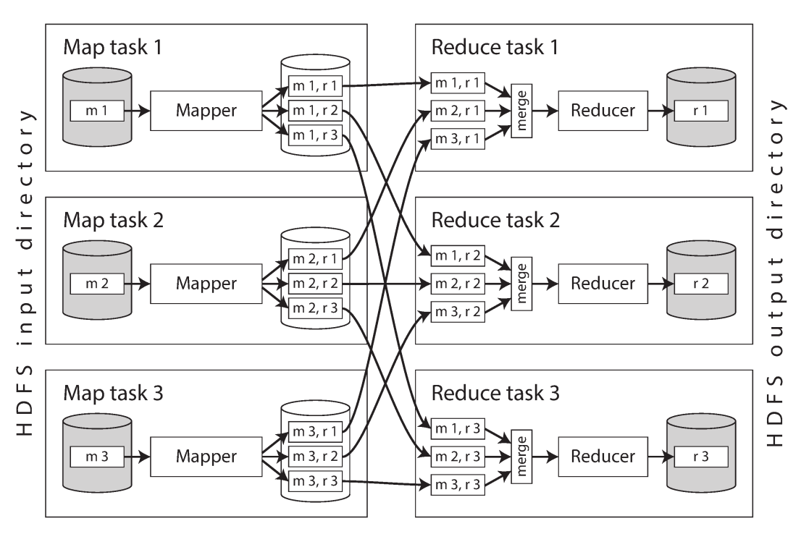
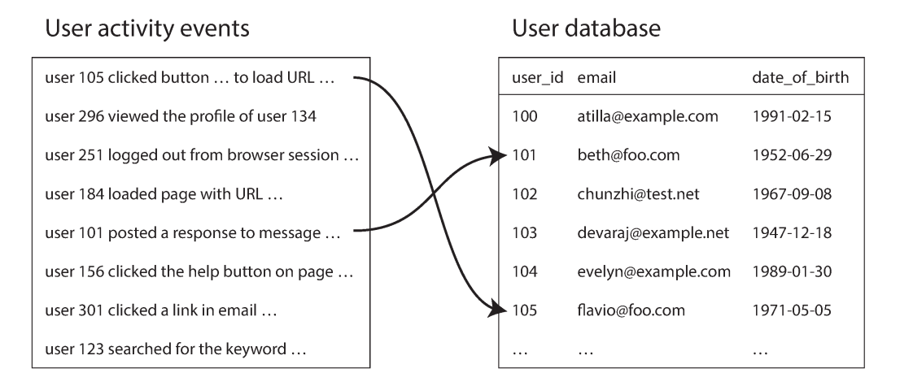
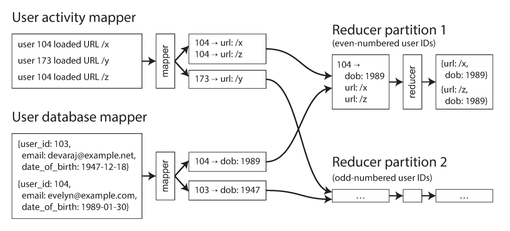

# فصل ۱۰: **Batch Processing**

## &rlm;Batch Processing

در دو بخش نخست کتاب بیشتر با request و response سروکار داشتیم: کاربر چیزی می‌خواهد و سرویس بعد از مدتی جواب می‌دهد. database، cache، search index و web server معمولاً همین مدل online را دارند. response time و availability در چنین سیستمی مهم‌اند، چون اغلب یک انسان منتظر پاسخ است.

اما این تنها مدل پردازش نیست. سه نوع سیستم را از هم جدا کنیم:

### &rlm;**Services** یا سیستم‌های online

سرویس منتظر request یا instruction از client است، آن را تا حد ممکن سریع اجرا می‌کند و response می‌دهد. معیار اصلی performance معمولاً response time است و unavailableشدن، مستقیماً خطای کاربر ایجاد می‌کند.

### &rlm;**Batch processing systems** یا سیستم‌های offline

سیستم batch مقدار زیادی input را می‌گیرد، job را روی آن اجرا می‌کند و output تولید می‌کند. job ممکن است چند دقیقه تا چند روز طول بکشد و معمولاً انسان منتظر پایان آن نیست؛ شاید job هر شب یا هر هفته اجرا شود. معیار اصلی performance در اینجا throughput است: چه مدت طول می‌کشد کل dataset با اندازهٔ مشخص پردازش شود؟

### &rlm;**Stream processing systems**

&rlm;stream processing بین online و batch قرار می‌گیرد. مانند batch، input را به output تبدیل می‌کند، اما input آن eventهایی است که پیوسته می‌رسند و بلافاصله پردازش می‌شوند؛ بنابراین latency از batch کمتر است. فصل ۱۱ به این مدل می‌پردازد.

در این فصل **MapReduce** و چند مدل دیگر batch processing را بررسی می‌کنیم. MapReduce در ۲۰۰۴ به‌عنوان الگوریتمی برای پردازش عظیم روی commodity hardware مطرح شد و بعد در Hadoop، CouchDB و MongoDB پیاده‌سازی شد. امروز ابزارهای سریع‌تر و سطح‌بالا جای آن را در بسیاری از کارها گرفته‌اند، اما MapReduce هنوز abstraction روشنی برای فهم partitioning، shuffle، fault tolerance و dataflow است.

## &rlm;Batch Processing با ابزارهای Unix

فرض کنید web server هر بار که requestی را پاسخ می‌دهد، یک خط به access log اضافه می‌کند:

&rlm;~~~text
216.58.210.78 - - [27/Feb/2015:17:55:11 +0000] "GET /css/typography.css HTTP/1.1"
200 3377 "http://example.com/" "Mozilla/5.0 ..."
~~~

فرمت log را می‌توان چنین خواند:

&rlm;~~~text
$remote_addr - $remote_user [$time_local] "$request"
$status $body_bytes_sent "$http_referer" "$http_user_agent"
~~~

در این نمونه، client با IP مشخصی در زمان معین فایل CSS را خواسته، status برابر ۲۰۰ بوده، response حدود ۳۳۷۷ byte داشته و browser از یک صفحهٔ دیگر به این URL رسیده است.

### تحلیل سادهٔ log

برای پیدا کردن پنج URL پرمراجعه می‌توان چند برنامهٔ کوچک را با pipe ترکیب کرد:

&rlm;~~~bash
&rlm;cat /var/log/nginx/access.log |
&rlm;awk '{print $7}' |
&rlm;sort |
&rlm;uniq -c |
&rlm;sort -r -n |
&rlm;head -n 5
~~~

هر مرحله فقط یک کار انجام می‌دهد:

1. &rlm;cat فایل log را می‌خواند.
2. &rlm;awk هر خط را با فاصله به fieldها تقسیم می‌کند و field هفتم، یعنی URL، را چاپ می‌کند.
3. &rlm;sort URLها را مرتب می‌کند تا موارد یکسان کنار هم قرار گیرند.
4. &rlm;uniq -c خط‌های تکراری متوالی را یکی می‌کند و تعدادشان را می‌شمارد.
5. &rlm;sort -r -n بر اساس count، از بزرگ به کوچک مرتب می‌کند.
6. &rlm;head -n 5 پنج خط نخست را نگه می‌دارد.

خروجی ممکن است شبیه این باشد:

&rlm;~~~text
4189 /favicon.ico
3631 /2013/05/24/improving-security-of-ssh-private-keys.html
2124 /2012/12/05/schema-evolution-in-avro-protocol-buffers-thrift.html
1369 /
915 /css/typography.css
~~~

این pipeline روی gigabyteها log نیز مؤثر است و تغییرش آسان است. برای حذف CSS می‌توان شرطی مانند $7 !~ /\.css$/ {print $7} به awk داد؛ برای شمردن IPهای پرتکرار نیز به‌جای field هفتم، field اول را انتخاب کرد. ترکیب awk، sed، grep، sort، uniq و xargs بسیاری از تحلیل‌های روزمره را بدون برنامهٔ بزرگ انجام می‌دهد.

### &rlm;pipeline در برابر برنامهٔ سفارشی

همین کار را می‌توان با Ruby نوشت:

&rlm;~~~ruby
&rlm;counts = Hash.new(0)
&rlm;File.open('/var/log/nginx/access.log') do |file|
&rlm;  file.each do |line|
&rlm;    url = line.split[6]
&rlm;    counts[url] += 1
&rlm;  end
&rlm;end
&rlm;top5 = counts.map { |url, count| [count, url] }.sort.reverse[0...5]
&rlm;top5.each { |count, url| puts "#{count} #{url}" }
~~~

این برنامه خواناست، اما از نظر execution flow با pipeline فرق دارد. Ruby یک hash table در memory نگه می‌دارد که برای هر URL counter دارد. اگر تعداد URLهای distinct کم باشد، این روش عالی است؛ تعداد تکرار یک URL هرقدر زیاد باشد، فضای hash فقط به تعداد URLهای متفاوت وابسته است.

اگر working set از memory بزرگ‌تر شود، hash table مشکل‌ساز می‌شود. روش sort می‌تواند chunkها را در memory مرتب و روی disk ذخیره کند و سپس با merge sort آن‌ها را یکی کند. access ترتیبی disk سریع است و به memory تصادفی زیادی نیاز ندارد. ابزار sort در GNU Coreutils خودش dataset بزرگ‌تر از memory را به disk spill می‌کند و sorting را میان چند CPU تقسیم می‌کند.

## فلسفهٔ Unix

&rlm;Unix pipeها را مانند شلنگ باغچه تصور می‌کند: اگر لازم شد داده را مرحلهٔ دیگری پردازش کند، بخش دیگری از شلنگ را وصل کن. اصول مهم این فلسفه:

1. هر برنامه یک کار را خوب انجام دهد؛ برای کار جدید، برنامهٔ تازه بساز نه اینکه برنامهٔ قدیمی را با featureهای بی‌پایان پیچیده کنی.
2. فرض کن output هر برنامه ممکن است input برنامه‌ای باشد که هنوز نمی‌شناسی. output را با اطلاعات اضافی شلوغ نکن.
3. &rlm;software را سریع بساز و زود امتحان کن؛ بخش‌های ناشیانه را بدون ترس دور بینداز و بازسازی کن.
4. برای کم‌کردن کار برنامه‌نویسی از tool استفاده کن، حتی اگر ابتدا لازم باشد همان tool را بسازی.

این اصول—automation، prototype سریع، iteration تدریجی و شکستن کار بزرگ به قطعه‌های کوچک—با Agile و DevOps امروز هم آشنا به نظر می‌رسند.

### &rlm;interface یکنواخت

اگر output یک برنامه input برنامهٔ دیگر باشد، باید format مشترکی وجود داشته باشد. در Unix این interface معمولاً file یا دقیق‌تر، file descriptor است: دنباله‌ای مرتب از byteها. file می‌تواند فایل واقعی، stdin، stdout، Unix socket، device driver یا TCP connection باشد.

بسیاری از ابزارهای Unix این byteها را متن ASCII و recordها را خط‌هایی جداشده با newline می‌دانند. قرارداد newline از نظر نظری تنها انتخاب ممکن نیست، اما همین یکسان‌بودن باعث می‌شود awk، sort، uniq و head با هم کار کنند. URL و HTTP نیز نمونهٔ دیگری از interface یکنواخت‌اند: برنامه‌های سازمان‌های کاملاً متفاوت می‌توانند با یک قرارداد مشترک به هم link شوند.

### جدایی logic از wiring

برنامه‌ای که از stdin می‌خواند و به stdout می‌نویسد، نمی‌داند input از keyboard، file یا process دیگر می‌آید و output به screen، file یا pipe می‌رود. shell wiring را تعیین می‌کند، اما logic داخل برنامه مستقل می‌ماند. این جدایی، reuse و آزمایش را آسان می‌کند.

### شفافیت و آزمایش‌پذیری

در pipelineهای Unix، input فایل‌ها معمولاً تغییر نمی‌کند و output جدید جای output قبلی را می‌گیرد. می‌توان یک command را بارها با input یکسان اجرا کرد، مرحله‌ای را جدا بررسی کرد و هرجا لازم شد output میانی را ذخیره کرد. همین ویژگی‌ها بعداً در طراحی batch jobهای بزرگ دوباره ظاهر می‌شوند.

## &rlm;**MapReduce** و distributed filesystem

&rlm;MapReduce مانند نسخهٔ distributed ابزارهای Unix است:

- &rlm;input در یک distributed filesystem مانند **HDFS** ذخیره می‌شود؛
- مرحلهٔ map هر record را می‌خواند و key-value pair تولید می‌کند؛
- &rlm;framework pairها را بر اساس key partition و sort می‌کند؛
- مرحلهٔ reduce همهٔ valueهای یک key را یک‌جا دریافت می‌کند و output می‌سازد.

&rlm;HDFS فایل‌های بزرگ را به block تقسیم و روی چند machine replicate می‌کند. اگر یک disk یا node خراب شود، block از replica دیگری خوانده می‌شود. input batch محدود و ثابت است؛ job می‌داند چه مقدار داده باید بخواند و در نهایت تمام می‌شود.

### اجرای MapReduce

تعداد map taskها معمولاً بر اساس blockهای input تعیین می‌شود. framework code برنامه، مانند JAR، را به machine مناسب کپی می‌کند و برای هر record callback mapper را صدا می‌زند. mapper key-value pair تولید می‌کند.

تعداد reducerها را job author تعیین می‌کند و لزوماً با تعداد mapperها برابر نیست. برای اینکه همهٔ pairهای یک key به یک reducer برسند، framework hash key را محاسبه و partition مناسب را انتخاب می‌کند.

خروجی هر mapper بر اساس reducer partition جدا و در فایل‌های مرتب روی disk محلی نوشته می‌شود. سپس reducerها فایل مربوط به partition خود را از همهٔ mapperها می‌گیرند و با حفظ ترتیب merge می‌کنند. این چرخهٔ partition، sort و copy را **shuffle** می‌نامند.

&rlm;reducer ورودی مرتب‌شده را به شکل key و iterator همهٔ valueهای همان key دریافت می‌کند. لازم نیست همهٔ valueها در memory جا شوند؛ iterator می‌تواند آن‌ها را تدریجی بخواند. reducer هر تعداد record خروجی که لازم است می‌سازد و output در distributed filesystem ذخیره می‌شود.

### &rlm;workflowهای MapReduce

یک job منفرد برای همهٔ کارها کافی نیست. مثلاً شمارش page viewهای هر URL یک job است، اما پیدا کردن پنج URL برتر نیازمند sorting دوباره است. پس jobها به شکل workflow زنجیر می‌شوند و output یک job input job بعدی می‌شود.

در Hadoop معمولاً output در directory مشخصی ذخیره و job بعدی همان directory را به‌عنوان input می‌خواند. از دید framework این‌ها jobهای مستقل‌اند و external workflow scheduler مانند Oozie، Azkaban، Luigi، Airflow یا Pinball باید dependency آن‌ها را مدیریت کند. workflowهای ۵۰ تا ۱۰۰ مرحله‌ای برای recommendation systemها غیرعادی نیستند.

&rlm;output job فقط وقتی معتبر است که کل job موفق شده باشد؛ output ناقص task شکست‌خورده دور ریخته می‌شود. بنابراین مرحلهٔ بعدی تا موفقیت مرحلهٔ قبل شروع نمی‌شود. ابزارهای سطح‌بالا مانند Pig، Hive، Cascading، Crunch و FlumeJava بسیاری از این wiring را خودکار می‌کنند.

## &rlm;**Reduce-Side Joins** و grouping

&rlm;join زمانی لازم است که یک record به record دیگری اشاره کند: foreign key در مدل relational، reference در مدل document یا edge در graph. denormalization نیاز به join را کم می‌کند، اما معمولاً کاملاً حذف نمی‌کند.

&rlm;database برای query کوچک از index استفاده می‌کند، اما MapReduce معمولاً index معمولی ندارد و همهٔ input fileها را scan می‌کند. برای query یک user این کار ناکارآمد است؛ برای analytic jobی که بیشتر dataset را می‌خواند، scan موازی می‌تواند کاملاً مناسب باشد.

### مثال: تحلیل activity کاربران

یک dataset از eventهای فعالیت user داریم و یک database از profile کاربر. event فقط user ID دارد؛ profile date of birth یا age را دارد. هدف می‌تواند فهمیدن این باشد که کدام URL در کدام age group محبوب‌تر است.

راه ساده این است که برای هر event از remote database profile بخوانیم، اما این روش:

- به round-trip network برای هر record وابسته است؛
- به distribution cache حساس است؛
- با queryهای هم‌زمان زیاد database را overload می‌کند؛
- &rlm;dataset remote ممکن است وسط job تغییر کند و نتیجه nondeterministic شود.

راه بهتر، exportکردن snapshot profile با ETL و قرار دادن آن در همان distributed filesystem است. حالا هر دو input محلی و immutable هستند و MapReduce می‌تواند آن‌ها را کنار هم بیاورد.

### &rlm;sort-merge join

&rlm;mapper رویدادها user ID را key و خود event را value می‌کند. mapper دیگر profile را می‌خواند و user ID را key و date of birth را value می‌کند. shuffle همهٔ recordهای یک user ID را به یک reducer می‌فرستد و آن‌ها را مرتب می‌کند.

با **secondary sort** می‌توان کاری کرد profile ابتدا و eventها بعد از آن، بر اساس timestamp مرتب باشند. reducer برای هر user ID یک بار صدا زده می‌شود، date of birth را نگه می‌دارد و eventها را یکی‌یکی می‌خواند تا خروجی‌هایی مانند URL و سن کاربر بسازد.

این الگوریتم **sort-merge join** نام دارد: mapperها خروجی را بر اساس join key sort می‌کنند و reducer لیست‌های مرتب چند input را merge می‌کند. application logic ساده می‌ماند و framework network communication و retry taskهای شکست‌خورده را مدیریت می‌کند.

### &rlm;**GROUP BY** و sessionization

الگوی «همهٔ recordهای یک key را یک‌جا بیاور» برای SQL **GROUP BY** نیز مناسب است. reducer می‌تواند:

- تعداد recordهای هر گروه را بشمارد؛
- مقدار fieldی را جمع کند؛
- &rlm;top-k record را بر اساس ranking انتخاب کند.

همین روش برای **sessionization** به کار می‌رود: eventهای یک user یا session cookie از log چند web server جمع می‌شوند تا ترتیب actionها مشخص شود. نتیجه می‌تواند مقایسهٔ A/B test یا اندازه‌گیری اثر یک campaign باشد.

### &rlm;skew و hot key

اگر یک key دادهٔ بسیار بیشتری از بقیه داشته باشد، یک reducer گلوگاه می‌شود. در social network، بیشتر userها چندصد follower دارند اما celebrity ممکن است میلیون‌ها follower داشته باشد. چنین keyهایی **hot key** یا **linchpin object** هستند.

چند راهکار:

- ابتدا keyهای داغ را با sampling پیدا کن و recordهای آن‌ها را تصادفی میان چند reducer پخش کن؛ input طرف دیگر join را به همهٔ reducerهای مربوط replicate کن.
- در sharded join، keyهای داغ را از قبل مشخص و shard کن.
- برای aggregation، کار را دو مرحله‌ای کن: مرحلهٔ اول هر reducer بخشی از key داغ را جمع کند؛ مرحلهٔ دوم جمع‌های کوچک‌تر را یکی کند.

هزینهٔ این راهکارها، replicateکردن داده یا اجرای job اضافه است، اما slowest reducer دیگر کل workflow را متوقف نمی‌کند.

## &rlm;**Map-Side Joins**

در reduce-side join، partitioning، sorting، copy و merge انجام می‌شود و انعطاف‌پذیر است؛ اما ممکن است داده چند بار روی disk نوشته شود. اگر دربارهٔ اندازه یا layout input فرض‌هایی داشته باشیم، map-side join سریع‌تر است: reducer و sorting حذف می‌شوند و هر mapper یک block را می‌خواند و output می‌نویسد.

### &rlm;broadcast hash join

اگر یکی از دو dataset کوچک است و در memory جا می‌شود:

1. هر mapper dataset کوچک را از HDFS در hash table می‌خواند.
2. &rlm;mapper blockهای dataset بزرگ را scan می‌کند.
3. برای هر record، user ID یا join key را در hash table lookup می‌کند.

چون dataset کوچک برای هر mapper خوانده می‌شود، به این روش **broadcast hash join** می‌گویند. اگر dataset در memory جا نشود، می‌توان یک read-only index روی disk محلی ساخت و از page cache کمک گرفت.

### &rlm;partitioned hash join

اگر هر دو input با همان key، hash function و تعداد partition یکسان تقسیم شده باشند، هر mapper فقط partition متناظر خود را می‌خواند. hash table کوچک‌تر می‌شود و network کمتر مصرف می‌شود. این روش در Hive با نام bucketed map join شناخته می‌شود.

### &rlm;map-side merge join

اگر دو input هم partition و هم بر اساس همان key مرتب شده باشند، mapper می‌تواند دو فایل را مانند merge sort هم‌زمان بخواند و recordهای key یکسان را match کند؛ بنابراین اندازهٔ dataset کوچک لازم نیست در memory جا شود.

انتخاب join به physical layout وابسته است، نه فقط encoding و directory. باید تعداد partitionها، key partitioning و sort order در metadata مانند Hive metastore یا HCatalog ثبت شود.

## خروجی workflowهای batch

&rlm;batch processing نه دقیقاً OLTP است و نه صرفاً گزارش analytics. اغلب input بزرگ را scan می‌کند اما output آن ساختاری برای مصرف یک سرویس دیگر است.

### ساخت search index

یکی از کاربردهای اولیهٔ MapReduce ساخت index موتور جست‌وجو بود. search index مانند Lucene برای هر keyword فهرست document IDهایی دارد که آن واژه را شامل می‌شوند. mapper documentها را partition می‌کند و reducer index بخش خود را می‌سازد.

&rlm;index file پس از ساخت immutable است. می‌توان کل index را دوره‌ای از نو ساخت و خروجی جدید را یک‌باره جایگزین کرد؛ این روش برای تغییر کم، محاسبهٔ اضافی دارد اما reasoning ساده‌ای دارد: document داخل، index بیرون. راه دیگر ساخت incremental segment و merge پس‌زمینه است.

### ساخت key-value store

&rlm;batch job می‌تواند classifier، spam filter، recommendation یا databaseای بسازد که بر اساس user ID یا product ID query می‌شود. نوشتن مستقیم نتیجهٔ هر mapper یا reducer در production database ایدهٔ بدی است:

- &rlm;network request برای هر record از throughput batch بسیار کندتر است؛
- &rlm;taskهای موازی ممکن است database را overload کنند؛
- &rlm;retry و speculative execution side effect خارجی ایجاد می‌کند و output ناقص را قابل مشاهده می‌سازد.

راه بهتر این است که job فایل‌های database جدید را در HDFS بسازد. فایل‌های immutable بعداً bulk load می‌شوند. server تا زمان کامل‌شدن copy، فایل‌های قدیمی را سرویس می‌دهد و سپس اتمیک به فایل‌های جدید switch می‌کند. اگر چیزی خراب شد، به نسخهٔ قدیمی برمی‌گردد. ساختن فایل‌های read-only مانند Voldemort، Terrapin، ElephantDB یا bulk load در HBase از این مدل استفاده می‌کند.

### &rlm;philosophy خروجی batch

&rlm;input immutable و output کاملاً جایگزین‌شونده چند مزیت دارد:

- اگر code bug داشت، output را نگه نمی‌داریم؛ نسخهٔ درست code را اجرا و output را دوباره می‌سازیم.
- &rlm;output قبلی را می‌توان در directory جدا نگه داشت و rollback کرد؛ این نوعی **human fault tolerance** است.
- &rlm;task شکست‌خورده روی همان input retry می‌شود و فقط output task ناموفق دور ریخته می‌شود.
- همان input را می‌توان با jobهای مختلف، monitoring و مقایسهٔ run قبلی استفاده کرد.
- &rlm;logic job از wiring input/output جداست.

&rlm;MapReduce روی inputهای ساختاریافته مانند Avro و Parquet، parsing متن Unix را کمتر می‌کند و schema evolution را ممکن می‌سازد.

## &rlm;Hadoop در برابر distributed database

&rlm;**MPP database** برای اجرای موازی queryهای analytic SQL ساخته شده و storage، query planning، scheduling و execution را یک‌جا کنترل می‌کند. در مقابل، Hadoop ترکیب HDFS و MapReduce شبیه operating system عمومی است که برنامهٔ دلخواه را اجرا می‌کند.

### تنوع storage

&rlm;database باید داده را با model و format خود سازگار کند، اما فایل HDFS صرفاً byte sequence است. می‌تواند record database، متن، عکس، ویدئو، sensor data، sparse matrix یا genome sequence باشد.

این آزادی شبیه **data lake** یا enterprise data hub است: داده خام سریع جمع می‌شود و schema بعداً هنگام مصرف تعیین می‌شود (**schema-on-read**). مزیت آن این است که تیم تولیدکننده را مجبور نمی‌کند از ابتدا یک model ایده‌آل انتخاب کند و چند تیم می‌توانند viewهای متفاوتی از همان raw data بسازند. عیب آن این است که بار تفسیر و پاک‌سازی به مصرف‌کننده منتقل می‌شود.

&rlm;Hadoop برای ETL نیز مناسب است: دادهٔ raw از سیستم OLTP وارد HDFS می‌شود، با MapReduce پاک و transform می‌شود و بعد به شکل relational به MPP data warehouse می‌رود.

### تنوع processing model

&rlm;SQL برای grouping و join عالی است، اما machine learning، recommendation، full-text relevance و image analysis اغلب به code و library اختصاصی نیاز دارند. MapReduce اجازه می‌دهد engineer هر logicی را روی dataset بزرگ اجرا کند. چون HDFS storage مشترک است، HBase برای OLTP، Impala برای analytics و مدل‌های دیگر می‌توانند روی همان cluster کنار هم باشند.

### طراحی برای faultهای مکرر

&rlm;MPP database معمولاً query چندثانیه‌ای یا چنددقیقه‌ای را با memory زیاد اجرا می‌کند؛ اگر یک node crash کند، کل query retry می‌شود. MapReduce jobهای طولانی و عظیم را با retry در سطح task مدیریت می‌کند و داده را بیشتر روی disk می‌نویسد.

در محیط‌هایی مانند datacenterهای چندکاربردی، low-priority batch task ممکن است هر لحظه برای task مهم‌تر preempt شود. پس failure مکرر task نه به این دلیل است که hardware بسیار خراب است، بلکه چون preemption utilization را بالا می‌برد. MapReduce با retry جزئی از restart کل job جلوگیری می‌کند؛ این trade-off fault-free performance کمتر در برابر recovery ارزان‌تر است.

## &rlm;**Beyond MapReduce**

&rlm;MapReduce abstraction آموزشی خوبی است، اما API خام آن برای join و workflow کدنویسی زیادی می‌خواهد و در بعضی پردازش‌ها کند است. Pig، Hive، Cascading و Crunch API سطح‌بالاتری ارائه کردند؛ سپس Spark، Tez و Flink مدل‌های dataflow منعطف‌تری ساختند.

### &rlm;materialization حالت میانی

در MapReduce، output هر job در HDFS نوشته می‌شود و job بعدی بعد از پایان کامل job قبلی آن را می‌خواند. این برای datasetی که قرار است منتشر و توسط چند تیم مصرف شود مفید است، چون coupling کم است. اما اگر output فقط input یک job بعدی همان تیم باشد، این فایل صرفاً **intermediate state** است.

نوشتن eager این state را **materialization** می‌نامیم. Unix pipe output را تدریجی از buffer کوچک به input بعدی می‌دهد. materialization کامل MapReduce چند مشکل دارد:

- &rlm;stage بعدی تا پایان slowest task stage قبلی شروع نمی‌شود.
- &rlm;mapper بعدی ممکن است فقط فایل reducer قبلی را دوباره بخواند و دوباره partition و sort کند.
- &rlm;intermediate file برای fault tolerance چند replica دارد، درحالی‌که temporary است.

### &rlm;dataflow engine

&rlm;Spark، Tez و Flink کل workflow را یک job می‌بینند. functionها نقش ثابت map و reduce ندارند؛ به‌صورت **operator** کنار هم قرار می‌گیرند:

- &rlm;repartition و sort برای sort-merge join و grouping؛
- &rlm;partition مشترک بدون sort برای partitioned hash join؛
- &rlm;broadcastکردن output کوچک برای broadcast hash join.

مزیت‌ها:

- &rlm;sort فقط جایی انجام می‌شود که واقعاً لازم است؛
- &rlm;mapperهای اضافی حذف می‌شوند؛
- &rlm;scheduler می‌تواند producer و consumer را روی یک machine قرار دهد و از locality استفاده کند؛
- &rlm;intermediate state در memory یا local disk می‌ماند و لازم نیست در HDFS چندبار replicate شود؛
- &rlm;operator بعدی به‌محض آماده‌شدن input شروع می‌شود؛
- &rlm;JVM و processها reuse می‌شوند و startup cost کم می‌شود.

### &rlm;fault tolerance در dataflow

&rlm;MapReduce با materialization روی HDFS recovery ساده‌ای دارد: task دوباره همان input را می‌خواند. Spark، Flink و Tez به‌جای ذخیرهٔ همهٔ intermediate state، ancestry یا lineage داده را نگه می‌دارند و در صورت failure بخش از دست‌رفته را recompute می‌کنند. Spark از **RDD** و Flink از checkpoint state operatorها استفاده می‌کند.

این recovery به deterministicبودن operator وابسته است. اگر iteration روی hash table ترتیب ثابتی نداشته باشد، random number یا system clock وارد محاسبه شود، recomputed output با output قبلی فرق می‌کند و downstream نیز باید دوباره اجرا شود. برای جلوگیری از cascading recovery، operator را deterministic نگه دارید؛ random را با seed ثابت بسازید.

&rlm;recompute همیشه بهتر نیست. اگر intermediate data کوچک یا computation بسیار CPU-intensive است، materializeکردن آن روی disk ارزان‌تر از اجرای دوبارهٔ کل محاسبه است. dataflow engine شبیه Unix pipe است، اما input اولیه و output نهایی همچنان معمولاً در HDFS durable می‌شوند.

## &rlm;graph و پردازش iterative

در graph processing، data خودش graph است، نه فقط DAG اجرای operatorها. الگوریتم‌هایی مانند **PageRank**، recommendation و transitive closure بارها edgeها را دنبال می‌کنند تا مقدار metric همگرا شود.

&rlm;MapReduce ذاتاً یک pass کامل انجام می‌دهد. راه ساده این است که scheduler هر iteration یک job اجرا کند، پایان condition را بررسی کند و اگر لازم بود round بعدی را شروع کند؛ اما هر round کل graph را دوباره می‌خواند و output کامل جدید می‌سازد.

### مدل **Pregel** و BSP

مدل **Bulk Synchronous Parallel (BSP)**، که Pregel آن را معروف کرد و در Giraph، GraphX و Gelly دیده می‌شود، state هر vertex را از یک iteration به iteration بعد نگه می‌دارد:

1. هر vertex پیام‌های iteration قبلی را دریافت می‌کند.
2. &rlm;function vertex state را به‌روز می‌کند.
3. پیام‌هایی به vertexهای همسایه می‌فرستد.
4. پس از پایان همهٔ vertexها، iteration بعد شروع می‌شود.

&rlm;vertex مانند actor است، اما state و messageها durable و fault-tolerant‌اند و communication در roundهای مشخص انجام می‌شود. framework می‌تواند graph را partition کند و messageها را بر اساس vertex ID به machine درست بفرستد.

برای fault tolerance، framework در پایان iteration checkpoint می‌گیرد. با خرابی node می‌توان کل computation را از checkpoint قبلی برگرداند یا در صورت log و deterministicبودن، فقط partition از دست‌رفته را recompute کرد.

&rlm;partition graph دشوار است؛ اگر vertexهای پرارتباط کنار هم نیفتند، messageهای بین machineها بسیار زیاد می‌شوند و حتی ممکن است از حجم خود graph بیشتر باشند. اگر graph روی یک machine جا شود، الگوریتم single-machine اغلب از distributed graph processing سریع‌تر است.

## &rlm;API و زبان‌های سطح‌بالا

&rlm;MapReduce در clusterهای بزرگ قابل‌اعتماد شده است، اما نوشتن function خام برای انسان پرزحمت است. APIهای Hive، Pig، Spark و Flink operatorهای relational-style مانند filter، join، group و aggregate را در اختیار می‌گذارند و می‌توانند interactive باشند.

### حرکت به سمت زبان declarative

اگر application فقط بگوید «این دو dataset را بر اساس این field join کن»، framework می‌تواند بر اساس اندازه و layout input، بهترین join را انتخاب کند، ترتیب joinها را عوض کند و intermediate state را کم کند. این همان مزیت **declarative query** است: application چه می‌خواهد را می‌گوید، optimizer چگونه را انتخاب می‌کند.

&rlm;MapReduce خام callback دلخواه را اجازه می‌دهد؛ این انعطاف برای parsing، NLP، image analysis، statistic و libraryهای مختلف ارزشمند است. dataflow engineها این آزادی را با بخش‌های declarative ترکیب کرده‌اند:

- &rlm;filter ساده را از هر record جدا و بهینه می‌کنند؛
- فقط columnهای لازم را از column-oriented storage می‌خوانند؛
- از vectorized execution و CPU cache بهتر استفاده می‌کنند؛
- &rlm;Spark bytecode JVM و Impala کد native با LLVM تولید می‌کند.

در نتیجه batch engineها به MPP database شبیه‌تر و سریع‌تر شده‌اند، اما قابلیت اجرای code دلخواه و خواندن formatهای متنوع را حفظ کرده‌اند.

### تخصصی‌شدن برای domainهای مختلف

الگوهای تکرارشوندهٔ machine learning، recommendation، k-nearest neighbors، similarity search و genome analysis می‌توانند implementationهای reusable داشته باشند. Mahout روی MapReduce، Spark و Flink الگوریتم‌های ML ارائه می‌کند و MADlib همین ایده را داخل relational MPP database پیاده می‌کند. با رشد abstractionهای declarative، dataflow engine و MPP database به‌تدریج شبیه خانواده‌ای از ابزارهای عمومی storage و processing می‌شوند.

## جمع‌بندی فصل

&rlm;Batch job inputی محدود و immutable را می‌خواند و outputی derived تولید می‌کند؛ بر خلاف stream، input آن بی‌پایان نیست.

اصول Unix در MapReduce و dataflow نیز دیده می‌شوند: input تغییر نکند، output قابل اتصال به برنامهٔ بعدی باشد و کار بزرگ با ابزارهای کوچک و قابل ترکیب انجام شود. interface Unix file و pipe است؛ interface MapReduce distributed filesystem است.

دو مسئلهٔ اصلی frameworkهای batch:

### &rlm;Partitioning

&rlm;Map taskها بر اساس input block تقسیم می‌شوند. output آن‌ها بر اساس key به reducer partitionها repartition، sort و merge می‌شود تا همهٔ recordهای مرتبط در یک مکان قرار گیرند. dataflow engineها ممکن است sort غیرضروری را حذف کنند، اما ایدهٔ جابه‌جایی داده به محل مشترک باقی می‌ماند.

### &rlm;Fault tolerance

&rlm;MapReduce با نوشتن مکرر روی disk، task شکست‌خورده را ارزان retry می‌کند، اما در حالت سالم I/O بیشتری دارد. dataflow engineها intermediate state را کمتر materialize و بیشتر در memory نگه می‌دارند؛ بنابراین در failure باید بیشتر recompute کنند. deterministic operatorها این recomputation را قابل اعتماد می‌کنند.

&rlm;joinهای مهم:

- &rlm;**sort-merge join:** key را استخراج، partition، sort و merge کن؛ reducer همهٔ recordهای key را می‌گیرد.
- &rlm;**broadcast hash join:** input کوچک را در hash table هر mapper قرار بده و input بزرگ را scan کن.
- &rlm;**partitioned hash join:** اگر هر دو input با key و hash function و تعداد partition یکسان تقسیم شده‌اند، هر mapper فقط partition خودش را join کند.

&rlm;callbackهای mapper و reducer بهتر است stateless و بدون side effect خارجی باشند. در این صورت framework می‌تواند task را retry کند و output attemptهای ناموفق را پنهان نگه دارد؛ نتیجهٔ نهایی طوری است که انگار fault رخ نداده است.

## مثال مستقل: ساخت recommendation database

فرض کنید eventهای خرید، profile کاربر و catalog کالا در HDFS ذخیره شده‌اند. هدف ساخت databaseای است که web service با user ID آن را query کند:

1. &rlm;activity و profile را با sort-merge join بر user ID کنار هم بیاور.
2. برای هر user، کالاهای مشابه یا محبوب را aggregate کن.
3. خروجی را بر اساس user ID sort و partition کن.
4. فایل‌های key-value جدید را در directory versionدار بنویس.
5. پس از موفقیت کامل job، فایل‌ها را bulk load کن.
6. &rlm;serverها تا آماده‌شدن همهٔ فایل‌های جدید، version قبلی را serve کنند؛ سپس atomically switch کن.

اگر mapper مستقیماً database production را update کند، retry و parallelism می‌تواند side effect تکراری و overload بسازد. output immutable و versionدار هم rollback را ساده می‌کند و هم امکان بررسی قبل از انتشار را می‌دهد.

## تعریف جداگانهٔ اصطلاحات

### &rlm;**batch processing**

پردازش یک input محدود و نسبتاً بزرگ که در یک job کامل خوانده می‌شود و output جدید تولید می‌کند. کاربر معمولاً منتظر response لحظه‌ای نیست.

### &rlm;**MapReduce**

مدل پردازشی که recordها را به key-value pair map می‌کند، آن‌ها را بر اساس key partition و sort می‌کند و در reduce گروه‌های هم‌key را پردازش می‌کند.

### &rlm;**mapper**

تابعی که هر input record را می‌خواند و صفر یا چند key-value pair تولید می‌کند. بهتر است stateless و بدون side effect خارجی باشد.

### &rlm;**reducer**

تابعی که همهٔ valueهای یک key را پس از shuffle دریافت می‌کند و output گروه را می‌سازد.

### &rlm;**shuffle**

مرحلهٔ repartition، sort و انتقال output mapperها به reducer مناسب. هدف، جمع‌کردن دادهٔ هم‌key در یک محل است.

### &rlm;**HDFS**

&rlm;distributed filesystem هدوپ برای نگه‌داری فایل‌های بزرگ با block و replica. در batch job معمولاً input و output durable در HDFS هستند.

### &rlm;**materialization**

محاسبهٔ eager یک state میانی و نوشتن آن روی storage، به‌جای عبوردادن مستقیم stream به مرحلهٔ بعد. materialization recovery را ساده می‌کند اما I/O و latency workflow را بالا می‌برد.

### &rlm;**dataflow engine**

&rlm;engineی مانند Spark، Flink یا Tez که کل workflow را به‌صورت graphی از operatorها اجرا می‌کند و intermediate state را تا حد ممکن در memory یا local disk نگه می‌دارد.

### &rlm;**sort-merge join**

&rlm;joinی که هر دو input را بر اساس key مرتب می‌کند و لیست‌های مرتب را merge می‌کند. در MapReduce معمولاً reducer تمام recordهای همان key را یک‌جا می‌گیرد.

### &rlm;**broadcast hash join**

&rlm;joinی که input کوچک را در hash table هر mapper پخش می‌کند و input بزرگ را scan می‌کند. input کوچک باید در memory یا index محلی جا شود.

### &rlm;**partitioned hash join**

&rlm;joinی که دو input با همان key، hash function و تعداد partition تقسیم شده‌اند؛ هر mapper فقط partition متناظر را hash و join می‌کند.

### &rlm;**skew** و **hot key**

حالتی که یک key بسیار بیشتر از بقیه record دارد و یک reducer را به گلوگاه تبدیل می‌کند. sampling، random sharding، replication یا aggregation دومرحله‌ای راه‌حل‌های رایج‌اند.

### &rlm;**BSP** و **Pregel**

مدل Bulk Synchronous Parallel برای graph processing iterative. هر vertex در round مشخص پیام‌های قبلی را می‌گیرد، state خود را تغییر می‌دهد و پیام round بعد را می‌فرستد.

### &rlm;**lineage** و **RDD**

&rlm;lineage تاریخچهٔ محاسبهٔ یک داده است: از کدام partitionها و operatorها ساخته شده است. Spark با abstractionی مانند RDD از lineage برای recompute دادهٔ ازدست‌رفته استفاده می‌کند.

### &rlm;**declarative query**

شیوه‌ای که application نتیجه یا رابطهٔ موردنیاز را توصیف می‌کند و optimizer ترتیب و algorithm اجرا را انتخاب می‌کند؛ SQL نمونهٔ اصلی آن است.
