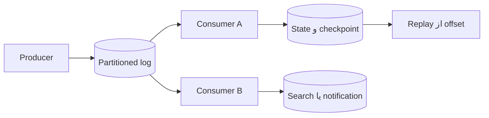

# فصل ۱۱: `Stream Processing`

## Stream Processing

در `stream processing`، data به‌جای اینکه منتظر کامل‌شدن یک dataset بماند، به‌صورت event وارد می‌شود. system باید با order، delay، duplicate، event time و state میان eventها کنار بیاید.

## هدف فصل

فصل تفاوت messaging و log، رابطهٔ database با stream، CDC و event sourcing، مدیریت زمان، join جریان‌ها و fault tolerance را توضیح می‌دهد.

## نقشهٔ مطالب

- انتقال event stream و خانوادهٔ messaging systemها
- partitioned log
- همگام‌سازی database و stream با CDC
- event sourcing و رابطهٔ state با stream
- window، join، زمان و تحمل خرابی

## خلاصهٔ زمینه‌محور

### `Message` و `log`

در یک message queue، پیام معمولاً پس از تحویل به یک consumer حذف یا ack می‌شود. این مدل برای توزیع کار مناسب است. در partitioned log، eventها به ترتیب در یک partition ماندگار می‌مانند و چند consumer مستقل می‌توانند همان stream را با offsetهای خود بخوانند. log replay و catch-up را ساده می‌کند، اما retention، رشد storage و مدیریت ترتیب را به مسئله تبدیل می‌کند.

partition کلید مهمی دارد: رویدادهای یک entity اگر در یک partition باشند ترتیب محلی حفظ می‌شود، ولی eventهای entityهای مختلف ترتیب جهانی ندارند. throughput بالا معمولاً با افزایش partition به دست می‌آید و به همان نسبت join و coordination سخت‌تر می‌شود.

### `database` و `stream`

وقتی database تغییر می‌کند و cache، search index یا warehouse باید به‌روز شود، نوشتن جداگانه در دو مقصد می‌تواند یکی را جا بیندازد. CDC تغییرهای database را به event تبدیل می‌کند. outbox نیز event را در همان local transaction ثبت می‌کند و بعد آن را publish می‌کند. consumer باید duplicate را تحمل و offset را با state خود هماهنگ کند.

در event sourcing، رویدادهای business منبع اصلی‌اند و وضعیت فعلی از replay آن‌ها ساخته می‌شود. این روش audit و بازسازی را خوب می‌کند، اما schema evolution، حذف اطلاعات حساس، اندازهٔ log و اصلاح event بد نیاز به طراحی دارد. event log با وضعیت فعلی database یکی نیست؛ هر کدام برای query و retention مناسب خاص خود را دارد.

### `state` و `immutability`

eventها معمولاً immutable هستند و state پردازشگر از آن‌ها مشتق می‌شود. اگر state از بین برود، می‌توان از checkpoint و event log دوباره ساخت. این الگو fault tolerance را ممکن می‌کند، اما replay باید deterministic باشد و منطق تغییرکرده با eventهای قدیمی سازگار بماند.

### زمان و `window`

دو زمان را باید جدا کرد: **event time** زمانی است که رخداد در منبع ایجاد شده و **processing time** زمانی است که پردازشگر آن را دیده است. شبکه و دستگاه آفلاین باعث می‌شوند eventها دیر یا خارج از ترتیب برسند. windowهای ثابت، لغزان یا session برای aggregate استفاده می‌شوند و watermark یا مهلت دیررس بودن مشخص می‌کند چه زمانی نتیجه نهایی اعلام شود.

### `Stream joins`

join دو stream به state نیاز دارد: eventهای هر طرف باید مدتی نگه‌داری شوند تا جفت احتمالی برسد. window زمانی از رشد بی‌نهایت state جلوگیری می‌کند، اما event دیررس ممکن است نتیجهٔ قبلی را اصلاح کند. join stream با table نیز به strategy برای refresh و ترتیب تغییرها نیاز دارد.

### fault tolerance

برای تحمل خرابی، offset مصرف‌شده، snapshot state و sink خارجی باید هماهنگ باشند. at-least-once ممکن است duplicate ایجاد کند؛ at-most-once احتمال از دست‌دادن دارد؛ exactly-once معمولاً دامنهٔ دقیقی دارد و به transaction یا commit هماهنگ در اجزای مشخص وابسته است. idempotent sink و deduplication اغلب راه عملی‌تری هستند.

### مثال مستقل: موجودی فروشگاه

هر خرید و برگشت کالا یک event است. پردازشگر آن‌ها را بر اساس `product_id` partition می‌کند و موجودی مشتق‌شده را به‌روز نگه می‌دارد. CDC سفارش‌ها را وارد stream می‌کند، event دیررس با watermark مدیریت می‌شود و snapshot دوره‌ای زمان replay را کم می‌کند. اگر پیام دوباره برسد، شناسهٔ event مانع دو بار کم‌شدن موجودی می‌شود.

## نکته‌های کلیدی

1. queue برای توزیع کار و log برای نگه‌داری قابل‌خواندن دوباره، semantics یکسانی ندارند.
2. event time، processing time و زمان مشاهده را از هم جدا کنید.
3. state پردازشگر باید checkpoint، replay و schema evolution داشته باشد.
4. exactly-once را در مرز دقیق سیستم تعریف کنید.

## ارتباط با فصل‌های دیگر

- [فصل ۴: `Encoding` و `Evolution`](../04-encoding-evolution/README.md)
- [فصل ۱۰: `Batch Processing`](../10-batch-processing/README.md)
- [فصل ۱۲: `Future of Data Systems`](../12-future-of-data-systems/README.md)

## مسیر کامل یک event

هر consumer offset و state خودش را دارد. بنابراین یک event می‌تواند چندبار توسط consumerهای متفاوت خوانده شود، بدون اینکه این موضوع duplicate درون یک consumer باشد. مرز دقیق commit offset و نوشتن state باید مستند شود.

## `Event time` و `Window` result

| زمان | تعریف | خطر اگر نادیده گرفته شود |
| --- | --- | --- |
| event time | زمان رخداد در منبع | گزارش تاریخی غلط |
| ingestion time | زمان ورود به pipeline | مخلوط‌شدن تأخیر منبع و شبکه |
| processing time | زمان اجرای operator | نتیجهٔ ناپایدار در replay |

برای هر window باید مشخص شود رویداد دیررس تا چه زمانی پذیرفته می‌شود، نتیجه چگونه اصلاح می‌شود و consumer نسخهٔ جدید را چگونه می‌فهمد.

## Delivery guarantees

| مدل | مزیت | هزینه یا ریسک |
| --- | --- | --- |
| at-most-once | ساده و کم‌تأخیر | از دست‌رفتن event |
| at-least-once | احتمال از دست‌رفتن کمتر | duplicate و نیاز به idempotency |
| exactly-once محدود | نتیجهٔ دقیق در مرز تعریف‌شده | coordination و محدودیت sink |

عبارت exactly-once باید با نام broker، state store و sink همراه باشد. اگر sink خارجی transaction مشترک ندارد، deduplication با شناسهٔ event یا عملیات قابل‌تکرار لازم است.

## سناریوی طراحی: مانیتورینگ دما

دستگاه‌ها ممکن است آفلاین شوند و چند دقیقه بعد دادهٔ قدیمی بفرستند. event شامل `device_id`، زمان اندازه‌گیری و sequence number است. pipeline بر اساس device partition می‌کند، window پنج‌دقیقه‌ای را با watermark می‌بندد و برای event دیررس correction می‌فرستد. dashboard باید زمان اندازه‌گیری را نمایش دهد، نه فقط زمان دریافت را.

## چک‌لیست stream

- [ ] کلید partition ترتیب لازم را حفظ می‌کند.
- [ ] schema event و policy نسخه‌بندی مشخص است.
- [ ] offset و checkpoint قابل‌بازسازی‌اند.
- [ ] duplicate، event دیررس و poison message مسیر جدا دارند.
- [ ] backpressure و رشد state پایش می‌شوند.

## تمرین‌های مرور

1. برای یک window، policy رویداد دیررس و correction را طراحی کنید.
2. نشان دهید چرا commit offset پیش از write به sink می‌تواند event را گم کند.
3. تفاوت replay کامل و retry همان پیام را توضیح دهید.

## تعریف مستقل اصطلاحات

### `event`

**چیست؟** گزارشی از اینکه یک اتفاق در زمان مشخص رخ داده است؛ معمولاً گذشته را توصیف می‌کند و نباید بی‌دلیل تغییر کند.

### `queue` و `log`

`queue` معمولاً پیام را بین consumerها تقسیم می‌کند تا یک کار انجام شود. `log` eventها را نگه می‌دارد و consumerها با offset مستقل دوباره آن‌ها را می‌خوانند. یک سیستم ممکن است هر دو رفتار را با policyهای متفاوت ارائه دهد.

### `consumer`

**چیست؟** برنامه‌ای که event را می‌خواند و بر اساس آن کاری انجام می‌دهد.

**اشتباه رایج:** consumer باید duplicate، پیام خراب و عقب‌ماندگی را مدیریت کند؛ broker به‌تنهایی این مسئولیت را حذف نمی‌کند.

### `at-most-once`, `at-least-once` و `exactly-once`

- `at-most-once`: پیام ممکن است گم شود، اما معمولاً دوباره تحویل نمی‌شود.
- `at-least-once`: پیام گم نشود، اما duplicate ممکن است.
- `exactly-once`: فقط در یک مرز دقیق و با شرایط خاص ادعای یک‌بار اثرگذاری می‌کند.

### `DLQ`

`DLQ` مخفف **Dead Letter Queue** است. پیام‌هایی که پس از retry محدود هنوز قابل‌پردازش نیستند، به DLQ می‌روند تا جریان اصلی متوقف نشود و تیم بتواند آن‌ها را بررسی یا اصلاح کند.

### `outbox` و `inbox`

`outbox` نیت ارسال event را کنار تغییر اصلی ثبت می‌کند. `inbox` شناسهٔ eventهای پردازش‌شده را ثبت می‌کند تا consumer یک side effect را دوباره اعمال نکند. این دو الگو مکمل‌اند، نه جایگزین retry.

### `CDC`

`CDC` مخفف **Change Data Capture** است؛ یعنی تغییرهای database به event تبدیل شوند. `CDC` برای ساخت search index یا analytics مفید است، اما ترتیب، حذف، schema و lag آن باید پایش شود.

### `Kafka`

**چیست؟** یک پلتفرم رایج برای نگه‌داری و مصرف partitioned log.

**اشتباه رایج:** استفاده از Kafka به‌تنهایی ordering جهانی، exactly-once یا business transaction ایجاد نمی‌کند؛ key، partition، consumer و sink باید با هم طراحی شوند.
