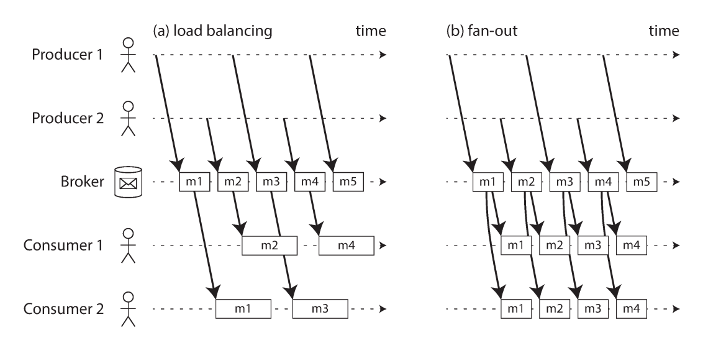
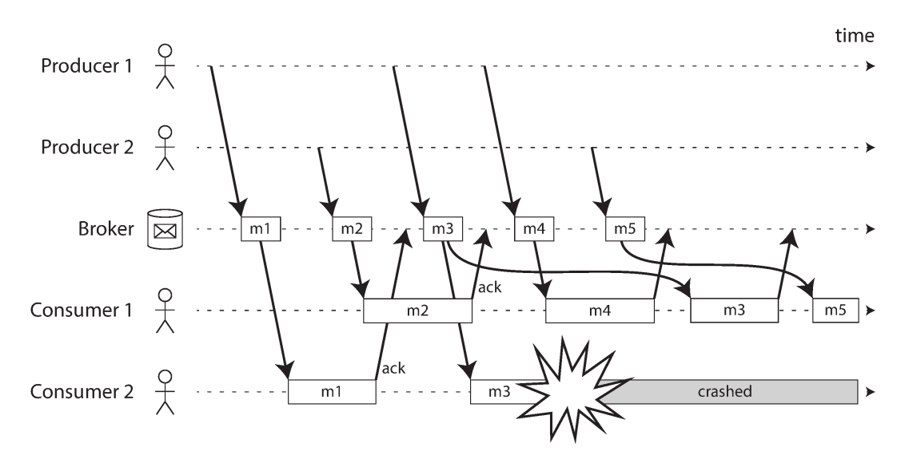
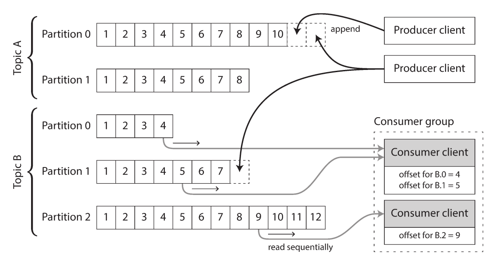
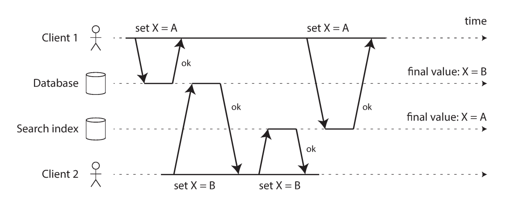
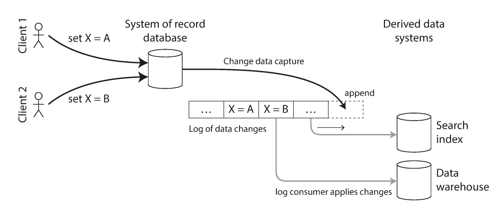
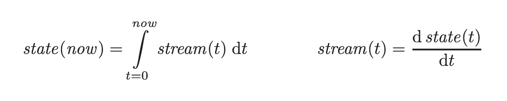
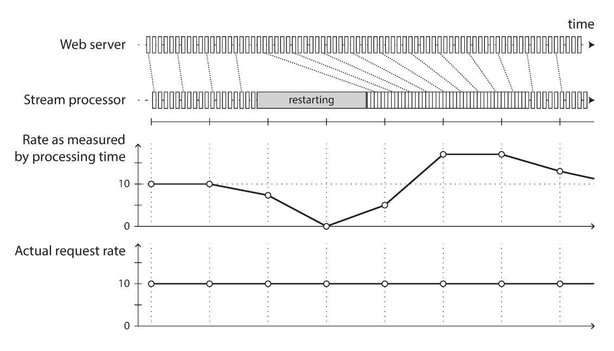

# فصل ۱۱: پردازش جریانی (Stream Processing)

<blockquote dir="rtl" align="right">
  
یک سیستم پیچیده که درست کار می‌کند، تقریباً همیشه از یک سیستم ساده‌ای تکامل پیدا کرده است که درست کار می‌کرد. گزارهٔ معکوس هم ظاهراً درست است: سیستم پیچیده‌ای که از ابتدا طراحی شود، معمولاً کار نمی‌کند و نمی‌توان آن را وادار کرد که کار کند.

  
— John Gall، کتاب <em dir="ltr">Systemantics</em>

</blockquote>

## هدف فصل

در فصل قبل دیدیم که **batch processing** ورودی‌ای محدود دارد: مجموعه‌ای از فایل‌ها را می‌خواند، کارش را انجام می‌دهد و مجموعه‌ای از فایل‌های خروجی می‌سازد. اما بسیاری از داده‌ها هیچ‌وقت به «آخر» نمی‌رسند. کاربران هر روز درخواست می‌فرستند، حسگرها مرتب اندازه‌گیری می‌کنند و تراکنش‌ها پیوسته ثبت می‌شوند. چنین داده‌ای را باید کم‌کم و هم‌زمان با رسیدنش پردازش کرد.

این فصل دربارهٔ **stream processing** است؛ یعنی پردازش مداوم داده‌ای که به‌صورت افزایشی در طول زمان در دسترس قرار می‌گیرد. ابتدا می‌بینیم eventها چگونه تولید، ذخیره و منتقل می‌شوند. سپس رابطهٔ میان database و stream را بررسی می‌کنیم؛ از جمله **Change Data Capture** و **Event Sourcing**. در پایان، روش‌های پردازش stream، مفهوم زمان، join کردن streamها و تحمل خطا را توضیح می‌دهیم.

## نقشهٔ مطالب

1. انتقال eventها و انواع سیستم‌های پیام‌رسانی
2. &rlm;**partitioned log** و تفاوت آن با message brokerهای سنتی
3. &rlm;databaseها به‌عنوان منبع stream و نگه‌داشتن چند سیستم در sync
4. &rlm;**Change Data Capture** و **Event Sourcing**
5. کاربردهای پردازش stream، windowها و joinها
6. تحمل خطا، retry، checkpoint و بازسازی state

## &rlm;۱. Stream چیست؟

در یک فایل یا مجموعهٔ فایل‌ها، پردازشگر می‌داند ورودی چه اندازه‌ای دارد و چه زمانی به پایان می‌رسد. برای مثال، مرتب‌سازی باید تمام ورودی را بخواند؛ چون ممکن است کوچک‌ترین کلید در آخرین رکورد باشد و لازم باشد همان رکورد در ابتدای خروجی قرار بگیرد. به همین دلیل، تولید خروجی قبل از دیدن تمام ورودی همیشه ممکن نیست.

اما بیشتر داده‌های واقعی **unbounded** هستند؛ یعنی اندازهٔ آن‌ها از قبل معلوم نیست و در طول زمان بزرگ‌تر می‌شوند. دادهٔ دیروز و امروز وجود دارد و دادهٔ فردا هم خواهد رسید. یک سرویس آنلاین تا زمانی که تعطیل نشود، ورودی جدید دریافت می‌کند. بنابراین dataset هیچ‌وقت به‌معنای واقعی «کامل» نمی‌شود.

در چنین حالتی، batch processing معمولاً داده را مصنوعی به قطعه‌های زمانی تقسیم می‌کند؛ مثلاً همهٔ eventهای یک روز را در پایان همان روز پردازش می‌کند. این روش ساده است، اما خروجی ممکن است یک روز از وضعیت واقعی عقب باشد. با کوتاه‌تر کردن batch می‌توان تأخیر را کم کرد؛ مثلاً هر ساعت یا هر ثانیه یک batch ساخت. مرحلهٔ بعد این است که اصلاً منتظر پایان یک بازهٔ ثابت نمانیم و هر event را به‌محض رسیدن پردازش کنیم. این همان stream processing است.

در این فصل، **stream** یعنی دنباله‌ای از داده که به‌صورت تدریجی در طول زمان قابل دریافت می‌شود. همین ایده در جاهای مختلف دیده می‌شود:

- ورودی و خروجی استاندارد در Unix، یعنی stdin و stdout
- &rlm;**lazy list**ها در زبان‌های برنامه‌نویسی
- &rlm;APIهای filesystem مانند FileInputStream در Java
- اتصال‌های TCP
- پخش صوت و ویدئو در اینترنت

در stream processing، یک رکورد معمولاً **event** نامیده می‌شود. event شیئی کوچک، مستقل و تغییرناپذیر (**immutable**) است که توضیح می‌دهد در زمانی مشخص چه اتفاقی افتاده است. event می‌تواند یکی از این موارد باشد:

- کاربر صفحه‌ای را باز کرده یا خریدی انجام داده است.
- حسگر دمای جدیدی گزارش کرده است.
- ماشین درصد استفاده از CPU خود را فرستاده است.
- وب‌سرور یک درخواست را در log ثبت کرده است.

&rlm;event را می‌توان به‌شکل متن، JSON یا یک قالب binary ذخیره کرد. سپس همان event را می‌توان به فایل append کرد، در یک جدول relational گذاشت، در یک document database ذخیره کرد یا به node دیگری فرستاد.

در این مدل، **producer** یا publisher، event را یک‌بار تولید می‌کند و یک یا چند **consumer** یا subscriber آن را می‌خوانند. eventهای مرتبط معمولاً در یک **topic** یا stream گروه‌بندی می‌شوند. این مدل شبیه فایل است: فایل یک‌بار نوشته می‌شود، اما چند job می‌تواند آن را بخواند.

### &rlm;polling یا notification؟

از نظر فنی می‌توان producer را وادار کرد eventها را در database بنویسد و consumer را وادار کرد مرتب بپرسد که آیا event جدیدی آمده است یا نه. این کار **polling** نام دارد. polling وقتی تعداد درخواست‌ها کم است، ساده است؛ اما برای تأخیر کم مناسب نیست:

- اگر فاصلهٔ polling زیاد باشد، event دیر دیده می‌شود.
- اگر فاصله را کم کنیم، بیشتر درخواست‌ها هیچ دادهٔ جدیدی پیدا نمی‌کنند.
- در نتیجه، هزینهٔ پرس‌وجو زیاد می‌شود بدون آن‌که کار مفیدی انجام شود.

راه بهتر این است که consumer هنگام رسیدن event **notification** دریافت کند. databaseهای سنتی معمولاً notification را به‌صورت کامل و عمومی ارائه نمی‌کنند. triggerها می‌توانند به insert یا update واکنش نشان دهند، اما محدودیت دارند و در طراحی بسیاری از databaseها قابلیت اصلی محسوب نمی‌شوند. به همین دلیل، ابزارهای تخصصی messaging برای رساندن notification ساخته شده‌اند.

## &rlm;۲. Messaging systems

در یک سیستم messaging، producer پیامی شامل event را می‌فرستد و سیستم آن را به consumerها تحویل می‌دهد. یک pipe در Unix یا اتصال TCP ساده می‌تواند یک sender را به یک receiver وصل کند، اما messaging system معمولاً چند producer، چند consumer و یک topic مشترک را پشتیبانی می‌کند.

برای مقایسهٔ سیستم‌های messaging، دو پرسش مهم وجود دارد.

### اگر producer سریع‌تر از consumer باشد چه می‌شود؟

سه انتخاب کلی داریم:

1. &rlm;**drop**: بعضی پیام‌ها حذف شوند.
2. &rlm;**buffer**: پیام‌ها در queue نگه‌داری شوند تا consumer به آن‌ها برسد.
3. &rlm;**backpressure** یا flow control: producer متوقف یا کند شود تا consumer عقب نماند.

&rlm;pipeهای Unix و TCP معمولاً backpressure دارند. buffer آن‌ها محدود است؛ وقتی پر شود، sender تا خالی شدن بخشی از آن متوقف می‌ماند. اگر سیستم پیام‌ها را در queue ذخیره کند، باید مشخص شود queue در چه نقطه‌ای از memory به disk منتقل می‌شود و این انتقال چه اثری بر performance دارد.

انتخاب درست به معنی event بستگی دارد. اگر حسگر هر چند ثانیه یک reading بفرستد، از دست رفتن یک reading شاید مهم نباشد؛ چون مقدار بعدی کمی بعد می‌رسد. اما اگر eventها شمارش شوند، از دست رفتن هر پیام مقدار counter را غلط می‌کند. بدتر این‌که اگر پیام‌های زیادی حذف شوند، ممکن است تا مدت‌ها متوجه نشویم که metric نادرست است.

### اگر node از کار بیفتد چه می‌شود؟

باید تعیین کنیم event در برابر crash یا offline شدن node از بین می‌رود یا نه. برای durability معمولاً باید event روی disk نوشته شود، replicate شود یا هر دو کار انجام شود. این کار هزینه دارد، اما اگر از دست رفتن پیام مجاز باشد، با همان hardware می‌توان throughput بیشتر و latency کمتری گرفت.

در batch processing معمولاً task خراب دوباره اجرا می‌شود و output ناقص آن دور ریخته می‌شود. بنابراین نتیجه طوری به‌نظر می‌رسد که انگار هیچ خطایی رخ نداده است. در stream processing، چون ورودی تمام نمی‌شود، رسیدن به همین رفتار سخت‌تر است و در بخش fault tolerance به آن برمی‌گردیم.

### ارسال مستقیم از producer به consumer

برخی سیستم‌ها هیچ broker واسطه‌ای ندارند و producer مستقیماً با consumer ارتباط می‌گیرد:

- &rlm;**UDP multicast** در feedهای بازار مالی رایج است؛ latency کم است، اما خود UDP قابل‌اعتماد نیست. اگر برنامه به پیام‌های ازدست‌رفته نیاز داشته باشد، باید شمارهٔ packetها را نگه دارد و امکان درخواست retransmission بدهد.
- کتابخانه‌های brokerless مانند **ZeroMQ** و **nanomsg**، publish/subscribe را روی TCP یا IP multicast پیاده می‌کنند.
- ابزارهایی مانند **StatsD** و **Brubeck** برای جمع‌آوری metric از ماشین‌های شبکه از UDP استفاده می‌کنند. در این حالت شمارش فقط وقتی دقیق است که همهٔ پیام‌ها برسند.
- اگر consumer یک service روی network ارائه کند، producer می‌تواند با HTTP یا RPC پیام را push کند. **webhook** نمونه‌ای از همین الگوست: یک service، callback URL سرویس دیگر را ثبت می‌کند و هنگام رخ دادن event به آن URL درخواست می‌فرستد.

این مدل‌ها برای کار خاص خود مفیدند، اما معمولاً فرض می‌کنند producer و consumer همیشه online هستند. اگر consumer موقتاً offline باشد، پیام‌های آن بازه را از دست می‌دهد. retry در producer هم کافی نیست؛ چون ممکن است خود producer قبل از retry crash کند و buffer پیام‌ها از بین برود.

### &rlm;Message broker

جایگزین رایج، **message broker** یا message queue است. broker سرویسی شبیه database است که برای دریافت و تحویل message stream بهینه شده است:

1. &rlm;producer به broker متصل می‌شود و پیام را در آن می‌نویسد.
2. &rlm;broker پیام را نگه می‌دارد.
3. &rlm;consumer به broker متصل می‌شود و پیام را می‌خواند.
4. &rlm;broker مسئولیت اصلی تحمل clientهایی را برعهده می‌گیرد که connect، disconnect یا crash می‌شوند.

برخی brokerها پیام‌ها را فقط در memory نگه می‌دارند. برخی دیگر بسته به configuration آن‌ها را روی disk می‌نویسند. در برابر consumer کند، broker می‌تواند queue را بزرگ کند، پیام‌ها را حذف کند یا backpressure اعمال کند. چون consumer معمولاً asynchronous است، producer بعد از تأیید broker ادامه می‌دهد و برای پردازش کامل پیام توسط consumer منتظر نمی‌ماند.

### تفاوت broker و database

| ویژگی | broker سنتی | database |
|---|---|---|
| طول عمر داده | معمولاً بعد از تحویل موفق حذف می‌شود | تا زمان حذف صریح نگه‌داری می‌شود |
| الگوی مصرف | queue کوتاه و working set کوچک | دادهٔ پایدار و قابل query |
| انتخاب داده | subscription به topic یا pattern | index و query |
| تغییرات | consumer هنگام رسیدن پیام notification می‌گیرد | query معمولاً snapshot همان لحظه را می‌بیند |
| هدف اصلی | تحویل asynchronous پیام | ذخیره، جست‌وجو و تغییر داده |

&rlm;brokerهایی با مدل سنتی مانند AMQP/JMS برای task queue و asynchronous RPC مناسب‌اند؛ یعنی جایی که پیام یک کار است و پس از پردازش دیگر نیازی به خواندن دوبارهٔ آن نیست.

### چند consumer: load balancing و fan-out

وقتی چند consumer به یک topic وصل می‌شوند، دو الگوی اصلی داریم:

&rlm;**Load balancing**: هر message فقط به یکی از consumerها تحویل داده می‌شود. consumerها کار را میان خود تقسیم می‌کنند. اگر هر پیام پردازش سنگینی داشته باشد، با اضافه کردن consumer می‌توان parallelism را افزایش داد.

&rlm;**Fan-out**: هر message به همهٔ consumerها تحویل داده می‌شود. در این حالت چند consumer مستقل می‌توانند یک broadcast مشترک را بخوانند؛ درست مثل چند batch job که یک فایل ورودی را جداگانه می‌خوانند.

دو الگو قابل ترکیب‌اند. مثلاً دو گروه مستقل از consumerها به یک topic subscribe می‌شوند؛ هر گروه همهٔ پیام‌ها را دریافت می‌کند، اما داخل هر گروه load balancing انجام می‌شود.

### &rlm;acknowledgment و redelivery

&rlm;consumer ممکن است پس از دریافت message، قبل از تمام کردن کار crash کند. broker برای جلوگیری از گم شدن پیام از **acknowledgment** استفاده می‌کند. consumer پس از پایان پردازش، صریحاً به broker می‌گوید که پیام را انجام داده است. اگر اتصال بسته شود یا timeout رخ دهد و acknowledgment نرسد، broker فرض می‌کند پیام پردازش نشده و آن را دوباره به consumer دیگری می‌دهد. این کار **redelivery** است.

&rlm;redelivery یک ابهام مهم دارد: ممکن است consumer واقعاً کار را انجام داده باشد، اما acknowledgment در network گم شده باشد. در این حالت تحویل دوباره می‌تواند side effect را دوبار اجرا کند. حل کامل این مشکل به atomic commit یا operationهای idempotent نیاز دارد.

همچنین redelivery می‌تواند ترتیب پیام‌ها را تغییر دهد. فرض کنید consumer 2 در حال پردازش m3 crash کند و هم‌زمان consumer 1 مشغول m4 باشد. broker بعداً m3 را به consumer 1 می‌دهد؛ پس consumer 1 پیام‌ها را به ترتیب m4، m3 و m5 می‌بیند. بنابراین حتی اگر broker در حالت عادی ترتیب producer را حفظ کند، ترکیب load balancing و redelivery می‌تواند ترتیب را بشکند.

اگر پیام‌ها مستقل باشند، این تغییر ترتیب مشکلی ندارد. اگر میان پیام‌ها رابطهٔ علّی وجود داشته باشد، باید queue جدا برای هر consumer یا سازوکار قوی‌تری استفاده شود.

## &rlm;۳. Partitioned log

ارسال packet روی network یا فراخوانی یک service معمولاً اثری دائمی باقی نمی‌گذارد. حتی brokerهایی که پیام را روی disk می‌نویسند، معمولاً پس از acknowledgment آن را حذف می‌کنند. این مدل، messaging را یک عملیات transient می‌بیند.

&rlm;database و filesystem رویکرد برعکس دارند: چیزی که نوشته شده، تا زمان حذف صریح باقی می‌ماند. این تفاوت روی ساختن derived data اثر بزرگی دارد. در batch processing می‌توان ورودی read-only را بارها پردازش کرد و روش جدیدی را آزمایش کرد. اما در broker سنتی، دریافت و acknowledgment ممکن است پیام را برای همیشه حذف کند؛ بنابراین اجرای دوبارهٔ consumer همان نتیجه را تولید نمی‌کند.

&rlm;**log-based message broker** این دو دنیا را به هم نزدیک می‌کند. در این مدل، topic به چند **partition** تقسیم می‌شود و هر partition یک log append-only است. producer پیام را به انتهای partition اضافه می‌کند و consumer پیام‌ها را به ترتیب می‌خواند. خواندن پیام آن را حذف نمی‌کند؛ فقط position یا **offset** consumer جلو می‌رود.

در Kafka، هر partition شبیه فایلی از رکوردهای پشت‌سرهم است. یک consumer group می‌تواند partitionها را میان اعضای خود تقسیم کند. پیام‌های یک partition به همان consumer اختصاص‌یافته تحویل می‌شوند؛ پس ترتیب داخل partition حفظ می‌شود و partitionهای مختلف می‌توانند موازی پردازش شوند.

### محدودیت parallelism

تعداد consumerهایی که واقعاً هم‌زمان کار می‌کنند، حداکثر به تعداد partitionها می‌رسد. اگر topic فقط سه partition داشته باشد، اضافه کردن consumer چهارم تا زمانی که partition جدید نسازیم parallelism بیشتری ایجاد نمی‌کند.

همچنین اگر یک پیام در یک partition خیلی کند پردازش شود، پیام‌های بعدی همان partition پشت آن منتظر می‌مانند. این **head-of-line blocking** است. بنابراین وقتی پیام‌ها پرهزینه‌اند و ترتیب آن‌ها اهمیت زیادی ندارد، broker سنتی با load balancing پیام‌به‌پیام مناسب‌تر است. وقتی throughput زیاد است، هر پیام سریع پردازش می‌شود و ترتیب اهمیت دارد، partitioned log انتخاب خوبی است.

### &rlm;consumer offset

چون consumer یک partition را به‌ترتیب می‌خواند، broker لازم نیست برای هر پیام acknowledgment جداگانه نگه دارد. اگر offset فعلی مثلاً ۱۰ باشد، پیام‌های قبل از آن پردازش‌شده و پیام‌های بعد از آن هنوز نخوانده‌اند. broker فقط باید offset را هر چند وقت یک‌بار ثبت کند.

&rlm;offset از این نظر شبیه **log sequence number** در replication database است. follower بعد از reconnect از همان position ادامه می‌دهد و چیزی را جا نمی‌اندازد. در log-based broker هم اگر consumer crash کند، consumer دیگری partition را از آخرین offset ثبت‌شده ادامه می‌دهد. پیام‌هایی که پردازش شده اما offset آن‌ها هنوز ثبت نشده، دوباره پردازش خواهند شد.

### مصرف disk و حذف segmentها

اگر فقط append کنیم، disk بالاخره پر می‌شود. log معمولاً به **segment**هایی تقسیم می‌شود و segmentهای قدیمی حذف یا archive می‌شوند. در نتیجه اگر consumer خیلی عقب بماند و offset آن به segment حذف‌شده اشاره کند، بخشی از پیام‌ها را از دست می‌دهد.

پس log یک buffer با اندازهٔ محدود است؛ buffer روی disk می‌تواند بسیار بزرگ‌تر از buffer memory باشد. برای درک اندازه، یک disk شش ترابایتی با سرعت نوشتن ترتیبی ۱۵۰ مگابایت بر ثانیه، اگر با بیشترین سرعت پر شود، حدود یازده ساعت داده را در خود جا می‌دهد. در استفادهٔ واقعی معمولاً از تمام پهنای باند disk استفاده نمی‌شود، بنابراین log می‌تواند چند روز یا چند هفته پیام را نگه دارد.

مزیت مهم این است که throughput log تقریباً مستقل از مقدار history باقی می‌ماند، چون پیام‌ها از ابتدا روی disk نوشته می‌شوند. در brokerهایی که ابتدا memory را مصرف می‌کنند و فقط هنگام بزرگ شدن queue به disk می‌روند، performance با اندازهٔ queue تغییر زیادی می‌کند.

فاصلهٔ consumer از ابتدای log را می‌توان monitor کرد و اگر زیاد شد alert داد. اگر یک consumer از کار بیفتد، فقط همان consumer آسیب می‌بیند؛ consumerهای دیگر می‌توانند ادامه دهند. consumer خاموش‌شده نیز resource زیادی مصرف نمی‌کند و فقط offset آن باقی می‌ماند.

### &rlm;replay کردن پیام‌های قدیمی

در broker سنتی، مصرف پیام destructive است. اما در log-based broker، مصرف شبیه خواندن فایل است. تنها side effect معمولاً جابه‌جا شدن offset است و offset تحت کنترل consumer قرار دارد.

می‌توان یک نسخهٔ آزمایشی از consumer ساخت، offset آن را به دیروز برد و خروجی را به محل دیگری نوشت. سپس کد پردازش را تغییر داد و دوباره همان روز را اجرا کرد. این ویژگی برای debug، آزمایش و recovery بسیار مهم است و dataflow را به batch processing نزدیک می‌کند: ورودی دست‌نخورده باقی می‌ماند و خروجی از اجرای دوباره ساخته می‌شود.

## &rlm;۴. Database و stream

یک application جدی معمولاً فقط یک سیستم data ندارد. ممکن است برای درخواست‌های کاربر از **OLTP database**، برای سرعت از cache، برای جست‌وجو از full-text index و برای گزارش‌گیری از data warehouse استفاده کند. هرکدام copy یا representation خودش را دارد و باید با بقیه همگام بماند.

اگر رکوردی در database تغییر کرد، همان تغییر باید به cache، search index و warehouse هم برسد. روش سنتی، گرفتن dump دوره‌ای و اجرای ETL است؛ اما این کار ممکن است کند باشد. روش دیگر **dual write** است: application خودش database و search index و cache را جداگانه update می‌کند.

&rlm;dual write دو مشکل جدی دارد:

1. دو درخواست هم‌زمان ممکن است ترتیب متفاوتی در دو سیستم پیدا کنند.
2. یکی از writeها ممکن است موفق و دیگری ناموفق شود.

در مثال کلاسیک، client 1 مقدار X را A و client 2 مقدار X را B می‌کند. database ابتدا A و بعد B را می‌بیند، پس مقدار نهایی B است. search index به‌دلیل زمان‌بندی network ابتدا B و بعد A را می‌بیند، پس مقدار نهایی A می‌شود. هیچ error آشکاری رخ نداده، اما دو سیستم برای همیشه ناسازگار شده‌اند.

حتی اگر ترتیب یکسان باشد، شکست یکی از writeها مسئلهٔ **atomic commit** را ایجاد می‌کند: یا همهٔ سیستم‌ها باید موفق شوند یا هیچ‌کدام نباید تغییر کنند. حل عمومی این مسئله میان فناوری‌های متفاوت پرهزینه است.

### &rlm;Change Data Capture

بسیاری از databaseها replication log دارند، اما این log در گذشته implementation detail داخلی محسوب می‌شد و API عمومی نبود. client قرار بود با data model و query language کار کند، نه این‌که log داخلی را parse کند. در نتیجه، ساختن یک copy همگام از database در search index یا warehouse دشوار بود.

&rlm;**Change Data Capture** یا **CDC** فرایند مشاهدهٔ همهٔ تغییراتی است که در database نوشته می‌شوند و استخراج آن‌ها به‌شکل stream است تا سیستم‌های دیگر بتوانند همان تغییرات را اعمال کنند. در این مدل، database اصلی **system of record** و leader است و search index، cache یا warehouse، derived data system و follower محسوب می‌شوند.

اگر تغییرها به همان ترتیب commit به مصرف‌کننده‌ها برسند، انتظار داریم derived system به database اصلی برسد. یک log-based broker برای این کار مناسب است، چون ترتیب پیام‌ها را در partition حفظ می‌کند.

روش‌های پیاده‌سازی CDC:

- &rlm;**database trigger** با هر تغییر رکوردی در changelog می‌نویسد. این روش ساده به‌نظر می‌رسد، اما می‌تواند fragile باشد و overhead داشته باشد.
- &rlm;parse کردن replication log یا WAL معمولاً robustتر است، اما با schema change و جزئیات داخلی database درگیر می‌شود.
- ابزارهایی مانند Databus، Wormhole، Bottled Water، Maxwell، Debezium، Mongoriver و GoldenGate نمونه‌هایی از پیاده‌سازی CDC برای databaseهای مختلف هستند.

&rlm;CDC معمولاً asynchronous است. database اصلی منتظر نمی‌ماند تا همهٔ consumerها تغییر را اعمال کنند. این کار slow consumer را از مسیر اصلی جدا می‌کند، اما replication lag همچنان وجود دارد.

### &rlm;initial snapshot

اگر log تمام تغییرات تاریخچه را نگه دارد، با replay کردن آن می‌توان state کامل database را ساخت. اما نگه‌داشتن تمام history ممکن است بیش از حد فضا بخواهد و replay آن زمان زیادی ببرد. به همین دلیل log truncate می‌شود.

برای ساختن یک search index جدید، فقط تغییرهای اخیر کافی نیست؛ رکوردهایی که مدت‌هاست تغییر نکرده‌اند نیز باید در index باشند. بنابراین باید ابتدا یک **consistent snapshot** از database گرفته شود و سپس تغییرهای بعد از آن snapshot خوانده شوند.

&rlm;snapshot باید با position مشخصی در CDC log مرتبط باشد. consumer پس از ساختن snapshot دقیقاً از همان offset ادامه می‌دهد و نه تغییری را دوباره اعمال می‌کند و نه تغییری را جا می‌اندازد.

### &rlm;log compaction

&rlm;**log compaction** راهی است برای نگه‌داشتن یک تصویر کامل از آخرین مقدارها بدون نگه‌داشتن همهٔ writeهای تاریخی. اگر چند رکورد برای یک key وجود داشته باشد، storage engine در background نسخه‌های قدیمی را حذف می‌کند و آخرین نسخه را نگه می‌دارد. حذف key با یک **tombstone** نمایش داده می‌شود تا در compaction آن key کنار گذاشته شود.

اگر هر CDC event شامل primary key و مقدار کامل جدید باشد، برای ساختن state فعلی فقط آخرین مقدار هر key لازم است. بنابراین consumer جدید می‌تواند از ابتدای log compacted شروع کند، همهٔ keyها را بخواند و یک copy کامل از database بسازد؛ بدون آن‌که دوباره snapshot بگیرد.

&rlm;Kafka از این قابلیت پشتیبانی می‌کند. این ویژگی broker را از یک مسیر تحویل transient به نوعی storage پایدار برای state و change stream تبدیل می‌کند.

برخی databaseها نیز change stream را به‌عنوان API اصلی ارائه می‌کنند. RethinkDB برای تغییر نتیجهٔ query notification دارد؛ Firebase و CouchDB feed تغییرات را برای synchronization در اختیار application می‌گذارند؛ MongoDB oplog برای subscriberها قابل استفاده است و VoltDB می‌تواند خروجی transactionها را به‌شکل stream صادر کند.

## &rlm;۵. Event Sourcing

&rlm;**Event Sourcing** شبیه CDC است، اما در سطح دیگری انجام می‌شود:

- در CDC، application معمولاً database را mutable می‌بیند و recordها را update یا delete می‌کند. سپس تغییرهای سطح پایین از replication log استخراج می‌شوند؛ application لازم نیست از CDC باخبر باشد.
- در Event Sourcing، خود application از ابتدا بر اساس eventهای immutable ساخته می‌شود. event store معمولاً append-only است و update یا delete مستقیم discouraged یا ممنوع است. event به‌جای اثر سطح پایین یک write، معنای action در سطح domain را بیان می‌کند.

ثبت event «دانشجو ثبت‌نام دورهٔ خود را لغو کرد» معنای بیشتری از دو side effect سطح پایین دارد: «یک رکورد از جدول enrollments حذف شد و یک علت به جدول feedback اضافه شد». اگر بعدها بخواهیم صندلی خالی‌شده به نفر بعدی در waiting list پیشنهاد شود، می‌توانیم feature جدید را از همان event قبلی بسازیم.

### ساختن state فعلی از event log

خود event log برای کاربر کافی نیست. کاربر در فروشگاه می‌خواهد محتوای فعلی cart را ببیند، نه فهرست تمام تغییرات cart را. بنابراین application باید eventها را به state قابل‌خواندن تبدیل کند. این تبدیل باید deterministic باشد تا با replay کردن همان eventها همان state تولید شود.

تفاوت CDC و Event Sourcing در compaction مهم است:

- &rlm;CDC معمولاً برای update یک record، نسخهٔ کامل جدید آن record را ثبت می‌کند. آخرین event برای key، مقدار فعلی را تعیین می‌کند؛ پس نسخه‌های قدیمی قابل حذف‌اند.
- &rlm;event در Event Sourcing معمولاً intent کاربر را بیان می‌کند، نه کل state جدید را. event بعدی event قبلی را overwrite نمی‌کند؛ مثلاً «کالا به cart اضافه شد» با «کالا از cart حذف شد» هر دو واقعیت‌های مهمی هستند. برای بازسازی state باید history کامل را نگه داشت.

برای سرعت، می‌توان snapshot دوره‌ای از state فعلی گرفت، اما snapshot جای event log را نمی‌گیرد. هدف این است که در صورت نیاز بتوان raw eventها را از ابتدا replay کرد.

### &rlm;command و event

در Event Sourcing، باید بین **command** و **event** فرق بگذاریم:

- &rlm;command درخواست یا نیت اولیهٔ کاربر است و ممکن است رد شود.
- &rlm;event واقعیتی است که تأیید شده، durable و immutable است.

مثلاً وقتی کاربر username یا صندلی هواپیما را رزرو می‌کند، ابتدا command می‌رسد. application باید بررسی کند username یا صندلی قبلاً گرفته نشده باشد. پس از موفقیت validation، eventی مانند «صندلی شمارهٔ ۱۲ برای مشتری X رزرو شد» ثبت می‌شود.

بعد از ثبت event، consumer حق ندارد آن را رد کند؛ event ممکن است هم‌زمان به consumerهای دیگری هم رسیده باشد. بنابراین validation باید پیش از تبدیل command به event انجام شود؛ مثلاً با transactionای که بررسی و append کردن event را atomic می‌کند. راه دیگر این است که رزرو به دو event تقسیم شود: رزرو موقت و تأیید نهایی.

### &rlm;state، stream و immutability

&rlm;state mutable و event log immutable متناقض نیستند؛ دو نگاه به یک فرایندند. فهرست صندلی‌های آزاد نتیجهٔ reservationهایی است که تاکنون پردازش شده‌اند. balance حساب نتیجهٔ credit و debitهاست. graph زمان پاسخ سرویس نتیجهٔ aggregate کردن پاسخ همهٔ requestهاست.

هر state فعلی حاصل دنباله‌ای از eventهاست. اگر log تغییرات را پایدار نگه داریم، state قابل بازتولید می‌شود. در این نگاه، حقیقت اصلی در log است و database فعلی cache یا viewای از بخشی از log به‌شمار می‌رود.

حسابداری نمونهٔ قدیمی همین ایده است. accountant تراکنش اشتباه را از دفتر حذف نمی‌کند؛ تراکنش اصلاحی دیگری اضافه می‌کند. به این ترتیب audit trail باقی می‌ماند و می‌توان فهمید چه اتفاقی افتاده است.

&rlm;immutable eventها فقط state فعلی را ذخیره نمی‌کنند؛ اطلاعاتی را هم حفظ می‌کنند که state فعلی پنهان می‌کند. مثلاً کاربر کالایی را به cart اضافه و بلافاصله حذف کرده است. برای fulfillment نتیجه این است که کالا در cart نیست، اما برای analytics مهم است که کاربر زمانی به آن کالا علاقه نشان داده است.

### چند view از یک event log

از یک event log می‌توان چند representation خواندنی ساخت:

- یک database برای درخواست‌های اصلی
- یک search index
- یک cache
- یک data warehouse
- یک سیستم analytics

این روش تغییر application را آسان‌تر می‌کند. اگر feature جدیدی بخواهد دادهٔ قدیمی را به شکل دیگری نشان دهد، می‌توان یک read-optimized view جدید از log ساخت و مدتی آن را کنار view قبلی اجرا کرد. لازم نیست حتماً schema قدیمی را یک‌باره تغییر دهیم.

جدا کردن فرم write از فرم read و ساختن چند view، گاهی **Command Query Responsibility Segregation** یا **CQRS** نامیده می‌شود. در این مدل، لازم نیست دادهٔ write-optimized و read-optimized یکسان باشند. حتی می‌توان read view را denormalized کرد؛ چون فرایند مصرف eventها آن را با source log همگام نگه می‌دارد.

### کنترل هم‌زمانی و محدودیت immutability

مصرف‌کنندگان event log معمولاً asynchronous هستند. ممکن است کاربر write خود را انجام دهد و بلافاصله read view را بخواند، اما view هنوز event را پردازش نکرده باشد. راه‌حل، synchronous کردن update view با append event است؛ این کار transaction یا سازوکار total-order می‌خواهد. راه دیگر پذیرفتن lag یا اجرای read از همان source است.

&rlm;Event Sourcing در عین حال بعضی مسئله‌های concurrency را ساده می‌کند. اگر تمام اثر یک action در یک event خودبسنده ثبت شود، action فقط یک append در یک محل دارد. اگر partition مربوط به event و state یکسان باشد، یک consumer تک‌نخی می‌تواند eventهای همان partition را به‌ترتیب اجرا کند و به lock پیچیده نیاز نداشته باشد.

نگه‌داشتن history برای همیشه همیشه عملی نیست. datasetی که بیشتر append می‌شود و کم update یا delete می‌شود، برای immutability مناسب است. اما dataset کوچک با updateهای زیاد می‌تواند log بسیار بزرگی بسازد و compaction و garbage collection به گلوگاه تبدیل شوند.

گاهی حذف واقعی داده به دلایل privacy یا administrative لازم است. اضافه کردن event «این داده حذف شده تلقی شود» ممکن است کافی نباشد؛ چون copyهای قبلی در backup، disk، index و replica باقی می‌مانند. حذف قطعی داده سخت است و باید از ابتدا policy مربوط به retention و deletion در طراحی دیده شود.

## ۶. با stream چه کارهایی می‌توان کرد؟

پس از دریافت stream، سه خانوادهٔ کار داریم:

1. &rlm;eventها را در database، cache، search index یا storage دیگری بنویسیم تا clientها آن‌ها را query کنند.
2. &rlm;eventها را به انسان‌ها برسانیم؛ مثلاً با email، push notification یا dashboard لحظه‌ای.
3. یک یا چند stream ورودی را پردازش کنیم و stream خروجی جدید بسازیم.

در حالت سوم، قطعهٔ کدی که stream را می‌خواند و خروجی می‌سازد **operator** یا job نام دارد. مانند Unix process و MapReduce job، input را read-only می‌خواند و output را در محل دیگری append می‌کند. mapping و filtering شبیه batch است، اما stream پایانی ندارد؛ بنابراین sorting کامل و برخی joinهای batch قابل استفاده نیستند.

### کاربردهای stream processing

#### &rlm;Complex Event Processing

&rlm;**Complex Event Processing** یا **CEP** برای پیدا کردن الگوهای event استفاده می‌شود. همان‌طور که regular expression الگوی خاصی از characterها را پیدا می‌کند، CEP rule مشخص می‌کند چه دنباله‌ای از eventها باید دیده شود.

نمونه‌ها:

- تغییر غیرعادی الگوی مصرف کارت بانکی و احتمال fraud
- رسیدن قیمت بازار به ترکیبی که باید معامله‌ای ایجاد کند
- خرابی زنجیره‌ای دستگاه‌های یک کارخانه
- شناسایی الگوهای مشکوک در رخدادهای امنیتی

در database معمولی، data دائمی است و query موقت. در CEP برعکس است: query یا rule برای مدت طولانی ذخیره می‌شود و eventهای ورودی یکی‌یکی از مقابل آن عبور می‌کنند. وقتی الگو کامل شد، engine یک complex event خروجی می‌دهد. Esper، IBM InfoSphere Streams، Apama، TIBCO StreamBase و SQLstream نمونه‌هایی از این خانواده‌اند.

#### &rlm;Stream analytics

در **stream analytics** بیشتر از پیدا کردن ترتیب خاص eventها، به aggregate و metric علاقه داریم:

- تعداد event در هر بازه
- میانگین متحرک یک مقدار
- مقایسهٔ metric فعلی با هفتهٔ قبل
- 99th percentile زمان پاسخ در پنج دقیقهٔ اخیر

بازه‌ای که روی آن aggregate انجام می‌شود **window** نام دارد. الگوریتم‌های تقریبی مانند Bloom filter، HyperLogLog و روش‌های تخمین percentile برای مصرف memory کمتر مفیدند، اما stream processing ذاتاً تقریبی یا lossy نیست. approximation فقط یک optimization است.

#### نگه‌داری materialized view

&rlm;CDC stream می‌تواند cache، search index و warehouse را با database اصلی همگام نگه دارد. این کار نمونه‌ای از **materialized view maintenance** است: یک view جایگزین برای query می‌سازیم تا خواندن سریع شود و با هر تغییر source آن را update می‌کنیم.

در این حالت window معمولاً از «ابتدای زمان» تا اکنون امتداد دارد؛ چون ساختن view ممکن است به همهٔ eventهای قدیمی نیاز داشته باشد. log compaction می‌تواند eventهای قدیمی و redundant را حذف کند، مشروط بر این‌که آخرین مقدار هر key به‌تنهایی کافی باشد.

#### جست‌وجو روی stream

در بعضی سیستم‌ها query از قبل ذخیره می‌شود و هر document یا خبر جدید در برابر queryها بررسی می‌شود. سرویس‌های media monitoring یا alertهای جست‌وجوی املاک همین الگو را دارند. این کار، جهت معمول search را برعکس می‌کند: به‌جای index کردن document و فرستادن query، queryها ذخیره می‌شوند و documentها از مقابل آن‌ها عبور می‌کنند.

#### &rlm;Message passing و RPC

&rlm;actor frameworkها هم با message و event کار می‌کنند، اما هدف اصلی آن‌ها مدیریت concurrency و اجرای distributed است؛ هدف stream processing مدیریت dataflow است. ارتباط actor معمولاً ephemeral و یک‌به‌یک است، در حالی‌که log جریانی durable و multi-subscriber است. با این حال مرز این دو کاملاً جدا نیست و بعضی frameworkها queryهای RPC را با event stream ترکیب می‌کنند.

## &rlm;۷. Reasoning about time

بسیاری از stream processorها باید به سؤال‌هایی مانند «میانگین پنج دقیقهٔ اخیر چقدر بوده؟» جواب دهند. برای این کار باید فرق دو زمان را بدانیم:

- &rlm;**event time**: زمانی که event واقعاً رخ داده است.
- &rlm;**processing time**: زمانی که stream processor آن را دریافت و پردازش کرده است.

در batch، معمولاً timestamp داخل event اهمیت دارد؛ چون process ممکن است یک سال داده را در چند دقیقه بخواند. processing time ربطی به timeline واقعی eventها ندارد. در stream، بعضی frameworkها از clock محلی processor استفاده می‌کنند؛ این روش ساده است، اما با queue، network delay، restart یا replay مشکل پیدا می‌کند.

مثلاً کاربر ابتدا request را به server A و بعد request دوم را به server B می‌فرستد. ممکن است event مربوط به B زودتر به broker برسد؛ پس processor ترتیب دریافت B و A را می‌بیند، هرچند ترتیب رخ دادن A و B بوده است.

اگر processor یک دقیقه down شود و بعد backlog را سریع بخواند، استفاده از processing time چنین نشان می‌دهد که در یک لحظه spike بزرگی در نرخ request رخ داده است؛ در حالی‌که نرخ واقعی ثابت بوده است.

### چه زمانی window تمام شده است؟

فرض کنید eventها را در windowهای یک‌دقیقه‌ای گروه‌بندی می‌کنیم. وقتی بیشتر eventها مربوط به دقیقهٔ ۳۸ و ۳۹ شدند، از کجا مطمئن شویم event دیگری برای دقیقهٔ ۳۷ در راه نیست؟

دو انتخاب کلی داریم:

1. بعد از مدتی بدون event جدید، window را ببندیم و eventهای دیررس را نادیده بگیریم. در این حالت باید تعداد eventهای dropped را metric کنیم.
2. خروجی اصلاحی منتشر کنیم؛ یعنی مقدار window را با late eventها دوباره محاسبه کنیم و در صورت نیاز خروجی قبلی را retract کنیم.

برخی سیستم‌ها پیام ویژه‌ای به نام **watermark** یا مرز زمانی می‌فرستند: «از این به بعد eventی با timestamp کوچک‌تر از t نخواهد آمد.» اگر چند producer وجود داشته باشد، باید threshold هر producer جداگانه پیگیری شود. producer جدید یا حذف‌شده نیز محاسبه را دشوار می‌کند.

در mobile app، event ممکن است در زمان offline بودن device روی خود device buffer شود و چند ساعت یا چند روز بعد برسد. timestamp device برای زمان تعامل کاربر معنا دارد، اما clock دستگاه قابل اعتماد نیست. یک راه، ثبت سه timestamp است:

- زمان رخ دادن event طبق clock دستگاه
- زمان ارسال event طبق clock دستگاه
- زمان دریافت event طبق clock server

با مقایسهٔ timestamp دوم و سوم می‌توان offset تقریبی clock دستگاه و server را به‌دست آورد و timestamp اول را اصلاح کرد.

### انواع window

#### &rlm;Tumbling window

&rlm;window ثابت و بدون هم‌پوشانی است. در window یک‌دقیقه‌ای، eventهای ۱۰:۰۳:۰۰ تا ۱۰:۰۳:۵۹ در یک گروه و eventهای ۱۰:۰۴:۰۰ تا ۱۰:۰۴:۵۹ در گروه بعد قرار می‌گیرند. معمولاً timestamp را به پایین‌ترین دقیقه گرد می‌کنیم.

#### &rlm;Hopping window

طول window ثابت است، اما windowها هم‌پوشانی دارند. مثلاً window پنج‌دقیقه‌ای با hop یک‌دقیقه‌ای، ابتدا بازهٔ ۱۰:۰۳ تا ۱۰:۰۷ و سپس بازهٔ ۱۰:۰۴ تا ۱۰:۰۸ را می‌بیند. این روش برای smooth کردن metric مفید است.

#### &rlm;Sliding window

در sliding window، eventها وقتی در یک فاصلهٔ زمانی از هم باشند، کنار هم قرار می‌گیرند. دو event در ۱۰:۰۳:۳۹ و ۱۰:۰۸:۱۲ در sliding window پنج‌دقیقه‌ای می‌توانند هم‌گروه باشند، چون فاصلهٔ آن‌ها کمتر از پنج دقیقه است؛ fixed boundary وجود ندارد.

#### &rlm;Session window

&rlm;session window طول ثابتی ندارد. eventهای یک user تا وقتی فاصلهٔ آن‌ها کوتاه است در یک session قرار می‌گیرند. اگر user مثلاً سی دقیقه هیچ کاری نکند، session تمام می‌شود. website analytics کاربرد رایج این window است.

## &rlm;۸. Stream joins

&rlm;join در stream دشوارتر از join در batch است، چون یکی از streamها ممکن است بی‌نهایت باشد و رکورد متناظر هنوز نرسیده باشد. processor باید بخشی از state ورودی‌ها را نگه دارد و برای هر event جدید، آن state را query کند.

### &rlm;Stream-stream join

هر دو ورودی stream از eventهای فعالیت هستند. processor دنبال دو event مرتبط می‌گردد که در یک window زمانی رخ داده‌اند. مثال:

- &rlm;event جست‌وجوی کاربر و click روی یکی از نتیجه‌ها
- ورود و خروج کاربر از یک سرویس
- پرداخت و event تأیید آن

اگر search event برسد، آن را در state نگه می‌داریم. اگر click مرتبط در ۳۰ دقیقهٔ بعد رسید، pair را emit می‌کنیم. اگر window تمام شود و click دیده نشود، می‌توان event «نتیجه دیده نشد» تولید کرد. late eventها و ترتیب نابرابر دو stream باید در طراحی لحاظ شوند.

### &rlm;Stream-table join یا stream enrichment

فرض کنید stream فعالیت user شامل user ID است و می‌خواهیم نام، کشور یا plan کاربر را به event اضافه کنیم. ساده‌ترین روش query کردن remote database برای هر event است، اما این کار latency و load زیادی ایجاد می‌کند.

راه بهتر، نگه‌داشتن copy محلی profile table در stream processor است. این copy می‌تواند با eventهای CDC مربوط به تغییر profile به‌روز شود. در نتیجه در عمل دو stream داریم: stream فعالیت و stream تغییر profile.

برای profile stream، window از ابتدای زمان تا اکنون است و مقدار جدید هر user مقدار قبلی را جایگزین می‌کند. برای stream فعالیت، ممکن است window مشخصی نداشته باشیم.

### &rlm;Table-table join و materialized view

&rlm;timeline خانگی شبکهٔ اجتماعی مثال خوبی است. اگر هنگام خواندن timeline مجبور باشیم همهٔ accountهای follow‌شده را پیدا کنیم و tweetهایشان را merge کنیم، query سنگین می‌شود. راه سریع‌تر ساختن inbox یا cache جدا برای هر user است.

&rlm;eventهایی که این cache را به‌روز می‌کنند:

- با tweet جدید user، آن tweet به timeline همهٔ followerها اضافه می‌شود.
- با حذف tweet، آن tweet از timelineها حذف می‌شود.
- با follow کردن یک user، tweetهای اخیر او به timeline اضافه می‌شوند.
- با unfollow کردن، tweetهای او از timeline حذف می‌شوند.

در این stream processor باید فهرست followerهای هر user را در state نگه داشت تا با رسیدن tweet بدانیم کدام timelineها باید update شوند. این کار در واقع نگه‌داری materialized view از join دو جدول tweets و follows است.

### وابستگی join به زمان

ترتیب eventهایی که state را تغییر می‌دهند مهم است. follow سپس unfollow با unfollow سپس follow یکسان نیست. در یک partition ترتیب حفظ می‌شود، اما میان streamها یا partitionهای مختلف معمولاً ترتیب کلی وجود ندارد.

فرض کنید کاربر profile خود را update کند. کدام activity event باید با profile قدیمی join شود و کدام با profile جدید؟ اگر این تصمیم به ترتیب تصادفی رسیدن eventها وابسته باشد، نتیجهٔ join nondeterministic می‌شود و اجرای دوبارهٔ همان input ممکن است خروجی دیگری بدهد.

نمونهٔ واقعی، نرخ مالیات است. invoice باید نرخ مالیات زمان فروش را بگیرد، نه نرخ فعلی. در data warehouse این مسئله **Slowly Changing Dimension** یا **SCD** نام دارد. یک راه، دادن شناسهٔ یکتا به هر نسخهٔ نرخ مالیات است و ثبت همان شناسه در invoice. این کار join را deterministic می‌کند، اما log compaction را محدود می‌کند؛ چون همهٔ نسخه‌های تاریخی باید باقی بمانند.

## &rlm;۹. Fault tolerance در stream processing

در batch processing، task شکست‌خورده دوباره روی ماشین دیگری اجرا می‌شود و output ناقص حذف می‌شود. چون input immutable و output جداست، نتیجه طوری است که انگار task فقط یک‌بار اجرا شده است. به این رفتار معمولاً **exactly-once semantics** می‌گویند، هرچند عبارت effectively-once دقیق‌تر است: ممکن است code چند بار اجرا شده باشد، اما اثر قابل‌مشاهده یک‌بار است.

در stream، هیچ‌وقت به پایان job نمی‌رسیم تا output را یک‌جا visible کنیم. پس باید state، offset و side effectها را هماهنگ مدیریت کنیم.

### &rlm;Microbatching و checkpointing

در **microbatching**، stream به batchهای کوچک، مثلاً یک‌ثانیه‌ای، تقسیم می‌شود. هر microbatch مثل یک batch کوچک پردازش می‌شود. batch کوچک latency کمتری دارد، اما overhead scheduling بیشتر است. batch بزرگ‌تر overhead کمتر، اما delay بیشتر دارد.

&rlm;Spark Streaming از این ایده استفاده می‌کند. microbatch به‌طور ضمنی یک tumbling window بر اساس processing time هم ایجاد می‌کند. اگر window بزرگ‌تری لازم باشد، state باید از یک microbatch به بعدی منتقل شود.

در روش **checkpointing**، framework هر چند وقت یک‌بار state operator را در storage پایدار snapshot می‌کند. اگر operator crash کند، از آخرین checkpoint بالا می‌آید و eventهای بعد از checkpoint را دوباره می‌خواند. Apache Flink از checkpointهای دوره‌ای و barrierهای داخل stream استفاده می‌کند.

این دو روش داخل خود framework می‌توانند effectively-once باشند، اما اگر خروجی از framework خارج شود چه؟ نوشتن در database، فرستادن email یا ارسال پیام به broker خارجی قابل rollback ساده نیست. اگر task دوباره اجرا شود، side effect ممکن است دوبار رخ دهد.

### &rlm;Atomic commit

برای اثر exactly-once باید همهٔ این موارد با هم commit شوند یا هیچ‌کدام:

- &rlm;messageهای خروجی برای operatorهای بعدی
- &rlm;messageهای خارجی، email یا push notification
- &rlm;writeهای database
- تغییر state داخلی operator
- جلو رفتن consumer offset

این همان مسئلهٔ atomic commit و distributed transaction است که در فصل ۹ دیدیم. XA می‌تواند راه‌حل عمومی باشد، اما هزینه و پیچیدگی زیادی دارد. بعضی frameworkها transaction را فقط داخل محیط خود نگه می‌دارند؛ state و messaging هر دو تحت کنترل framework هستند و می‌توان چند event را در یک transaction داخلی commit کرد.

### &rlm;Idempotency

&rlm;**Idempotency** یعنی اگر یک operation را چند بار اجرا کنیم، نتیجه با یک‌بار اجرا کردن آن یکی باشد.

- &rlm;set کردن مقدار key به A، idempotent است؛ اجرای دوباره فقط همان A را می‌نویسد.
- زیاد کردن counter، idempotent نیست؛ اجرای دوباره مقدار را دوبار زیاد می‌کند.

گاهی می‌توان operation غیر-idempotent را با metadata به idempotent تبدیل کرد. در Kafka هر پیام offset پایدار و افزایشی دارد. consumer هنگام write به database، offset پیام را نیز ذخیره می‌کند. اگر همان پیام دوباره رسید، consumer می‌فهمد این offset قبلاً اعمال شده است و آن را تکرار نمی‌کند.

این روش فرض‌هایی دارد:

- &rlm;replay باید همان پیام‌ها را با همان ترتیب بدهد.
- پردازش باید deterministic باشد.
- &rlm;node دیگری نباید هم‌زمان همان مقدار را تغییر دهد.
- هنگام failover ممکن است به **fencing** نیاز باشد تا node قدیمی که ظاهراً مرده است نتواند دوباره write کند.

پس Idempotency جایگزین جادویی transaction نیست، اما در بسیاری از dataflowها با هزینهٔ کم رفتار effectively-once می‌سازد.

### بازسازی state پس از failure

&rlm;windowed aggregation، counter، average، histogram و tableهای مورد استفاده در join همگی state دارند. این state بعد از crash باید recover شود.

چند راه:

1. &rlm;**remote state**: state در database دور نگه‌داری و replicate شود. ساده است، اما query شبکه‌ای برای هر پیام می‌تواند کند باشد.
2. &rlm;**local state با replication**: processor state را محلی نگه می‌دارد و تغییرها یا snapshotها را به storage پایدار می‌فرستد.
3. &rlm;**checkpoint**: Flink snapshot state operator را در HDFS یا storage پایدار نگه می‌دارد.
4. &rlm;**changelog topic**: Samza و Kafka Streams تغییرهای state را به topicای با log compaction می‌فرستند.
5. **پردازش redundant**: VoltDB یک input را روی چند node پردازش می‌کند تا state replica باشد.
6. &rlm;**replay input**: اگر window کوتاه باشد، می‌توان eventهای همان window را دوباره خواند. local copy database نیز می‌تواند از compacted CDC stream دوباره ساخته شود.

هیچ انتخابی همیشه بهترین نیست. گاهی network از disk سریع‌تر است؛ گاهی برعکس. باید latency، bandwidth، اندازهٔ state و هزینهٔ recovery را با هم دید.

## جمع‌بندی فصل

&rlm;stream processing، counterpart پیوستهٔ batch processing است: به‌جای ورودی محدود، stream بی‌پایان را می‌خواند و به‌جای خروجی نهایی، مرتب output جدید تولید می‌کند.

دو نوع broker اصلی داریم:

- &rlm;**AMQP/JMS-style broker**: broker پیام‌ها را به consumerها تقسیم می‌کند، consumer برای هر پیام acknowledgment می‌دهد و پیام پس از تحویل حذف می‌شود. این مدل برای task queue و asynchronous RPC مناسب است.
- &rlm;**log-based broker**: پیام‌ها در partitionهای پایدار روی disk می‌مانند، ترتیب داخل partition حفظ می‌شود، consumer با offset پیشرفت خود را ثبت می‌کند و هر زمان لازم باشد پیام‌های قدیمی را replay می‌کند. این مدل برای ساخت derived state و stream pipeline مناسب است.

&rlm;stream می‌تواند از action کاربر، sensor، market feed یا writeهای database ساخته شود. CDC log تغییرهای database را در اختیار search index، cache و warehouse می‌گذارد. Event Sourcing، eventهای سطح domain را source of truth می‌کند و state فعلی را از replay آن‌ها می‌سازد.

کاربردهای مهم stream processing عبارت‌اند از:

- &rlm;CEP برای پیدا کردن الگوی چند event
- &rlm;analytics برای aggregate کردن داده در window
- &rlm;materialized view برای به‌روز نگه‌داشتن representationهای read-optimized
- جست‌وجوی eventها در برابر queryهای از پیش ذخیره‌شده
- تولید stream جدید از چند stream ورودی

پردازشگر باید event time را از processing time جدا کند، late eventها را مدیریت کند و نوع window مناسب را انتخاب کند. در joinهای stream، state و ترتیب eventها اهمیت حیاتی دارند. در پایان، checkpoint، replay، atomic commit و Idempotency ابزارهای اصلی ساختن stream processor مقاوم در برابر failure هستند.

## مثال آموزشی مستقل: موجودی فروشگاه

فرض کنید فروشگاه دو stream دارد:

- &rlm;**orders**: سفارش جدید، لغو سفارش و برگشت کالا
- &rlm;**payments**: پرداخت موفق یا ناموفق

یک stream processor می‌تواند این کارها را انجام دهد:

1. &rlm;event سفارش را دریافت کند.
2. تا رسیدن payment مرتبط، سفارش را در state نگه دارد.
3. با payment موفق، موجودی را کم کند و event جدیدی در **inventory-events** بنویسد.
4. اگر payment شکست خورد، سفارش را در وضعیت pending یا failed قرار دهد.
5. اگر همان event به‌علت retry دوباره رسید، order ID و offset را بررسی کند تا موجودی دوبار کم نشود.
6. &rlm;search index و dashboard را از stream موجودی به‌روز کند.

در این مثال، **orders** و **payments** یک stream-stream join هستند، **inventory** یک materialized view است و بررسی order ID یا offset نمونه‌ای از Idempotency است. اگر processor crash کند، state باید از checkpoint یا replay eventها بازسازی شود.

## تعریف مستقل اصطلاحات

### &rlm;stream

دنباله‌ای از داده که به‌تدریج در طول زمان در دسترس قرار می‌گیرد و معمولاً پایان مشخصی ندارد.

### &rlm;event

رکوردی immutable که می‌گوید اتفاقی در یک زمان رخ داده است.

### &rlm;producer و consumer

&rlm;producer event را تولید و منتشر می‌کند. consumer event را می‌خواند و پردازش می‌کند.

### &rlm;topic

نام یا کانالی برای گروه‌بندی eventهای مرتبط.

### &rlm;message broker

سرویس واسطه‌ای که پیام‌ها را دریافت، نگه‌داری و به consumerها تحویل می‌دهد.

### &rlm;partition

بخشی مستقل از یک topic یا log که امکان پردازش موازی را فراهم می‌کند. ترتیب معمولاً فقط داخل همان partition تضمین می‌شود.

### &rlm;offset

شماره یا position پیام در partition. consumer با ثبت offset نشان می‌دهد تا کجا پیش رفته است.

### &rlm;acknowledgment

پیامی از consumer به broker که می‌گوید پردازش یک message به پایان رسیده است.

### &rlm;redelivery

تحویل دوبارهٔ پیام به‌دلیل crash، قطع اتصال یا نرسیدن acknowledgment.

### &rlm;backpressure

کند کردن یا متوقف کردن producer وقتی consumer توان پردازش ورودی را ندارد.

### &rlm;CDC

مخفف **Change Data Capture**؛ استخراج تغییرهای ثبت‌شده در یک database و انتشار آن‌ها به‌شکل stream.

### &rlm;Event Sourcing

الگویی که در آن eventهای immutable و سطح domain منبع اصلی حقیقت‌اند و state فعلی از آن‌ها ساخته می‌شود.

### &rlm;command

درخواست اولیهٔ انجام یک کار؛ ممکن است validation شود و رد یا پذیرفته شود.

### &rlm;CQRS

مخفف **Command Query Responsibility Segregation**؛ جدا کردن مدل write و command از مدل read و query.

### &rlm;materialized view

نمای ذخیره‌شده و آمادهٔ query از داده که با تغییر source باید به‌روز شود.

### &rlm;window

بازه‌ای از زمان یا گروهی از eventها که aggregate یا join روی آن انجام می‌شود.

### &rlm;watermark

نشانه‌ای دربارهٔ پیشرفت event time که به processor می‌گوید eventهای قبل از یک timestamp مشخص احتمالاً دیگر نخواهند رسید.

### &rlm;late event یا straggler

&rlm;eventی که timestamp آن به window قدیمی تعلق دارد، اما به‌دلیل delay بعد از بسته شدن آن window می‌رسد.

### &rlm;CEP

مخفف **Complex Event Processing**؛ پیدا کردن الگوهای چند event در stream.

### &rlm;microbatching

تقسیم stream به batchهای کوچک و پردازش هر batch مانند یک job مستقل.

### &rlm;checkpoint

&rlm;snapshot پایدار از state پردازشگر که برای ادامهٔ کار بعد از failure استفاده می‌شود.

### &rlm;Idempotency

ویژگی operationای که اجرای چندبارهٔ آن همان اثر اجرای یک‌باره را دارد.

### &rlm;exactly-once semantics

تضمین اثر قابل‌مشاهدهٔ یک‌باره؛ ممکن است عملیات داخلی چند بار اجرا شده باشد، اما output نهایی دوباره‌کاری نداشته باشد.

## لینک‌های مرتبط

- [فصل ۳: Storage و Retrieval](../03-storage-retrieval/README.md) — log-structured storage، compaction و index
- [فصل ۴: Encoding و Evolution](../04-encoding-evolution/README.md) — encoding event و schema evolution
- [فصل ۵: Replication](../05-replication/README.md) — replication log و lag
- [فصل ۷: Transactions](../07-transactions/README.md) — atomicity، isolation و Idempotency
- [فصل ۹: Consistency و Consensus](../09-consistency-consensus/README.md) — total order، atomic commit و distributed transaction
- [فصل ۱۰: Batch Processing](../10-batch-processing/README.md) — batch، MapReduce و dataflow
- [فصل ۱۲: آیندهٔ سیستم‌های داده](../12-future-of-data-systems/README.md) — اتصال ایده‌های stream و data system
