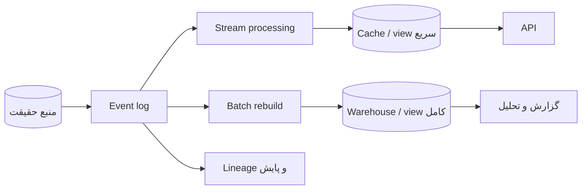

# فصل ۱۲: `Future of Data Systems` و `Derived Data`

## The Future of Data Systems

فصل پایانی ایده‌های فصل‌های قبل را در معماری‌های ترکیبی جمع می‌کند: source data، index، cache، warehouse و stream معمولاً اجزای یک dataflow هستند و باید دربارهٔ source of truth، freshness، correctness و observability آن‌ها تصمیم بگیریم.

## هدف فصل

به‌جای پرسش «بهترین database کدام است؟» باید بپرسیم چگونه چند ابزار تخصصی را با derived data، قرارداد و کنترل صحت به یک سامانهٔ قابل‌اعتماد تبدیل کنیم.

## نقشهٔ مطالب

- یکپارچه‌سازی داده و ترکیب ابزارهای تخصصی
- batch و stream به‌عنوان دو مسیر مشتق‌سازی
- unbundling database و معماری dataflow
- مشاهدهٔ state مشتق‌شده و هدف‌گذاری صحت
- constraint، تازگی، integrity، analytics و حریم خصوصی

## خلاصهٔ زمینه‌محور

### Integration و `Derived data`

یک محصول ممکن است از database `OLTP`، search index، cache، انبار داده و مدل پیش‌بینی استفاده کند. اگر هر کدام جداگانه write شوند، failure میان آن‌ها رخ می‌دهد. راه پایدارتر، تعریف source of truth و مشتق‌کردن viewهای دیگر با pipeline قابل‌تکرار است. این رویکرد، هزینهٔ sync را حذف نمی‌کند اما آن را به dataflow قابل‌مشاهده تبدیل می‌کند.

batch برای بازسازی کامل و اصلاح خطا خوب است؛ stream برای کاهش latency و به‌روز نگه‌داشتن viewها. معماری lambda-style که دو مسیر جدا دارد ممکن است منطق را تکرار کند. طراحی unified یا داشتن یک مدل محاسبهٔ مشترک، تفاوت زمان و completeness را بهتر آشکار می‌کند.

### `Unbundling` `database`

database سنتی چند قابلیت را یک‌جا می‌دهد: storage، index، transaction، query و replication. unbundling این قابلیت‌ها را به ابزارهای تخصصی جدا می‌کند. این کار انعطاف و مقیاس هر بخش را بالا می‌برد، اما مسئولیت هماهنگی، schema، backfill، failure و debugging را به معماری می‌سپارد.

هر derived store باید معلوم کند از کدام event یا snapshot ساخته می‌شود، چه مقدار lag مجاز دارد و چگونه از نو ساخته خواهد شد. اگر بازسازی ممکن نباشد، آن store عملاً منبع دیگری از حقیقت شده است و باید با همان جدیت مدیریت شود.

### Programming around `dataflow`

در معماری dataflow، eventها مسیر تغییر را نشان می‌دهند و viewها خروجی‌های قابل‌تولیدند. به‌جای صدور commandهای پنهان در چند سیستم، می‌توان تغییر را یک‌بار ثبت و مصرف‌کنندگان مستقل را از آن تغذیه کرد. این مدل audit، replay و اتصال ابزارها را بهتر می‌کند، ولی معنا و schema event باید پایدار باشد.

مشاهدهٔ state مشتق‌شده شامل lineage، offset، version، freshness و نرخ خطا است. dashboard فقط latency سرویس را نشان نمی‌دهد؛ باید بدانیم یک مقدار از کدام source آمده و آخرین بار چه زمانی به‌روزرسانی شده است.

### `Correctness` targets

سرعت بدون صحت ممکن است زیان‌بار باشد. محدودیت‌های مالی، uniqueness، موجودی و مجوز باید در لایه‌ای enforce شوند که race و retry را می‌فهمد. بعضی constraintها را database به‌خوبی تضمین می‌کند و بعضی نیازمند coordination یا reconciliation هستند.

استدلال سرتاسری می‌گوید یک لایهٔ میانی نمی‌تواند همهٔ تضمین نهایی را بر عهده بگیرد؛ دو سر عملیات نیز باید نتیجه را بررسی کنند. `Trust, but verify` در اینجا یعنی مصرف‌کننده، checksum، version، invariant یا مقایسهٔ مستقل داشته باشد و صرفاً به پاسخ یک pipeline اعتماد نکند.

تازگی و integrity یک چیز نیستند. داده ممکن است تازه اما غلط باشد، یا قدیمی اما معتبر. SLA باید هر دو را مشخص کند: حداکثر lag، دامنهٔ تغییرپذیری، روش اصلاح و رفتار در صورت ناقص‌بودن ورودی.

### `Predictive analytics` و privacy

Predictive analytics می‌تواند از دادهٔ مشتق‌شده برای پیش‌بینی رفتار استفاده کند، اما bias، leakage، drift و explainability باید بخشی از طراحی باشند. جمع‌آوری بیشتر داده همیشه ارزش بیشتر نمی‌سازد.

tracking و ترکیب شناسه‌ها می‌تواند هویت افراد را حتی پس از حذف نام آشکار کند. حداقل‌سازی داده، retention محدود، کنترل دسترسی، consent، ناشناس‌سازی و امکان حذف باید در مسیر dataflow دیده شوند؛ حذف از source بدون حذف از cache، backup، log و مدل مشتق‌شده کافی نیست.

### مثال مستقل: سامانهٔ پیشنهاد محصول

رویدادهای مشاهده و خرید از سرویس اصلی وارد log می‌شوند. stream processor پیشنهادهای تازه را به‌روز می‌کند و batch job هر شب دادهٔ کامل را برای اصلاح drift و backfill بازسازی می‌کند. search index و cache derived هستند و با version و زمان تولید عرضه می‌شوند. سامانه باید توضیح دهد پیشنهاد بر چه داده‌ای ساخته شده، چگونه یک کاربر opt-out می‌کند و در صورت خطای pipeline چطور به آخرین view معتبر برمی‌گردد.

## نکته‌های کلیدی

1. منبع حقیقت، view مشتق‌شده و مسیر بازسازی را صریح کنید.
2. batch و stream مکمل یکدیگرند؛ یکی completeness و دیگری latency را بهتر پوشش می‌دهد.
3. صحت، تازگی، lineage و حریم خصوصی بخشی از API داده‌اند.
4. هرچه ابزارها تخصصی‌تر شوند، مسئولیت هماهنگی و مشاهده‌پذیری بیشتر می‌شود.

## ارتباط با فصل‌های دیگر

- [فصل ۴: `Encoding` و `Evolution`](../04-encoding-evolution/README.md)
- [فصل ۱۰: `Batch Processing`](../10-batch-processing/README.md)
- [فصل ۱۱: `Stream Processing`](../11-stream-processing/README.md)

## معماری مستقل dataflow

این معماری فقط زمانی قابل‌اعتماد است که هر view مالک، freshness، version و روش بازسازی داشته باشد. وجود چند مقصد داده به‌خودی‌خود معماری خوب نیست؛ قرارداد dataflow باید failure و اصلاح را هم پوشش دهد.

## قرارداد صحت برای یک view مشتق‌شده

| بخش قرارداد | نمونه سؤال |
| --- | --- |
| منبع | این مقدار از کدام event یا snapshot آمده است؟ |
| تازگی | حداکثر lag قابل‌قبول چقدر است؟ |
| کامل‌بودن | آیا همهٔ ورودی‌ها دیده شده‌اند یا بخشی در حال پردازش است؟ |
| اصلاح | اگر event اشتباه بود، backfill چگونه انجام می‌شود؟ |
| حریم خصوصی | حذف کاربر از همهٔ نسخه‌ها و backupها چگونه انجام می‌شود؟ |

## تصمیم بین batch و stream

- اگر پاسخ باید در چند ثانیه تازه شود، stream مسیر اصلی است.
- اگر الگوریتم به کل تاریخ یا اصلاح گسترده نیاز دارد، batch لازم است.
- اگر هر دو لازم‌اند، منطق کسب‌وکار را تا حد امکان مشترک و تفاوت latency/completeness را آشکار کنید.
- اگر بازسازی ممکن نیست، derived store را منبع مستقل فرض کنید و برای آن backup و migration جدا داشته باشید.

## سناریوی طراحی: امتیاز ریسک سفارش

سرویس سفارش eventهای خرید را ثبت می‌کند. stream processor امتیاز اولیه می‌سازد و API از view سریع می‌خواند. batch job هر شب با دادهٔ اصلاح‌شده مدل را دوباره اجرا می‌کند. هر نتیجه با version مدل و زمان تولید برچسب می‌خورد. اگر مدل یا pipeline خطا داشت، API باید آخرین view معتبر را بدهد و متریک freshness و کیفیت را نمایش دهد، نه اینکه مقدار ناقص را بی‌صدا به‌عنوان حقیقت عرضه کند.

## چک‌لیست آینده‌نگر

- [ ] برای هر داده source of truth و owner مشخص است.
- [ ] viewهای مشتق‌شده با lag و lineage قابل‌مشاهده‌اند.
- [ ] backfill و replay در محیط آزمایشی تمرین شده‌اند.
- [ ] constraintهای مالی، دسترسی و uniqueness در لایهٔ درست enforce می‌شوند.
- [ ] retention، حذف کاربر و دسترسی به داده در همهٔ derived storeها تعریف شده است.

## تمرین‌های مرور

1. برای یک cache مشتق‌شده، منبع، lag و روش rebuild را بنویسید.
2. یک failure طراحی کنید که batch و stream نتایج متفاوت بدهند و راه آشتی آن‌ها را مشخص کنید.
3. برای یک pipeline تحلیلی، سه خطر privacy و کنترل متناظر پیشنهاد دهید.

## تعریف مستقل اصطلاحات

### `source of truth`

**چیست؟** محلی که مقدار معتبر و اصلی در آن نگه‌داری می‌شود.

**مثال:** database سفارش source of truth است؛ cache فقط copy سریع آن است.

### `derived data`

**چیست؟** داده‌ای که با پردازش source یا eventها ساخته شده است.

**قانون ساده:** derived data باید owner، زمان تولید و روش rebuild داشته باشد.

### `event sourcing`

**چیست؟** نگه‌داری eventهای تغییر به‌عنوان منبع اصلی و ساخت وضعیت فعلی با replay.

**خطر:** اصلاح event، حجم log، حذف دادهٔ خصوصی و تغییر schema به ابزار و policy جدا نیاز دارند.

### `materialized view`

**چیست؟** نتیجهٔ آماده‌ای که برای پاسخ سریع‌تر ذخیره شده است.

**مثال:** تعداد سفارش‌های باز هر مشتری به‌جای محاسبه در هر request از قبل ساخته می‌شود.

### `lineage`

**چیست؟** مسیر قابل‌ردگیری یک مقدار از source تا view نهایی.

**مثال:** می‌دانیم عدد dashboard از کدام snapshot، کدام نسخهٔ job و کدام eventها ساخته شده است.

### `freshness`

**چیست؟** میزان تازه‌بودن یک view نسبت به source؛ معمولاً با lag یا زمان آخرین update بیان می‌شود.

**اشتباه رایج:** دادهٔ تازه الزاماً دادهٔ درست نیست؛ freshness و integrity دو معیار جدا هستند.

### `RPO` و `RTO`

- `RPO` بیشترین مقدار data loss قابل‌قبول را مشخص می‌کند.
- `RTO` بیشترین زمان قابل‌قبول برای recovery را مشخص می‌کند.

backup، replication و rebuild باید با هر دو هدف آزمون شوند.

### `saga`

**چیست؟** workflow چندمرحله‌ای بین سرویس‌ها که به‌جای rollback مشترک، برای هر مرحله action جبرانی دارد.

**مثال:** اگر پرداخت موفق شد اما ارسال سفارش نشد، refund یا release inventory می‌تواند جبران باشد.

**اشتباه رایج:** saga تضمین نمی‌کند همه‌چیز لحظه‌ای و اتمیک باشد؛ فقط failure را به مراحل قابل‌مدیریت تقسیم می‌کند.
