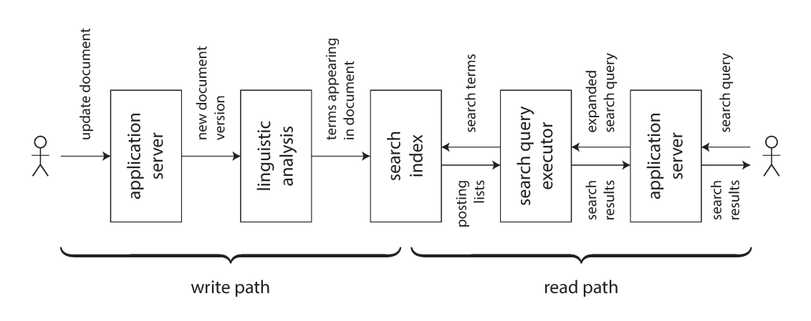

# فصل ۱۲: آیندهٔ سیستم‌های داده (The Future of Data Systems)

<blockquote dir="rtl" align="right">
  
اگر چیزی برای هدفی دیگر ساخته شده باشد، هدف نهایی آن نمی‌تواند فقط حفظ موجودیت خودش باشد. بنابراین ناخدا هدف نهایی‌اش را حفظ کشتی نمی‌داند؛ کشتی برای دریانوردی ساخته شده است. اگر هدف اصلی ناخدا فقط حفظ کشتی بود، آن را برای همیشه در بندر نگه می‌داشت.

  
— St. Thomas Aquinas، <em dir="ltr">Summa Theologica</em>

</blockquote>

## هدف فصل

فصل‌های قبلی بیشتر توضیح می‌دادند سیستم‌های داده امروز چگونه کار می‌کنند. در فصل پایانی، نگاه را به آینده می‌بریم و می‌پرسیم چگونه می‌توان applicationهایی ساخت که reliable، scalable، maintainable، درست و برای انسان‌ها مفید باشند.

تقریباً هیچ ابزار واحدی برای همهٔ نیازهای یک محصول مناسب نیست. یک application ممکن است هم‌زمان به OLTP database، full-text search، cache، data warehouse، stream processor و مدل machine learning نیاز داشته باشد. مسئله فقط انتخاب هر ابزار نیست؛ مسئله این است که همهٔ representationها چگونه از یکدیگر ساخته و با هم هماهنگ می‌شوند.

موضوع مرکزی فصل این است: داده را از یک منبع معتبر به‌صورت dataflow به viewها و سیستم‌های تخصصی مختلف برسانیم، مسیر بازسازی و بررسی صحت را روشن کنیم، و برای correctness، privacy و اثر اجتماعی تصمیم‌های آگاهانه بگیریم.

## نقشهٔ مطالب

1. یکپارچه‌سازی داده و ترکیب ابزارهای تخصصی
2. &rlm;batch و stream به‌عنوان دو روش ساختن derived data
3. &rlm;unbundling database و ساختن application بر اساس dataflow
4. مشاهدهٔ state مشتق‌شده و اتصال آن به client
5. &rlm;correctness سرتاسری، Idempotency و constraintها
6. &rlm;timeliness، integrity و auditability
7. &rlm;predictive analytics، privacy و مسئولیت اخلاقی

## &rlm;۱. Data Integration

برای یک مسئلهٔ مشخص معمولاً چند راه‌حل وجود دارد و هرکدام trade-off خود را دارند. در storage engineها log-structured storage، B-tree و column-oriented storage را دیدیم. در replication نیز single-leader، multi-leader و leaderless هرکدام در شرایط خاصی مناسب‌اند.

اگر مسئله این باشد که «داده‌ای را ذخیره کنم و بعداً آن را پیدا کنم»، پاسخ واحدی وجود ندارد. انتخاب درست به حجم داده، نوع query، latency، شکل failure و میزان consistency مورد نیاز بستگی دارد. حتی databaseهای general-purpose هم برای workload خاصی بهتر از بقیه‌اند.

کار دشوارتر زمانی آغاز می‌شود که یک dataset باید به شکل‌های متفاوت استفاده شود. احتمالاً یک software نمی‌تواند هم system of record خوبی باشد، هم search index، هم cache، هم analytics engine. در نتیجه، باید چند ابزار تخصصی را ترکیب کنیم.

### ترکیب ابزارها با derived data

یک مثال رایج، اتصال OLTP database به full-text search index است. PostgreSQL و برخی databaseهای دیگر search ساده را انجام می‌دهند، اما جست‌وجوی پیشرفته معمولاً به ابزار تخصصی نیاز دارد. از طرف دیگر، search index معمولاً system of record مناسب و durable نیست. بنابراین هر دو لازم‌اند.

ممکن است علاوه بر database و search، این سیستم‌ها را هم داشته باشیم:

- &rlm;data warehouse برای گزارش و analytics
- &rlm;batch و stream processor برای محاسبهٔ metric
- &rlm;cache یا نسخهٔ denormalized از objectها
- سیستم classification، ranking یا recommendation
- سرویس notification بر اساس تغییر داده

هرچه تعداد representationها بیشتر شود، هماهنگ نگه‌داشتن آن‌ها سخت‌تر می‌شود. باید دقیقاً بدانیم داده ابتدا کجا نوشته می‌شود، هر view از کدام source مشتق می‌شود و با چه روشی به مقصدها می‌رسد.

### &rlm;Reasoning about dataflow

فرض کنید داده ابتدا در database اصلی نوشته شود. سپس **Change Data Capture** تغییر را از log بگیرد و همان تغییر را به‌ترتیب در search index اعمال کند. اگر CDC تنها راه update کردن search index باشد، می‌توان گفت index کاملاً از database اصلی مشتق شده است. database در این معماری **system of record** است و search index یک consumer است.

اگر application مستقیماً هم database و هم search index را update کند، ترتیب دو write ممکن است متفاوت شود و race condition رخ دهد. هیچ‌کدام از دو سیستم مسئول نهایی تعیین ترتیب نیستند و ممکن است مقدارهای متناقض بسازند.

اگر همهٔ ورودی‌ها ابتدا از یک سیستم عبور کنند که ترتیب writeها را مشخص می‌کند، ساختن representationهای دیگر آسان‌تر می‌شود. CDC و Event Sourcing دو روش متفاوت برای این کارند؛ اصل مهم‌تر، داشتن ترتیب قابل‌اعتماد و مشخص برای تغییرهاست.

&rlm;update کردن derived system از روی event log را می‌توان deterministic و idempotent طراحی کرد. در این صورت، اگر consumer خراب شود، با replay و retry می‌توان state آن را دوباره ساخت.

### &rlm;Derived data در برابر distributed transaction

در **distributed transaction**، lock و atomic commit ترتیب و نتیجهٔ writeها را در چند storage system هماهنگ می‌کنند. در **CDC** و **Event Sourcing**، log ترتیب تغییرها را مشخص می‌کند و consumerهای deterministic با retry و Idempotency کار را جلو می‌برند.

&rlm;distributed transaction معمولاً linearizability می‌دهد؛ یعنی بعد از commit، write برای readerها قابل‌مشاهده است و client می‌تواند انتظار read-your-writes داشته باشد. derived system معمولاً asynchronous است و چنین guarantee زمانی را به‌طور پیش‌فرض ندارد.

&rlm;distributed transaction در محیط محدود ممکن است مفید باشد، اما XA معمولاً performance و fault tolerance ضعیف‌تری دارد و ترکیب آن با ابزارهای متفاوت دشوار است. به همین دلیل، log-based derived data در بسیاری از معماری‌ها گزینهٔ عملی‌تری است. البته نباید به کاربر گفت «eventual consistency اجتناب‌ناپذیر است و باید تحملش کنی»؛ باید برای guaranteeهایی مانند read-your-writes راه‌حل مشخص داشت.

### محدودیت total ordering

ساختن event log کاملاً مرتب در سیستم کوچک امکان‌پذیر است؛ single-leader database دقیقاً چنین logی می‌سازد. اما با بزرگ شدن سیستم، محدودیت‌هایی پدیدار می‌شوند:

- اگر throughput از توان یک leader بیشتر شود، log باید partition شود. ترتیب eventهای دو partition مستقل مشخص نیست.
- در چند datacenter، هر region ممکن است leader خودش را داشته باشد تا منتظر network بین‌منطقه‌ای نماند. در نتیجه ترتیب eventهای دو region مبهم است.
- در microservice architecture، هر service معمولاً state و storage مستقل دارد. دو event از دو service ترتیب مشترک ندارند.
- &rlm;clientهای offline ممکن است بدون تأیید server تغییر بسازند و بعداً آن‌ها را sync کنند؛ در نتیجه client و server eventها را با ترتیب متفاوت می‌بینند.

در نظریه، تعیین ترتیب کلی eventها **total order broadcast** است و با consensus ارتباط مستقیم دارد. بیشتر consensus algorithmها برای حالتی طراحی شده‌اند که یک node بتواند کل stream را مرتب کند. ساختن الگوریتمی که هم در چند node و چند جغرافیا scale شود و هم ترتیب کلی را حفظ کند، هنوز مسئله‌ای دشوار است.

### مرتب‌سازی بر اساس causality

همهٔ eventها به total order نیاز ندارند. اگر دو event هیچ رابطهٔ علّی نداشته باشند، می‌توان آن‌ها را هر طور خواست مرتب کرد. برای updateهای یک object نیز می‌توان همهٔ eventهای همان object را به یک partition فرستاد.

اما گاهی dependency پنهان است. فرض کنید دو نفر در یک شبکهٔ اجتماعی از هم جدا شده‌اند. کاربر اول دیگری را unfriend می‌کند و بعد پیامی دربارهٔ او برای دوستان باقی‌مانده می‌فرستد. انتظار او این است که فرد حذف‌شده پیام را نبیند. اگر friendship در یک storage و message در storage دیگری باشد، ممکن است consumer ابتدا message را پردازش کند و notification اشتباه بفرستد.

چند نقطهٔ شروع برای حل این مسئله:

- &rlm;logical timestamp می‌تواند ترتیب مشترکی بسازد، اما consumerها همچنان باید eventهای out-of-order را مدیریت کنند.
- می‌توان eventی را که state دیده‌شدهٔ کاربر را ثبت می‌کند، با ID یکتا ذخیره کرد و eventهای بعدی را به آن ارجاع داد.
- &rlm;conflict resolution برای state مفید است، اما side effect خارجی مانند ارسال notification را به‌تنهایی اصلاح نمی‌کند.

در آینده احتمالاً الگوهایی بهتر برای ثبت causality و ساختن derived state درست شکل می‌گیرد، بدون آن‌که همهٔ eventها از گلوگاه یک total-order log عبور کنند.

## &rlm;۲. Batch و Stream Processing

هدف data integration این است که داده در شکل درست و مکان درست قرار گیرد. این کار ممکن است شامل transform، join، filter، aggregate، آموزش مدل و نوشتن خروجی باشد. batch و stream processor ابزارهای اصلی رسیدن به این هدف‌اند.

خروجی آن‌ها derived dataset است؛ مانند search index، materialized view، recommendation، aggregate metric و مدل آماری یا machine learning.

تفاوت بنیادی این است که stream روی dataset بی‌انتها کار می‌کند و batch ورودی محدود دارد. با این حال مرز این دو در حال کم‌رنگ شدن است:

- &rlm;Spark می‌تواند stream را با microbatchهای کوچک روی موتور batch پردازش کند.
- &rlm;Apache Flink می‌تواند batch را به‌عنوان streamای محدود پردازش کند.

از نظر نظری، هرکدام را می‌توان روی دیگری شبیه‌سازی کرد، اما performance یکسان نیست؛ مثلاً microbatching برای hopping یا sliding window ممکن است مناسب نباشد.

### نگه‌داری derived state

&rlm;batch processing معمولاً به توابع deterministic و pure نزدیک است: input تغییر نمی‌کند، output در محل جدا نوشته می‌شود و side effect پنهان وجود ندارد. stream processing همین ایده را با state مدیریت‌شده و fault-tolerant گسترش می‌دهد.

وقتی هر derived dataset را خروجی یک function مشخص از input بدانیم، reasoning دربارهٔ dataflow سازمان ساده‌تر می‌شود. search index، cache یا مدل آماری همگی نتیجهٔ یک pipeline هستند:

1. &rlm;input دریافت می‌شود.
2. &rlm;function آن را transform می‌کند.
3. &rlm;output در storage یا stream بعدی نوشته می‌شود.
4. &rlm;consumer بعدی از آن استفاده می‌کند.

سازگار کردن derived data به‌صورت synchronous شبیه update کردن index داخل همان transaction database است، اما asynchronous بودن مزیت دارد. اگر یک consumer خراب شود، event log پیام را نگه می‌دارد و بخش‌های دیگر ادامه می‌دهند. distributed transaction برعکس، شکست یک participant را به کل transaction منتقل می‌کند و دامنهٔ failure را بزرگ‌تر می‌سازد.

در سیستم partitioned، secondary index ممکن است مرز partitionها را قطع کند. اگر index بر اساس term partition شده باشد، یک write باید به چند partition برسد. اگر بر اساس document partition شده باشد، query باید همهٔ partitionها را ببیند. نگه‌داری asynchronous معمولاً برای چنین ارتباطی reliableتر و scalableتر است.

### &rlm;Reprocessing برای evolution

&rlm;stream تغییر تازه را با delay کم به view می‌رساند. batch می‌تواند حجم بزرگی از history را دوباره پردازش کند و view جدید بسازد. **Reprocessing** یکی از بهترین ابزارها برای evolution است:

- منطق جدید را روی dataset موجود اجرا می‌کنیم.
- &rlm;index یا cache جدید را کنار نسخهٔ قدیمی می‌سازیم.
- بخشی از userها را به نسخهٔ جدید می‌فرستیم.
- پس از اطمینان، نسخهٔ قدیمی را حذف می‌کنیم.

این روش شبیه تغییر gauge راه‌آهن در انگلستان است. برای تعطیل نکردن خط، ابتدا ریل سوم اضافه شد تا قطارهای دو gauge روی یک مسیر حرکت کنند. پس از تبدیل همهٔ قطارها، ریل قدیمی حذف شد. در application نیز old schema و new schema مدتی کنار هم وجود دارند.

مزیت migration تدریجی این است که هر مرحله reversible است. اگر view جدید bug داشته باشد، traffic را به view قدیمی برمی‌گردانیم.

### &rlm;Lambda architecture

&rlm;**Lambda architecture** پیشنهاد می‌کند eventهای immutable در یک dataset رو به رشد ذخیره شوند و دو pipeline جدا داشته باشیم:

- &rlm;stream processor سریعاً view تقریبی را update می‌کند.
- &rlm;batch processor بعداً همان eventها را با الگوریتم دقیق‌تر پردازش و view را اصلاح می‌کند.

این طراحی از سادگی batch و latency کم stream استفاده می‌کند، اما هزینه‌هایی دارد:

- باید logic مشابه را در دو framework نگه‌داری و debug کنیم.
- خروجی دو pipeline باید merge شود؛ برای join و sessionization این کار پیچیده است.
- &rlm;reprocess کردن کل history روی dataset بزرگ پرهزینه است.
- &rlm;batch به incremental batch تقسیم می‌شود و به مسئلهٔ late event، window مرزی و time reasoning شبیه stream دچار می‌شود.

ایدهٔ Lambda مهم بود، چون immutable event و reprocessing را عمومی کرد؛ اما در بسیاری از سیستم‌ها بهتر است batch و stream روی یک engine مشترک اجرا شوند.

### یکپارچه‌سازی batch و stream

یک سیستم unified برای هر دو حالت معمولاً به این قابلیت‌ها نیاز دارد:

1. &rlm;replay کردن eventهای قدیمی با همان engineای که eventهای جدید را پردازش می‌کند.
2. &rlm;effectively-once semantics و دور ریختن output ناقص هنگام failure.
3. &rlm;windowing بر اساس event time، نه processing time؛ چون هنگام reprocess کردن history، processing time معنایی ندارد.

&rlm;Apache Beam نمونه‌ای از API است که می‌تواند چنین محاسبه‌هایی را برای engineهایی مانند Flink یا Google Cloud Dataflow بیان کند.

## &rlm;۳. Unbundling Databases

در سطح انتزاعی، database، Hadoop و operating system کار مشابهی دارند: داده را نگه می‌دارند و اجازه می‌دهند آن را process یا query کنیم. database داده را در row، document یا vertex ذخیره می‌کند و filesystem آن را در file؛ اما هر دو information management system هستند.

&rlm;Unix و relational database از دو فلسفهٔ متفاوت آمده‌اند:

- &rlm;Unix abstraction نسبتاً پایین و نزدیک به hardware می‌دهد: file و pipe دنباله‌ای از byte هستند.
- &rlm;relational database abstraction بالاتری می‌دهد: SQL، index، query optimization، join، concurrency control و recovery را پنهان می‌کند.

&rlm;Unix از نظر سادگی یعنی لایهٔ نازکی روی resourceها. database از نظر سادگی یعنی با یک query کوتاه از infrastructure قدرتمندی استفاده می‌کنیم. هیچ‌کدام همیشه بهتر نیستند.

### اجزای قابل ترکیب database

در فصل‌های قبل قابلیت‌های مختلف database را دیدیم:

- &rlm;secondary index برای جست‌وجو بر اساس field
- &rlm;materialized view به‌عنوان cache نتیجهٔ query
- &rlm;replication log برای به‌روز کردن replicaها
- &rlm;full-text index برای جست‌وجوی کلمه‌ها

در batch و stream نیز دقیقاً همین قابلیت‌ها را بیرون از database می‌سازیم: search index، view مشتق‌شده و consumerهای CDC.

### ساختن index چه می‌کند؟

وقتی در relational database دستور CREATE INDEX اجرا می‌شود، database:

1. یک consistent snapshot از table می‌گیرد.
2. مقدار fieldهای مورد نظر را می‌خواند.
3. آن‌ها را sort و index می‌کند.
4. &rlm;writeهایی را که بعد از snapshot رخ داده‌اند پردازش می‌کند.
5. از آن به بعد index را با هر transaction به‌روز نگه می‌دارد.

این فرایند شبیه ساختن follower جدید و شبیه bootstrap کردن CDC است. database در واقع dataset موجود را reprocess کرده و یک view جدید ساخته است.

### سازمان به‌عنوان یک meta-database

اگر از بالا به dataflow کل سازمان نگاه کنیم، batch، stream و ETL processهایی هستند که داده را از یک شکل و مکان به شکل و مکان دیگری می‌برند؛ درست مثل subsystemای که index یا materialized view database را به‌روز می‌کند.

در این نگاه، derived systemهای مختلف شبیه indexهای مختلف‌اند: B-tree index، hash index، spatial index، full-text index و cache یا view denormalized. تفاوت این است که در database یک محصول همهٔ این قابلیت‌ها را در خود دارد، اما در معماری unbundled، قطعه‌های software روی ماشین‌ها و زیر نظر تیم‌های مختلف اجرا می‌شوند.

### &rlm;Federated database: متحد کردن read

&rlm;**Federated database** یا **polystore** یک query interface مشترک روی چند storage engine می‌سازد. PostgreSQL foreign data wrapper نمونه‌ای از این ایده است. application تخصصی می‌تواند مستقیماً به storage اصلی وصل شود، اما queryای که دادهٔ چند منبع را ترکیب می‌کند از interface فدرال استفاده می‌کند.

این روش روح relational دارد: یک query language سطح‌بالا و semantics یکپارچه. در عوض implementation آن پیچیده است.

### &rlm;Unbundled database: متحد کردن write

فدراسیون read-only به‌تنهایی writeها را میان سیستم‌ها sync نمی‌کند. اگر چند storage engine داشته باشیم، تغییر باید به همهٔ مقصدهای درست برسد؛ حتی در حضور crash و network failure.

&rlm;CDC و event log را می‌توان unbundling قابلیت index maintenance دانست. این مدل به Unix نزدیک است:

- هر ابزار یک کار را خوب انجام می‌دهد.
- ابزارها با interface ساده، یعنی stream یا log، با هم ارتباط دارند.
- &rlm;application یا یک زبان بالاتر آن‌ها را compose می‌کند.

### چگونه unbundling را عملی کنیم؟

در محیط‌های ناهمگون، distributed transaction میان storageهای مختلف معمولاً راه‌حل سنگین و شکننده‌ای است. transaction داخل یک storage یا stream processor قابل‌مدیریت است، اما میان تیم‌ها و technologyهای متفاوت، event log asynchronous با consumerهای idempotent عملی‌تر است.

مزیت log-based integration، **loose coupling** است:

1. در سطح سیستم، اگر consumer کند یا خراب شود، log پیام‌ها را buffer می‌کند و producer و consumerهای دیگر ادامه می‌دهند. بعد از repair، consumer از offset قبلی catch up می‌کند.
2. در سطح سازمان، تیم‌ها می‌توانند componentهای خود را مستقل توسعه دهند، تا وقتی interface event و schema را رعایت می‌کنند.

&rlm;event log هم ordering و durability کافی برای consistencyهای مهم دارد و هم به یک technology خاص محدود نیست.

### &rlm;Unbundled در برابر integrated

&rlm;unbundling قرار نیست databaseهای فعلی را حذف کند. database همچنان برای نگه‌داری state stream processor و پاسخ به queryهای output لازم است. data warehouse و engineهای MPP نیز برای workload تخصصی خود عالی‌اند.

اجرای چند infrastructure مختلف هزینه دارد: هرکدام learning curve، configuration و مشکل operational مخصوص خود را دارند. اگر یک محصول واحد همهٔ نیازها را برآورده می‌کند، استفاده از همان محصول معمولاً بهتر است. unbundling زمانی ارزش دارد که هیچ ابزار واحدی همهٔ نیازها را پوشش ندهد. هدف آن breadth است، نه این‌که در یک workload خاص حتماً سریع‌ترین component باشد.

### چیزی که کم است: shell برای data system

&rlm;Unix shell اجازه می‌دهد ابزارها را با pipe به‌سادگی به هم وصل کنیم. برای data system نیز می‌توان چنین زبان declarativeای تصور کرد:

&rlm;~~~text
&rlm;mysql | elasticsearch
~~~

چنین دستوری باید همهٔ documentهای MySQL را index کند، بعد تغییرهای آینده را با CDC بگیرد و به Elasticsearch برساند؛ بدون آن‌که برای هر اتصال application code سفارشی بنویسیم. همین ایده برای ساختن cache و materialized view از queryهای پیچیده نیز قابل تصور است.

## &rlm;۴. Designing Applications Around Dataflow

ترکیب storage و processing تخصصی با application code گاهی **database inside-out** نامیده می‌شود. این بیشتر یک design pattern و زبان مشترک برای بحث است تا یک architecture کاملاً جدید.

ایدهٔ dataflow در spreadsheetها هم دیده می‌شود: اگر formula در یک cell به cellهای دیگر وابسته باشد، با تغییر input نتیجه خودکار محاسبه می‌شود. سیستم داده نیز باید بتواند با تغییر یک record، indexها، cacheها و aggregateهای وابسته را refresh کند.

### &rlm;Application code به‌عنوان derivation function

هر dataset مشتق‌شده با یک transformation function از dataset دیگری ساخته می‌شود:

- &rlm;secondary index، fieldهای جدول اصلی را برمی‌دارد و بر اساس آن‌ها sort می‌کند.
- &rlm;full-text index، language detection، word segmentation، stemming، spelling correction و synonym detection را انجام می‌دهد و inverted index می‌سازد.
- &rlm;machine learning model از training data و feature extraction و تحلیل آماری مشتق می‌شود.
- &rlm;cache، داده را در شکلی نگه می‌دارد که UI مستقیماً آن را نمایش دهد.

&rlm;CREATE INDEX یک derivation function عمومی و استاندارد است. اما feature engineering مدل ML یا cache مخصوص UI به دانش application نیاز دارد. database trigger و stored procedure می‌توانند code اجرا کنند، ولی معمولاً برای این نوع integration طراحی اصلی database نیستند.

### جدا کردن application code از state

&rlm;database می‌تواند user-defined function اجرا کند، اما برای dependency management، package، version control، rolling upgrade، metric، network call و اتصال به سیستم‌های بیرونی محیط مناسبی نیست. ابزارهایی مثل Docker، Kubernetes، Mesos و YARN برای اجرای application code ساخته شده‌اند.

در web application معمولاً service stateless است و request را به database می‌سپارد. database شبیه mutable shared variableای است که روی network قرار دارد: application آن را می‌خواند یا تغییر می‌دهد و database durability و concurrency را مدیریت می‌کند.

مشکل این مدل این است که معمولاً نمی‌توان به تغییر variable subscribe کرد؛ فقط می‌توان هر چند وقت آن را poll کرد. dataflow با تبدیل change به stream، رابطهٔ فعال‌تری میان state و code ایجاد می‌کند.

### &rlm;Dataflow: تعامل state و code

در dataflow، application به‌جای دست‌کاری passive database، به state change واکنش نشان می‌دهد و تغییر جدیدی در جای دیگر می‌سازد:

1. یک event در system of record ثبت می‌شود.
2. &rlm;consumer آن را می‌خواند.
3. &rlm;consumer state یا view جدیدی را تغییر می‌دهد.
4. تغییر جدید به consumerهای بعدی می‌رسد.

این همان چیزی است که database با trigger یا index داخلی انجام می‌دهد، اما در unbundled architecture برای cache، search، machine learning و analytics بیرون از database اجرا می‌شود.

نگه‌داری derived data با asynchronous job queue معمولی فرق دارد:

- ترتیب state change اغلب مهم است.
- از دست رفتن یک پیام می‌تواند derived dataset را برای همیشه از source جدا کند.
- &rlm;actorها و queueهای memory-only ممکن است بعد از crash state و message را از دست بدهند.

&rlm;modern stream processor باید ordering پایدار، delivery قابل‌اعتماد و state recovery را فراهم کند.

### &rlm;Stream processor و service

&rlm;microserviceها معمولاً با request/response و REST با هم حرف می‌زنند. stream operatorها با message stream یک‌طرفه و asynchronous compose می‌شوند.

مثال تبدیل currency:

- در microservice، هنگام خرید باید به exchange-rate service درخواست synchronous بدهیم.
- در dataflow، processor از قبل به stream تغییر exchange rate subscribe می‌شود و آخرین rate را در database محلی نگه می‌دارد. هنگام خرید، rate را local read می‌کند.

در روش دوم network request لحظهٔ خرید حذف می‌شود؛ بنابراین هم سریع‌تر است و هم با failure سرویس exchange-rate بهتر کنار می‌آید. این عملیات در واقع stream-table join میان purchase event و rate update است.

البته join به زمان وابسته است. اگر خرید قدیمی را دوباره پردازش کنیم، rate فعلی با rate زمان خرید فرق دارد. برای بازسازی دقیق output باید history rate در زمان اصلی را داشته باشیم.

## &rlm;۵. Observing Derived State

&rlm;dataflow برای ساختن search index، materialized view و predictive model یک **write path** ایجاد می‌کند. داده از لحظهٔ جمع‌آوری، از چند مرحلهٔ batch و stream می‌گذرد تا همهٔ derived datasetها update شوند.

کاربر معمولاً بعداً از **read path** به derived dataset query می‌زند و پاسخ دریافت می‌کند. write path eager است؛ به‌محض رسیدن داده اجرا می‌شود. read path lazy است؛ فقط وقتی user query می‌فرستد انجام می‌شود.

&rlm;derived dataset مرز این دو مسیر است و trade-off را تعیین می‌کند: هرچه در write بیشتر precompute کنیم، read سریع‌تر می‌شود؛ هرچه write ساده‌تر باشد، read باید کار بیشتری انجام دهد.

### &rlm;Materialized view و cache

در full-text search، write path باید برای همهٔ termهای document index entry بسازد. read path termهای query را پیدا می‌کند و با Boolean logic مشخص می‌کند کدام documentها همهٔ termها را دارند.

اگر index نداشته باشیم، query باید همهٔ documentها را مانند grep scan کند. write سبک‌تر می‌شود، اما read روی collection بزرگ گران است. از طرف دیگر، precompute کردن نتیجهٔ همهٔ queryهای ممکن غیرممکن است. راه میانی، cache کردن queryهای پرتکرار است.

&rlm;cache و materialized view مرز write و read را جابه‌جا می‌کنند: بخشی از کار را زودتر انجام می‌دهیم تا پاسخ بعدی سریع شود. همان trade-off در مثال timeline شبکهٔ اجتماعی دیده شد؛ بعضی userها و celebrityها strategy متفاوتی می‌خواهند.

### &rlm;Clientهای stateful و offline-capable

مدل سنتی browser را client تقریباً stateless می‌بیند که برای بیشتر کارها به server نیاز دارد. اما single-page applicationها و mobile appها local storage و state زیادی دارند. این موضوع **offline-first** را ممکن می‌کند:

- &rlm;UI و database محلی حتی بدون اینترنت کار می‌کنند.
- تغییرها در device جمع می‌شوند.
- هنگام وصل شدن، با server sync می‌شوند.

در این نگاه، state روی device cache یا replica کوچک state server است. pixelهای صفحه materialized view model objectهای local هستند.

### &rlm;Push کردن state change به client

در صفحهٔ معمولی، اگر server بعد از load شدن صفحه تغییر کند، browser تا reload یا polling متوجه نمی‌شود. Server-sent events و WebSockets ارتباطی باز نگه می‌دارند تا server بتواند تغییرها را به browser push کند.

در مدل write/read، این کار write path را تا خود device کاربر ادامه می‌دهد. device در بعضی زمان‌ها offline خواهد بود، اما همان تکنیک consumer offset حلش می‌کند: device بعد از reconnect از position خود ادامه می‌دهد و eventهای جاافتاده را می‌گیرد.

### &rlm;End-to-end event stream

&rlm;Elm و ابزارهایی مانند React، Flux و Redux state داخل client را با event stream مدیریت می‌کنند. می‌توان همین مدل را تا server ادامه داد:

1. &rlm;action کاربر روی device اول event می‌سازد.
2. &rlm;event از log و derived systemها عبور می‌کند.
3. &rlm;state change به device دوم push می‌شود.
4. &rlm;UI دوم بدون reload خودکار update می‌شود.

پیام‌رسانی فوری و online gameها نمونه‌هایی از این architecture هستند. چالش این است که database، framework و protocolهای قدیمی بر request/response بنا شده‌اند و subscription به تغییر را کمتر پشتیبانی می‌کنند.

### &rlm;Readها هم event هستند

تا اینجا write از event log عبور می‌کرد، اما read معمولاً request موقتی بود که مستقیماً به node می‌رفت. می‌توان read request را هم event دانست و آن را از همان stream processor عبور داد.

اگر write event و read event به یک operator برسند، در واقع stream-table join میان stream query و database انجام می‌شود. یک read معمولی فقط لحظه‌ای به join وارد می‌شود و نتیجه می‌گیرد. یک subscribe request، join دائمی با eventهای آینده است.

ثبت read event مزیت provenance دارد. مثلاً اگر user بر اساس موجودی و زمان ارسال نمایش‌داده‌شده خرید کند، برای تحلیل تصمیم او باید بدانیم دقیقاً چه مقداری را در آن لحظه دیده است. ذخیرهٔ read event هزینهٔ storage و I/O دارد، اما causality را روشن‌تر می‌کند.

### &rlm;Multi-partition data processing

برای query یک partition، فرستادن request به stream شاید بیش از حد پیچیده باشد. اما برای query چند partition این مدل جالب است. stream processor می‌تواند request را route کند، نتیجهٔ چند partition را join کند و پاسخ stream بسازد.

مثال‌ها:

- تعداد userهایی که URL خاصی را دیده‌اند؛ باید follower set چند user ترکیب شود.
- تشخیص fraud؛ reputation مربوط به IP، email، billing address و shipping address در databaseهای partitionشده قرار دارد و باید برای یک purchase به هم join شوند.

&rlm;MPP database این قابلیت را آماده ارائه می‌کند و برای بسیاری از queryها انتخاب ساده‌تری است؛ اما query-as-stream راهی برای ساخت applicationهای بسیار بزرگ و خاص فراهم می‌کند.

## &rlm;۶. Aiming for Correctness

در service stateless، اگر bug رخ دهد معمولاً با restart مسئله رفع می‌شود. اما database و stateful system برای مدت طولانی state را نگه می‌دارند؛ پس bug می‌تواند اثر دائمی بگذارد.

&rlm;transactionهای atomicity، isolation و durability ابزارهای قدرتمندی‌اند، اما guarantee آن‌ها همیشه به آن اندازه که تصور می‌کنیم ساده نیست. weak isolation، quorum configuration و replication ممکن است در شرایط هم‌زمانی و failure رفتار متفاوتی داشته باشند. آزمایش‌های Jepsen نیز نشان داده‌اند ضمانت اعلام‌شدهٔ بعضی محصول‌ها با رفتار واقعی آن‌ها در برابر crash و network مشکل‌دار متفاوت است.

### اجرای exactly-once یک operation

اگر message در پردازش شکست بخورد، می‌توان آن را drop کرد و data loss داشت یا retry کرد و خطر اجرای دوباره را پذیرفت. دوبار charge کردن مشتری یا دوبار زیاد کردن counter corruption است.

یک operation طبیعی ممکن است idempotent نباشد:

&rlm;~~~sql
&rlm;BEGIN TRANSACTION;
&rlm;UPDATE accounts SET balance = balance + 11.00
&rlm;  WHERE account_id = 1234;
&rlm;UPDATE accounts SET balance = balance - 11.00
&rlm;  WHERE account_id = 4321;
&rlm;COMMIT;
~~~

اگر client بعد از ارسال COMMIT پاسخ را نگیرد، نمی‌داند transaction commit شده یا abort. اگر دوباره همین transaction را اجرا کند، ممکن است ۲۲ دلار به‌جای ۱۱ دلار جابه‌جا شود. TCP duplicate suppression فقط داخل همان connection کار می‌کند و connection جدید را نمی‌شناسد.

### &rlm;Operation ID و duplicate suppression

راه عمومی‌تر این است که هر operation یک **operation ID** یکتا، مثلاً UUID، داشته باشد. client همان ID را در هر retry حفظ می‌کند و آن ID از web server تا database و derived systemها عبور می‌کند.

در database، request ID را unique می‌کنیم:

&rlm;~~~sql
&rlm;ALTER TABLE requests ADD UNIQUE (request_id);

&rlm;BEGIN TRANSACTION;
&rlm;INSERT INTO requests
&rlm;  (request_id, from_account, to_account, amount)
&rlm;VALUES
  ('0286FDB8-D7E1-423F-B40B-792B3608036C',
   4321, 1234, 11.00);

&rlm;UPDATE accounts SET balance = balance + 11.00
&rlm;  WHERE account_id = 1234;
&rlm;UPDATE accounts SET balance = balance - 11.00
&rlm;  WHERE account_id = 4321;
&rlm;COMMIT;
~~~

اگر retry همان request ID را insert کند، uniqueness constraint آن را رد می‌کند و transaction دوباره اثر نمی‌گذارد. جدول requests علاوه بر duplicate suppression، شبیه event log نیز عمل می‌کند. update balance می‌تواند بعدها از همین request event مشتق شود.

### &rlm;End-to-end argument

&rlm;**End-to-end argument** می‌گوید بعضی functionها فقط وقتی کاملاً درست پیاده می‌شوند که application دو سر ارتباط در اجرای آن دخالت داشته باشد. لایهٔ پایین می‌تواند نسخه‌ای ناقص اما مفید ارائه کند، ولی guarantee نهایی در endpointها بررسی می‌شود.

&rlm;TCP packetهای تکراری را داخل connection حذف می‌کند، database transaction را atomic می‌کند و stream processor retry را مدیریت می‌کند. اما هیچ‌کدام نمی‌فهمند user بعد از timeout همان POST را دستی دوباره فرستاده است. برای آن، operation ID باید از client تا مقصد نهایی عبور کند.

همین اصل برای integrity هم برقرار است. checksumهای Ethernet، TCP و TLS خرابی packet را بررسی می‌کنند، اما bug در sender یا receiver و خرابی disk را نمی‌بینند. برای پوشش همهٔ مسیر باید checksum یا بررسی end-to-end داشت. encryption محلی WiFi نیز جایگزین authentication و encryption end-to-end نیست.

### &rlm;Enforcing constraints

&rlm;constraintهایی مانند uniqueness، non-negative balance، موجودی انبار و نبودن booking هم‌پوشان نیاز به تصمیم قطعی دارند. اگر چند request هم‌زمان مقدار یکسانی بخواهند، سیستم باید یکی را بپذیرد و بقیه را رد کند.

در سیستم distributed، uniqueness به consensus نیاز دارد. روش رایج، یک leader است که همهٔ تصمیم‌ها را می‌گیرد. برای scale کردن، requestها را بر اساس value مورد نظر partition می‌کنیم:

- &rlm;request ID برای uniqueness همان ID
- &rlm;username برای uniqueness نام کاربری
- &rlm;seat ID برای رزرو صندلی

&rlm;multi-master asynchronous برای uniqueness مناسب نیست، چون دو master ممکن است هم‌زمان مقدار متناقض را قبول کنند. اگر رد کردن فوری violation لازم باشد، synchronous coordination اجتناب‌ناپذیر است.

### &rlm;Uniqueness در log-based messaging

&rlm;log همهٔ consumerها را در یک partition به یک ترتیب می‌رساند. برای رزرو username:

1. هر درخواست به‌عنوان message و بر اساس hash username به partition خاص append می‌شود.
2. &rlm;stream processor به‌صورت single-threaded آن partition را می‌خواند و در local database نام‌های گرفته‌شده را نگه می‌دارد.
3. اگر username آزاد باشد، آن را taken می‌کند و success event می‌فرستد.
4. اگر قبلاً گرفته شده باشد، rejection event می‌فرستد.
5. &rlm;client output stream را دنبال می‌کند و پاسخ مربوط به request ID خود را می‌خواند.

با افزایش تعداد partitionها می‌توان throughput را زیاد کرد، چون partitionهای مستقل جداگانه پردازش می‌شوند. همین الگو برای constraintهای دیگر نیز قابل استفاده است؛ کافی است conflictهای احتمالی به یک partition بروند.

### &rlm;Multi-partition request

انتقال پول میان دو account ممکن است سه partition داشته باشد: request ID، account پرداخت‌کننده و account دریافت‌کننده. transaction سنتی به atomic commit میان هر سه نیاز دارد.

با dataflow می‌توان آن را مرحله‌ای کرد:

1. &rlm;client transfer را با request ID یکتا در log مربوط به همان ID ثبت می‌کند.
2. &rlm;processor از این event دو instruction می‌سازد: debit برای account A و credit برای account B. هرکدام به partition account خودش می‌رود.
3. &rlm;processorهای account instructionها را با request ID deduplicate می‌کنند و balance را تغییر می‌دهند.

اگر مرحلهٔ دوم crash کند، ممکن است instructionها چند بار تولید شوند؛ اما deterministic هستند و مرحلهٔ سوم با request ID آن‌ها را تکراری تشخیص می‌دهد. اگر نباید حساب overdraft شود، processor partitionشده بر اساس payer account می‌تواند قبل از قرار گرفتن درخواست در log، balance را بررسی کند.

در این روش، write اولیه atomic است و بقیهٔ state از آن مشتق می‌شود. به این ترتیب correctness مورد نیاز بدون distributed atomic commit به‌دست می‌آید.

## &rlm;۷. Timeliness و Integrity

در transaction معمولاً writer تا commit منتظر می‌ماند و بعد reader مقدار جدید را می‌بیند. در stream processor، consumer asynchronous است و sender لزوماً برای پردازش کامل منتظر نمی‌ماند.

بهتر است دو معنی متفاوت consistency را جدا کنیم.

### &rlm;Timeliness

&rlm;**Timeliness** یعنی user state به‌روز را ببیند. اگر replica قدیمی باشد، user موقتاً مقدار قدیمی می‌خواند؛ با صبر یا retry ممکن است درست شود. linearizability راه قوی برای timeliness است، اما read-after-write نیز در بسیاری از کاربردها کافی است.

### &rlm;Integrity

&rlm;**Integrity** یعنی داده گم، خراب، متناقض یا نادرست نشود. اگر index از database مشتق شده باشد، باید همهٔ رکوردهای لازم را درست نشان دهد.

نقض timeliness معمولاً **eventual consistency** است و با گذشت زمان برطرف می‌شود. نقض integrity، **perpetual inconsistency** است؛ wait و retry معمولاً corruption را اصلاح نمی‌کنند و باید repair انجام شود.

مثلاً تأخیر یک‌روزه در نشان دادن تراکنش کارت اعتباری شاید طبیعی باشد. اما اگر balance با جمع تراکنش‌ها برابر نباشد یا پول از حساب کم شود و به merchant نرسد، integrity نقض شده است.

### &rlm;Correctness در dataflow

&rlm;ACID معمولاً timeliness و integrity را با هم می‌دهد. dataflow asynchronous این دو را از هم جدا می‌کند:

- &rlm;timeliness فقط وقتی تضمین می‌شود که client برای پاسخ consumer منتظر بماند.
- &rlm;integrity با delivery reliable، Idempotency، immutable event، operation ID و reprocessing حفظ می‌شود.

ترکیب مهم برای dataflow قابل‌اعتماد:

1. کل write کاربر را در یک message خودبسنده ثبت کنیم.
2. &rlm;stateهای دیگر را با function deterministic از آن message بسازیم.
3. &rlm;operation ID را در تمام stageها عبور دهیم.
4. &rlm;messageها را immutable نگه داریم تا بعداً بتوانیم reprocess کنیم.

## &rlm;۸. Constraintهای انعطاف‌پذیر

&rlm;uniqueness سخت به consensus و coordination نیاز دارد، اما همهٔ business constraintها به enforce لحظه‌ای نیاز ندارند.

مثال‌ها:

- اگر دو نفر username یکسان بخواهند، می‌توان یکی را عذرخواهی کرد و نام دیگری پیشنهاد داد.
- اگر سفارش‌ها از موجودی بیشتر شوند، می‌توان stock جدید آورد و به مشتری تخفیف داد.
- هواپیما و هتل گاهی عمدی overbook می‌شوند و برای مسافر یا مهمان جایگزین یا refund در نظر می‌گیرند.
- اگر برداشت از حساب از موجودی بیشتر شد، بانک می‌تواند overdraft fee بگیرد و مبلغ را بعداً وصول کند.

در این مدل constraint موقتاً نقض می‌شود، اما integrity کلی حفظ می‌شود: reservation گم نمی‌شود و پول ناپدید نمی‌شود. هزینهٔ apology و compensation یک تصمیم business است.

اگر این هزینه قابل‌قبول باشد، لازم نیست پیش از هر write همهٔ constraintها را linearizable بررسی کنیم. می‌توان optimistic write انجام داد و بعد constraint را validate کرد؛ فقط باید پیش از side effectهای غیرقابل‌برگشت بررسی نهایی انجام شود.

### &rlm;Coordination-avoiding data system

دو نتیجه داریم:

1. &rlm;dataflow می‌تواند integrity derived data را بدون atomic commit و synchronous cross-partition coordination حفظ کند.
2. بسیاری از applicationها با constraint ضعیف‌تر که بعداً اصلاح می‌شود مشکلی ندارند.

پس می‌توان سیستم multi-datacenter ساخت که regionها asynchronous replicate شوند. timeliness آن linearizable نیست، اما integrity آن با log و Idempotency قوی بماند. coordination را فقط در نقطه‌ای خرج می‌کنیم که violation واقعاً غیرقابل‌جبران است.

&rlm;coordination تعداد apologyها به‌علت inconsistency را کم می‌کند، اما ممکن است outage و latency را بیشتر کند. هدف حذف همهٔ apologyها نیست؛ هدف پیدا کردن trade-off مناسب است.

## &rlm;۹. Trust, but Verify

هر system model فرض می‌کند برخی چیزها ممکن است خراب شوند و برخی معمولاً درست می‌مانند:

- &rlm;process می‌تواند crash کند.
- &rlm;network ممکن است message را drop یا delay کند.
- &rlm;disk ممکن است بعد از fsync داده را نگه دارد.
- &rlm;memory و CPU معمولاً درست کار می‌کنند.

در واقع این‌ها مطلق نیستند؛ احتمال دارند. داده ممکن است در disk خاموش خراب شود، checksum شبکه ممکن است هر خرابی را نبیند و bit flip حافظه بسیار نادر اما ممکن باشد. الگوهای دسترسی خاص حتی می‌توانند bitهای memory را تغییر دهند؛ نمونهٔ شناخته‌شدهٔ آن Rowhammer است.

&rlm;software هم bug دارد. حتی databaseهای معتبر ممکن است در edge caseهایی uniqueness یا serializable isolation را غلط اجرا کنند. application code معمولاً بیشتر در معرض bug است و گاهی constraintهایی را که database ارائه می‌دهد اشتباه استفاده می‌کند.

### &rlm;Auditing

اگر corruption ممکن است، باید راه کشف آن را داشته باشیم. بررسی integrity داده **auditing** است. storage systemهایی مانند HDFS و S3 فقط به disk اعتماد نمی‌کنند؛ fileها را دوباره می‌خوانند، با replicaها مقایسه می‌کنند و در صورت مشکل آن‌ها را جابه‌جا می‌کنند.

&rlm;backup را نیز باید واقعاً restore کرد. وجود فایل backup کافی نیست؛ ممکن است backup ناقص یا غیرقابل‌بازگردانی باشد و تا روز بحران متوجه نشویم.

### طراحی برای auditability

در transactionای که چند table را تغییر می‌دهد، بعداً فهمیدن هدف business آن دشوار است. log سطح پایین فقط insert و update را نشان می‌دهد، نه این‌که چرا application آن تصمیم را گرفته است.

در event-based system، user input یک event immutable و روشن است. stateهای بعدی با derivation deterministic ساخته می‌شوند. پس می‌توان:

- با hash بررسی کرد event log دست‌کاری یا خراب نشده است.
- &rlm;processor را دوباره اجرا کرد و خروجی را با view فعلی مقایسه کرد.
- یک derivation مستقل و redundant برای بررسی ساخت.
- &rlm;provenance و علت یک تصمیم را trace کرد.

&rlm;dataflow deterministic نوعی time-travel debugging ایجاد می‌کند: می‌توان شرایط دقیق قبل از رخداد غیرمنتظره را بازسازی کرد.

### &rlm;End-to-end audit

اگر هر component را کاملاً بی‌خطا فرض نکنیم، باید integrity را در انتهای مسیر بررسی کنیم. هرچه storage، network، service و algorithm بیشتری در check end-to-end شرکت کنند، احتمال پنهان ماندن corruption کمتر می‌شود.

&rlm;cryptocurrency و distributed ledgerهایی مانند Bitcoin، Ethereum و دیگر سامانه‌ها ایده‌هایی برای audit رمزنگاری‌شده دارند: replicaهای مستقل integrity یکدیگر را بررسی می‌کنند و با consensus روی transactionها توافق می‌کنند. این فناوری‌ها trade-offها و محدودیت‌های خود را دارند؛ proof of work پرهزینه است و throughput برخی شبکه‌ها کم است، اما **Merkle tree** و proof عضویت برای audit عمومی جالب‌اند.

در آینده ممکن است self-validating data systemها به‌صورت پیوسته integrity خود را بررسی کنند، نه این‌که فقط به promise یک storage یا transaction mechanism اعتماد کنند.

## &rlm;۱۰. Doing the Right Thing

هر system برای هدفی ساخته می‌شود، اما اثرهای آن از هدف اولیه فراتر می‌روند. بسیاری از datasetها دربارهٔ انسان‌ها هستند: رفتار، علاقه، هویت، سلامت و تصمیم‌هایشان. بنابراین مهندس فقط مسئول درست کار کردن code نیست؛ باید اثر انسانی و اجتماعی آن را هم ببیند.

### &rlm;Predictive analytics

پیش‌بینی آب‌وهوا یا گسترش بیماری با پیش‌بینی احتمال تکرار جرم، default وام یا هزینهٔ درمان یک فرد فرق دارد. دستهٔ دوم مستقیماً بر زندگی فرد اثر می‌گذارد.

بانک، شبکهٔ پرداخت، شرکت بیمه و کارفرما طبیعی است که fraud، وام بد یا استخدام پرخطر را کم کنند. اما اگر الگوریتم فردی را risky برچسب بزند، ممکن است همان فرد در کار، مسکن، بیمه و خدمات مالی بارها جواب «نه» بگیرد. این می‌تواند شبیه algorithmic prison باشد، بدون آن‌که فرد فرصت دفاع و appeal واقعی داشته باشد.

### &rlm;Bias و discrimination

&rlm;algorithm لزوماً از انسان عادل‌تر نیست. اگر input تاریخی discriminatory باشد، مدل همان bias را یاد می‌گیرد و گاهی تقویت می‌کند. ویژگی‌هایی مانند postal code یا IP address ممکن است proxy ویژگی‌های حفاظت‌شده مانند ethnicity یا class باشند.

مدل فقط گذشته را extrapolate می‌کند. اگر گذشته ناعادلانه بوده، خروجی مدل نیز می‌تواند ناعادلانه شود. machine learning ابزار ماست، نه جانشین قضاوت اخلاقی.

### &rlm;Responsibility و accountability

اگر human اشتباه کند، می‌توان مسئول را پیدا و تصمیم را appeal کرد. اگر الگوریتم اشتباه کند، چه کسی پاسخ‌گو است؟ اگر credit scoring یا hiring model علیه گروهی bias داشته باشد، فرد چگونه می‌فهمد چرا رد شده و چطور اعتراض کند؟

خروجی predictive analytics آماری است. حتی اگر distribution کل درست باشد، مورد فردی می‌تواند اشتباه باشد. بنابراین باید منبع data، کیفیت data، explainability مدل، مسیر appeal و ارزیابی گروه‌های مختلف را جدی گرفت. مسئولیت نهایی نباید پشت عبارت «الگوریتم این‌طور گفت» پنهان شود.

### &rlm;Feedback loop

&rlm;recommendation systemی که محتوای مورد علاقهٔ user را نشان می‌دهد، ممکن است user را در **echo chamber** قرار دهد و misinformation یا polarization را تقویت کند.

نمونهٔ دیگر credit score است: فرد به‌دلیل مشکلی موقت امتیاز پایینی می‌گیرد، کار پیدا نمی‌کند، درآمدش کم می‌شود، امتیازش پایین‌تر می‌رود و دوباره فرصت‌های کمتری پیدا می‌کند. این feedback loop خودتقویت‌شونده است.

برای دیدن این اثرها باید **systems thinking** داشت؛ فقط algorithm را جداگانه بررسی نکنیم، بلکه رفتار انسان، بازار و پیامدهای بلندمدت را هم در model وارد کنیم.

## &rlm;۱۱. Privacy و Tracking

اگر user آگاهانه داده‌ای را وارد کند تا system آن را ذخیره و پردازش کند، رابطهٔ service و user نسبتاً روشن است. اما اگر activity کاربر به‌عنوان side effect ثبت شود، service ممکن است هدف‌هایی پیدا کند که با منافع user هم‌سو نیست.

&rlm;tracking می‌تواند برای feature مفید باشد: کلیک روی search result برای بهتر شدن ranking، پیشنهادهای مشابه، A/B test و تحلیل user flow. اما اگر مدل درآمدی بر advertisement باشد، advertiser مشتری اصلی می‌شود. tracking گسترده‌تر، profile دقیق‌تر و retention طولانی‌تر برای marketing ساخته می‌شود.

### &rlm;Surveillance

اگر عبارت data را با surveillance عوض کنیم، بسیاری از عبارت‌های رایج ترسناک‌تر می‌شوند: surveillance stream، surveillance warehouse و surveillance analytics. گوشی، تلویزیون هوشمند، voice assistant، baby monitor و حتی اسباب‌بازی می‌توانند microphone یا location tracker باشند.

دادهٔ جمع‌شده به شرکت‌ها قدرت زیادی می‌دهد. استفاده از آن برای بیمهٔ خودرو، بیمهٔ سلامت یا employment نشان می‌دهد tracking فقط یک recommendation ساده نیست. sensor حرکت smartwatch حتی ممکن است الگوی تایپ یا password را حدس بزند.

### &rlm;Consent و آزادی انتخاب

گفتن این‌که user با terms of service موافقت کرده، الزاماً consent معنادار نیست:

- &rlm;user معمولاً نمی‌داند چه داده‌ای جمع می‌شود و چه مدت نگه داشته می‌شود.
- &rlm;privacy policy ممکن است بیشتر پنهان کند تا روشن سازد.
- دادهٔ یک user دربارهٔ افراد دیگری نیز اطلاعات تولید می‌کند.
- سرویس محبوب ممکن است عملاً برای مشارکت اجتماعی یا شغلی ضروری باشد؛ پس «از سرویس استفاده نکن» انتخاب آزاد واقعی نیست.

&rlm;consent باید قابل فهم، قابل پس‌گرفتن و متناسب با استفادهٔ واقعی از داده باشد.

### &rlm;Privacy و استفاده از داده

&rlm;privacy به معنی پنهان کردن همه‌چیز نیست؛ یعنی هر شخص حق داشته باشد تصمیم بگیرد چه چیزی را به چه کسی نشان دهد و چه چیزی را مخفی نگه دارد. وقتی شرکت از زیرساخت surveillance برای استخراج داده استفاده می‌کند، این حق تصمیم‌گیری از فرد به شرکت منتقل می‌شود.

حتی اگر user از نظر دیگران چیزی را پنهان نکند، ممکن است نخواهد شرکت از همان داده برای قیمت‌گذاری، تبلیغ، استخدام یا تصمیم دیگری استفاده کند. privacy setting شروع خوبی است، اما service معمولاً همچنان به دادهٔ خام دسترسی دارد. کنترل واقعی باید شامل purpose، retention، access و deletion هم باشد.

### &rlm;Data به‌عنوان asset و قدرت

رفتار کاربر گاهی data exhaust نامیده می‌شود؛ انگار محصول جانبی بی‌ارزش است. اما اگر advertisement هزینهٔ service را تأمین کند، همین رفتار دارایی اصلی شرکت است. data brokerها دادهٔ شخصی را می‌خرند، ترکیب می‌کنند، inference می‌سازند و دوباره می‌فروشند.

داده هم برای شرکت‌ها و هم برای دولت‌ها جذاب است. هنگام ورشکستگی ممکن است data یکی از assetهای فروشی باشد. breach، insider misuse و تغییر حکومت یا مدیریت نشان می‌دهند جمع‌آوری data فقط فایده ندارد؛ ریسک سیاسی و انسانی هم دارد.

داده را می‌توان hazardous material دانست: چیزی که باید سود آن را با خطر افتادن در دست اشتباه مقایسه کرد. لازم است فقط امروز را نبینیم و بپرسیم اگر سازمان یا حکومت آینده ارزش‌های دیگری داشت، همین dataset چه آسیبی می‌تواند ایجاد کند.

### درس انقلاب صنعتی

انقلاب صنعتی رشد اقتصادی و بهبود زندگی آورد، اما آلودگی، کار کودک، شرایط سخت کار و شکاف طبقاتی نیز ایجاد کرد. مدتی طول کشید تا قانون محیط‌زیست، ایمنی، سلامت و منع کار کودک شکل بگیرد.

عصر اطلاعات نیز مسئلهٔ مشابهی دارد. داده می‌تواند برای درمان و کمک اجتماعی به‌کار رود، اما collection بی‌حد، surveillance و misuse می‌تواند اثر ماندگار داشته باشد. داده باید مانند ماده‌ای آلاینده محدود، محافظت و در زمان مناسب حذف شود.

### &rlm;Legislation و self-regulation

قوانین protection داده می‌گویند personal data باید برای purpose مشخص، مشروع و متناسب جمع شود و فراتر از آن purpose استفاده نشود. این اصل با فلسفهٔ Big Data که می‌خواهد «همه‌چیز را جمع کن و بعداً ببین چه کشفی می‌شود» در تنش است.

&rlm;regulation بیش از حد ممکن است جلوی درمان یا پژوهش مفید را بگیرد، اما نبود regulation نیز privacy را تهدید می‌کند. تعادل فقط با قانون به‌دست نمی‌آید؛ صنعت باید culture خود را تغییر دهد:

- &rlm;user را metric قابل‌بهینه‌سازی نبیند، بلکه انسان دارای dignity بداند.
- داده را بیشتر از زمان لازم نگه ندارد.
- به user دربارهٔ استفادهٔ واقعی از داده توضیح دهد.
- امکان دسترسی، اصلاح، opt-out و حذف فراهم کند.
- &rlm;access control را تا حد امکان با protocol رمزنگاری‌شده enforce کند، نه فقط با promise سازمانی.

## جمع‌بندی فصل

هیچ tool واحدی همهٔ use caseهای data را پوشش نمی‌دهد. applicationها باید چند component تخصصی را ترکیب کنند. راه عملی این ترکیب، تعیین system of record و ساختن search index، cache، materialized view، model و metric به‌عنوان derived data است.

&rlm;batch و stream مکمل‌اند: stream تغییرهای جدید را با latency کم منتقل می‌کند و batch history را دوباره پردازش و viewها را اصلاح یا بازسازی می‌کند.

این dataflow باید asynchronous و loosely coupled باشد تا failure یک بخش کل سیستم را متوقف نکند. event log و operation ID، ordering و Idempotency را میان technologyهای ناهمگون برقرار می‌کنند.

&rlm;unbundling database یعنی قابلیت‌های storage، index، replication، query و processing را به componentهای تخصصی تقسیم کنیم و با dataflow به هم وصل کنیم. این کار انعطاف می‌دهد، اما schema، backfill، monitoring، ownership و repair را نیز بر عهدهٔ application می‌گذارد.

&rlm;correctness فقط وظیفهٔ database نیست. constraintهای مهم باید در مسیر end-to-end بررسی شوند. uniqueness به consensus نیاز دارد، اما بعضی business constraintها با validation بعدی و compensating action بهتر و مقیاس‌پذیرترند. timeliness و integrity را جدا کنید: دادهٔ کمی قدیمی ممکن است قابل‌قبول باشد، اما دادهٔ corrupted خطرناک است.

در نهایت، data دربارهٔ انسان‌هاست. predictive analytics می‌تواند bias، discrimination و feedback loop بسازد. tracking می‌تواند به surveillance تبدیل شود و data قدرتی ایجاد کند که قابل‌مشاهده یا قابل‌اعتراض نباشد. مهندس باید هم performance و reliability و هم dignity، privacy، accountability و پیامدهای بلندمدت را در طراحی ببیند.

## مثال آموزشی مستقل: سامانهٔ پیشنهاد محصول

فرض کنید فروشگاه online چند سیستم دارد:

1. سفارش‌ها و خریدها در OLTP database به‌عنوان system of record ثبت می‌شوند.
2. &rlm;CDC تغییرها را به event log می‌فرستد.
3. &rlm;stream processor پیشنهادهای تازه و dashboard را update می‌کند.
4. &rlm;search index برای جست‌وجوی محصول ساخته می‌شود.
5. &rlm;batch job هر شب history را reprocess می‌کند تا model recommendation اصلاح و backfill شود.
6. &rlm;mobile app نسخهٔ محلی پیشنهادها را نگه می‌دارد و هنگام اتصال eventهای عقب‌افتاده را دریافت می‌کند.

هر نتیجه باید metadata داشته باشد: از کدام source آمده، با کدام version مدل ساخته شده، آخرین update چه زمانی بوده، اگر pipeline خراب شد آخرین view معتبر کدام است و اگر user opt-out کرد داده از cache، log، backup و model چگونه حذف می‌شود.

در این معماری، stream برای freshness، batch برای completeness و audit برای integrity کار می‌کند. اگر هر view فقط یک copy غیرقابل‌بازسازی باشد، به‌مرور تبدیل به source of truth پنهان می‌شود و باید مثل database اصلی مدیریت شود.

## نکته‌های کلیدی

1. برای هر داده، system of record، owner و مسیر rebuild را مشخص کنید.
2. &rlm;derived data باید source، version، freshness و lineage قابل‌مشاهده داشته باشد.
3. &rlm;batch و stream را بر اساس completeness و latency انتخاب کنید، نه بر اساس مد روز.
4. برای retryهای چندمرحله‌ای operation ID سرتاسری داشته باشید.
5. &rlm;timeliness و integrity را جداگانه اندازه‌گیری و guarantee کنید.
6. &rlm;constraint را در لایه‌ای enforce کنید که conflict را می‌بیند؛ constraintهای قابل‌جبران را بی‌دلیل linearizable نکنید.
7. &rlm;backup، replay و audit را واقعاً تمرین کنید.
8. &rlm;predictive model را از نظر bias، feedback loop و امکان appeal بررسی کنید.
9. &rlm;retention و deletion را برای همهٔ derived systemها، نه فقط source، تعریف کنید.

## چک‌لیست طراحی

- [ ] source of truth و owner هر dataset مشخص است.
- [ ] هر view با event یا snapshot قابل‌ساختن دوباره است.
- [ ] operation ID از client تا آخرین consumer حفظ می‌شود.
- [ ] offset، lag، freshness و error rate پایش می‌شوند.
- [ ] backfill و replay در محیط آزمایشی اجرا شده‌اند.
- [ ] correctness با check end-to-end یا audit مستقل بررسی می‌شود.
- [ ] برای constraintهای موقت، workflow جبران و اطلاع‌رسانی وجود دارد.
- [ ] bias و رفتار مدل برای گروه‌های مختلف آزمون شده است.
- [ ] access، consent، opt-out، retention و deletion در dataflow ثبت شده‌اند.

## تعریف مستقل اصطلاحات

### &rlm;source of truth

محلی که مقدار اصلی و معتبر در آن نگه‌داری می‌شود. cache، index و viewهای دیگر از آن مشتق می‌شوند.

### &rlm;derived data

داده‌ای که با transform، join، aggregate یا model از source ساخته شده است. باید قابل‌تولید دوباره و قابل‌ردگیری باشد.

### &rlm;data integration

هماهنگ کردن چند system یا representation تا داده در شکل درست و زمان مناسب به مقصدهای مختلف برسد.

### &rlm;dataflow

مسیر حرکت و تبدیل data از source تا outputها؛ شامل event، processor، storage، consumer و contract میان آن‌ها.

### &rlm;unbundling

جدا کردن قابلیت‌های database و ساختن آن‌ها با componentهای تخصصی که از طریق event log یا stream با هم کار می‌کنند.

### &rlm;federated database و polystore

&rlm;query interfaceای مشترک روی چند storage engine متفاوت؛ تمرکز اصلی آن متحد کردن read است.

### &rlm;write path و read path

&rlm;write path مسیر precompute کردن و آماده‌سازی derived data است. read path کاری است که هنگام query user انجام می‌شود. index و cache مرز این دو را جابه‌جا می‌کنند.

### &rlm;Event Sourcing

ثبت eventهای immutable در سطح domain به‌عنوان source و ساختن state فعلی با replay و derivation.

### &rlm;operation ID

شناسهٔ یکتای یک action که در retry ثابت می‌ماند و برای duplicate suppression و Idempotency استفاده می‌شود.

### &rlm;end-to-end argument

این اصل که guarantee نهایی مانند حذف duplicate، integrity یا encryption کامل باید با کمک endpointهای application بررسی شود؛ feature لایهٔ پایین به‌تنهایی کافی نیست.

### &rlm;timeliness

به‌روز بودن چیزی که user می‌بیند؛ معمولاً با freshness، lag یا read-after-write سنجیده می‌شود.

### &rlm;integrity

نبودن data loss، corruption، contradiction و مقدارهای دروغین یا ناسازگار.

### &rlm;auditability

توانایی کشف، توضیح و بازسازی تغییرها و بررسی این‌که output از input درست مشتق شده است.

### &rlm;compensating transaction

عمل جبرانی برای اصلاح نتیجهٔ یک operation قبلی؛ مانند refund، آزاد کردن رزرو یا ارسال پیام عذرخواهی.

### &rlm;saga

&rlm;workflow چندمرحله‌ای بین سرویس‌ها که به‌جای یک rollback مشترک، برای هر مرحله action جبرانی تعریف می‌کند. saga atomicity لحظه‌ای ایجاد نمی‌کند، بلکه failure را به مراحل قابل‌مدیریت تقسیم می‌کند.

### &rlm;RPO و RTO

&rlm;RPO بیشترین data loss قابل‌قبول و RTO بیشترین زمان قابل‌قبول برای recovery را مشخص می‌کند.

### &rlm;predictive analytics

استفاده از data و model آماری برای پیش‌بینی رفتار یا تصمیم دربارهٔ آینده. باید bias، explainability و امکان appeal آن بررسی شود.

### &rlm;feedback loop

چرخه‌ای که در آن خروجی سیستم رفتار آینده را تغییر می‌دهد و همان رفتار دوباره input سیستم می‌شود؛ ممکن است bias یا inequality را تقویت کند.

### &rlm;surveillance

جمع‌آوری و تحلیل پیوستهٔ رفتار، مکان یا ویژگی‌های افراد، به‌ویژه وقتی بدون آگاهی و کنترل معنادار آن‌ها انجام شود.

## لینک‌های مرتبط

- [پیشگفتار](../../preface/README.md)
- [فصل ۳: Storage و Retrieval](../03-storage-retrieval/README.md) — storage engine و index
- [فصل ۴: Encoding و Evolution](../04-encoding-evolution/README.md) — schema و migration
- [فصل ۵: Replication](../05-replication/README.md) — replication log و derived replica
- [فصل ۷: Transactions](../07-transactions/README.md) — ACID، constraint و atomic commit
- [فصل ۹: Consistency و Consensus](../09-consistency-consensus/README.md) — linearizability و consensus
- [فصل ۱۰: Batch Processing](../10-batch-processing/README.md) — reprocessing و batch workflow
- [فصل ۱۱: Stream Processing](../11-stream-processing/README.md) — event log، CDC و stream join
